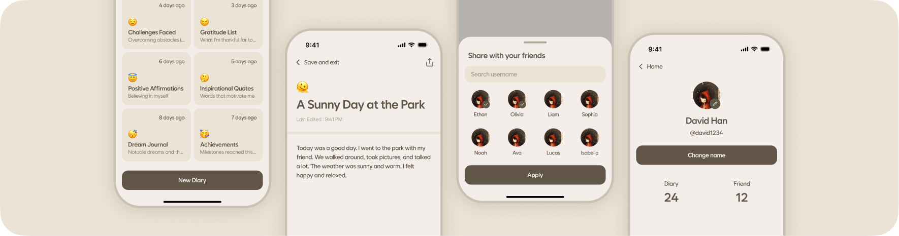

This file is a merged representation of a subset of the codebase, containing files not matching ignore patterns, combined into a single document by Repomix.
The content has been processed where empty lines have been removed, content has been compressed (code blocks are separated by ⋮---- delimiter).

# File Summary

## Purpose
This file contains a packed representation of the entire repository's contents.
It is designed to be easily consumable by AI systems for analysis, code review,
or other automated processes.

## File Format
The content is organized as follows:
1. This summary section
2. Repository information
3. Directory structure
4. Repository files (if enabled)
5. Multiple file entries, each consisting of:
  a. A header with the file path (## File: path/to/file)
  b. The full contents of the file in a code block

## Usage Guidelines
- This file should be treated as read-only. Any changes should be made to the
  original repository files, not this packed version.
- When processing this file, use the file path to distinguish
  between different files in the repository.
- Be aware that this file may contain sensitive information. Handle it with
  the same level of security as you would the original repository.

## Notes
- Some files may have been excluded based on .gitignore rules and Repomix's configuration
- Binary files are not included in this packed representation. Please refer to the Repository Structure section for a complete list of file paths, including binary files
- Files matching these patterns are excluded: src-tauri/gen/android/app/src/main/res/**/*.*, src-tauri/gen/android/app/build/**/*.*, **/*.pbxproj
- Files matching patterns in .gitignore are excluded
- Files matching default ignore patterns are excluded
- Empty lines have been removed from all files
- Content has been compressed - code blocks are separated by ⋮---- delimiter
- Files are sorted by Git change count (files with more changes are at the bottom)

# Directory Structure
```
public/
  symbol.svg
src/
  binding/
    function/
      decrypt-diary.ts
      encrypt-diary.ts
      encrypt-key-for-recipient.ts
      generate-key-pair.ts
    types/
      diary-data.d.ts
  components/
    features/
      auth/
        styles/
          biometric.css.ts
          pin.css.ts
          popup.css.ts
        biometric.tsx
        pin.tsx
        shared.ts
      diary/
        styles/
          detail-drawer.css.ts
          share-drawer.css.ts
        delete-popup.tsx
        detail-drawer.tsx
        share-drawer.tsx
        stop-url-sharing-popup.tsx
        url-copied-popup.tsx
      friend/
        add-drawer.tsx
      user/
        styles/
          picker-drawer.css.ts
        ban-drawer.tsx
        picker-drawer.tsx
    layout/
      column/
        index.tsx
      container/
        index.tsx
      flex/
        styles/
          align.css.ts
          direction.css.ts
          flex.css.ts
          justify.css.ts
          wrap.css.ts
        index.tsx
        shared.ts
      grid/
        index.tsx
        styles.css.ts
      row/
        index.tsx
    pages/
      diary/
        saving-popup.tsx
      explorer/
        styles/
          content.css.ts
        content.tsx
        header.tsx
      home/
        styles/
          friends-diaries.css.ts
          my-diary-drawer.css.ts
        friend-diary-drawer.tsx
        friends-diaries.tsx
        my-diaries.tsx
        my-diary-drawer.tsx
      my-profile/
        styles/
          image.css.ts
          reset-confirm.css.ts
        change-name.tsx
        image.tsx
        reset-confirm.tsx
      sign-up/
        styles/
          confirm-pin.css.ts
          styles.css.ts
        biometric.tsx
        confirm-pin.tsx
        context.ts
        information.tsx
        set-pin.tsx
    ui/
      avatar/
        styles/
          avatar.css.ts
          item.css.ts
        index.tsx
        item.tsx
      button/
        styles/
          button.css.ts
          group.css.ts
        group.tsx
        index.tsx
      card/
        diary.tsx
        styles.css.ts
      content/
        index.tsx
        styles.css.ts
      divider/
        index.tsx
        padding.tsx
        styles.css.ts
      drawer/
        animation.ts
        index.tsx
        styles.css.ts
      flow/
        context.ts
        index.tsx
      input/
        styles/
          emoji.css.ts
          field.css.ts
          image.css.ts
          pin.css.ts
          text.css.ts
        emoji.tsx
        field.tsx
        image.tsx
        index.tsx
        pin.tsx
      list-item/
        index.tsx
        styles.css.ts
      loading-circle/
        index.tsx
        styles.css.ts
      overlay/
        styles/
          backdrop.css.ts
          root.css.ts
        context.ts
        provider.tsx
        renderer.tsx
        types.ts
        utils.ts
      popup/
        animation.ts
        content.tsx
        index.tsx
        styles.css.ts
      sotto-symbol/
        index.tsx
      tabs/
        styles/
          item.css.ts
        content.tsx
        context.ts
        index.tsx
        item.tsx
      top-navigator/
        go-back.tsx
        index.tsx
        styles.css.ts
      typography/
        styles/
          typography.css.ts
          weight.css.ts
        base.tsx
        index.tsx
  hooks/
    use-auth.ts
    use-check-initialized.ts
    use-diary.ts
    use-drawer.ts
    use-flow.ts
    use-overlay.ts
  lib/
    managers/
      diary.ts
      friend.ts
      http.ts
      storage.ts
    animation.ts
    app.ts
    common.ts
    log.ts
    style.ts
  routes/
    auth/
      sign-in/
        biometric/
          index.tsx
          page.css.ts
        forgot-pin/
          index.tsx
          page.css.ts
        pin/
          index.tsx
          page.css.ts
      sign-up/
        index.tsx
    diary/
      index.tsx
      page.css.ts
    explorer/
      diaries/
        detail.tsx
        index.tsx
      friends/
        detail.tsx
        index.tsx
    home/
      index.tsx
      page.css.ts
    index/
      index.tsx
      page.css.ts
    my-profile/
      index.tsx
      page.css.ts
    index.ts
  styles/
    color.css.ts
    font.css.ts
    layer.css.ts
    reset.css.ts
    utils.css.ts
  types/
    props.d.ts
    response.d.ts
  App.tsx
  main.tsx
  vite-env.d.ts
src-tauri/
  capabilities/
    default.json
    mobile.json
  gen/
    android/
      app/
        build/
          intermediates/
            dex_number_of_buckets_file/
              arm64Debug/
                dexBuilderArm64Debug/
                  out
        src/
          main/
            java/
              com/
                tyeongkim/
                  sotto_app/
                    MainActivity.kt
            AndroidManifest.xml
        .gitignore
        build.gradle.kts
        proguard-rules.pro
      buildSrc/
        build/
          kotlin/
            compileKotlin/
              cacheable/
                caches-jvm/
                  lookups/
                    counters.tab
          pluginDescriptors/
            rust.properties
          resources/
            main/
              META-INF/
                gradle-plugins/
                  rust.properties
          tmp/
            jar/
              MANIFEST.MF
        src/
          main/
            java/
              com/
                tyeongkim/
                  sotto_app/
                    kotlin/
                      BuildTask.kt
                      RustPlugin.kt
        build.gradle.kts
      gradle/
        wrapper/
          gradle-wrapper.properties
      .editorconfig
      .gitignore
      build.gradle.kts
      gradle.properties
      gradlew
      gradlew.bat
      settings.gradle
    apple/
      Assets.xcassets/
        AppIcon.appiconset/
          Contents.json
        Background.colorset/
          Contents.json
        Symbol.imageset/
          Contents.json
          Symbol.svg
        Contents.json
      sotto-app_iOS/
        Info.plist
        sotto-app_iOS.entitlements
      sotto-app.xcodeproj/
        project.xcworkspace/
          xcshareddata/
            WorkspaceSettings.xcsettings
          contents.xcworkspacedata
        xcshareddata/
          xcschemes/
            sotto-app_iOS.xcscheme
      Sources/
        sotto-app/
          bindings/
            bindings.h
          main.mm
      .gitignore
      ExportOptions.plist
      LaunchScreen.storyboard
      Podfile
      PrivacyInfo.xcprivacy
      project.yml
  src/
    crypto.rs
    lib.rs
    main.rs
  .gitignore
  build.rs
  Cargo.toml
  tauri.conf.json
.gitignore
biome.json
index.html
LICENSE.md
package.json
README.md
repomix.config.json
tsconfig.json
tsconfig.node.json
vite.config.ts
```

# Files

## File: public/symbol.svg
````
<svg width="83" height="97" viewBox="0 0 83 97" fill="none" xmlns="http://www.w3.org/2000/svg">
<rect x="7.33704" y="18.2445" width="56" height="79" rx="13" transform="rotate(-16 7.33704 18.2445)" fill="#B0A695"/>
<rect x="0.0569458" y="18.2515" width="56" height="79" rx="13" transform="rotate(-16 0.0569458 18.2515)" fill="#615548"/>
<rect x="13.5285" y="28.9528" width="26" height="4" rx="2" transform="rotate(-16 13.5285 28.9528)" fill="#F3EEEA"/>
<rect x="16.5605" y="39.5266" width="15" height="4" rx="2" transform="rotate(-16 16.5605 39.5266)" fill="#F3EEEA"/>
<rect x="19.5925" y="50.1005" width="26" height="4" rx="2" transform="rotate(-16 19.5925 50.1005)" fill="#F3EEEA"/>
<rect x="22.6245" y="60.6744" width="21" height="4" rx="2" transform="rotate(-16 22.6245 60.6744)" fill="#F3EEEA"/>
</svg>
````

## File: src/binding/function/generate-key-pair.ts
````typescript
import { invoke } from '@tauri-apps/api/core';
export async function generateKeyPair()
````

## File: src/components/features/diary/delete-popup.tsx
````typescript
import { Button } from '@/components/ui/button';
import { ButtonGroup } from '@/components/ui/button/group';
import type { OverlayProps } from '@/components/ui/overlay/types';
import { Popup } from '@/components/ui/popup';
import { PopupContent } from '@/components/ui/popup/content';
import { useAuth } from '@/hooks/use-auth';
import { log } from '@/lib/log';
import { type Diary, diaryManager } from '@/lib/managers/diary';
import { message } from '@tauri-apps/plugin-dialog';
import { TriangleAlert } from 'lucide-react';
import { useCallback } from 'react';
interface DeleteDiaryPopupProps {
	diary: Diary;
	callback: () => unknown;
}
````

## File: src/components/features/diary/stop-url-sharing-popup.tsx
````typescript
import { Button } from '@/components/ui/button';
import { ButtonGroup } from '@/components/ui/button/group';
import type { OverlayProps } from '@/components/ui/overlay/types';
import { Popup } from '@/components/ui/popup';
import { PopupContent } from '@/components/ui/popup/content';
import { TriangleAlert } from 'lucide-react';
import { useCallback } from 'react';
interface DiaryStopURLSharingPopupProps {
	onStopUrlSharingClick: () => unknown;
}
````

## File: src/components/features/diary/url-copied-popup.tsx
````typescript
import { Button } from '@/components/ui/button';
import { ButtonGroup } from '@/components/ui/button/group';
import type { OverlayProps } from '@/components/ui/overlay/types';
import { Popup } from '@/components/ui/popup';
import { PopupContent } from '@/components/ui/popup/content';
import { ClipboardCheck } from 'lucide-react';
````

## File: src/components/layout/column/index.tsx
````typescript
import { Flex } from '../flex';
import type { FlexProps } from '../flex/shared';
export function Column(props: FlexProps)
````

## File: src/components/layout/flex/styles/align.css.ts
````typescript
import { layoutStyle } from '@/styles/layer.css';
````

## File: src/components/layout/flex/styles/direction.css.ts
````typescript
import { layoutStyle } from '@/styles/layer.css';
````

## File: src/components/layout/flex/styles/flex.css.ts
````typescript
import { layoutStyle } from '@/styles/layer.css';
````

## File: src/components/layout/flex/styles/justify.css.ts
````typescript
import { layoutStyle } from '@/styles/layer.css';
````

## File: src/components/layout/flex/styles/wrap.css.ts
````typescript
import { layoutStyle } from '@/styles/layer.css';
````

## File: src/components/layout/flex/index.tsx
````typescript
import { cn } from '@/lib/common';
import { createElement } from 'react';
import type { FlexProps } from './shared';
import { alignStyles } from './styles/align.css';
import { directionStyles } from './styles/direction.css';
import { flex, noGrow, noShrink } from './styles/flex.css';
import { justifyStyles } from './styles/justify.css';
import { wrapStyles } from './styles/wrap.css';
export function Flex(props: FlexProps)
````

## File: src/components/layout/flex/shared.ts
````typescript
import type { BaseProps, HAS_CHILDREN } from '@/types/props';
import type { JSX } from 'react';
type AlignItems = 'start' | 'center' | 'end' | 'stretch';
type JustifyContent =
	| 'start'
	| 'center'
	| 'end'
	| 'space-between'
	| 'space-around'
	| 'space-evenly';
type FlexDirection = 'row' | 'column' | 'row-reverse' | 'column-reverse';
type FlexWrap = 'nowrap' | 'wrap' | 'wrap-reverse';
export interface FlexProps
	extends BaseProps<HAS_CHILDREN>,
		React.HTMLAttributes<HTMLElement> {
	as?: keyof JSX.IntrinsicElements;
	direction?: FlexDirection;
	wrap?: FlexWrap;
	align?: AlignItems;
	justify?: JustifyContent;
	grow?: boolean;
	shrink?: boolean;
	gap?: string | number;
}
````

## File: src/components/layout/grid/index.tsx
````typescript
import { cn } from '@/lib/common';
import type { BaseProps, HAS_CHILDREN } from '@/types/props';
import { grid } from './styles.css';
interface GridProps extends BaseProps<HAS_CHILDREN> {}
export function Grid(props: GridProps)
````

## File: src/components/layout/grid/styles.css.ts
````typescript
import { layoutStyle } from '@/styles/layer.css';
````

## File: src/components/layout/row/index.tsx
````typescript
import { Flex } from '../flex';
import type { FlexProps } from '../flex/shared';
export function Row(props: FlexProps)
````

## File: src/components/ui/divider/index.tsx
````typescript
import { divider } from './styles.css';
export function Divider()
````

## File: src/components/ui/divider/styles.css.ts
````typescript
import { color } from '@/styles/color.css';
import { uiStyle } from '@/styles/layer.css';
````

## File: src/components/ui/input/styles/image.css.ts
````typescript
import { color } from '@/styles/color.css';
import { uiStyle } from '@/styles/layer.css';
````

## File: src/components/ui/input/styles/text.css.ts
````typescript
import { color } from '@/styles/color.css';
import { uiStyle } from '@/styles/layer.css';
import { body } from '../../typography/styles/typography.css';
````

## File: src/components/ui/input/image.tsx
````typescript
import { Plus } from 'lucide-react';
import {
	type ChangeEvent,
	type InputHTMLAttributes,
	useCallback,
	useState,
} from 'react';
import { image, input, wrapper } from './styles/image.css';
interface ImageInputProps extends InputHTMLAttributes<HTMLInputElement> {
	preview?: string;
	onImage?: (image: File | null) => void;
}
````

## File: src/components/ui/input/index.tsx
````typescript
import type { ChangeEvent, InputHTMLAttributes } from 'react';
import { input } from './styles/text.css';
interface InputFieldProps extends InputHTMLAttributes<HTMLInputElement> {
	onValue?: (value: string) => void;
}
export function Input(props: InputFieldProps)
⋮----
const onChange = (e: ChangeEvent<HTMLInputElement>) =>
````

## File: src/components/ui/sotto-symbol/index.tsx
````typescript
interface SymbolProps {
	size?: number;
	className?: string;
}
export function SottoSymbol(props: SymbolProps)
````

## File: src/components/ui/tabs/styles/item.css.ts
````typescript
import { color } from '@/styles/color.css';
import { style } from '@vanilla-extract/css';
````

## File: src/components/ui/tabs/content.tsx
````typescript
import type { BaseProps, HAS_CHILDREN } from '@/types/props';
import { useContext } from 'react';
import { TabsContext } from './context';
interface TabsContentProps extends BaseProps<HAS_CHILDREN> {
	value: string;
}
export function TabsContent(props: TabsContentProps)
````

## File: src/components/ui/tabs/context.ts
````typescript
import { createContext } from 'react';
type TabsContextType = {
	currentValue: string | null;
	setCurrentValue: (value: string) => unknown;
};
````

## File: src/components/ui/tabs/item.tsx
````typescript
import { Row } from '@/components/layout/row';
import { cn } from '@/lib/common';
import type { BaseProps, HAS_CHILDREN } from '@/types/props';
import { useContext } from 'react';
import { Typo } from '../typography';
import { TabsContext } from './context';
import { group, item, itemActive } from './styles/item.css';
export function TabsGroup(props: BaseProps<HAS_CHILDREN>)
interface TabRailItemProps extends BaseProps<HAS_CHILDREN> {
	value: string;
}
⋮----
const handleClick = () =>
````

## File: src/components/ui/top-navigator/index.tsx
````typescript
import { Column } from '@/components/layout/column';
import { Row } from '@/components/layout/row';
import type { BaseProps, HAS_CHILDREN } from '@/types/props';
import { content, spacer, topNavigator } from './styles.css';
interface TopNavigatorProps extends BaseProps<HAS_CHILDREN> {
	leadingArea?: React.ReactNode;
	trailingArea?: React.ReactNode;
}
export function TopNavigator(props: TopNavigatorProps)
````

## File: src/components/ui/top-navigator/styles.css.ts
````typescript
import { color } from '@/styles/color.css';
import { uiStyle } from '@/styles/layer.css';
````

## File: src/components/ui/typography/styles/typography.css.ts
````typescript
import { uiStyle } from '@/styles/layer.css';
import { weightStyles } from './weight.css';
````

## File: src/components/ui/typography/styles/weight.css.ts
````typescript
import { uiStyle } from '@/styles/layer.css';
````

## File: src/components/ui/typography/base.tsx
````typescript
import { cn } from '@/lib/common';
import type { BaseProps, HAS_CHILDREN } from '@/types/props';
import { type JSX, createElement } from 'react';
import { typography, typographyFill } from './styles/typography.css';
import { weightStyles } from './styles/weight.css';
type TypographyWeight = 'regular' | 'medium' | 'strong';
export interface TypographyBaseProps extends BaseProps<HAS_CHILDREN> {
	as?: keyof JSX.IntrinsicElements;
	weight?: TypographyWeight;
	color?: string;
	fill?: boolean;
}
export function TypographyBase(props: TypographyBaseProps)
````

## File: src/components/ui/typography/index.tsx
````typescript
import { cn } from '@/lib/common';
import { TypographyBase, type TypographyBaseProps } from './base';
import { body, caption, lead, title } from './styles/typography.css';
````

## File: src/lib/animation.ts
````typescript
export function getTransition(duration = 0.2, delay = 0)
````

## File: src/lib/style.ts
````typescript
import {
	type StyleRule,
	globalStyle as _globalStyle,
	style as _style,
} from '@vanilla-extract/css';
type StyleFunction = typeof _style;
type GlobalStyleFunction = typeof _globalStyle;
type ClassNames = string | Array<ClassNames>;
export function getLayerApplier(layer: string)
⋮----
function style(...args: Parameters<StyleFunction>)
function globalStyle(...args: Parameters<GlobalStyleFunction>)
⋮----
export function applyLayer(layer: string, rule: StyleRule)
function isLayerApplicable(rule: StyleRule | ClassNames): rule is StyleRule
export function addOpacity(hex: string, opacity: number)
⋮----
export function calculateScaleFactor(size: number)
````

## File: src/routes/home/page.css.ts
````typescript
import { style } from '@vanilla-extract/css';
````

## File: src/styles/color.css.ts
````typescript
import { createGlobalTheme } from '@vanilla-extract/css';
````

## File: src/styles/layer.css.ts
````typescript
import { getLayerApplier } from '@/lib/style';
import { globalLayer } from '@vanilla-extract/css';
````

## File: src/types/props.d.ts
````typescript
export type HAS_CHILDREN = true;
export interface BaseProps<CHILDREN extends boolean = false> {
	className?: string;
	style?: React.CSSProperties;
	children?: CHILDREN extends true ? React.ReactNode : never;
}
````

## File: src/vite-env.d.ts
````typescript
/// <reference types="vite/client" />
````

## File: src-tauri/gen/android/app/build/intermediates/dex_number_of_buckets_file/arm64Debug/dexBuilderArm64Debug/out
````
7
````

## File: src-tauri/gen/android/app/.gitignore
````
/src/main/java/com/tyeongkim/sotto_app/generated
/src/main/jniLibs/**/*.so
/src/main/assets/tauri.conf.json
/tauri.build.gradle.kts
/proguard-tauri.pro
/tauri.properties
````

## File: src-tauri/gen/android/app/proguard-rules.pro
````
# Add project specific ProGuard rules here.
# You can control the set of applied configuration files using the
# proguardFiles setting in build.gradle.
#
# For more details, see
#   http://developer.android.com/guide/developing/tools/proguard.html

# If your project uses WebView with JS, uncomment the following
# and specify the fully qualified class name to the JavaScript interface
# class:
#-keepclassmembers class fqcn.of.javascript.interface.for.webview {
#   public *;
#}

# Uncomment this to preserve the line number information for
# debugging stack traces.
#-keepattributes SourceFile,LineNumberTable

# If you keep the line number information, uncomment this to
# hide the original source file name.
#-renamesourcefileattribute SourceFile
````

## File: src-tauri/gen/android/buildSrc/build/kotlin/compileKotlin/cacheable/caches-jvm/lookups/counters.tab
````
2
0
````

## File: src-tauri/gen/android/buildSrc/build/pluginDescriptors/rust.properties
````
implementation-class=RustPlugin
````

## File: src-tauri/gen/android/buildSrc/build/resources/main/META-INF/gradle-plugins/rust.properties
````
implementation-class=RustPlugin
````

## File: src-tauri/gen/android/buildSrc/build/tmp/jar/MANIFEST.MF
````
Manifest-Version: 1.0
````

## File: src-tauri/gen/android/buildSrc/src/main/java/com/tyeongkim/sotto_app/kotlin/BuildTask.kt
````kotlin
import java.io.File
import org.apache.tools.ant.taskdefs.condition.Os
import org.gradle.api.DefaultTask
import org.gradle.api.GradleException
import org.gradle.api.logging.LogLevel
import org.gradle.api.tasks.Input
import org.gradle.api.tasks.TaskAction
open class BuildTask : DefaultTask() {
    @Input
    var rootDirRel: String? = null
    @Input
    var target: String? = null
    @Input
    var release: Boolean? = null
    @TaskAction
    fun assemble() {
        val executable = """bun""";
        try {
            runTauriCli(executable)
        } catch (e: Exception) {
            if (Os.isFamily(Os.FAMILY_WINDOWS)) {
                runTauriCli("$executable.cmd")
            } else {
                throw e;
            }
        }
    }
    fun runTauriCli(executable: String) {
        val rootDirRel = rootDirRel ?: throw GradleException("rootDirRel cannot be null")
        val target = target ?: throw GradleException("target cannot be null")
        val release = release ?: throw GradleException("release cannot be null")
        val args = listOf("tauri", "android", "android-studio-script");
        project.exec {
            workingDir(File(project.projectDir, rootDirRel))
            executable(executable)
            args(args)
            if (project.logger.isEnabled(LogLevel.DEBUG)) {
                args("-vv")
            } else if (project.logger.isEnabled(LogLevel.INFO)) {
                args("-v")
            }
            if (release) {
                args("--release")
            }
            args(listOf("--target", target))
        }.assertNormalExitValue()
    }
}
````

## File: src-tauri/gen/android/buildSrc/src/main/java/com/tyeongkim/sotto_app/kotlin/RustPlugin.kt
````kotlin
import com.android.build.api.dsl.ApplicationExtension
import org.gradle.api.DefaultTask
import org.gradle.api.Plugin
import org.gradle.api.Project
import org.gradle.kotlin.dsl.configure
import org.gradle.kotlin.dsl.get
const val TASK_GROUP = "rust"
open class Config {
    lateinit var rootDirRel: String
}
open class RustPlugin : Plugin<Project> {
    private lateinit var config: Config
    override fun apply(project: Project) = with(project) {
        config = extensions.create("rust", Config::class.java)
        val defaultAbiList = listOf("arm64-v8a", "armeabi-v7a", "x86", "x86_64");
        val abiList = (findProperty("abiList") as? String)?.split(',') ?: defaultAbiList
        val defaultArchList = listOf("arm64", "arm", "x86", "x86_64");
        val archList = (findProperty("archList") as? String)?.split(',') ?: defaultArchList
        val targetsList = (findProperty("targetList") as? String)?.split(',') ?: listOf("aarch64", "armv7", "i686", "x86_64")
        extensions.configure<ApplicationExtension> {
            @Suppress("UnstableApiUsage")
            flavorDimensions.add("abi")
            productFlavors {
                create("universal") {
                    dimension = "abi"
                    ndk {
                        abiFilters += abiList
                    }
                }
                defaultArchList.forEachIndexed { index, arch ->
                    create(arch) {
                        dimension = "abi"
                        ndk {
                            abiFilters.add(defaultAbiList[index])
                        }
                    }
                }
            }
        }
        afterEvaluate {
            for (profile in listOf("debug", "release")) {
                val profileCapitalized = profile.replaceFirstChar { it.uppercase() }
                val buildTask = tasks.maybeCreate(
                    "rustBuildUniversal$profileCapitalized",
                    DefaultTask::class.java
                ).apply {
                    group = TASK_GROUP
                    description = "Build dynamic library in $profile mode for all targets"
                }
                tasks["mergeUniversal${profileCapitalized}JniLibFolders"].dependsOn(buildTask)
                for (targetPair in targetsList.withIndex()) {
                    val targetName = targetPair.value
                    val targetArch = archList[targetPair.index]
                    val targetArchCapitalized = targetArch.replaceFirstChar { it.uppercase() }
                    val targetBuildTask = project.tasks.maybeCreate(
                        "rustBuild$targetArchCapitalized$profileCapitalized",
                        BuildTask::class.java
                    ).apply {
                        group = TASK_GROUP
                        description = "Build dynamic library in $profile mode for $targetArch"
                        rootDirRel = config.rootDirRel
                        target = targetName
                        release = profile == "release"
                    }
                    buildTask.dependsOn(targetBuildTask)
                    tasks["merge$targetArchCapitalized${profileCapitalized}JniLibFolders"].dependsOn(
                        targetBuildTask
                    )
                }
            }
        }
    }
}
````

## File: src-tauri/gen/android/buildSrc/build.gradle.kts
````
plugins {
    `kotlin-dsl`
}

gradlePlugin {
    plugins {
        create("pluginsForCoolKids") {
            id = "rust"
            implementationClass = "RustPlugin"
        }
    }
}

repositories {
    google()
    mavenCentral()
}

dependencies {
    compileOnly(gradleApi())
    implementation("com.android.tools.build:gradle:8.5.1")
}
````

## File: src-tauri/gen/android/gradle/wrapper/gradle-wrapper.properties
````
#Tue May 10 19:22:52 CST 2022
distributionBase=GRADLE_USER_HOME
distributionUrl=https\://services.gradle.org/distributions/gradle-8.9-bin.zip
distributionPath=wrapper/dists
zipStorePath=wrapper/dists
zipStoreBase=GRADLE_USER_HOME
````

## File: src-tauri/gen/android/.editorconfig
````
# EditorConfig is awesome: https://EditorConfig.org

# top-most EditorConfig file
root = true

[*]
indent_style = space
indent_size = 2
end_of_line = lf
charset = utf-8
trim_trailing_whitespace = false
insert_final_newline = false
````

## File: src-tauri/gen/android/.gitignore
````
*.iml
.gradle
/local.properties
/.idea/caches
/.idea/libraries
/.idea/modules.xml
/.idea/workspace.xml
/.idea/navEditor.xml
/.idea/assetWizardSettings.xml
.DS_Store
build
/captures
.externalNativeBuild
.cxx
local.properties
key.properties

/.tauri
/tauri.settings.gradle
````

## File: src-tauri/gen/android/build.gradle.kts
````
buildscript {
    repositories {
        google()
        mavenCentral()
    }
    dependencies {
        classpath("com.android.tools.build:gradle:8.5.1")
        classpath("org.jetbrains.kotlin:kotlin-gradle-plugin:1.9.25")
    }
}

allprojects {
    repositories {
        google()
        mavenCentral()
    }
}

tasks.register("clean").configure {
    delete("build")
}
````

## File: src-tauri/gen/android/gradle.properties
````
# Project-wide Gradle settings.
# IDE (e.g. Android Studio) users:
# Gradle settings configured through the IDE *will override*
# any settings specified in this file.
# For more details on how to configure your build environment visit
# http://www.gradle.org/docs/current/userguide/build_environment.html
# Specifies the JVM arguments used for the daemon process.
# The setting is particularly useful for tweaking memory settings.
org.gradle.jvmargs=-Xmx2048m -Dfile.encoding=UTF-8
# When configured, Gradle will run in incubating parallel mode.
# This option should only be used with decoupled projects. More details, visit
# http://www.gradle.org/docs/current/userguide/multi_project_builds.html#sec:decoupled_projects
# org.gradle.parallel=true
# AndroidX package structure to make it clearer which packages are bundled with the
# Android operating system, and which are packaged with your app"s APK
# https://developer.android.com/topic/libraries/support-library/androidx-rn
android.useAndroidX=true
# Kotlin code style for this project: "official" or "obsolete":
kotlin.code.style=official
# Enables namespacing of each library's R class so that its R class includes only the
# resources declared in the library itself and none from the library's dependencies,
# thereby reducing the size of the R class for that library
android.nonTransitiveRClass=true
android.nonFinalResIds=false
````

## File: src-tauri/gen/android/gradlew
````
#!/usr/bin/env sh

#
# Copyright 2015 the original author or authors.
#
# Licensed under the Apache License, Version 2.0 (the "License");
# you may not use this file except in compliance with the License.
# You may obtain a copy of the License at
#
#      https://www.apache.org/licenses/LICENSE-2.0
#
# Unless required by applicable law or agreed to in writing, software
# distributed under the License is distributed on an "AS IS" BASIS,
# WITHOUT WARRANTIES OR CONDITIONS OF ANY KIND, either express or implied.
# See the License for the specific language governing permissions and
# limitations under the License.
#

##############################################################################
##
##  Gradle start up script for UN*X
##
##############################################################################

# Attempt to set APP_HOME
# Resolve links: $0 may be a link
PRG="$0"
# Need this for relative symlinks.
while [ -h "$PRG" ] ; do
    ls=`ls -ld "$PRG"`
    link=`expr "$ls" : '.*-> \(.*\)$'`
    if expr "$link" : '/.*' > /dev/null; then
        PRG="$link"
    else
        PRG=`dirname "$PRG"`"/$link"
    fi
done
SAVED="`pwd`"
cd "`dirname \"$PRG\"`/" >/dev/null
APP_HOME="`pwd -P`"
cd "$SAVED" >/dev/null

APP_NAME="Gradle"
APP_BASE_NAME=`basename "$0"`

# Add default JVM options here. You can also use JAVA_OPTS and GRADLE_OPTS to pass JVM options to this script.
DEFAULT_JVM_OPTS='"-Xmx64m" "-Xms64m"'

# Use the maximum available, or set MAX_FD != -1 to use that value.
MAX_FD="maximum"

warn () {
    echo "$*"
}

die () {
    echo
    echo "$*"
    echo
    exit 1
}

# OS specific support (must be 'true' or 'false').
cygwin=false
msys=false
darwin=false
nonstop=false
case "`uname`" in
  CYGWIN* )
    cygwin=true
    ;;
  Darwin* )
    darwin=true
    ;;
  MINGW* )
    msys=true
    ;;
  NONSTOP* )
    nonstop=true
    ;;
esac

CLASSPATH=$APP_HOME/gradle/wrapper/gradle-wrapper.jar


# Determine the Java command to use to start the JVM.
if [ -n "$JAVA_HOME" ] ; then
    if [ -x "$JAVA_HOME/jre/sh/java" ] ; then
        # IBM's JDK on AIX uses strange locations for the executables
        JAVACMD="$JAVA_HOME/jre/sh/java"
    else
        JAVACMD="$JAVA_HOME/bin/java"
    fi
    if [ ! -x "$JAVACMD" ] ; then
        die "ERROR: JAVA_HOME is set to an invalid directory: $JAVA_HOME

Please set the JAVA_HOME variable in your environment to match the
location of your Java installation."
    fi
else
    JAVACMD="java"
    which java >/dev/null 2>&1 || die "ERROR: JAVA_HOME is not set and no 'java' command could be found in your PATH.

Please set the JAVA_HOME variable in your environment to match the
location of your Java installation."
fi

# Increase the maximum file descriptors if we can.
if [ "$cygwin" = "false" -a "$darwin" = "false" -a "$nonstop" = "false" ] ; then
    MAX_FD_LIMIT=`ulimit -H -n`
    if [ $? -eq 0 ] ; then
        if [ "$MAX_FD" = "maximum" -o "$MAX_FD" = "max" ] ; then
            MAX_FD="$MAX_FD_LIMIT"
        fi
        ulimit -n $MAX_FD
        if [ $? -ne 0 ] ; then
            warn "Could not set maximum file descriptor limit: $MAX_FD"
        fi
    else
        warn "Could not query maximum file descriptor limit: $MAX_FD_LIMIT"
    fi
fi

# For Darwin, add options to specify how the application appears in the dock
if $darwin; then
    GRADLE_OPTS="$GRADLE_OPTS \"-Xdock:name=$APP_NAME\" \"-Xdock:icon=$APP_HOME/media/gradle.icns\""
fi

# For Cygwin or MSYS, switch paths to Windows format before running java
if [ "$cygwin" = "true" -o "$msys" = "true" ] ; then
    APP_HOME=`cygpath --path --mixed "$APP_HOME"`
    CLASSPATH=`cygpath --path --mixed "$CLASSPATH"`

    JAVACMD=`cygpath --unix "$JAVACMD"`

    # We build the pattern for arguments to be converted via cygpath
    ROOTDIRSRAW=`find -L / -maxdepth 1 -mindepth 1 -type d 2>/dev/null`
    SEP=""
    for dir in $ROOTDIRSRAW ; do
        ROOTDIRS="$ROOTDIRS$SEP$dir"
        SEP="|"
    done
    OURCYGPATTERN="(^($ROOTDIRS))"
    # Add a user-defined pattern to the cygpath arguments
    if [ "$GRADLE_CYGPATTERN" != "" ] ; then
        OURCYGPATTERN="$OURCYGPATTERN|($GRADLE_CYGPATTERN)"
    fi
    # Now convert the arguments - kludge to limit ourselves to /bin/sh
    i=0
    for arg in "$@" ; do
        CHECK=`echo "$arg"|egrep -c "$OURCYGPATTERN" -`
        CHECK2=`echo "$arg"|egrep -c "^-"`                                 ### Determine if an option

        if [ $CHECK -ne 0 ] && [ $CHECK2 -eq 0 ] ; then                    ### Added a condition
            eval `echo args$i`=`cygpath --path --ignore --mixed "$arg"`
        else
            eval `echo args$i`="\"$arg\""
        fi
        i=`expr $i + 1`
    done
    case $i in
        0) set -- ;;
        1) set -- "$args0" ;;
        2) set -- "$args0" "$args1" ;;
        3) set -- "$args0" "$args1" "$args2" ;;
        4) set -- "$args0" "$args1" "$args2" "$args3" ;;
        5) set -- "$args0" "$args1" "$args2" "$args3" "$args4" ;;
        6) set -- "$args0" "$args1" "$args2" "$args3" "$args4" "$args5" ;;
        7) set -- "$args0" "$args1" "$args2" "$args3" "$args4" "$args5" "$args6" ;;
        8) set -- "$args0" "$args1" "$args2" "$args3" "$args4" "$args5" "$args6" "$args7" ;;
        9) set -- "$args0" "$args1" "$args2" "$args3" "$args4" "$args5" "$args6" "$args7" "$args8" ;;
    esac
fi

# Escape application args
save () {
    for i do printf %s\\n "$i" | sed "s/'/'\\\\''/g;1s/^/'/;\$s/\$/' \\\\/" ; done
    echo " "
}
APP_ARGS=`save "$@"`

# Collect all arguments for the java command, following the shell quoting and substitution rules
eval set -- $DEFAULT_JVM_OPTS $JAVA_OPTS $GRADLE_OPTS "\"-Dorg.gradle.appname=$APP_BASE_NAME\"" -classpath "\"$CLASSPATH\"" org.gradle.wrapper.GradleWrapperMain "$APP_ARGS"

exec "$JAVACMD" "$@"
````

## File: src-tauri/gen/android/gradlew.bat
````
@rem
@rem Copyright 2015 the original author or authors.
@rem
@rem Licensed under the Apache License, Version 2.0 (the "License");
@rem you may not use this file except in compliance with the License.
@rem You may obtain a copy of the License at
@rem
@rem      https://www.apache.org/licenses/LICENSE-2.0
@rem
@rem Unless required by applicable law or agreed to in writing, software
@rem distributed under the License is distributed on an "AS IS" BASIS,
@rem WITHOUT WARRANTIES OR CONDITIONS OF ANY KIND, either express or implied.
@rem See the License for the specific language governing permissions and
@rem limitations under the License.
@rem

@if "%DEBUG%" == "" @echo off
@rem ##########################################################################
@rem
@rem  Gradle startup script for Windows
@rem
@rem ##########################################################################

@rem Set local scope for the variables with windows NT shell
if "%OS%"=="Windows_NT" setlocal

set DIRNAME=%~dp0
if "%DIRNAME%" == "" set DIRNAME=.
set APP_BASE_NAME=%~n0
set APP_HOME=%DIRNAME%

@rem Resolve any "." and ".." in APP_HOME to make it shorter.
for %%i in ("%APP_HOME%") do set APP_HOME=%%~fi

@rem Add default JVM options here. You can also use JAVA_OPTS and GRADLE_OPTS to pass JVM options to this script.
set DEFAULT_JVM_OPTS="-Xmx64m" "-Xms64m"

@rem Find java.exe
if defined JAVA_HOME goto findJavaFromJavaHome

set JAVA_EXE=java.exe
%JAVA_EXE% -version >NUL 2>&1
if "%ERRORLEVEL%" == "0" goto execute

echo.
echo ERROR: JAVA_HOME is not set and no 'java' command could be found in your PATH.
echo.
echo Please set the JAVA_HOME variable in your environment to match the
echo location of your Java installation.

goto fail

:findJavaFromJavaHome
set JAVA_HOME=%JAVA_HOME:"=%
set JAVA_EXE=%JAVA_HOME%/bin/java.exe

if exist "%JAVA_EXE%" goto execute

echo.
echo ERROR: JAVA_HOME is set to an invalid directory: %JAVA_HOME%
echo.
echo Please set the JAVA_HOME variable in your environment to match the
echo location of your Java installation.

goto fail

:execute
@rem Setup the command line

set CLASSPATH=%APP_HOME%\gradle\wrapper\gradle-wrapper.jar


@rem Execute Gradle
"%JAVA_EXE%" %DEFAULT_JVM_OPTS% %JAVA_OPTS% %GRADLE_OPTS% "-Dorg.gradle.appname=%APP_BASE_NAME%" -classpath "%CLASSPATH%" org.gradle.wrapper.GradleWrapperMain %*

:end
@rem End local scope for the variables with windows NT shell
if "%ERRORLEVEL%"=="0" goto mainEnd

:fail
rem Set variable GRADLE_EXIT_CONSOLE if you need the _script_ return code instead of
rem the _cmd.exe /c_ return code!
if  not "" == "%GRADLE_EXIT_CONSOLE%" exit 1
exit /b 1

:mainEnd
if "%OS%"=="Windows_NT" endlocal

:omega
````

## File: src-tauri/gen/android/settings.gradle
````
include ':app'

apply from: 'tauri.settings.gradle'
````

## File: src-tauri/gen/apple/Assets.xcassets/AppIcon.appiconset/Contents.json
````json
{
	"images": [
		{
			"size": "60x60",
			"expected-size": "180",
			"filename": "180.png",
			"folder": "Assets.xcassets/AppIcon.appiconset/",
			"idiom": "iphone",
			"scale": "3x"
		},
		{
			"size": "40x40",
			"expected-size": "80",
			"filename": "80.png",
			"folder": "Assets.xcassets/AppIcon.appiconset/",
			"idiom": "iphone",
			"scale": "2x"
		},
		{
			"size": "40x40",
			"expected-size": "120",
			"filename": "120.png",
			"folder": "Assets.xcassets/AppIcon.appiconset/",
			"idiom": "iphone",
			"scale": "3x"
		},
		{
			"size": "60x60",
			"expected-size": "120",
			"filename": "120.png",
			"folder": "Assets.xcassets/AppIcon.appiconset/",
			"idiom": "iphone",
			"scale": "2x"
		},
		{
			"size": "57x57",
			"expected-size": "57",
			"filename": "57.png",
			"folder": "Assets.xcassets/AppIcon.appiconset/",
			"idiom": "iphone",
			"scale": "1x"
		},
		{
			"size": "29x29",
			"expected-size": "58",
			"filename": "58.png",
			"folder": "Assets.xcassets/AppIcon.appiconset/",
			"idiom": "iphone",
			"scale": "2x"
		},
		{
			"size": "29x29",
			"expected-size": "29",
			"filename": "29.png",
			"folder": "Assets.xcassets/AppIcon.appiconset/",
			"idiom": "iphone",
			"scale": "1x"
		},
		{
			"size": "29x29",
			"expected-size": "87",
			"filename": "87.png",
			"folder": "Assets.xcassets/AppIcon.appiconset/",
			"idiom": "iphone",
			"scale": "3x"
		},
		{
			"size": "57x57",
			"expected-size": "114",
			"filename": "114.png",
			"folder": "Assets.xcassets/AppIcon.appiconset/",
			"idiom": "iphone",
			"scale": "2x"
		},
		{
			"size": "20x20",
			"expected-size": "40",
			"filename": "40.png",
			"folder": "Assets.xcassets/AppIcon.appiconset/",
			"idiom": "iphone",
			"scale": "2x"
		},
		{
			"size": "20x20",
			"expected-size": "60",
			"filename": "60.png",
			"folder": "Assets.xcassets/AppIcon.appiconset/",
			"idiom": "iphone",
			"scale": "3x"
		},
		{
			"size": "1024x1024",
			"filename": "1024.png",
			"expected-size": "1024",
			"idiom": "ios-marketing",
			"folder": "Assets.xcassets/AppIcon.appiconset/",
			"scale": "1x"
		},
		{
			"size": "40x40",
			"expected-size": "80",
			"filename": "80.png",
			"folder": "Assets.xcassets/AppIcon.appiconset/",
			"idiom": "ipad",
			"scale": "2x"
		},
		{
			"size": "72x72",
			"expected-size": "72",
			"filename": "72.png",
			"folder": "Assets.xcassets/AppIcon.appiconset/",
			"idiom": "ipad",
			"scale": "1x"
		},
		{
			"size": "76x76",
			"expected-size": "152",
			"filename": "152.png",
			"folder": "Assets.xcassets/AppIcon.appiconset/",
			"idiom": "ipad",
			"scale": "2x"
		},
		{
			"size": "50x50",
			"expected-size": "100",
			"filename": "100.png",
			"folder": "Assets.xcassets/AppIcon.appiconset/",
			"idiom": "ipad",
			"scale": "2x"
		},
		{
			"size": "29x29",
			"expected-size": "58",
			"filename": "58.png",
			"folder": "Assets.xcassets/AppIcon.appiconset/",
			"idiom": "ipad",
			"scale": "2x"
		},
		{
			"size": "76x76",
			"expected-size": "76",
			"filename": "76.png",
			"folder": "Assets.xcassets/AppIcon.appiconset/",
			"idiom": "ipad",
			"scale": "1x"
		},
		{
			"size": "29x29",
			"expected-size": "29",
			"filename": "29.png",
			"folder": "Assets.xcassets/AppIcon.appiconset/",
			"idiom": "ipad",
			"scale": "1x"
		},
		{
			"size": "50x50",
			"expected-size": "50",
			"filename": "50.png",
			"folder": "Assets.xcassets/AppIcon.appiconset/",
			"idiom": "ipad",
			"scale": "1x"
		},
		{
			"size": "72x72",
			"expected-size": "144",
			"filename": "144.png",
			"folder": "Assets.xcassets/AppIcon.appiconset/",
			"idiom": "ipad",
			"scale": "2x"
		},
		{
			"size": "40x40",
			"expected-size": "40",
			"filename": "40.png",
			"folder": "Assets.xcassets/AppIcon.appiconset/",
			"idiom": "ipad",
			"scale": "1x"
		},
		{
			"size": "83.5x83.5",
			"expected-size": "167",
			"filename": "167.png",
			"folder": "Assets.xcassets/AppIcon.appiconset/",
			"idiom": "ipad",
			"scale": "2x"
		},
		{
			"size": "20x20",
			"expected-size": "20",
			"filename": "20.png",
			"folder": "Assets.xcassets/AppIcon.appiconset/",
			"idiom": "ipad",
			"scale": "1x"
		},
		{
			"size": "20x20",
			"expected-size": "40",
			"filename": "40.png",
			"folder": "Assets.xcassets/AppIcon.appiconset/",
			"idiom": "ipad",
			"scale": "2x"
		}
	]
}
````

## File: src-tauri/gen/apple/Assets.xcassets/Background.colorset/Contents.json
````json
{
	"colors": [
		{
			"color": {
				"color-space": "srgb",
				"components": {
					"alpha": "1.000",
					"blue": "234",
					"green": "238",
					"red": "243"
				}
			},
			"idiom": "universal"
		}
	],
	"info": {
		"author": "xcode",
		"version": 1
	}
}
````

## File: src-tauri/gen/apple/Assets.xcassets/Symbol.imageset/Contents.json
````json
{
	"images": [
		{
			"filename": "Symbol.svg",
			"idiom": "universal"
		}
	],
	"info": {
		"author": "xcode",
		"version": 1
	}
}
````

## File: src-tauri/gen/apple/Assets.xcassets/Symbol.imageset/Symbol.svg
````
<svg width="83" height="96" viewBox="0 0 83 96" fill="none" xmlns="http://www.w3.org/2000/svg">
<path d="M48.6144 5.50575L19.7766 13.7749C12.875 15.7539 8.88444 22.953 10.8634 29.8546L25.4722 80.8014C27.4512 87.703 34.6503 91.6935 41.5519 89.7145L70.3898 81.4454C77.2913 79.4664 81.2819 72.2673 79.3029 65.3657L64.6941 14.4189C62.7151 7.51729 55.516 3.52675 48.6144 5.50575Z" fill="#B0A695"/>
<path d="M41.3343 5.51271L12.4964 13.7818C5.59483 15.7608 1.60429 22.9599 3.58329 29.8615L18.1921 80.8084C20.1711 87.71 27.3702 91.7005 34.2718 89.7215L63.1096 81.4524C70.0112 79.4734 74.0017 72.2743 72.0227 65.3727L57.4139 14.4258C55.4349 7.52425 48.2358 3.53371 41.3343 5.51271Z" fill="#615548"/>
<path d="M36.5418 21.4511L15.3941 27.5151C14.3323 27.8196 13.7184 28.9271 14.0228 29.9889C14.3273 31.0507 15.4348 31.6646 16.4966 31.3602L37.6444 25.2962C38.7062 24.9917 39.3201 23.8841 39.0156 22.8224C38.7112 21.7606 37.6036 21.1466 36.5418 21.4511Z" fill="#F3EEEA"/>
<path d="M28.9999 35.057L18.4261 38.089C17.3643 38.3934 16.7504 39.501 17.0548 40.5628C17.3593 41.6246 18.4668 42.2385 19.5286 41.934L30.1025 38.902C31.1643 38.5976 31.7782 37.49 31.4737 36.4282C31.1693 35.3664 30.0617 34.7525 28.9999 35.057Z" fill="#F3EEEA"/>
<path d="M42.6058 42.5988L21.458 48.6628C20.3963 48.9673 19.7823 50.0749 20.0868 51.1366C20.3913 52.1984 21.4988 52.8123 22.5606 52.5079L43.7084 46.4439C44.7701 46.1394 45.3841 45.0318 45.0796 43.9701C44.7751 42.9083 43.6676 42.2944 42.6058 42.5988Z" fill="#F3EEEA"/>
<path d="M40.8316 54.551L24.4902 59.2368C23.4284 59.5413 22.8144 60.6488 23.1189 61.7106C23.4234 62.7724 24.5309 63.3863 25.5927 63.0819L41.9341 58.396C42.9959 58.0916 43.6099 56.984 43.3054 55.9222C43.0009 54.8604 41.8934 54.2465 40.8316 54.551Z" fill="#F3EEEA"/>
</svg>
````

## File: src-tauri/gen/apple/Assets.xcassets/Contents.json
````json
{
	"info": {
		"author": "xcode",
		"version": 1
	}
}
````

## File: src-tauri/gen/apple/sotto-app_iOS/sotto-app_iOS.entitlements
````
<?xml version="1.0" encoding="UTF-8"?>
<!DOCTYPE plist PUBLIC "-//Apple//DTD PLIST 1.0//EN" "http://www.apple.com/DTDs/PropertyList-1.0.dtd">
<plist version="1.0">
<dict/>
</plist>
````

## File: src-tauri/gen/apple/sotto-app.xcodeproj/project.xcworkspace/xcshareddata/WorkspaceSettings.xcsettings
````
<?xml version="1.0" encoding="UTF-8"?>
<!DOCTYPE plist PUBLIC "-//Apple//DTD PLIST 1.0//EN" "http://www.apple.com/DTDs/PropertyList-1.0.dtd">
<plist version="1.0">
<dict>
	<key>BuildSystemType</key>
	<string>Original</string>
	<key>DisableBuildSystemDeprecationDiagnostic</key>
	<true/>
</dict>
</plist>
````

## File: src-tauri/gen/apple/sotto-app.xcodeproj/project.xcworkspace/contents.xcworkspacedata
````
<?xml version="1.0" encoding="UTF-8"?>
<Workspace
   version = "1.0">
   <FileRef
      location = "self:">
   </FileRef>
</Workspace>
````

## File: src-tauri/gen/apple/sotto-app.xcodeproj/xcshareddata/xcschemes/sotto-app_iOS.xcscheme
````
<?xml version="1.0" encoding="UTF-8"?>
<Scheme
   LastUpgradeVersion = "1430"
   version = "1.3">
   <BuildAction
      parallelizeBuildables = "YES"
      buildImplicitDependencies = "YES">
      <BuildActionEntries>
         <BuildActionEntry
            buildForTesting = "YES"
            buildForRunning = "YES"
            buildForProfiling = "YES"
            buildForArchiving = "YES"
            buildForAnalyzing = "YES">
            <BuildableReference
               BuildableIdentifier = "primary"
               BlueprintIdentifier = "4553F1F4A0D18BDA5BB308D6"
               BuildableName = "Sotto.app"
               BlueprintName = "sotto-app_iOS"
               ReferencedContainer = "container:sotto-app.xcodeproj">
            </BuildableReference>
         </BuildActionEntry>
      </BuildActionEntries>
   </BuildAction>
   <TestAction
      buildConfiguration = "debug"
      selectedDebuggerIdentifier = "Xcode.DebuggerFoundation.Debugger.LLDB"
      selectedLauncherIdentifier = "Xcode.DebuggerFoundation.Launcher.LLDB"
      shouldUseLaunchSchemeArgsEnv = "NO">
      <MacroExpansion>
         <BuildableReference
            BuildableIdentifier = "primary"
            BlueprintIdentifier = "4553F1F4A0D18BDA5BB308D6"
            BuildableName = "Sotto.app"
            BlueprintName = "sotto-app_iOS"
            ReferencedContainer = "container:sotto-app.xcodeproj">
         </BuildableReference>
      </MacroExpansion>
      <EnvironmentVariables>
         <EnvironmentVariable
            key = "RUST_BACKTRACE"
            value = "full"
            isEnabled = "YES">
         </EnvironmentVariable>
         <EnvironmentVariable
            key = "RUST_LOG"
            value = "info"
            isEnabled = "YES">
         </EnvironmentVariable>
      </EnvironmentVariables>
      <Testables>
      </Testables>
   </TestAction>
   <LaunchAction
      buildConfiguration = "debug"
      selectedDebuggerIdentifier = "Xcode.DebuggerFoundation.Debugger.LLDB"
      selectedLauncherIdentifier = "Xcode.DebuggerFoundation.Launcher.LLDB"
      launchStyle = "0"
      useCustomWorkingDirectory = "NO"
      ignoresPersistentStateOnLaunch = "NO"
      debugDocumentVersioning = "YES"
      debugServiceExtension = "internal"
      allowLocationSimulation = "YES">
      <BuildableProductRunnable
         runnableDebuggingMode = "0">
         <BuildableReference
            BuildableIdentifier = "primary"
            BlueprintIdentifier = "4553F1F4A0D18BDA5BB308D6"
            BuildableName = "Sotto.app"
            BlueprintName = "sotto-app_iOS"
            ReferencedContainer = "container:sotto-app.xcodeproj">
         </BuildableReference>
      </BuildableProductRunnable>
      <EnvironmentVariables>
         <EnvironmentVariable
            key = "RUST_BACKTRACE"
            value = "full"
            isEnabled = "YES">
         </EnvironmentVariable>
         <EnvironmentVariable
            key = "RUST_LOG"
            value = "info"
            isEnabled = "YES">
         </EnvironmentVariable>
      </EnvironmentVariables>
   </LaunchAction>
   <ProfileAction
      buildConfiguration = "release"
      shouldUseLaunchSchemeArgsEnv = "NO"
      savedToolIdentifier = ""
      useCustomWorkingDirectory = "NO"
      debugDocumentVersioning = "YES">
      <BuildableProductRunnable
         runnableDebuggingMode = "0">
         <BuildableReference
            BuildableIdentifier = "primary"
            BlueprintIdentifier = "4553F1F4A0D18BDA5BB308D6"
            BuildableName = "Sotto.app"
            BlueprintName = "sotto-app_iOS"
            ReferencedContainer = "container:sotto-app.xcodeproj">
         </BuildableReference>
      </BuildableProductRunnable>
      <EnvironmentVariables>
         <EnvironmentVariable
            key = "RUST_BACKTRACE"
            value = "full"
            isEnabled = "YES">
         </EnvironmentVariable>
         <EnvironmentVariable
            key = "RUST_LOG"
            value = "info"
            isEnabled = "YES">
         </EnvironmentVariable>
      </EnvironmentVariables>
   </ProfileAction>
   <AnalyzeAction
      buildConfiguration = "debug">
   </AnalyzeAction>
   <ArchiveAction
      buildConfiguration = "release"
      revealArchiveInOrganizer = "YES">
   </ArchiveAction>
</Scheme>
````

## File: src-tauri/gen/apple/Sources/sotto-app/bindings/bindings.h
````
void start_app();
````

## File: src-tauri/gen/apple/Sources/sotto-app/main.mm
````
#include "bindings/bindings.h"
#include <unistd.h>

int main(int argc, char * argv[]) {
    sleep(1);
	ffi::start_app();
	return 0;
}
````

## File: src-tauri/gen/apple/.gitignore
````
xcuserdata/
build/
Externals/
````

## File: src-tauri/gen/apple/ExportOptions.plist
````
<?xml version="1.0" encoding="UTF-8"?>
<!DOCTYPE plist PUBLIC "-//Apple//DTD PLIST 1.0//EN" "http://www.apple.com/DTDs/PropertyList-1.0.dtd">
<plist version="1.0">
<dict>
    <key>method</key>
    <string>debugging</string>
</dict>
</plist>
````

## File: src-tauri/gen/apple/LaunchScreen.storyboard
````
<?xml version="1.0" encoding="UTF-8"?>
<document type="com.apple.InterfaceBuilder3.CocoaTouch.Storyboard.XIB" version="3.0" toolsVersion="23727" targetRuntime="iOS.CocoaTouch" propertyAccessControl="none" useAutolayout="YES" useTraitCollections="YES" useSafeAreas="YES" colorMatched="YES" initialViewController="Y6W-OH-hqX">
    <device id="retina6_3" orientation="portrait" appearance="light"/>
    <dependencies>
        <deployment identifier="iOS"/>
        <plugIn identifier="com.apple.InterfaceBuilder.IBCocoaTouchPlugin" version="23721"/>
        <capability name="Named colors" minToolsVersion="9.0"/>
        <capability name="Safe area layout guides" minToolsVersion="9.0"/>
        <capability name="documents saved in the Xcode 8 format" minToolsVersion="8.0"/>
    </dependencies>
    <scenes>
        <!--View Controller-->
        <scene sceneID="s0d-6b-0kx">
            <objects>
                <viewController id="Y6W-OH-hqX" sceneMemberID="viewController">
                    <view key="view" contentMode="scaleToFill" id="5EZ-qb-Rvc">
                        <rect key="frame" x="0.0" y="0.0" width="402" height="874"/>
                        <autoresizingMask key="autoresizingMask" widthSizable="YES" heightSizable="YES"/>
                        <subviews>
                            <imageView clipsSubviews="YES" userInteractionEnabled="NO" contentMode="scaleAspectFit" horizontalHuggingPriority="251" verticalHuggingPriority="251" image="Symbol" translatesAutoresizingMaskIntoConstraints="NO" id="9eN-px-pK0">
                                <rect key="frame" x="159.66666666666666" y="389" width="83" height="96"/>
                            </imageView>
                        </subviews>
                        <viewLayoutGuide key="safeArea" id="vDu-zF-Fre"/>
                        <color key="backgroundColor" name="Background"/>
                        <constraints>
                            <constraint firstItem="9eN-px-pK0" firstAttribute="centerY" secondItem="5EZ-qb-Rvc" secondAttribute="centerY" id="6QP-5g-iP9"/>
                            <constraint firstItem="9eN-px-pK0" firstAttribute="centerX" secondItem="5EZ-qb-Rvc" secondAttribute="centerX" id="l73-ei-okR"/>
                        </constraints>
                    </view>
                </viewController>
                <placeholder placeholderIdentifier="IBFirstResponder" id="Ief-a0-LHa" userLabel="First Responder" customClass="UIResponder" sceneMemberID="firstResponder"/>
            </objects>
            <point key="canvasLocation" x="90" y="-2"/>
        </scene>
    </scenes>
    <color key="tintColor" name="Background"/>
    <resources>
        <image name="Symbol" width="83" height="96"/>
        <namedColor name="Background">
            <color red="0.95294117647058818" green="0.93333333333333335" blue="0.91764705882352937" alpha="1" colorSpace="custom" customColorSpace="sRGB"/>
        </namedColor>
    </resources>
</document>
````

## File: src-tauri/gen/apple/Podfile
````
# Uncomment the next line to define a global platform for your project

target 'sotto-app_iOS' do
platform :ios, '13.0'
  # Pods for sotto-app_iOS
end

target 'sotto-app_macOS' do
platform :osx, '11.0'
  # Pods for sotto-app_macOS
end

# Delete the deployment target for iOS and macOS, causing it to be inherited from the Podfile
post_install do |installer|
 installer.pods_project.targets.each do |target|
  target.build_configurations.each do |config|
   config.build_settings.delete 'IPHONEOS_DEPLOYMENT_TARGET'
   config.build_settings.delete 'MACOSX_DEPLOYMENT_TARGET'
  end
 end
end
````

## File: src-tauri/gen/apple/project.yml
````yaml
name: sotto-app
options:
  bundleIdPrefix: com.tyeongkim.sotto-app
  deploymentTarget:
    iOS: 13.0
fileGroups: [../../src]
configs:
  debug: debug
  release: release
settingGroups:
  app:
    base:
      PRODUCT_NAME: Sotto
      PRODUCT_BUNDLE_IDENTIFIER: com.tyeongkim.sotto-app
targetTemplates:
  app:
    type: application
    sources:
      - path: Sources
    scheme:
      environmentVariables:
        RUST_BACKTRACE: full
        RUST_LOG: info
    settings:
      groups: [app]
targets:
  sotto-app_iOS:
    type: application
    platform: iOS
    sources:
      - path: Sources
      - path: Assets.xcassets
      - path: Externals
      - path: sotto-app_iOS
      - path: assets
        buildPhase: resources
        type: folder
      - path: LaunchScreen.storyboard
    info:
      path: sotto-app_iOS/Info.plist
      properties:
        LSRequiresIPhoneOS: true
        UILaunchStoryboardName: LaunchScreen
        UIRequiredDeviceCapabilities: [arm64, metal]
        UISupportedInterfaceOrientations:
          - UIInterfaceOrientationPortrait
          - UIInterfaceOrientationLandscapeLeft
          - UIInterfaceOrientationLandscapeRight
        UISupportedInterfaceOrientations~ipad:
          - UIInterfaceOrientationPortrait
          - UIInterfaceOrientationPortraitUpsideDown
          - UIInterfaceOrientationLandscapeLeft
          - UIInterfaceOrientationLandscapeRight
        CFBundleShortVersionString: 0.1.0
        CFBundleVersion: 0.1.0
    entitlements:
      path: sotto-app_iOS/sotto-app_iOS.entitlements
    scheme:
      environmentVariables:
        RUST_BACKTRACE: full
        RUST_LOG: info
    settings:
      base:
        ENABLE_BITCODE: false
        ARCHS: [arm64]
        VALID_ARCHS: arm64 
        LIBRARY_SEARCH_PATHS[arch=x86_64]: $(inherited) $(PROJECT_DIR)/Externals/x86_64/$(CONFIGURATION) $(SDKROOT)/usr/lib/swift $(TOOLCHAIN_DIR)/usr/lib/swift/$(PLATFORM_NAME) $(TOOLCHAIN_DIR)/usr/lib/swift-5.0/$(PLATFORM_NAME)
        LIBRARY_SEARCH_PATHS[arch=arm64]: $(inherited) $(PROJECT_DIR)/Externals/arm64/$(CONFIGURATION) $(SDKROOT)/usr/lib/swift $(TOOLCHAIN_DIR)/usr/lib/swift/$(PLATFORM_NAME) $(TOOLCHAIN_DIR)/usr/lib/swift-5.0/$(PLATFORM_NAME)
        ALWAYS_EMBED_SWIFT_STANDARD_LIBRARIES: true
        EXCLUDED_ARCHS[sdk=iphoneos*]: x86_64
      groups: [app]
    dependencies:
      - framework: libapp.a
        embed: false
      - sdk: CoreGraphics.framework
      - sdk: Metal.framework
      - sdk: MetalKit.framework
      - sdk: QuartzCore.framework
      - sdk: Security.framework
      - sdk: UIKit.framework
      - sdk: WebKit.framework
    preBuildScripts:
      - script: bun tauri ios xcode-script -v --platform ${PLATFORM_DISPLAY_NAME:?} --sdk-root ${SDKROOT:?} --framework-search-paths "${FRAMEWORK_SEARCH_PATHS:?}" --header-search-paths "${HEADER_SEARCH_PATHS:?}" --gcc-preprocessor-definitions "${GCC_PREPROCESSOR_DEFINITIONS:-}" --configuration ${CONFIGURATION:?} ${FORCE_COLOR} ${ARCHS:?}
        name: Build Rust Code
        basedOnDependencyAnalysis: false
        outputFiles:
          - $(SRCROOT)/Externals/x86_64/${CONFIGURATION}/libapp.a
          - $(SRCROOT)/Externals/arm64/${CONFIGURATION}/libapp.a
````

## File: src-tauri/src/main.rs
````rust
fn main() {
````

## File: src-tauri/.gitignore
````
# Generated by Cargo
# will have compiled files and executables
/target/

# Generated by Tauri
# will have schema files for capabilities auto-completion
/gen/schemas
````

## File: src-tauri/build.rs
````rust
fn main() {
````

## File: tsconfig.json
````json
{
	"compilerOptions": {
		"target": "ES2020",
		"useDefineForClassFields": true,
		"lib": ["ES2020", "DOM", "DOM.Iterable"],
		"module": "ESNext",
		"skipLibCheck": true,
		"moduleResolution": "bundler",
		"allowImportingTsExtensions": true,
		"resolveJsonModule": true,
		"isolatedModules": true,
		"noEmit": true,
		"jsx": "react-jsx",
		"strict": true,
		"noUnusedLocals": true,
		"noUnusedParameters": true,
		"noFallthroughCasesInSwitch": true,
		"paths": {
			"@/*": ["./src/*"]
		}
	},
	"include": ["src"],
	"references": [{ "path": "./tsconfig.node.json" }]
}
````

## File: tsconfig.node.json
````json
{
	"compilerOptions": {
		"composite": true,
		"skipLibCheck": true,
		"module": "ESNext",
		"moduleResolution": "bundler",
		"allowSyntheticDefaultImports": true
	},
	"include": ["vite.config.ts"]
}
````

## File: src/binding/function/decrypt-diary.ts
````typescript
import { invoke } from '@tauri-apps/api/core';
export async function decryptDiary(
	privateKey: string,
	encryptedData: string,
	encryptedKey: string,
	nonce: string,
)
````

## File: src/binding/function/encrypt-diary.ts
````typescript
import { invoke } from '@tauri-apps/api/core';
/**
 * ```rust
 * BASE64_STANDARD.encode(&encrypted_data)
 * BASE64_STANDARD.encode(&aes_key)
 * BASE64_STANDARD.encode(&nonce_bytes)
 * ```
 */
type EncryptDiaryResult = [string, string, string];
export async function encryptDiary(diary: DiaryData, prevAesKey?: string)
````

## File: src/binding/function/encrypt-key-for-recipient.ts
````typescript
import { invoke } from '@tauri-apps/api/core';
/**
 * @param publicKey
 * @param aesKey
 * @returns The encrypted AES key (Base64)
 */
export async function encryptKeyForRecipient(
	publicKey: string,
	aesKey: string,
)
````

## File: src/components/features/auth/styles/biometric.css.ts
````typescript
import { color } from '@/styles/color.css';
import { uiStyle } from '@/styles/layer.css';
````

## File: src/components/features/auth/styles/pin.css.ts
````typescript
import { uiStyle } from '@/styles/layer.css';
````

## File: src/components/features/auth/styles/popup.css.ts
````typescript
import { uiStyle } from '@/styles/layer.css';
````

## File: src/components/features/auth/biometric.tsx
````typescript
import { Column } from '@/components/layout/column';
import { Button } from '@/components/ui/button';
import { ButtonGroup } from '@/components/ui/button/group';
import { Popup } from '@/components/ui/popup';
import { authenticate } from '@tauri-apps/plugin-biometric';
import { LockKeyhole } from 'lucide-react';
import { useCallback, useEffect } from 'react';
import type { AuthPopupProps } from './shared';
import { icon, iconWrapper } from './styles/biometric.css';
import { popup } from './styles/popup.css';
export function AuthBiometricPopup(props: AuthPopupProps)
````

## File: src/components/features/auth/pin.tsx
````typescript
import { Column } from '@/components/layout/column';
import { Container } from '@/components/layout/container';
import { Button } from '@/components/ui/button';
import { ButtonGroup } from '@/components/ui/button/group';
import { PINInput } from '@/components/ui/input/pin';
import { Popup } from '@/components/ui/popup';
import { Typo } from '@/components/ui/typography';
import { log } from '@/lib/log';
import { message } from '@tauri-apps/plugin-dialog';
import { useCallback } from 'react';
import { getItem } from 'tauri-plugin-keychain';
import type { AuthPopupProps } from './shared';
import { pinInput } from './styles/pin.css';
import { popup } from './styles/popup.css';
export function AuthPINPopup(props: AuthPopupProps)
````

## File: src/components/features/auth/shared.ts
````typescript
export interface AuthPopupProps {
	close: () => void;
	openAlternative: () => void;
	callback: () => unknown;
}
````

## File: src/components/features/diary/styles/detail-drawer.css.ts
````typescript
import { color } from '@/styles/color.css';
import { uiStyle } from '@/styles/layer.css';
````

## File: src/components/features/diary/detail-drawer.tsx
````typescript
import { Column } from '@/components/layout/column';
import { Container } from '@/components/layout/container';
import { Row } from '@/components/layout/row';
import { Drawer } from '@/components/ui/drawer';
import type { OverlayProps } from '@/components/ui/overlay/types';
import { Typo } from '@/components/ui/typography';
import { calculateDiffDays } from '@/lib/common';
import type { Diary } from '@/lib/managers/diary';
import type { BaseProps, HAS_CHILDREN } from '@/types/props';
import {
	card,
	preventOverflow,
	preview,
	title,
} from './styles/detail-drawer.css';
interface DiaryDetailDrawerProps extends BaseProps<HAS_CHILDREN> {
	diary: Diary;
}
export function DiaryDetailDrawer(
	props: DiaryDetailDrawerProps & OverlayProps,
)
````

## File: src/components/features/user/ban-drawer.tsx
````typescript
import { Container } from '@/components/layout/container';
import { center } from '@/components/pages/home/styles/friends-diaries.css';
import { Avatar } from '@/components/ui/avatar';
import { Button } from '@/components/ui/button';
import { ButtonGroup } from '@/components/ui/button/group';
import { Drawer } from '@/components/ui/drawer';
import type { OverlayProps } from '@/components/ui/overlay/types';
import { Typo } from '@/components/ui/typography';
import { log } from '@/lib/log';
import { diaryManager } from '@/lib/managers/diary';
import { type User, friendManager } from '@/lib/managers/friend';
import { apiClient } from '@/lib/managers/http';
import { banWarning } from '@/routes/home/page.css';
import { message } from '@tauri-apps/plugin-dialog';
import { useCallback } from 'react';
interface BanUserDrawerProps {
	friend: User;
	callback?: (friend: User) => unknown;
}
````

## File: src/components/pages/home/styles/friends-diaries.css.ts
````typescript
import { style } from '@vanilla-extract/css';
````

## File: src/components/pages/home/styles/my-diary-drawer.css.ts
````typescript
import { style } from '@vanilla-extract/css';
````

## File: src/components/pages/home/friend-diary-drawer.tsx
````typescript
import { DiaryDetailDrawer } from '@/components/features/diary/detail-drawer';
import { BanFriendDrawer } from '@/components/features/user/ban-drawer';
import { Container } from '@/components/layout/container';
import { Row } from '@/components/layout/row';
import { Avatar } from '@/components/ui/avatar';
import { Button } from '@/components/ui/button';
import { ButtonGroup } from '@/components/ui/button/group';
import type { OverlayProps } from '@/components/ui/overlay/types';
import { Typo } from '@/components/ui/typography';
import { useOverlay } from '@/hooks/use-overlay';
import type { Diary } from '@/lib/managers/diary';
import { friendManager } from '@/lib/managers/friend';
import { useCallback } from 'react';
interface HomeFriendDiaryDrawerProps {
	diary: Diary;
	onDelete?: () => void;
}
export function HomeFriendDiaryDrawer(
	props: HomeFriendDiaryDrawerProps & OverlayProps,
)
````

## File: src/components/pages/home/my-diary-drawer.tsx
````typescript
import { DeleteDiaryPopup } from '@/components/features/diary/delete-popup';
import { DiaryDetailDrawer } from '@/components/features/diary/detail-drawer';
import { Container } from '@/components/layout/container';
import { AvatarItem } from '@/components/ui/avatar/item';
import { Button } from '@/components/ui/button';
import { ButtonGroup } from '@/components/ui/button/group';
import type { OverlayProps } from '@/components/ui/overlay/types';
import { Typo } from '@/components/ui/typography';
import { useOverlay } from '@/hooks/use-overlay';
import { log } from '@/lib/log';
import { type Diary, diaryManager } from '@/lib/managers/diary';
import { friendManager } from '@/lib/managers/friend';
import { message } from '@tauri-apps/plugin-dialog';
import { useCallback } from 'react';
import { list } from './styles/my-diary-drawer.css';
interface HomeMyDiaryDrawerProps {
	diary: Diary;
	onDelete?: () => void;
}
````

## File: src/components/pages/my-profile/styles/image.css.ts
````typescript
import { color } from '@/styles/color.css';
import { style } from '@vanilla-extract/css';
````

## File: src/components/pages/my-profile/styles/reset-confirm.css.ts
````typescript
import { color } from '@/styles/color.css';
import { style } from '@vanilla-extract/css';
````

## File: src/components/pages/sign-up/styles/confirm-pin.css.ts
````typescript
import { style } from '@vanilla-extract/css';
````

## File: src/components/pages/sign-up/styles/styles.css.ts
````typescript
import { style } from '@vanilla-extract/css';
````

## File: src/components/pages/sign-up/confirm-pin.tsx
````typescript
import { Column } from '@/components/layout/column';
import { Container } from '@/components/layout/container';
import { PINInput } from '@/components/ui/input/pin';
import { TopNavigator } from '@/components/ui/top-navigator';
import { GoBack } from '@/components/ui/top-navigator/go-back';
import { Typo } from '@/components/ui/typography';
import { useFlow } from '@/hooks/use-flow';
import { useCallback, useContext, useState } from 'react';
import { SignUpFlowContext } from './context';
import { pinUnmatched } from './styles/confirm-pin.css';
import { fillHeight, title } from './styles/styles.css';
````

## File: src/components/pages/sign-up/context.ts
````typescript
import { type Dispatch, type SetStateAction, createContext } from 'react';
type SignUpFlowContextType = {
	profileImage: string | null;
	name: string;
	username: string;
	pin: string;
	confirmPin: string;
	useBiometricLogin: boolean;
	setProfileImage: Dispatch<SetStateAction<string | null>>;
	setName: Dispatch<SetStateAction<string>>;
	setUsername: Dispatch<SetStateAction<string>>;
	setPin: Dispatch<SetStateAction<string>>;
	setConfirmPin: Dispatch<SetStateAction<string>>;
	setUseBiometricLogin: Dispatch<SetStateAction<boolean>>;
};
````

## File: src/components/pages/sign-up/set-pin.tsx
````typescript
import { Column } from '@/components/layout/column';
import { Container } from '@/components/layout/container';
import { PINInput } from '@/components/ui/input/pin';
import { TopNavigator } from '@/components/ui/top-navigator';
import { GoBack } from '@/components/ui/top-navigator/go-back';
import { Typo } from '@/components/ui/typography';
import { useFlow } from '@/hooks/use-flow';
import { useCallback, useContext } from 'react';
import { SignUpFlowContext } from './context';
import { fillHeight, title } from './styles/styles.css';
export function SignUpSetPinSection()
````

## File: src/components/ui/avatar/styles/avatar.css.ts
````typescript
import { uiStyle } from '@/styles/layer.css';
````

## File: src/components/ui/avatar/styles/item.css.ts
````typescript
import { color } from '@/styles/color.css';
import { style } from '@vanilla-extract/css';
````

## File: src/components/ui/avatar/item.tsx
````typescript
import { Column } from '@/components/layout/column';
import type { User } from '@/lib/managers/friend';
import { Check } from 'lucide-react';
import { Avatar } from '.';
import { Typo } from '../typography';
import { avatar, check, item } from './styles/item.css';
interface AvatarItemProps {
	user: User;
	selected?: boolean;
	onClick?: () => unknown;
}
````

## File: src/components/ui/button/styles/button.css.ts
````typescript
import { color } from '@/styles/color.css';
import { uiStyle } from '@/styles/layer.css';
````

## File: src/components/ui/button/styles/group.css.ts
````typescript
import { color } from '@/styles/color.css';
import { uiStyle } from '@/styles/layer.css';
````

## File: src/components/ui/button/index.tsx
````typescript
import { cn } from '@/lib/common';
import type { ButtonHTMLAttributes } from 'react';
import { LoadingCircle } from '../loading-circle';
import { Typo } from '../typography';
import { button, fillStyle, variantStyles } from './styles/button.css';
interface ButtonProps extends ButtonHTMLAttributes<HTMLButtonElement> {
	variant?: ButtonVariant;
	fill?: boolean;
	loading?: boolean;
}
type ButtonVariant = 'primary' | 'secondary' | 'text';
export function Button(props: ButtonProps)
````

## File: src/components/ui/content/styles.css.ts
````typescript
import { color } from '@/styles/color.css';
import { uiStyle } from '@/styles/layer.css';
````

## File: src/components/ui/divider/padding.tsx
````typescript
import { Container } from '@/components/layout/container';
import { Divider } from '.';
export function PaddingDivider()
````

## File: src/components/ui/drawer/animation.ts
````typescript
import { getTransition } from '@/lib/animation';
import type { Variants } from 'motion/react';
````

## File: src/components/ui/flow/context.ts
````typescript
import { type Dispatch, type SetStateAction, createContext } from 'react';
type FlowContextType = {
	currentStep: number;
	setCurrentStep: Dispatch<SetStateAction<number>>;
};
````

## File: src/components/ui/flow/index.tsx
````typescript
import { useState } from 'react';
import { FlowContext } from './context';
interface FlowProps {
	defaultStep?: number;
	pages: Array<React.ReactNode>;
}
export function Flow(props: FlowProps)
````

## File: src/components/ui/input/styles/emoji.css.ts
````typescript
import { uiStyle } from '@/styles/layer.css';
````

## File: src/components/ui/input/styles/field.css.ts
````typescript
import { uiStyle } from '@/styles/layer.css';
````

## File: src/components/ui/input/styles/pin.css.ts
````typescript
import { color } from '@/styles/color.css';
import { uiStyle } from '@/styles/layer.css';
````

## File: src/components/ui/input/field.tsx
````typescript
import { Column } from '@/components/layout/column';
import { Container } from '@/components/layout/container';
import type { BaseProps, HAS_CHILDREN } from '@/types/props';
import { Typo } from '../typography';
import { labelStyle } from './styles/field.css';
interface InputFieldProps extends BaseProps<HAS_CHILDREN> {
	label?: string;
}
````

## File: src/components/ui/list-item/index.tsx
````typescript
import { Container } from '@/components/layout/container';
import { Row } from '@/components/layout/row';
import type { ReactNode } from 'react';
import { item } from './styles.css';
interface ListItemProps {
	leadingArea?: ReactNode;
	trailingArea?: ReactNode;
	onClick?: () => unknown;
}
export function ListItem(props: ListItemProps)
````

## File: src/components/ui/list-item/styles.css.ts
````typescript
import { color } from '@/styles/color.css';
import { uiStyle } from '@/styles/layer.css';
````

## File: src/components/ui/loading-circle/index.tsx
````typescript
import { LoaderCircle } from 'lucide-react';
import { loaderCircle, wrapper } from './styles.css';
interface LoadingCircleProps {
	size?: number;
}
````

## File: src/components/ui/overlay/styles/backdrop.css.ts
````typescript
import { style } from '@vanilla-extract/css';
````

## File: src/components/ui/overlay/styles/root.css.ts
````typescript
import { resetGlobalStyle } from '@/styles/layer.css';
````

## File: src/components/ui/popup/content.tsx
````typescript
import { Column } from '@/components/layout/column';
import { Container } from '@/components/layout/container';
import { color } from '@/styles/color.css';
import { Typo } from '../typography';
import { iconWrapper } from './styles.css';
interface PopupContentProps {
	icon: React.ReactNode;
	title: string;
	description: string;
}
export function PopupContent(props: PopupContentProps)
````

## File: src/components/ui/tabs/index.tsx
````typescript
import type { BaseProps, HAS_CHILDREN } from '@/types/props';
import { useQueryState } from 'nuqs';
import { TabsContext } from './context';
interface TabsProps extends BaseProps<HAS_CHILDREN> {
	defaultValue?: string;
}
export function Tabs(props: TabsProps)
````

## File: src/hooks/use-auth.ts
````typescript
import { AuthBiometricPopup } from '@/components/features/auth/biometric';
import { AuthPINPopup } from '@/components/features/auth/pin';
import { checkStatus } from '@tauri-apps/plugin-biometric';
import { useMemo } from 'react';
import { useOverlay } from './use-overlay';
export function useAuth()
⋮----
const openBiometric = (callback: () => unknown) =>
const openPIN = (callback: () => unknown) =>
const authenticate = async (callback: () => unknown) =>
````

## File: src/hooks/use-check-initialized.ts
````typescript
import { diaryManager } from '@/lib/managers/diary';
import { storageClient } from '@/lib/managers/storage';
import { useEffect } from 'react';
export function useCheckInitialized()
````

## File: src/hooks/use-flow.ts
````typescript
import { FlowContext } from '@/components/ui/flow/context';
import { useCallback, useContext } from 'react';
export function useFlow()
````

## File: src/lib/log.ts
````typescript
type Log = 'debug' | 'warn' | 'error';
export function log(type: Log, ...args: Array<unknown>)
````

## File: src/routes/auth/sign-in/biometric/index.tsx
````typescript
import { Column } from '@/components/layout/column';
import { Button } from '@/components/ui/button';
import { ButtonGroup } from '@/components/ui/button/group';
import { Content } from '@/components/ui/content';
import { processSignIn } from '@/lib/app';
import { log } from '@/lib/log';
import { authenticate } from '@tauri-apps/plugin-biometric';
import { LockKeyhole } from 'lucide-react';
import { useCallback, useEffect } from 'react';
import { Link, useNavigate } from 'react-router-dom';
import { getItem } from 'tauri-plugin-keychain';
import { page } from './page.css';
````

## File: src/routes/auth/sign-in/biometric/page.css.ts
````typescript
import { style } from '@vanilla-extract/css';
````

## File: src/routes/auth/sign-in/forgot-pin/index.tsx
````typescript
import { Column } from '@/components/layout/column';
import { Button } from '@/components/ui/button';
import { ButtonGroup } from '@/components/ui/button/group';
import { Content } from '@/components/ui/content';
import { resetApp } from '@/lib/app';
import { confirm } from '@tauri-apps/plugin-dialog';
import { ShieldQuestion } from 'lucide-react';
import { useCallback } from 'react';
import { Link } from 'react-router-dom';
import { page } from './page.css';
````

## File: src/routes/auth/sign-in/forgot-pin/page.css.ts
````typescript
import { style } from '@vanilla-extract/css';
````

## File: src/routes/auth/sign-in/pin/index.tsx
````typescript
import { Column } from '@/components/layout/column';
import { Container } from '@/components/layout/container';
import { Button } from '@/components/ui/button';
import { ButtonGroup } from '@/components/ui/button/group';
import { PINInput } from '@/components/ui/input/pin';
import { Typo } from '@/components/ui/typography';
import { processSignIn } from '@/lib/app';
import { log } from '@/lib/log';
import { message } from '@tauri-apps/plugin-dialog';
import { Link, useNavigate } from 'react-router-dom';
import { getItem } from 'tauri-plugin-keychain';
import { page, title } from './page.css';
⋮----
const onPin = async (pin: string) =>
````

## File: src/routes/auth/sign-in/pin/page.css.ts
````typescript
import { style } from '@vanilla-extract/css';
````

## File: src/routes/auth/sign-up/index.tsx
````typescript
import { generateKeyPair } from '@/binding/function/generate-key-pair';
import { SignUpBiometricSection } from '@/components/pages/sign-up/biometric';
import { SignUpConfirmPinSection } from '@/components/pages/sign-up/confirm-pin';
import { SignUpFlowContext } from '@/components/pages/sign-up/context';
import { SignUpInformationSection } from '@/components/pages/sign-up/information';
import { SignUpSetPinSection } from '@/components/pages/sign-up/set-pin';
import { Flow } from '@/components/ui/flow';
import { processSignIn } from '@/lib/app';
import { log } from '@/lib/log';
import { apiClient } from '@/lib/managers/http';
import { storageClient } from '@/lib/managers/storage';
import { message } from '@tauri-apps/plugin-dialog';
import { useCallback, useState } from 'react';
import { useNavigate } from 'react-router-dom';
import { saveItem } from 'tauri-plugin-keychain';
````

## File: src/routes/index.ts
````typescript
import { lazy } from 'react';
````

## File: src/styles/font.css.ts
````typescript
import { fontFace, globalFontFace } from '@vanilla-extract/css';
import { resetGlobalStyle } from './layer.css';
````

## File: src/styles/utils.css.ts
````typescript
import { style } from '@vanilla-extract/css';
````

## File: src-tauri/capabilities/mobile.json
````json
{
	"identifier": "mobile-capability",
	"platforms": ["android", "iOS"],
	"windows": ["main"],
	"permissions": ["biometric:default"]
}
````

## File: src-tauri/gen/android/app/src/main/java/com/tyeongkim/sotto_app/MainActivity.kt
````kotlin
package com.tyeongkim.sotto_app
class MainActivity : TauriActivity()
````

## File: src-tauri/gen/android/app/src/main/AndroidManifest.xml
````xml
<?xml version="1.0" encoding="utf-8"?>
<manifest xmlns:android="http://schemas.android.com/apk/res/android"
    xmlns:tools="http://schemas.android.com/tools">
    <uses-permission android:name="android.permission.INTERNET" />
    <!-- AndroidTV support -->
    <uses-feature android:name="android.software.leanback" android:required="false" />
    <application
        android:icon="@mipmap/ic_launcher"
        android:label="@string/app_name"
        android:theme="@style/Theme.sotto_app"
        android:usesCleartextTraffic="${usesCleartextTraffic}"
        tools:replace="android:theme">
        <activity
            android:configChanges="orientation|keyboardHidden|keyboard|screenSize|locale|smallestScreenSize|screenLayout|uiMode"
            android:launchMode="singleTask"
            android:label="@string/main_activity_title"
            android:name=".MainActivity"
            android:exported="true">
            <intent-filter>
                <action android:name="android.intent.action.MAIN" />
                <category android:name="android.intent.category.LAUNCHER" />
                <!-- AndroidTV support -->
                <category android:name="android.intent.category.LEANBACK_LAUNCHER" />
            </intent-filter>
        </activity>
        <provider
          android:name="androidx.core.content.FileProvider"
          android:authorities="${applicationId}.fileprovider"
          android:exported="false"
          android:grantUriPermissions="true">
          <meta-data
            android:name="android.support.FILE_PROVIDER_PATHS"
            android:resource="@xml/file_paths" />
        </provider>
    </application>
</manifest>
````

## File: src-tauri/gen/apple/sotto-app_iOS/Info.plist
````
<?xml version="1.0" encoding="UTF-8"?>
<!DOCTYPE plist PUBLIC "-//Apple//DTD PLIST 1.0//EN" "http://www.apple.com/DTDs/PropertyList-1.0.dtd">
<plist version="1.0">
<dict>
	<key>NSFaceIDUsageDescription</key>
	<string>Authenticate with biometric</string>
	<key>CFBundleDevelopmentRegion</key>
	<string>$(DEVELOPMENT_LANGUAGE)</string>
	<key>CFBundleExecutable</key>
	<string>$(EXECUTABLE_NAME)</string>
	<key>CFBundleIdentifier</key>
	<string>$(PRODUCT_BUNDLE_IDENTIFIER)</string>
	<key>CFBundleInfoDictionaryVersion</key>
	<string>6.0</string>
	<key>CFBundleName</key>
	<string>$(PRODUCT_NAME)</string>
	<key>CFBundlePackageType</key>
	<string>APPL</string>
	<key>CFBundleShortVersionString</key>
	<string>0.1.0</string>
	<key>CFBundleVersion</key>
	<string>0.1.0</string>
	<key>LSRequiresIPhoneOS</key>
	<true/>
	<key>UILaunchStoryboardName</key>
	<string>LaunchScreen</string>
	<key>UIRequiredDeviceCapabilities</key>
	<array>
		<string>arm64</string>
		<string>metal</string>
	</array>
	<key>UISupportedInterfaceOrientations</key>
	<array>
		<string>UIInterfaceOrientationPortrait</string>
	</array>
	<key>UISupportedInterfaceOrientations~ipad</key>
	<array>
		<string>UIInterfaceOrientationLandscapeLeft</string>
		<string>UIInterfaceOrientationLandscapeRight</string>
		<string>UIInterfaceOrientationPortrait</string>
		<string>UIInterfaceOrientationPortraitUpsideDown</string>
	</array>
</dict>
</plist>
````

## File: src-tauri/tauri.conf.json
````json
{
	"$schema": "https://schema.tauri.app/config/2",
	"productName": "Sotto",
	"version": "0.1.0",
	"identifier": "com.tyeongkim.sotto-app",
	"build": {
		"beforeDevCommand": "bun run dev",
		"devUrl": "http://localhost:1420",
		"beforeBuildCommand": "bun run build",
		"frontendDist": "../dist"
	},
	"app": {
		"windows": [
			{
				"title": "Sotto",
				"width": 800,
				"height": 600
			}
		],
		"security": {
			"csp": null
		}
	},
	"bundle": {
		"active": true,
		"targets": "all",
		"icon": [
			"icons/32x32.png",
			"icons/128x128.png",
			"icons/128x128@2x.png",
			"icons/icon.icns",
			"icons/icon.ico"
		],
		"android": {
			"minSdkVersion": 29
		}
	}
}
````

## File: biome.json
````json
{
	"$schema": "https://biomejs.dev/schemas/1.9.4/schema.json",
	"vcs": {
		"enabled": true,
		"clientKind": "git",
		"useIgnoreFile": true
	},
	"files": {
		"ignoreUnknown": true,
		"ignore": ["src-tauri/"]
	},
	"formatter": {
		"enabled": true,
		"indentStyle": "tab"
	},
	"organizeImports": {
		"enabled": true
	},
	"linter": {
		"enabled": true,
		"rules": {
			"recommended": true,
			"a11y": {
				"useKeyWithClickEvents": "off"
			},
			"correctness": {
				"noUnusedImports": "error"
			}
		}
	},
	"javascript": {
		"formatter": {
			"quoteStyle": "single",
			"jsxQuoteStyle": "single"
		}
	}
}
````

## File: LICENSE.md
````markdown
MIT License

Copyright (c) 2025 Taeyeong Kim

Permission is hereby granted, free of charge, to any person obtaining a copy
of this software and associated documentation files (the "Software"), to deal
in the Software without restriction, including without limitation the rights
to use, copy, modify, merge, publish, distribute, sublicense, and/or sell
copies of the Software, and to permit persons to whom the Software is
furnished to do so, subject to the following conditions:

The above copyright notice and this permission notice shall be included in all
copies or substantial portions of the Software.

THE SOFTWARE IS PROVIDED "AS IS", WITHOUT WARRANTY OF ANY KIND, EXPRESS OR
IMPLIED, INCLUDING BUT NOT LIMITED TO THE WARRANTIES OF MERCHANTABILITY,
FITNESS FOR A PARTICULAR PURPOSE AND NONINFRINGEMENT. IN NO EVENT SHALL THE
AUTHORS OR COPYRIGHT HOLDERS BE LIABLE FOR ANY CLAIM, DAMAGES OR OTHER
LIABILITY, WHETHER IN AN ACTION OF CONTRACT, TORT OR OTHERWISE, ARISING FROM,
OUT OF OR IN CONNECTION WITH THE SOFTWARE OR THE USE OR OTHER DEALINGS IN THE
SOFTWARE.
````

## File: README.md
````markdown
<div align="center">
  

  # Sotto
  Write your diary, share with friends safely
  ---

  
</div>

# Features
### 🔒 Highly Secured
All data will be stored in your local device using [IOTA Stronghold](https://github.com/iotaledger/stronghold.rs).

When sharing data, Asymmetric encryption will be applied (RSA for data, AES for key sharing).

You can also lock the app using biometric or PIN login.

### 👥 Sharing
You can share your diaries to your friends easily only with a few touch.

# Download
This app cannot run on real iPhone because I don't have Apple Developer Program ($99 per year).

- [Android (10+)](https://github.com/cottons-kr/sotto-app/releases/download/1.0/Sotto-Android.zip)
- [iOS **(Simulator only)**](https://github.com/cottons-kr/sotto-app/releases/download/1.0/Sotto-iOS-Simulator.zip)

# Others
- [`sotto-api`](https://github.com/cottons-kr/sotto-api)

# License
[MIT](https://github.com/cottons-kr/sotto-app/blob/main/LICENSE.md)
````

## File: repomix.config.json
````json
{
	"$schema": "https://repomix.com/schemas/latest/schema.json",
	"output": {
		"filePath": "./repomix-output.md",
		"style": "markdown",
		"compress": true,
		"removeEmptyLines": true
	},
	"ignore": {
		"useGitignore": true,
		"useDefaultPatterns": true,
		"customPatterns": [
			"src-tauri/gen/android/app/src/main/res/**/*.*",
			"src-tauri/gen/android/app/build/**/*.*",
			"**/*.pbxproj"
		]
	}
}
````

## File: vite.config.ts
````typescript
import { vanillaExtractPlugin } from '@vanilla-extract/vite-plugin';
import react from '@vitejs/plugin-react';
import { defineConfig } from 'vite';
````

## File: src/binding/types/diary-data.d.ts
````typescript
interface DiaryData {
	emoji: string;
	title: string;
	content: string;
}
````

## File: src/components/features/diary/styles/share-drawer.css.ts
````typescript
import { color } from '@/styles/color.css';
import { style } from '@vanilla-extract/css';
````

## File: src/components/features/friend/add-drawer.tsx
````typescript
import type { OverlayProps } from '@/components/ui/overlay/types';
import { type User, friendManager } from '@/lib/managers/friend';
import { useCallback, useState } from 'react';
import { UserPickerDrawer } from '../user/picker-drawer';
````

## File: src/components/features/user/styles/picker-drawer.css.ts
````typescript
import { color } from '@/styles/color.css';
import { style } from '@vanilla-extract/css';
````

## File: src/components/layout/container/index.tsx
````typescript
import type { BaseProps, HAS_CHILDREN } from '@/types/props';
import { type JSX, useRef } from 'react';
interface ContainerProps extends BaseProps<HAS_CHILDREN> {
	as?: keyof JSX.IntrinsicElements;
	vertical?: Padding;
	horizontal?: Padding;
	onClick?: () => unknown;
	onLongPress?: () => unknown;
}
type Padding = 'none' | 'small' | 'regular' | 'medium' | 'large';
⋮----
export function Container(props: ContainerProps)
⋮----
const handlePressStart = () =>
const handlePressEnd = () =>
````

## File: src/components/pages/explorer/styles/content.css.ts
````typescript
import { color } from '@/styles/color.css';
import { FIRA_CODE } from '@/styles/font.css';
import { uiStyle } from '@/styles/layer.css';
````

## File: src/components/pages/explorer/content.tsx
````typescript
import { Container } from '@/components/layout/container';
import { Typo } from '@/components/ui/typography';
import { contentStyle } from './styles/content.css';
interface ExplorerContentProps {
	label: string;
	content: string;
}
export function ExplorerContent(props: ExplorerContentProps)
````

## File: src/components/pages/explorer/header.tsx
````typescript
import { Container } from '@/components/layout/container';
import { Row } from '@/components/layout/row';
import { Divider } from '@/components/ui/divider';
import { Input } from '@/components/ui/input';
import { Typo } from '@/components/ui/typography';
interface ExplorerHeaderProps {
	title: string;
	count: number;
	placeholder: string;
	onSearch?: (query: string) => void;
}
export function ExplorerHeader(props: ExplorerHeaderProps)
````

## File: src/components/pages/home/my-diaries.tsx
````typescript
import { Container } from '@/components/layout/container';
import { Grid } from '@/components/layout/grid';
import { Button } from '@/components/ui/button';
import { ButtonGroup } from '@/components/ui/button/group';
import { DiaryCard } from '@/components/ui/card/diary';
import { Content } from '@/components/ui/content';
import { diaryManager } from '@/lib/managers/diary';
import { fullHeight } from '@/styles/utils.css';
import { BookDashed } from 'lucide-react';
import { Link } from 'react-router-dom';
````

## File: src/components/pages/my-profile/image.tsx
````typescript
import { Avatar } from '@/components/ui/avatar';
import { resizeImage } from '@/lib/common';
import { log } from '@/lib/log';
import { apiClient } from '@/lib/managers/http';
import { color } from '@/styles/color.css';
import { message } from '@tauri-apps/plugin-dialog';
import { Pencil } from 'lucide-react';
import { type ChangeEvent, useState } from 'react';
import { avatar, edit } from './styles/image.css';
export function MyProfileImage()
⋮----
const onChange = async (e: ChangeEvent<HTMLInputElement>) =>
````

## File: src/components/pages/sign-up/information.tsx
````typescript
import { Column } from '@/components/layout/column';
import { Container } from '@/components/layout/container';
import { Button } from '@/components/ui/button';
import { ButtonGroup } from '@/components/ui/button/group';
import { Input } from '@/components/ui/input';
import { InputField } from '@/components/ui/input/field';
import { ImageInput } from '@/components/ui/input/image';
import { TopNavigator } from '@/components/ui/top-navigator';
import { GoBack } from '@/components/ui/top-navigator/go-back';
import { Typo } from '@/components/ui/typography';
import { useFlow } from '@/hooks/use-flow';
import { resizeImage } from '@/lib/common';
import { message } from '@tauri-apps/plugin-dialog';
import { useCallback, useContext } from 'react';
import { SignUpFlowContext } from './context';
import { fillHeight, title } from './styles/styles.css';
export function SignUpInformationSection()
````

## File: src/components/ui/button/group.tsx
````typescript
import { Column } from '@/components/layout/column';
import { Row } from '@/components/layout/row';
import { cn } from '@/lib/common';
import type { BaseProps, HAS_CHILDREN } from '@/types/props';
import { useEffect, useState } from 'react';
import {
	bottomSafeAreaPaddingStyle,
	buttonGroup,
	floatStyle,
	smallPaddingStyle,
} from './styles/group.css';
interface ButtonGroupProps extends BaseProps<HAS_CHILDREN> {
	direction?: 'horizontal' | 'vertical';
	float?: boolean;
	smallPadding?: boolean;
	bottomSafeAreaPadding?: boolean;
}
export function ButtonGroup(props: ButtonGroupProps)
⋮----
const handleResize = () =>
⋮----
className=
````

## File: src/components/ui/content/index.tsx
````typescript
import { Column } from '@/components/layout/column';
import { Container } from '@/components/layout/container';
import { Typo } from '../typography';
import { content, iconStyle } from './styles.css';
interface ContentProps {
	icon?: React.ReactNode;
	title?: string;
	description?: string;
}
````

## File: src/components/ui/drawer/styles.css.ts
````typescript
import { color } from '@/styles/color.css';
import { uiStyle } from '@/styles/layer.css';
````

## File: src/components/ui/input/pin.tsx
````typescript
import { Row } from '@/components/layout/row';
import { cn } from '@/lib/common';
import { useEffect, useRef, useState } from 'react';
import { Typo } from '../typography';
import { input, item, itemActive, wrapper } from './styles/pin.css';
interface PINInputProps {
	onPin?: (pin: string) => void;
}
export function PINInput(props: PINInputProps)
⋮----
onChange=
⋮----
interface PINItemProps {
	value?: string;
}
````

## File: src/components/ui/loading-circle/styles.css.ts
````typescript
import { uiStyle } from '@/styles/layer.css';
import { keyframes } from '@vanilla-extract/css';
````

## File: src/components/ui/overlay/utils.ts
````typescript
import type { OverlayContent } from './types';
export function isContentSaved(id: string, contents: Array<OverlayContent>)
````

## File: src/components/ui/popup/animation.ts
````typescript
import { getTransition } from '@/lib/animation';
import type { Variants } from 'motion/react';
````

## File: src/components/ui/top-navigator/go-back.tsx
````typescript
import { Row } from '@/components/layout/row';
import { ChevronLeft } from 'lucide-react';
import { useCallback } from 'react';
import { useNavigate } from 'react-router-dom';
import { Typo } from '../typography';
interface GoBackProps {
	label?: string;
	beforeBack?: () => unknown;
}
export function GoBack(props: GoBackProps)
````

## File: src/lib/managers/storage.ts
````typescript
import { appDataDir } from '@tauri-apps/api/path';
import { BaseDirectory, remove } from '@tauri-apps/plugin-fs';
import {
	type Client,
	type Store,
	Stronghold,
} from '@tauri-apps/plugin-stronghold';
import { log } from '../log';
abstract class StorageClient
⋮----
abstract init(password: string): Promise<void>;
abstract get(key: string): Promise<string | null>;
abstract set(key: string, value: string): Promise<void>;
abstract remove(key: string): Promise<void>;
abstract clear(): Promise<StorageClient>;
⋮----
class LocalStorageClient extends StorageClient
⋮----
constructor()
async init()
async get(key: string)
async set(key: string, value: string)
async remove(key: string)
async clear()
⋮----
class StrongholdStorageClient extends StorageClient
⋮----
async init(password: string)
private checkInitialized()
⋮----
/**
	 * You have to reinitialize the Stronghold client after clearing it.
	 * @returns A new instance of StrongholdStorageClient
	 */
````

## File: src/lib/common.ts
````typescript
export async function resizeImage(image: File, size = 256)
export async function wait(ms: number)
export function calculateDiffDays(createdAt: Date)
````

## File: src/routes/index/page.css.ts
````typescript
import { style } from '@vanilla-extract/css';
````

## File: src/styles/reset.css.ts
````typescript
import { color } from './color.css';
import { resetGlobalStyle } from './layer.css';
````

## File: src-tauri/gen/android/app/build.gradle.kts
````
import java.util.Properties
import java.io.FileInputStream

plugins {
    id("com.android.application")
    id("org.jetbrains.kotlin.android")
    id("rust")
}

val tauriProperties = Properties().apply {
    val propFile = file("tauri.properties")
    if (propFile.exists()) {
        propFile.inputStream().use { load(it) }
    }
}

android {
    compileSdk = 34
    namespace = "com.tyeongkim.sotto_app"
    defaultConfig {
        manifestPlaceholders["usesCleartextTraffic"] = "false"
        applicationId = "com.tyeongkim.sotto_app"
        minSdk = 29
        targetSdk = 34
        versionCode = tauriProperties.getProperty("tauri.android.versionCode", "1").toInt()
        versionName = tauriProperties.getProperty("tauri.android.versionName", "1.0")
    }
    signingConfigs {
        create("release") {
          val keystorePropertiesFile = rootProject.file("keystore.properties")
          val keystoreProperties = Properties()
          if (keystorePropertiesFile.exists()) {
            keystoreProperties.load(FileInputStream(keystorePropertiesFile))
          }

          keyAlias = keystoreProperties["keyAlias"] as String
          keyPassword = keystoreProperties["password"] as String
          storeFile = file(keystoreProperties["storeFile"] as String)
          storePassword = keystoreProperties["password"] as String
        }
    }
    buildTypes {
        getByName("debug") {
            manifestPlaceholders["usesCleartextTraffic"] = "true"
            isDebuggable = true
            isJniDebuggable = true
            isMinifyEnabled = false
            packaging {
                jniLibs.keepDebugSymbols.add("*/arm64-v8a/*.so")
                jniLibs.keepDebugSymbols.add("*/armeabi-v7a/*.so")
                jniLibs.keepDebugSymbols.add("*/x86/*.so")
                jniLibs.keepDebugSymbols.add("*/x86_64/*.so")
            }
        }
        getByName("release") {
            isMinifyEnabled = true
            signingConfig = signingConfigs.getByName("release")
            proguardFiles(
                *fileTree(".") { include("**/*.pro") }
                    .plus(getDefaultProguardFile("proguard-android-optimize.txt"))
                    .toList().toTypedArray()
            )
        }
    }
    kotlinOptions {
        jvmTarget = "1.8"
    }
    buildFeatures {
        buildConfig = true
    }
}

rust {
    rootDirRel = "../../../"
}

dependencies {
    implementation("androidx.webkit:webkit:1.6.1")
    implementation("androidx.appcompat:appcompat:1.6.1")
    implementation("com.google.android.material:material:1.8.0")
    testImplementation("junit:junit:4.13.2")
    androidTestImplementation("androidx.test.ext:junit:1.1.4")
    androidTestImplementation("androidx.test.espresso:espresso-core:3.5.0")
}

apply(from = "tauri.build.gradle.kts")
````

## File: src-tauri/gen/apple/PrivacyInfo.xcprivacy
````
<?xml version="1.0" encoding="UTF-8"?>
<!DOCTYPE plist PUBLIC "-//Apple//DTD PLIST 1.0//EN" "http://www.apple.com/DTDs/PropertyList-1.0.dtd">
<plist version="1.0">
  <dict>
    <key>NSPrivacyAccessedAPITypes</key>
    <array>
      <dict>
        <key>NSPrivacyAccessedAPIType</key>
        <string>NSPrivacyAccessedAPICategoryFileTimestamp</string>
        <key>NSPrivacyAccessedAPITypeReasons</key>
        <array>
          <string>C617.1</string>
        </array>
      </dict>
    </array>
  </dict>
</plist>
````

## File: src-tauri/src/crypto.rs
````rust
pub struct DiaryData {
⋮----
pub fn generate_key_pair() -> Result<(String, String), String> {
⋮----
.map_err(|e| format!("Key generation failed: {:?}", e))?;
⋮----
let private_key_pem = private_key.to_pkcs1_pem(Default::default())
.map_err(|e| format!("Private key PEM encoding failed: {:?}", e))?
.to_string();
let public_key_pem = public_key.to_pkcs1_pem(Default::default())
.map_err(|e| format!("Public key PEM encoding failed: {:?}", e))?
⋮----
Ok((private_key_pem, public_key_pem))
⋮----
pub fn encrypt_diary(diary: DiaryData, prev_aes_key: Option<String>) -> Result<(String, String, String), String> {
let json = serde_json::to_string(&diary).map_err(|e| e.to_string())?;
⋮----
.decode(b64)
.map_err(|e| format!("Failed to decode provided AES key: {:?}", e))?
.try_into()
.map_err(|_| "Invalid AES key length".to_string())?
⋮----
rng.fill_bytes(&mut key);
⋮----
.encrypt(nonce, json.as_bytes())
.map_err(|e| format!("AES encryption failed: {:?}", e))?;
Ok((
BASE64_STANDARD.encode(&encrypted_data),
BASE64_STANDARD.encode(&aes_key),
BASE64_STANDARD.encode(&nonce_bytes),
⋮----
pub fn encrypt_key_for_recipient(
⋮----
.map_err(|e| format!("Invalid public key: {:?}", e))?;
⋮----
.decode(&aes_key)
.map_err(|e| format!("Failed to decode AES key: {:?}", e))?;
⋮----
.encrypt(&mut rng, rsa::pkcs1v15::Pkcs1v15Encrypt, &aes_key)
.map_err(|e| format!("RSA encryption failed: {:?}", e))?;
Ok(BASE64_STANDARD.encode(&encrypted_key))
⋮----
pub fn decrypt_diary(
⋮----
.map_err(|e| format!("Invalid private key: {:?}", e))?;
let encrypted_data = BASE64_STANDARD.decode(encrypted_data_b64)
.map_err(|e| format!("encrypted_data decode error: {:?}", e))?;
let encrypted_key = BASE64_STANDARD.decode(encrypted_key_b64)
.map_err(|e| format!("encrypted_key decode error: {:?}", e))?;
let nonce_bytes = BASE64_STANDARD.decode(nonce_b64)
.map_err(|e| format!("nonce decode error: {:?}", e))?;
⋮----
let aes_key = decryptor.decrypt(&encrypted_key)
.map_err(|e| format!("RSA decryption failed: {:?}", e))?;
⋮----
let decrypted_data = cipher.decrypt(nonce, encrypted_data.as_ref())
.map_err(|e| format!("AES decryption failed: {:?}", e))?;
⋮----
.map_err(|e| format!("UTF-8 decode error: {:?}", e))?;
⋮----
.map_err(|e| format!("JSON parse error: {:?}", e))?;
Ok(diary)
````

## File: .gitignore
````
# Logs
logs
*.log
npm-debug.log*
yarn-debug.log*
yarn-error.log*
pnpm-debug.log*
lerna-debug.log*

node_modules
dist
dist-ssr
*.local
.env
upload-keystore.jks
keystore.properties

# Editor directories and files
.vscode/*
!.vscode/extensions.json
!.vscode/settings.json
.idea
.DS_Store
*.suo
*.ntvs*
*.njsproj
*.sln
*.sw?
````

## File: src/components/features/diary/share-drawer.tsx
````typescript
import type { OverlayProps } from '@/components/ui/overlay/types';
import { useOverlay } from '@/hooks/use-overlay';
import { type Diary, diaryManager } from '@/lib/managers/diary';
import type { User } from '@/lib/managers/friend';
import { writeText } from '@tauri-apps/plugin-clipboard-manager';
import { message } from '@tauri-apps/plugin-dialog';
import {
	type Dispatch,
	type SetStateAction,
	useCallback,
	useMemo,
	useState,
} from 'react';
import { UserPickerDrawer } from '../user/picker-drawer';
import { DiaryStopURLSharingPopup } from './stop-url-sharing-popup';
import { DiaryURLCopiedPopup } from './url-copied-popup';
interface DiaryShareDrawerProps {
	diary: Diary;
	setDiary: Dispatch<SetStateAction<Diary>>;
}
````

## File: src/components/pages/diary/saving-popup.tsx
````typescript
import { Column } from '@/components/layout/column';
import { Container } from '@/components/layout/container';
import { LoadingCircle } from '@/components/ui/loading-circle';
import { Popup } from '@/components/ui/popup';
import { Typo } from '@/components/ui/typography';
export function DiarySavingPopup()
````

## File: src/components/ui/avatar/index.tsx
````typescript
import { cn } from '@/lib/common';
import type { BaseProps } from '@/types/props';
import { avatar } from './styles/avatar.css';
interface AvatarProps extends BaseProps {
	size?: number;
	src?: string | null;
	onClick?: () => unknown;
}
````

## File: src/components/ui/card/styles.css.ts
````typescript
import { color } from '@/styles/color.css';
import { uiStyle } from '@/styles/layer.css';
````

## File: src/components/ui/overlay/context.ts
````typescript
import { type Dispatch, type SetStateAction, createContext } from 'react';
import type { OverlayContent } from './types';
type OverlayContextType = {
	contents: Array<OverlayContent>;
	setContents: Dispatch<SetStateAction<Array<OverlayContent>>>;
};
````

## File: src/components/ui/overlay/renderer.tsx
````typescript
import { getTransition } from '@/lib/animation';
import { type Variants, motion } from 'motion/react';
import { type MouseEvent, useCallback } from 'react';
import { backdrop } from './styles/backdrop.css';
import type { OverlayContent } from './types';
⋮----
interface OverlayRendererProps {
	content: OverlayContent;
	close: () => void;
}
export function OverlayRenderer(props: OverlayRendererProps)
````

## File: src/components/ui/overlay/types.ts
````typescript
import type { ComponentType } from 'react';
export interface OverlayProps {
	close: () => void;
}
export type Renderer<T = object> = (props: T & OverlayProps) => React.ReactNode;
export type OverlayContent = {
	id: string;
	render: Renderer;
	options?: OverlayOptions;
};
export type OverlayOptions = {
	onClickBackdrop?: () => unknown;
	preventBackdropClose?: boolean;
};
export type PropsOf<Component> = Component extends ComponentType<infer P>
	? P extends OverlayProps
		? P
		: never
	: never;
````

## File: src/components/ui/popup/styles.css.ts
````typescript
import { color } from '@/styles/color.css';
import { uiStyle } from '@/styles/layer.css';
````

## File: src/hooks/use-diary.ts
````typescript
import { diaryManager } from '@/lib/managers/diary';
import { storageClient } from '@/lib/managers/storage';
import { useCallback, useState } from 'react';
export function useDiary(uuid: string | null)
function getDiaryOrCreate(uuid?: string | null)
````

## File: src/hooks/use-drawer.ts
````typescript
import type { Renderer } from '@/components/ui/overlay/types';
import { useOverlay } from './use-overlay';
export function useDrawer<T extends object>(renderer: Renderer<T>)
````

## File: src/routes/diary/page.css.ts
````typescript
import {
	body,
	title,
	typography,
} from '@/components/ui/typography/styles/typography.css';
import { weightStyles } from '@/components/ui/typography/styles/weight.css';
import { style } from '@vanilla-extract/css';
````

## File: src/routes/explorer/friends/index.tsx
````typescript
import { AddFriendDrawer } from '@/components/features/friend/add-drawer';
import { Column } from '@/components/layout/column';
import { Container } from '@/components/layout/container';
import { Row } from '@/components/layout/row';
import { ExplorerHeader } from '@/components/pages/explorer/header';
import { Avatar } from '@/components/ui/avatar';
import { ListItem } from '@/components/ui/list-item';
import { TopNavigator } from '@/components/ui/top-navigator';
import { GoBack } from '@/components/ui/top-navigator/go-back';
import { Typo } from '@/components/ui/typography';
import { useDrawer } from '@/hooks/use-drawer';
import { friendManager } from '@/lib/managers/friend';
import { ChevronRight, Plus } from 'lucide-react';
import { useNavigate } from 'react-router-dom';
````

## File: src/components/features/user/picker-drawer.tsx
````typescript
import { Column } from '@/components/layout/column';
import { Container } from '@/components/layout/container';
import { AvatarItem } from '@/components/ui/avatar/item';
import { Button } from '@/components/ui/button';
import { ButtonGroup } from '@/components/ui/button/group';
import { Drawer, type DrawerProps } from '@/components/ui/drawer';
import { Input } from '@/components/ui/input';
import type { OverlayProps } from '@/components/ui/overlay/types';
import { Typo } from '@/components/ui/typography';
import { type User, friendManager } from '@/lib/managers/friend';
import { apiClient } from '@/lib/managers/http';
import { Search, UserRoundX } from 'lucide-react';
import { useMemo, useState } from 'react';
import { useDebouncedCallback } from 'use-debounce';
import { empty, emptyIcon, friendList } from './styles/picker-drawer.css';
interface UserPickerDrawerProps extends DrawerProps {
	title: string;
	placeholder?: string;
	buttons: Array<{
		label: string;
		onClick?: (selectedUsers: Array<User>) => unknown;
		variant?: 'primary' | 'secondary' | 'text';
		loading?: boolean;
	}>;
	defaultSelected?: Array<string>;
}
⋮----
onClick=
⋮----
key=
````

## File: src/components/pages/my-profile/reset-confirm.tsx
````typescript
import { Container } from '@/components/layout/container';
import { Button } from '@/components/ui/button';
import { ButtonGroup } from '@/components/ui/button/group';
import { Drawer } from '@/components/ui/drawer';
import type { OverlayProps } from '@/components/ui/overlay/types';
import { Typo } from '@/components/ui/typography';
import { useAuth } from '@/hooks/use-auth';
import { resetApp } from '@/lib/app';
import { message } from '@tauri-apps/plugin-dialog';
import { ShieldQuestion } from 'lucide-react';
import { useCallback } from 'react';
import { centered, iconWrapper } from './styles/reset-confirm.css';
````

## File: src/routes/explorer/diaries/index.tsx
````typescript
import { Column } from '@/components/layout/column';
import { Container } from '@/components/layout/container';
import { Row } from '@/components/layout/row';
import { ExplorerHeader } from '@/components/pages/explorer/header';
import { ListItem } from '@/components/ui/list-item';
import { TopNavigator } from '@/components/ui/top-navigator';
import { GoBack } from '@/components/ui/top-navigator/go-back';
import { Typo } from '@/components/ui/typography';
import { diaryManager } from '@/lib/managers/diary';
import { friendManager } from '@/lib/managers/friend';
import { ChevronRight } from 'lucide-react';
import { useNavigate } from 'react-router-dom';
````

## File: src/main.tsx
````typescript
import { NuqsAdapter } from 'nuqs/adapters/react';
import { Suspense } from 'react';
import ReactDOM from 'react-dom/client';
import App from './App';
import { OverlayProvider } from './components/ui/overlay/provider';
````

## File: src/components/pages/sign-up/biometric.tsx
````typescript
import { Column } from '@/components/layout/column';
import { Button } from '@/components/ui/button';
import { ButtonGroup } from '@/components/ui/button/group';
import { Content } from '@/components/ui/content';
import { ScanFace } from 'lucide-react';
import { fillHeight } from './styles/styles.css';
interface SignUpBiometricSectionProps {
	signUp: (biometricLogin: boolean) => void;
}
````

## File: src/components/ui/overlay/provider.tsx
````typescript
import type { BaseProps, HAS_CHILDREN } from '@/types/props';
import { AnimatePresence } from 'motion/react';
import { useCallback, useState } from 'react';
import { createPortal } from 'react-dom';
import { OverlayContext } from './context';
import { OverlayRenderer } from './renderer';
import type { OverlayContent } from './types';
interface OverlayProviderProps extends BaseProps<HAS_CHILDREN> {}
````

## File: src/components/ui/popup/index.tsx
````typescript
import { cn } from '@/lib/common';
import type { BaseProps, HAS_CHILDREN } from '@/types/props';
import { motion } from 'motion/react';
import { variants } from './animation';
import { fillPopup, popup } from './styles.css';
interface PopupProps extends BaseProps<HAS_CHILDREN> {
	fill?: boolean;
}
````

## File: src/hooks/use-overlay.ts
````typescript
import { OverlayContext } from '@/components/ui/overlay/context';
import type { OverlayOptions, Renderer } from '@/components/ui/overlay/types';
import { nanoid } from 'nanoid';
import { useCallback, useContext, useEffect, useMemo } from 'react';
export function useOverlay<T extends object>(
	renderer: Renderer<T>,
	options: OverlayOptions = {},
)
````

## File: src/lib/managers/http.ts
````typescript
import { fetch } from '@tauri-apps/plugin-http';
import { log } from '../log';
interface APIResponse<T> {
	status: number;
	message: string;
	data: T | null;
	responseAt: string;
}
⋮----
class APIClient
⋮----
constructor(private baseUrl: string)
private async request<T>(
		path: string,
		method: string,
		body?: unknown,
): Promise<T>
async get<T>(path: string): Promise<T>
async post<T>(path: string, data: unknown): Promise<T>
async put<T>(path: string, data: unknown): Promise<T>
async patch<T>(path: string, data: unknown): Promise<T>
async delete<T>(path: string): Promise<T>
⋮----
function isBodyContainable(method: string): boolean
````

## File: src/lib/app.ts
````typescript
import { message } from '@tauri-apps/plugin-dialog';
import { wait } from './common';
import { log } from './log';
import { diaryManager } from './managers/diary';
import { friendManager } from './managers/friend';
import { apiClient } from './managers/http';
import { storageClient } from './managers/storage';
export async function processSignIn(pin: string)
export async function resetApp()
````

## File: src/routes/explorer/diaries/detail.tsx
````typescript
import { DeleteDiaryPopup } from '@/components/features/diary/delete-popup';
import { Column } from '@/components/layout/column';
import { Container } from '@/components/layout/container';
import { Row } from '@/components/layout/row';
import { ExplorerContent } from '@/components/pages/explorer/content';
import { Avatar } from '@/components/ui/avatar';
import { Button } from '@/components/ui/button';
import { ButtonGroup } from '@/components/ui/button/group';
import { PaddingDivider } from '@/components/ui/divider/padding';
import { TopNavigator } from '@/components/ui/top-navigator';
import { GoBack } from '@/components/ui/top-navigator/go-back';
import { Typo } from '@/components/ui/typography';
import { useOverlay } from '@/hooks/use-overlay';
import { diaryManager } from '@/lib/managers/diary';
import { friendManager } from '@/lib/managers/friend';
import { color } from '@/styles/color.css';
import { useCallback, useMemo } from 'react';
import { useNavigate, useParams } from 'react-router-dom';
⋮----
<Typo.Title weight='strong'>
⋮----
? friendManager.getFriend(diary.sharedBy)?.profileUrl
⋮----
: `by $
⋮----
{/* <Container vertical='small'>
				<Typo.Body>Share via URL is enabled</Typo.Body>
			</Container> */}
````

## File: src/routes/explorer/friends/detail.tsx
````typescript
import { BanFriendDrawer } from '@/components/features/user/ban-drawer';
import { Column } from '@/components/layout/column';
import { Container } from '@/components/layout/container';
import { ExplorerContent } from '@/components/pages/explorer/content';
import { Avatar } from '@/components/ui/avatar';
import { Button } from '@/components/ui/button';
import { ButtonGroup } from '@/components/ui/button/group';
import { PaddingDivider } from '@/components/ui/divider/padding';
import { TopNavigator } from '@/components/ui/top-navigator';
import { GoBack } from '@/components/ui/top-navigator/go-back';
import { Typo } from '@/components/ui/typography';
import { useDrawer } from '@/hooks/use-drawer';
import { friendManager } from '@/lib/managers/friend';
import { color } from '@/styles/color.css';
import { useCallback, useMemo, useState } from 'react';
import { useNavigate, useParams } from 'react-router-dom';
⋮----
Created :
````

## File: src/routes/index/index.tsx
````typescript
import { Button } from '@/components/ui/button';
import { ButtonGroup } from '@/components/ui/button/group';
import { LoadingCircle } from '@/components/ui/loading-circle';
import { SottoSymbol } from '@/components/ui/sotto-symbol';
import { Typo } from '@/components/ui/typography';
import { wait } from '@/lib/common';
import { useCallback, useEffect, useState } from 'react';
import { Link, useNavigate } from 'react-router-dom';
import { centerSymbol } from './page.css';
````

## File: src/types/response.d.ts
````typescript
interface SignUpResponse {
	accessToken: string;
	user: {
		name: string;
	};
}
interface ShareDiaryResponse {
	uuid: string;
}
type SharedDiariesResponse = Array<{
	uuid: string;
	diaryId: string;
	encryptedKey: string;
	diary: {
		uuid: string;
		data: string;
		nonce: string;
		owner: {
			uuid: string;
			username: string;
			name: string;
			profileUrl: string;
			publicKey: string;
			createdAt: string;
			updatedAt: string;
		};
		createdAt: string;
		updatedAt: string;
	};
	recipient: unknown;
	createdAt: string;
}>;
````

## File: src-tauri/capabilities/default.json
````json
{
	"$schema": "../gen/schemas/desktop-schema.json",
	"identifier": "default",
	"description": "Capability for the main window",
	"windows": ["main"],
	"permissions": [
		"core:default",
		"opener:default",
		"dialog:default",
		"fs:default",
		"keychain:default",
		"stronghold:default",
		"log:default",
		"clipboard-manager:allow-write-text",
		{
			"identifier": "http:default",
			"allow": [
				{
					"url": "http://localhost:3000"
				},
				{
					"url": "https://sotto-api.tapie.kr"
				}
			]
		}
	]
}
````

## File: index.html
````html
<!doctype html>
<html lang="en">
  <head>
    <meta charset="UTF-8" />
    <meta name="viewport" content="width=device-width, initial-scale=1.0, maximum-scale=1.0, user-scalable=no, viewport-fit=cover" />
    <title>Sotto</title>
  </head>
  <body>
    <div id="root"></div>
    <div id="overlay-root"></div>
    <script type="module" src="/src/main.tsx"></script>
  </body>
</html>
````

## File: src/components/pages/my-profile/change-name.tsx
````typescript
import { Container } from '@/components/layout/container';
import { Button } from '@/components/ui/button';
import { ButtonGroup } from '@/components/ui/button/group';
import { Drawer } from '@/components/ui/drawer';
import { Input } from '@/components/ui/input';
import type { OverlayProps } from '@/components/ui/overlay/types';
import { Typo } from '@/components/ui/typography';
import { log } from '@/lib/log';
import { apiClient } from '@/lib/managers/http';
import { message } from '@tauri-apps/plugin-dialog';
import { useCallback, useState } from 'react';
export function MyProfileChangeNameDrawer(props: OverlayProps)
````

## File: src/components/ui/input/emoji.tsx
````typescript
import { Container } from '@/components/layout/container';
import { useDrawer } from '@/hooks/use-drawer';
import { cn } from '@/lib/common';
import emojis from 'emojibase-data/en/data.json';
import {
	type Dispatch,
	type SetStateAction,
	useCallback,
	useState,
} from 'react';
import { Drawer } from '../drawer';
import type { OverlayProps } from '../overlay/types';
import { Typo } from '../typography';
import {
	emojiButton,
	emojiContainer,
	emojiGrid,
	placeholderStyle,
} from './styles/emoji.css';
interface EmojiInputProps {
	placeholder?: string;
	defaultValue?: string;
	onValue?: (value: string) => unknown;
	disabled?: boolean;
}
⋮----
close();
````

## File: src/lib/managers/friend.ts
````typescript
export interface User {
	uuid: string;
	name: string;
	username: string;
	profileUrl: string;
	publicKey: string;
	createdAt: string;
	updatedAt: string;
}
class FriendManager
⋮----
constructor()
private save()
isFriend(uuid: string)
cacheUser(user: User)
getFriends()
getFriend(uuid: string)
addFriend(user: User)
updateFriend(uuid: string, user: User)
removeFriend(uuid: string)
clear()
````

## File: src/routes/my-profile/page.css.ts
````typescript
import { color } from '@/styles/color.css';
import { style } from '@vanilla-extract/css';
````

## File: src-tauri/Cargo.toml
````toml
[package]
name = "sotto-app"
version = "0.1.0"
description = "A Tauri App"
authors = ["you"]
edition = "2021"

# See more keys and their definitions at https://doc.rust-lang.org/cargo/reference/manifest.html

[lib]
# The `_lib` suffix may seem redundant but it is necessary
# to make the lib name unique and wouldn't conflict with the bin name.
# This seems to be only an issue on Windows, see https://github.com/rust-lang/cargo/issues/8519
name = "sotto_app_lib"
crate-type = ["staticlib", "cdylib", "rlib"]

[build-dependencies]
tauri-build = { version = "2", features = [] }

[dependencies]
tauri = { version = "2", features = [] }
tauri-plugin-opener = "2"
serde = { version = "1", features = ["derive"] }
serde_json = "1"
rsa = "0.9.8"
aes-gcm = "0.10.3"
rand = "0.9.1"
base64 = "0.22.1"
tauri-plugin-dialog = "2"
tauri-plugin-http = "2"
tauri-plugin-stronghold = "2.2.0"
rust-argon2 = "2.1.0"
tauri-plugin-keychain = "2.0.2"
tauri-plugin-fs = "2"
tauri-plugin-log = "2"
tauri-plugin-clipboard-manager = "2"

[target.'cfg(any(target_os = "android", target_os = "ios"))'.dependencies]
tauri-plugin-biometric = "2"
````

## File: src/components/ui/card/diary.tsx
````typescript
import { AppContext } from '@/App';
import { Column } from '@/components/layout/column';
import { Container } from '@/components/layout/container';
import { HomeFriendDiaryDrawer } from '@/components/pages/home/friend-diary-drawer';
import { HomeMyDiaryDrawer } from '@/components/pages/home/my-diary-drawer';
import { useOverlay } from '@/hooks/use-overlay';
import { calculateDiffDays } from '@/lib/common';
import type { Diary } from '@/lib/managers/diary';
import { useCallback, useContext, useMemo } from 'react';
import { useNavigate } from 'react-router-dom';
import { Typo } from '../typography';
import { card, content, preventOverflow, preview, title } from './styles.css';
interface DiaryCardProps {
	diary: Diary;
}
export function DiaryCard(props: DiaryCardProps)
⋮----
onLongPress=
````

## File: src/components/ui/drawer/index.tsx
````typescript
import { Container } from '@/components/layout/container';
import { Row } from '@/components/layout/row';
import type { BaseProps, HAS_CHILDREN } from '@/types/props';
import { type PanInfo, motion } from 'motion/react';
import { useCallback } from 'react';
import type { OverlayProps } from '../overlay/types';
import { drawerVariants } from './animation';
import { drawer, handle } from './styles.css';
export interface DrawerProps extends BaseProps<HAS_CHILDREN> {}
````

## File: src-tauri/src/lib.rs
````rust
use tauri::Manager;
mod crypto;
⋮----
pub fn run() {
⋮----
.plugin(tauri_plugin_clipboard_manager::init())
.plugin(tauri_plugin_log::Builder::new().build())
.plugin(tauri_plugin_fs::init())
.plugin(tauri_plugin_http::init())
.plugin(tauri_plugin_dialog::init())
.plugin(tauri_plugin_keychain::init())
.plugin(tauri_plugin_opener::init())
.invoke_handler(tauri::generate_handler![
⋮----
.setup(|app| {
⋮----
app.handle().plugin(tauri_plugin_biometric::init());
⋮----
.path()
.app_local_data_dir()
.expect("Failed to get app local data dir")
.join("sotto_salt.txt");
app.handle().plugin(tauri_plugin_stronghold::Builder::with_argon2(&salt_path).build())?;
Ok(())
⋮----
.run(tauri::generate_context!())
.expect("error while running tauri application");
````

## File: src/routes/home/index.tsx
````typescript
import { Column } from '@/components/layout/column';
import { Row } from '@/components/layout/row';
import { HomeFriendsDiariesSection } from '@/components/pages/home/friends-diaries';
import { HomeMyDiariesSection } from '@/components/pages/home/my-diaries';
import { Avatar } from '@/components/ui/avatar';
import { SottoSymbol } from '@/components/ui/sotto-symbol';
import { Tabs } from '@/components/ui/tabs';
import { TabsContent } from '@/components/ui/tabs/content';
import { TabsGroup, TabsItem } from '@/components/ui/tabs/item';
import { TopNavigator } from '@/components/ui/top-navigator';
import { Typo } from '@/components/ui/typography';
import { fullHeight } from '@/styles/utils.css';
import { useCallback } from 'react';
import { useNavigate } from 'react-router-dom';
import { left, right } from './page.css';
⋮----
src=
````

## File: src/components/pages/home/friends-diaries.tsx
````typescript
import { decryptDiary } from '@/binding/function/decrypt-diary';
import { BanFriendDrawer } from '@/components/features/user/ban-drawer';
import { Container } from '@/components/layout/container';
import { Grid } from '@/components/layout/grid';
import { Row } from '@/components/layout/row';
import { Avatar } from '@/components/ui/avatar';
import { DiaryCard } from '@/components/ui/card/diary';
import { Content } from '@/components/ui/content';
import { Divider } from '@/components/ui/divider';
import { Typo } from '@/components/ui/typography';
import { useDrawer } from '@/hooks/use-drawer';
import { log } from '@/lib/log';
import { diaryManager } from '@/lib/managers/diary';
import { friendManager } from '@/lib/managers/friend';
import { apiClient } from '@/lib/managers/http';
import { storageClient } from '@/lib/managers/storage';
import { Ban, SmilePlus } from 'lucide-react';
import { useCallback, useEffect, useState } from 'react';
⋮----
function FriendDiaries(props: FriendDiariesProps)
⋮----
const diaries = diaryManager.getFriendDiaries(userUUID);
const showBanDrawer = useCallback(() =>
````

## File: src/lib/managers/diary.ts
````typescript
import { encryptDiary } from '@/binding/function/encrypt-diary';
import { encryptKeyForRecipient } from '@/binding/function/encrypt-key-for-recipient';
import { v4 } from 'uuid';
import { type User, friendManager } from './friend';
import { apiClient } from './http';
import { storageClient } from './storage';
export interface Diary {
	uuid: string;
	shareUUID: string | null;
	sharedBy: string | null;
	emoji: string;
	title: string;
	content: string;
	sharedWith: Array<string>;
	encryptedData: string | null;
	aesKey: string | null;
	encryptedKey: string | null;
	nonce: string | null;
	readonly: boolean;
	isSharedViaURL: boolean;
	createdAt: Date;
	updatedAt: Date;
}
interface DiaryEditable {
	emoji: string;
	title: string;
	content: string;
}
class DiaryManager
⋮----
async init()
private checkInitialized()
isDiaryExists(uuid: string)
isSharedDiaryExists(shareUUID: string)
private async saveData()
getDiaries()
getSharedDiaries()
getFriendDiaries(friendUUID: string)
getAllDiaries()
getDiary(uuid: string)
createDiary(): Diary
async addDiary(newDiary: DiaryEditable | Diary)
async updateDiary(uuid: string, updatedData: Diary | DiaryEditable)
async shareDiary(
		uuid: string,
		targetUsers: Array<User>,
		preventDelete = false,
)
async shareDiaryViaURL(uuid: string)
async stopURLSharingAndReEncrypt(uuid: string)
isSharedDiary(diary: Diary)
removeDiary(uuid: string)
async clear()
````

## File: src/routes/my-profile/index.tsx
````typescript
import packageJson from '@/../package.json';
import { Column } from '@/components/layout/column';
import { Container } from '@/components/layout/container';
import { Row } from '@/components/layout/row';
import { MyProfileChangeNameDrawer } from '@/components/pages/my-profile/change-name';
import { MyProfileImage } from '@/components/pages/my-profile/image';
import { MyProfileResetConfirmDrawer } from '@/components/pages/my-profile/reset-confirm';
import { Button } from '@/components/ui/button';
import { ButtonGroup } from '@/components/ui/button/group';
import { TopNavigator } from '@/components/ui/top-navigator';
import { GoBack } from '@/components/ui/top-navigator/go-back';
import { Typo } from '@/components/ui/typography';
import { useDrawer } from '@/hooks/use-drawer';
import { diaryManager } from '@/lib/managers/diary';
import { friendManager } from '@/lib/managers/friend';
import { color } from '@/styles/color.css';
import { ChevronRight } from 'lucide-react';
import { useCallback } from 'react';
import { useNavigate } from 'react-router-dom';
import { avatarContainer, stat } from './page.css';
⋮----
<Typo.Lead weight='strong'>
````

## File: src/App.tsx
````typescript
import { Suspense, createContext, useReducer } from 'react';
import { BrowserRouter, Route, Routes } from 'react-router-dom';
import { useCheckInitialized } from './hooks/use-check-initialized';
import {
	DiaryPage,
	ExplorerDiariesDetailPage,
	ExplorerDiariesPage,
	ExplorerFriendsDetailPage,
	ExplorerFriendsPage,
	HomePage,
	IndexPage,
	MyProfilePage,
	SignInBiometricPage,
	SignInForgotPinPage,
	SignInPinPage,
	SignUpPage,
} from './routes';
⋮----
export default function App()
````

## File: package.json
````json
{
	"name": "sotto-app",
	"private": true,
	"version": "1.1.0",
	"type": "module",
	"config": {
		"commitizen": {
			"path": "./node_modules/cz-conventional-changelog"
		}
	},
	"scripts": {
		"dev": "vite",
		"build": "tsc && vite build",
		"ios": "tauri ios dev \"iPhone 16 Pro\"",
		"android": "tauri android dev \"Pixel_7_Pro\"",
		"tauri": "tauri",
		"format": "biome check --fix && bun repomix",
		"repomix": "repomix -c ./repomix.config.json",
		"build:ios-sim": "rimraf ./src-tauri/gen/apple/build/arm64-sim && tauri ios build --target aarch64-sim",
		"build:android": "tauri android build",
		"commit": "bun format && git add . && cz"
	},
	"dependencies": {
		"@tauri-apps/api": "^2.5.0",
		"@tauri-apps/plugin-biometric": "~2",
		"@tauri-apps/plugin-clipboard-manager": "~2",
		"@tauri-apps/plugin-dialog": "~2",
		"@tauri-apps/plugin-fs": "~2",
		"@tauri-apps/plugin-http": "~2",
		"@tauri-apps/plugin-log": "~2",
		"@tauri-apps/plugin-opener": "^2.2.6",
		"@tauri-apps/plugin-stronghold": "^2.2.0",
		"@vanilla-extract/css": "^1.17.1",
		"classnames": "^2.5.1",
		"emojibase-data": "^16.0.3",
		"lucide-react": "^0.510.0",
		"motion": "^12.10.5",
		"nanoid": "^5.1.5",
		"nuqs": "^2.4.3",
		"react": "^19.1.0",
		"react-dom": "^19.1.0",
		"react-router-dom": "^7.6.0",
		"tauri-plugin-keychain": "^2.0.1",
		"use-debounce": "^10.0.4",
		"uuid": "^11.1.0"
	},
	"devDependencies": {
		"@biomejs/biome": "^1.9.4",
		"@commitlint/cli": "^19.8.1",
		"@commitlint/config-conventional": "^19.8.1",
		"@tauri-apps/cli": "^2.5.0",
		"@types/react": "^19.1.3",
		"@types/react-dom": "^19.1.3",
		"@vanilla-extract/vite-plugin": "^5.0.1",
		"@vitejs/plugin-react": "^4.4.1",
		"commitizen": "^4.3.1",
		"cz-conventional-changelog": "^3.3.0",
		"repomix": "^0.3.7",
		"rimraf": "^6.0.1",
		"typescript": "~5.8.3",
		"vite": "^6.3.5"
	}
}
````

## File: src/routes/diary/index.tsx
````typescript
import { ShareDiaryDrawer } from '@/components/features/diary/share-drawer';
import { Column } from '@/components/layout/column';
import { Container } from '@/components/layout/container';
import { DiarySavingPopup } from '@/components/pages/diary/saving-popup';
import { Divider } from '@/components/ui/divider';
import { EmojiInput } from '@/components/ui/input/emoji';
import { TopNavigator } from '@/components/ui/top-navigator';
import { GoBack } from '@/components/ui/top-navigator/go-back';
import { Typo } from '@/components/ui/typography';
import { useDiary } from '@/hooks/use-diary';
import { useOverlay } from '@/hooks/use-overlay';
import { log } from '@/lib/log';
import { diaryManager } from '@/lib/managers/diary';
import { color } from '@/styles/color.css';
import { Share } from 'lucide-react';
import { useCallback, useMemo, useState } from 'react';
import { useSearchParams } from 'react-router-dom';
import { page, textArea, textAreaContainer, titleInput } from './page.css';
````
