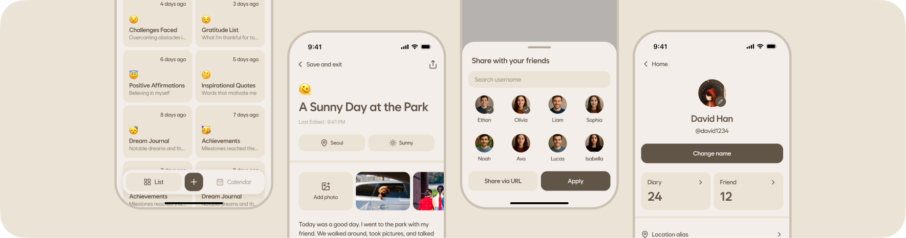

This file is a merged representation of a subset of the codebase, containing files not matching ignore patterns, combined into a single document by Repomix.
The content has been processed where empty lines have been removed.

# File Summary

## Purpose
This file contains a packed representation of the entire repository's contents.
It is designed to be easily consumable by AI systems for analysis, code review,
or other automated processes.

## File Format
The content is organized as follows:
1. This summary section
2. Repository information
3. Directory structure
4. Repository files (if enabled)
5. Multiple file entries, each consisting of:
  a. A header with the file path (## File: path/to/file)
  b. The full contents of the file in a code block

## Usage Guidelines
- This file should be treated as read-only. Any changes should be made to the
  original repository files, not this packed version.
- When processing this file, use the file path to distinguish
  between different files in the repository.
- Be aware that this file may contain sensitive information. Handle it with
  the same level of security as you would the original repository.

## Notes
- Some files may have been excluded based on .gitignore rules and Repomix's configuration
- Binary files are not included in this packed representation. Please refer to the Repository Structure section for a complete list of file paths, including binary files
- Files matching these patterns are excluded: src-tauri/gen/android/app/src/main/res/**/*.*, src-tauri/gen/android/app/build/**/*.*, **/*.pbxproj
- Files matching patterns in .gitignore are excluded
- Files matching default ignore patterns are excluded
- Empty lines have been removed from all files
- Files are sorted by Git change count (files with more changes are at the bottom)

# Directory Structure
```
public/
  symbol.svg
src/
  binding/
    function/
      decrypt-diary.ts
      decrypt-reply.ts
      encrypt-json.ts
      encrypt-key-for-recipient.ts
      generate-key-pair.ts
    types/
      diary-data.d.ts
      reply-data.d.ts
  components/
    features/
      auth/
        styles/
          biometric.css.ts
          pin.css.ts
          popup.css.ts
        biometric.tsx
        pin.tsx
        shared.ts
      diary/
        styles/
          detail-drawer.css.ts
          location-drawer.css.ts
          share-drawer.css.ts
          weather-drawer.css.ts
        delete-popup.tsx
        detail-drawer.tsx
        in-date-drawer.tsx
        location-drawer.tsx
        share-drawer.tsx
        stop-url-sharing-popup.tsx
        url-copied-popup.tsx
        weather-drawer.tsx
      friend/
        add-drawer.tsx
      location/
        alias/
          add-drawer.tsx
          delete-confirm-popup.tsx
          edit-drawer.tsx
        presets/
          add-drawer.tsx
          edit-drawer.tsx
          reset-confirm-popup.tsx
      reply/
        styles/
          replies-drawer.css.ts
          send-reply-drawer.css.ts
        replies-drawer.tsx
        send-reply-drawer.tsx
      user/
        styles/
          picker-drawer.css.ts
        ban-drawer.tsx
        picker-drawer.tsx
    layout/
      column/
        index.tsx
      container/
        index.tsx
      flex/
        styles/
          align.css.ts
          direction.css.ts
          flex.css.ts
          justify.css.ts
          wrap.css.ts
        index.tsx
        shared.ts
      grid/
        index.tsx
        styles.css.ts
      row/
        index.tsx
    pages/
      diary/
        styles/
          additional-info.css.ts
        additional-info.tsx
        context.ts
        saving-popup.tsx
      explorer/
        location-alias/
          styles/
            presets.css.ts
          others.tsx
          presets.tsx
        shared/
          styles/
            content.css.ts
          content.tsx
          header.tsx
      home/
        my-diaries/
          styles/
            my-diary-drawer.css.ts
          views/
            calendar.tsx
            list.tsx
          drawer.tsx
          index.tsx
        styles/
          bottom-navigator.css.ts
          friends-diaries.css.ts
        bottom-navigator.tsx
        friend-diary-drawer.tsx
        friends-diaries.tsx
      my-profile/
        styles/
          image.css.ts
          reset-confirm.css.ts
        change-name.tsx
        explorer-item.tsx
        image.tsx
        reset-confirm.tsx
      sign-up/
        styles/
          confirm-pin.css.ts
          styles.css.ts
        biometric.tsx
        confirm-pin.tsx
        context.ts
        information.tsx
        set-pin.tsx
    ui/
      avatar/
        styles/
          avatar.css.ts
          item.css.ts
        index.tsx
        item.tsx
      button/
        styles/
          button.css.ts
          group.css.ts
        group.tsx
        index.tsx
      calendar/
        styles/
          day.css.ts
          month.css.ts
        context.ts
        day.tsx
        month.tsx
        provider.tsx
      card/
        diary.tsx
        styles.css.ts
      content/
        index.tsx
        styles.css.ts
      divider/
        index.tsx
        padding.tsx
        styles.css.ts
      drawer/
        animation.ts
        index.tsx
        styles.css.ts
        title.tsx
      flow/
        context.ts
        index.tsx
      input/
        styles/
          emoji.css.ts
          field.css.ts
          image.css.ts
          pin.css.ts
          text.css.ts
        emoji.tsx
        field.tsx
        image.tsx
        index.tsx
        pin.tsx
      list/
        compact/
          item.tsx
          title.tsx
        item.css.ts
        item.tsx
      loading-circle/
        index.tsx
        styles.css.ts
      overlay/
        styles/
          backdrop.css.ts
          root.css.ts
        context.ts
        provider.tsx
        renderer.tsx
        types.ts
        utils.ts
      popup/
        animation.ts
        content.tsx
        index.tsx
        styles.css.ts
      sotto-symbol/
        index.tsx
      tabs/
        styles/
          item.css.ts
        content.tsx
        context.ts
        index.tsx
        item.tsx
      top-navigator/
        go-back.tsx
        index.tsx
        styles.css.ts
      typography/
        styles/
          typography.css.ts
          weight.css.ts
        base.tsx
        index.tsx
  hooks/
    use-auth.ts
    use-check-initialized.ts
    use-diary.ts
    use-drawer.ts
    use-flow.ts
    use-overlay.ts
  lib/
    managers/
      diary.ts
      friend.ts
      http.ts
      location.ts
      storage.ts
    animation.ts
    app.ts
    common.ts
    date.ts
    log.ts
    style.ts
    weather.ts
  routes/
    auth/
      sign-in/
        biometric/
          index.tsx
          page.css.ts
        forgot-pin/
          index.tsx
          page.css.ts
        pin/
          index.tsx
          page.css.ts
      sign-up/
        index.tsx
    diary/
      index.tsx
      page.css.ts
    explorer/
      diaries/
        detail.tsx
        index.tsx
      friends/
        detail.tsx
        index.tsx
      location-alias/
        index.tsx
    home/
      index.tsx
      page.css.ts
    index/
      index.tsx
      page.css.ts
    my-profile/
      index.tsx
      page.css.ts
    index.ts
  styles/
    color.css.ts
    font.css.ts
    layer.css.ts
    reset.css.ts
    utils.css.ts
  types/
    props.d.ts
    response.d.ts
  App.tsx
  main.tsx
  vite-env.d.ts
src-tauri/
  capabilities/
    default.json
    mobile.json
  gen/
    android/
      app/
        build/
          intermediates/
            dex_number_of_buckets_file/
              arm64Debug/
                dexBuilderArm64Debug/
                  out
        src/
          main/
            java/
              com/
                tyeongkim/
                  sotto_app/
                    MainActivity.kt
            AndroidManifest.xml
        .gitignore
        build.gradle.kts
        proguard-rules.pro
      buildSrc/
        build/
          kotlin/
            compileKotlin/
              cacheable/
                caches-jvm/
                  lookups/
                    counters.tab
          pluginDescriptors/
            rust.properties
          resources/
            main/
              META-INF/
                gradle-plugins/
                  rust.properties
          tmp/
            jar/
              MANIFEST.MF
        src/
          main/
            java/
              com/
                tyeongkim/
                  sotto_app/
                    kotlin/
                      BuildTask.kt
                      RustPlugin.kt
        build.gradle.kts
      gradle/
        wrapper/
          gradle-wrapper.properties
      .editorconfig
      .gitignore
      build.gradle.kts
      gradle.properties
      gradlew
      gradlew.bat
      settings.gradle
    apple/
      Assets.xcassets/
        AppIcon.appiconset/
          Contents.json
        Background.colorset/
          Contents.json
        Symbol.imageset/
          Contents.json
          Symbol.svg
        Contents.json
      sotto-app_iOS/
        Info.plist
        sotto-app_iOS.entitlements
      sotto-app.xcodeproj/
        project.xcworkspace/
          xcshareddata/
            WorkspaceSettings.xcsettings
          contents.xcworkspacedata
        xcshareddata/
          xcschemes/
            sotto-app_iOS.xcscheme
      Sources/
        sotto-app/
          bindings/
            bindings.h
          main.mm
      .gitignore
      ExportOptions.plist
      LaunchScreen.storyboard
      Podfile
      PrivacyInfo.xcprivacy
      project.yml
  src/
    crypto.rs
    lib.rs
    main.rs
  .gitignore
  build.rs
  Cargo.toml
  tauri.conf.json
.gitignore
biome.json
index.html
LICENSE.md
package.json
README.md
repomix.config.json
tsconfig.json
tsconfig.node.json
vite.config.ts
```

# Files

## File: public/symbol.svg
````
<svg width="83" height="97" viewBox="0 0 83 97" fill="none" xmlns="http://www.w3.org/2000/svg">
<rect x="7.33704" y="18.2445" width="56" height="79" rx="13" transform="rotate(-16 7.33704 18.2445)" fill="#B0A695"/>
<rect x="0.0569458" y="18.2515" width="56" height="79" rx="13" transform="rotate(-16 0.0569458 18.2515)" fill="#615548"/>
<rect x="13.5285" y="28.9528" width="26" height="4" rx="2" transform="rotate(-16 13.5285 28.9528)" fill="#F3EEEA"/>
<rect x="16.5605" y="39.5266" width="15" height="4" rx="2" transform="rotate(-16 16.5605 39.5266)" fill="#F3EEEA"/>
<rect x="19.5925" y="50.1005" width="26" height="4" rx="2" transform="rotate(-16 19.5925 50.1005)" fill="#F3EEEA"/>
<rect x="22.6245" y="60.6744" width="21" height="4" rx="2" transform="rotate(-16 22.6245 60.6744)" fill="#F3EEEA"/>
</svg>
````

## File: src/binding/function/encrypt-key-for-recipient.ts
````typescript
import { invoke } from '@tauri-apps/api/core';
/**
 * @param publicKey
 * @param aesKey
 * @returns The encrypted AES key (Base64)
 */
export async function encryptKeyForRecipient(
	publicKey: string,
	aesKey: string,
) {
	const result = await invoke<string>('encrypt_key_for_recipient', {
		publicKeyPem: publicKey,
		aesKey,
	});
	return result;
}
````

## File: src/binding/function/generate-key-pair.ts
````typescript
import { invoke } from '@tauri-apps/api/core';
export async function generateKeyPair() {
	const [privateKeyPem, publicKeyPem] =
		await invoke<[string, string]>('generate_key_pair');
	return {
		privateKeyPem,
		publicKeyPem,
	};
}
````

## File: src/components/features/reply/styles/replies-drawer.css.ts
````typescript
import { color } from '@/styles/color.css';
import { uiStyle } from '@/styles/layer.css';
export const list = uiStyle({
	width: '100%',
	maxHeight: 400,
	overflowY: 'auto',
});
export const content = uiStyle({
	backgroundColor: color.cream,
	borderRadius: 16,
});
````

## File: src/components/features/reply/styles/send-reply-drawer.css.ts
````typescript
import {
	body,
	typography,
} from '@/components/ui/typography/styles/typography.css';
import { weightStyles } from '@/components/ui/typography/styles/weight.css';
import { color } from '@/styles/color.css';
import { uiStyle } from '@/styles/layer.css';
export const wrapper = uiStyle({
	width: '100%',
	height: 180,
	backgroundColor: color.cream,
	borderRadius: 16,
});
export const textArea = uiStyle([
	typography,
	body,
	weightStyles.medium,
	{
		height: '100%',
		':disabled': {
			opacity: 1,
		},
	},
]);
````

## File: src/components/features/reply/replies-drawer.tsx
````typescript
import { decryptReply } from '@/binding/function/decrypt-reply';
import { Column } from '@/components/layout/column';
import { Container } from '@/components/layout/container';
import { Row } from '@/components/layout/row';
import { Avatar } from '@/components/ui/avatar';
import { Drawer } from '@/components/ui/drawer';
import { DrawerTitle } from '@/components/ui/drawer/title';
import { LoadingCircle } from '@/components/ui/loading-circle';
import type { OverlayProps } from '@/components/ui/overlay/types';
import { Typo } from '@/components/ui/typography';
import { log } from '@/lib/log';
import type { Diary, Reply } from '@/lib/managers/diary';
import { friendManager } from '@/lib/managers/friend';
import { apiClient } from '@/lib/managers/http';
import { storageClient } from '@/lib/managers/storage';
import { message } from '@tauri-apps/plugin-dialog';
import { X } from 'lucide-react';
import { useEffect, useState } from 'react';
import { content, list } from './styles/replies-drawer.css';
interface DiaryRepliesDrawerProps {
	diary: Diary;
}
export function DiaryRepliesDrawer(
	props: DiaryRepliesDrawerProps & OverlayProps,
) {
	const { diary, close } = props;
	const [replies, setReplies] = useState<Array<Reply>>([]);
	const [isLoading, setIsLoading] = useState(true);
	useEffect(() => {
		setIsLoading(true);
		apiClient
			.get<RepliesResponse>(`/replies?diaryId=${diary.shareUUID}`)
			.then(async (replies) => {
				const privateKey = await storageClient.get('privateKey');
				if (!privateKey) {
					log('error', 'Private key not found');
					throw new Error('Private key not found');
				}
				const decryptedReplies = await Promise.all(
					replies.map(async (reply) => ({
						uuid: reply.uuid,
						diaryId: reply.diaryId,
						authorId: reply.authorId,
						...(await decryptReply(
							privateKey,
							reply.data,
							reply.encryptedKey,
							reply.nonce,
						)),
						createdAt: new Date(reply.createdAt),
					})),
				);
				setReplies(decryptedReplies);
			})
			.catch(async (error) => {
				log('error', 'Failed to fetch replies', error);
				await message(`Failed to fetch replies: ${error}`);
				close();
			})
			.finally(() => {
				setIsLoading(false);
			});
	}, [diary.shareUUID, close]);
	return (
		<Drawer close={close}>
			<DrawerTitle>Replies</DrawerTitle>
			{isLoading ? (
				<Container vertical='large'>
					<Row justify='center'>
						<LoadingCircle />
					</Row>
				</Container>
			) : (
				<Column className={list}>
					{replies.map((reply, i) => (
						<Item key={i.toString()} reply={reply} />
					))}
				</Column>
			)}
		</Drawer>
	);
}
interface ItemProps {
	reply: Reply;
}
function Item(props: ItemProps) {
	const { reply } = props;
	const author = friendManager.getFriend(reply.authorId);
	if (!author) {
		return null;
	}
	return (
		<Container>
			<Column gap={12}>
				<Row align='center' justify='space-between'>
					<Row gap={6} align='center'>
						<Avatar size={24} src={author.profileUrl} />
						<Typo.Caption weight='medium'>{author.name}</Typo.Caption>
					</Row>
					<X size={20} />
				</Row>
				<Container className={content} vertical='regular'>
					<Column gap={8}>
						{reply.emoji && <Typo.Lead>{reply.emoji}</Typo.Lead>}
						<Typo.Body>{reply.content}</Typo.Body>
					</Column>
				</Container>
			</Column>
		</Container>
	);
}
````

## File: src/components/features/reply/send-reply-drawer.tsx
````typescript
import { encryptJson } from '@/binding/function/encrypt-json';
import { encryptKeyForRecipient } from '@/binding/function/encrypt-key-for-recipient';
import { Column } from '@/components/layout/column';
import { Container } from '@/components/layout/container';
import { Button } from '@/components/ui/button';
import { ButtonGroup } from '@/components/ui/button/group';
import { Drawer } from '@/components/ui/drawer';
import { DrawerTitle } from '@/components/ui/drawer/title';
import { EmojiInput } from '@/components/ui/input/emoji';
import type { OverlayProps } from '@/components/ui/overlay/types';
import { log } from '@/lib/log';
import type { Diary } from '@/lib/managers/diary';
import { friendManager } from '@/lib/managers/friend';
import { apiClient } from '@/lib/managers/http';
import { fullHeight } from '@/styles/utils.css';
import { message } from '@tauri-apps/plugin-dialog';
import { useCallback, useState } from 'react';
import { textArea, wrapper } from './styles/send-reply-drawer.css';
interface DiarySendReplyDrawerProps {
	diary: Diary;
}
export function DiarySendReplyDrawer(
	props: DiarySendReplyDrawerProps & OverlayProps,
) {
	const { diary, close } = props;
	const [emoji, setEmoji] = useState('');
	const [content, setContent] = useState('');
	const [isSending, setIsSending] = useState(false);
	const onClickSend = useCallback(async () => {
		if (!content) {
			await message('Please enter a message');
			return;
		}
		const user = friendManager.getFriend(diary.sharedBy || '');
		if (!user) {
			await message('User not found');
			return;
		}
		try {
			setIsSending(true);
			const [data, key, nonce] = await encryptJson({ emoji, content });
			const encryptedKey = await encryptKeyForRecipient(user.publicKey, key);
			await apiClient.post('/replies', {
				diaryId: diary.uuid,
				data,
				nonce,
				encryptedKey,
			});
			close();
		} catch (error) {
			log('error', 'Failed to send reply', error);
			await message(`Failed to send reply: ${error}`);
			return;
		} finally {
			setIsSending(false);
		}
	}, [diary, emoji, content, close]);
	return (
		<Drawer close={close}>
			<DrawerTitle>Send reply</DrawerTitle>
			<Container vertical='small'>
				<Container className={wrapper} horizontal='regular'>
					<Column className={fullHeight} gap={12}>
						<EmojiInput defaultValue={emoji} onValue={setEmoji} />
						<textarea
							className={textArea}
							placeholder='Write short message'
							value={content}
							onChange={(e) => setContent(e.target.value)}
						/>
					</Column>
				</Container>
			</Container>
			<ButtonGroup>
				<Button fill onClick={onClickSend} loading={isSending}>
					Send
				</Button>
			</ButtonGroup>
		</Drawer>
	);
}
````

## File: src/components/layout/column/index.tsx
````typescript
import { Flex } from '../flex';
import type { FlexProps } from '../flex/shared';
export function Column(props: FlexProps) {
	return <Flex {...props} direction='column' />;
}
````

## File: src/components/layout/flex/styles/align.css.ts
````typescript
import { layoutStyle } from '@/styles/layer.css';
export const alignStyles = {
	start: layoutStyle({
		alignItems: 'flex-start',
	}),
	center: layoutStyle({
		alignItems: 'center',
	}),
	end: layoutStyle({
		alignItems: 'flex-end',
	}),
	stretch: layoutStyle({
		alignItems: 'stretch',
	}),
} as const;
````

## File: src/components/layout/flex/styles/direction.css.ts
````typescript
import { layoutStyle } from '@/styles/layer.css';
export const directionStyles = {
	row: layoutStyle({
		flexDirection: 'row',
	}),
	'row-reverse': layoutStyle({
		flexDirection: 'row-reverse',
	}),
	column: layoutStyle({
		flexDirection: 'column',
	}),
	'column-reverse': layoutStyle({
		flexDirection: 'column-reverse',
	}),
} as const;
````

## File: src/components/layout/flex/styles/flex.css.ts
````typescript
import { layoutStyle } from '@/styles/layer.css';
export const flex = layoutStyle({
	display: 'flex',
});
export const noGrow = layoutStyle({
	flexGrow: 0,
});
export const noShrink = layoutStyle({
	flexShrink: 0,
});
````

## File: src/components/layout/flex/styles/justify.css.ts
````typescript
import { layoutStyle } from '@/styles/layer.css';
export const justifyStyles = {
	start: layoutStyle({
		justifyContent: 'flex-start',
	}),
	center: layoutStyle({
		justifyContent: 'center',
	}),
	end: layoutStyle({
		justifyContent: 'flex-end',
	}),
	'space-between': layoutStyle({
		justifyContent: 'space-between',
	}),
	'space-around': layoutStyle({
		justifyContent: 'space-around',
	}),
	'space-evenly': layoutStyle({
		justifyContent: 'space-evenly',
	}),
} as const;
````

## File: src/components/layout/flex/styles/wrap.css.ts
````typescript
import { layoutStyle } from '@/styles/layer.css';
export const wrapStyles = {
	nowrap: layoutStyle({
		flexWrap: 'nowrap',
	}),
	wrap: layoutStyle({
		flexWrap: 'wrap',
	}),
	'wrap-reverse': layoutStyle({
		flexWrap: 'wrap-reverse',
	}),
} as const;
````

## File: src/components/layout/flex/index.tsx
````typescript
import { cn } from '@/lib/common';
import { createElement } from 'react';
import type { FlexProps } from './shared';
import { alignStyles } from './styles/align.css';
import { directionStyles } from './styles/direction.css';
import { flex, noGrow, noShrink } from './styles/flex.css';
import { justifyStyles } from './styles/justify.css';
import { wrapStyles } from './styles/wrap.css';
export function Flex(props: FlexProps) {
	const {
		as = 'div',
		direction = 'row',
		wrap = 'nowrap',
		align = 'stretch',
		justify = 'center',
		grow = true,
		shrink = true,
		gap,
		className: propClassName,
		style: propStyle,
		...restProps
	} = props;
	const classNames = [
		flex,
		directionStyles[direction],
		alignStyles[align],
		justifyStyles[justify],
		wrapStyles[wrap],
		{
			[noGrow]: !grow,
			[noShrink]: !shrink,
		},
	];
	return createElement(as, {
		...restProps,
		className: cn(classNames, propClassName),
		style: {
			...propStyle,
			gap,
		},
	});
}
````

## File: src/components/layout/flex/shared.ts
````typescript
import type { BaseProps, HAS_CHILDREN } from '@/types/props';
import type { JSX } from 'react';
type AlignItems = 'start' | 'center' | 'end' | 'stretch';
type JustifyContent =
	| 'start'
	| 'center'
	| 'end'
	| 'space-between'
	| 'space-around'
	| 'space-evenly';
type FlexDirection = 'row' | 'column' | 'row-reverse' | 'column-reverse';
type FlexWrap = 'nowrap' | 'wrap' | 'wrap-reverse';
export interface FlexProps
	extends BaseProps<HAS_CHILDREN>,
		React.HTMLAttributes<HTMLElement> {
	as?: keyof JSX.IntrinsicElements;
	direction?: FlexDirection;
	wrap?: FlexWrap;
	align?: AlignItems;
	justify?: JustifyContent;
	grow?: boolean;
	shrink?: boolean;
	gap?: string | number;
}
````

## File: src/components/layout/grid/index.tsx
````typescript
import { cn } from '@/lib/common';
import type { BaseProps, HAS_CHILDREN } from '@/types/props';
import { grid } from './styles.css';
interface GridProps extends BaseProps<HAS_CHILDREN> {}
export function Grid(props: GridProps) {
	const { className, ...rest } = props;
	const classNames = [grid, className];
	return <div {...rest} className={cn(classNames)} />;
}
````

## File: src/components/layout/grid/styles.css.ts
````typescript
import { layoutStyle } from '@/styles/layer.css';
export const grid = layoutStyle({
	width: '100%',
	display: 'grid',
	gridTemplateColumns: 'repeat(2, 1fr)',
	gap: 8,
});
````

## File: src/components/layout/row/index.tsx
````typescript
import { Flex } from '../flex';
import type { FlexProps } from '../flex/shared';
export function Row(props: FlexProps) {
	return <Flex {...props} direction='row' />;
}
````

## File: src/components/pages/sign-up/styles/confirm-pin.css.ts
````typescript
import { style } from '@vanilla-extract/css';
export const pinUnmatched = style({
	textAlign: 'center',
});
````

## File: src/components/pages/sign-up/styles/styles.css.ts
````typescript
import { style } from '@vanilla-extract/css';
export const fillHeight = style({
	height: '100%',
});
export const title = style({
	textAlign: 'center',
});
````

## File: src/components/pages/sign-up/confirm-pin.tsx
````typescript
import { Column } from '@/components/layout/column';
import { Container } from '@/components/layout/container';
import { PINInput } from '@/components/ui/input/pin';
import { TopNavigator } from '@/components/ui/top-navigator';
import { GoBack } from '@/components/ui/top-navigator/go-back';
import { Typo } from '@/components/ui/typography';
import { useFlow } from '@/hooks/use-flow';
import { useCallback, useContext, useState } from 'react';
import { SignUpFlowContext } from './context';
import { pinUnmatched } from './styles/confirm-pin.css';
import { fillHeight, title } from './styles/styles.css';
export function SignUpConfirmPinSection() {
	const { next } = useFlow();
	const { pin: prevPin, setConfirmPin } = useContext(SignUpFlowContext);
	const [isUnmatched, setIsUnmatched] = useState(false);
	const onPin = useCallback(
		(pin: string) => {
			if (pin !== prevPin) {
				setIsUnmatched(true);
				return;
			}
			setConfirmPin(pin);
			next();
		},
		[setConfirmPin, next, prevPin],
	);
	return (
		<Column className={fillHeight}>
			<TopNavigator leadingArea={<GoBack />} />
			<Column className={fillHeight}>
				<Container className={title}>
					<Typo.Title weight='strong'>Confirm PIN</Typo.Title>
				</Container>
				<Container>
					<PINInput onPin={onPin} />
				</Container>
				{isUnmatched && (
					<Container className={pinUnmatched}>
						<Typo.Body>PIN does not match</Typo.Body>
					</Container>
				)}
			</Column>
		</Column>
	);
}
````

## File: src/components/pages/sign-up/context.ts
````typescript
import { type Dispatch, type SetStateAction, createContext } from 'react';
type SignUpFlowContextType = {
	profileImage: string | null;
	name: string;
	username: string;
	pin: string;
	confirmPin: string;
	useBiometricLogin: boolean;
	setProfileImage: Dispatch<SetStateAction<string | null>>;
	setName: Dispatch<SetStateAction<string>>;
	setUsername: Dispatch<SetStateAction<string>>;
	setPin: Dispatch<SetStateAction<string>>;
	setConfirmPin: Dispatch<SetStateAction<string>>;
	setUseBiometricLogin: Dispatch<SetStateAction<boolean>>;
};
export const SignUpFlowContext = createContext({} as SignUpFlowContextType);
````

## File: src/components/pages/sign-up/set-pin.tsx
````typescript
import { Column } from '@/components/layout/column';
import { Container } from '@/components/layout/container';
import { PINInput } from '@/components/ui/input/pin';
import { TopNavigator } from '@/components/ui/top-navigator';
import { GoBack } from '@/components/ui/top-navigator/go-back';
import { Typo } from '@/components/ui/typography';
import { useFlow } from '@/hooks/use-flow';
import { useCallback, useContext } from 'react';
import { SignUpFlowContext } from './context';
import { fillHeight, title } from './styles/styles.css';
export function SignUpSetPinSection() {
	const { next } = useFlow();
	const { setPin } = useContext(SignUpFlowContext);
	const onPin = useCallback(
		(pin: string) => {
			setPin(pin);
			next();
		},
		[setPin, next],
	);
	return (
		<Column className={fillHeight}>
			<TopNavigator leadingArea={<GoBack />} />
			<Column className={fillHeight}>
				<Container className={title}>
					<Typo.Title weight='strong'>Set PIN</Typo.Title>
				</Container>
				<Container>
					<PINInput onPin={onPin} />
				</Container>
			</Column>
		</Column>
	);
}
````

## File: src/components/ui/content/styles.css.ts
````typescript
import { color } from '@/styles/color.css';
import { uiStyle } from '@/styles/layer.css';
export const content = uiStyle({
	height: '100%',
});
export const iconStyle = uiStyle({
	display: 'grid',
	placeItems: 'center',
	width: 'fit-content',
	aspectRatio: '1 / 1',
	padding: 24,
	backgroundColor: color.cream,
	borderRadius: '50%',
});
````

## File: src/components/ui/divider/index.tsx
````typescript
import { divider } from './styles.css';
export function Divider() {
	return <div className={divider} />;
}
````

## File: src/components/ui/divider/styles.css.ts
````typescript
import { color } from '@/styles/color.css';
import { uiStyle } from '@/styles/layer.css';
export const divider = uiStyle({
	width: '100%',
	height: 6,
	backgroundColor: color.cream,
});
````

## File: src/components/ui/flow/context.ts
````typescript
import { type Dispatch, type SetStateAction, createContext } from 'react';
type FlowContextType = {
	currentStep: number;
	setCurrentStep: Dispatch<SetStateAction<number>>;
};
export const FlowContext = createContext({} as FlowContextType);
````

## File: src/components/ui/flow/index.tsx
````typescript
import { useState } from 'react';
import { FlowContext } from './context';
interface FlowProps {
	defaultStep?: number;
	pages: Array<React.ReactNode>;
}
export function Flow(props: FlowProps) {
	const { defaultStep = 0, pages } = props;
	const [currentStep, setCurrentStep] = useState(defaultStep);
	return (
		<FlowContext value={{ currentStep, setCurrentStep }}>
			{pages[currentStep]}
		</FlowContext>
	);
}
````

## File: src/components/ui/input/styles/field.css.ts
````typescript
import { uiStyle } from '@/styles/layer.css';
export const labelStyle = uiStyle({
	width: '100%',
});
````

## File: src/components/ui/input/styles/image.css.ts
````typescript
import { color } from '@/styles/color.css';
import { uiStyle } from '@/styles/layer.css';
export const wrapper = uiStyle({
	width: 80,
	height: 80,
	backgroundColor: color.cream,
	borderRadius: '50%',
	display: 'grid',
	placeItems: 'center',
	overflow: 'hidden',
});
export const input = uiStyle({
	position: 'absolute',
	top: -100,
	left: -100,
	width: 1,
	height: 1,
});
export const image = uiStyle({
	width: 80,
	height: 80,
	objectFit: 'cover',
	borderRadius: '50%',
	overflow: 'hidden',
});
````

## File: src/components/ui/input/styles/pin.css.ts
````typescript
import { color } from '@/styles/color.css';
import { uiStyle } from '@/styles/layer.css';
export const wrapper = uiStyle({
	position: 'relative',
});
export const input = uiStyle({
	position: 'absolute',
	width: '100%',
	height: '100%',
	opacity: 0,
});
export const item = uiStyle({
	width: 45,
	padding: 12,
	backgroundColor: color.cream,
	border: `1.5px solid ${color.sand}`,
	borderRadius: 16,
	color: color.sand,
});
export const itemActive = uiStyle({
	borderColor: color.mud,
	color: color.mud,
});
````

## File: src/components/ui/input/styles/text.css.ts
````typescript
import { color } from '@/styles/color.css';
import { uiStyle } from '@/styles/layer.css';
import { body } from '../../typography/styles/typography.css';
export const input = uiStyle([
	body,
	{
		width: '100%',
		padding: '12px 16px',
		backgroundColor: color.cream,
		borderRadius: 16,
	},
]);
````

## File: src/components/ui/input/image.tsx
````typescript
import { Plus } from 'lucide-react';
import {
	type ChangeEvent,
	type InputHTMLAttributes,
	useCallback,
	useState,
} from 'react';
import { image, input, wrapper } from './styles/image.css';
interface ImageInputProps extends InputHTMLAttributes<HTMLInputElement> {
	preview?: string;
	onImage?: (image: File | null) => void;
}
export function ImageInput(props: ImageInputProps) {
	const { preview, onChange: propOnChange, onImage, ...rest } = props;
	const [previewUrl, setPreviewUrl] = useState<string | undefined>(preview);
	const onChange = useCallback(
		(e: ChangeEvent<HTMLInputElement>) => {
			const file = e.target.files?.[0];
			if (file) {
				const reader = new FileReader();
				reader.onloadend = () => {
					setPreviewUrl(reader.result?.toString());
				};
				reader.readAsDataURL(file);
				onImage?.(file);
			}
			propOnChange?.(e);
		},
		[propOnChange, onImage],
	);
	return (
		<label className={wrapper}>
			{previewUrl ? (
				
			) : (
				<Plus size={32} />
			)}
			<input {...rest} className={input} type='file' onChange={onChange} />
		</label>
	);
}
````

## File: src/components/ui/input/index.tsx
````typescript
import type { ChangeEvent, InputHTMLAttributes } from 'react';
import { input } from './styles/text.css';
interface InputFieldProps extends InputHTMLAttributes<HTMLInputElement> {
	onValue?: (value: string) => void;
}
export function Input(props: InputFieldProps) {
	const { onValue, onChange: propOnChange, ...rest } = props;
	const onChange = (e: ChangeEvent<HTMLInputElement>) => {
		propOnChange?.(e);
		onValue?.(e.target.value);
	};
	return <input {...rest} className={input} onChange={onChange} />;
}
````

## File: src/components/ui/input/pin.tsx
````typescript
import { Row } from '@/components/layout/row';
import { cn } from '@/lib/common';
import { useEffect, useRef, useState } from 'react';
import { Typo } from '../typography';
import { input, item, itemActive, wrapper } from './styles/pin.css';
interface PINInputProps {
	onPin?: (pin: string) => void;
}
export function PINInput(props: PINInputProps) {
	const { onPin } = props;
	const [pin, setPin] = useState('');
	const inputRef = useRef<HTMLInputElement>(null);
	useEffect(() => {
		if (pin.length >= 4) {
			onPin?.(pin.slice(0, 4));
		}
	}, [pin, onPin]);
	useEffect(() => {
		if (inputRef.current) {
			inputRef.current.focus();
		}
	}, []);
	return (
		<Row className={wrapper} gap={8}>
			<input
				className={input}
				ref={inputRef}
				type='number'
				maxLength={4}
				pattern='[0-9]*'
				inputMode='numeric'
				min={0}
				max={9999}
				value={pin}
				onChange={(e) => setPin(e.target.value)}
				onClick={() => setPin('')}
			/>
			<PINItem value={pin[0]} />
			<PINItem value={pin[1]} />
			<PINItem value={pin[2]} />
			<PINItem value={pin[3]} />
		</Row>
	);
}
interface PINItemProps {
	value?: string;
}
function PINItem(props: PINItemProps) {
	const { value } = props;
	const isTyped = !!value;
	return (
		<div className={cn(item, isTyped && itemActive)}>
			<Typo.Title weight='medium'>{value ?? '0'}</Typo.Title>
		</div>
	);
}
````

## File: src/components/ui/sotto-symbol/index.tsx
````typescript
interface SymbolProps {
	size?: number;
	className?: string;
}
export function SottoSymbol(props: SymbolProps) {
	const { size = 32, className } = props;
	return (
		
	);
}
````

## File: src/components/ui/tabs/styles/item.css.ts
````typescript
import { color } from '@/styles/color.css';
import { style } from '@vanilla-extract/css';
export const group = style({
	width: '100%',
	padding: '0 16px',
});
export const item = style({
	width: '100%',
	padding: '8px 24px',
	color: color.sand,
});
export const itemActive = style({
	color: color.mud,
});
````

## File: src/components/ui/tabs/content.tsx
````typescript
import type { BaseProps, HAS_CHILDREN } from '@/types/props';
import { useContext } from 'react';
import { TabsContext } from './context';
interface TabsContentProps extends BaseProps<HAS_CHILDREN> {
	value: string;
}
export function TabsContent(props: TabsContentProps) {
	const { value, children } = props;
	const { currentValue } = useContext(TabsContext);
	return currentValue === value ? children : null;
}
````

## File: src/components/ui/tabs/context.ts
````typescript
import { createContext } from 'react';
type TabsContextType = {
	currentValue: string | null;
	setCurrentValue: (value: string) => unknown;
};
export const TabsContext = createContext({} as TabsContextType);
````

## File: src/components/ui/tabs/item.tsx
````typescript
import { Row } from '@/components/layout/row';
import { cn } from '@/lib/common';
import type { BaseProps, HAS_CHILDREN } from '@/types/props';
import { useContext } from 'react';
import { Typo } from '../typography';
import { TabsContext } from './context';
import { group, item, itemActive } from './styles/item.css';
export function TabsGroup(props: BaseProps<HAS_CHILDREN>) {
	const { children } = props;
	return (
		<Row className={group} justify='start'>
			{children}
		</Row>
	);
}
interface TabRailItemProps extends BaseProps<HAS_CHILDREN> {
	value: string;
}
export function TabsItem(props: TabRailItemProps) {
	const { value, children } = props;
	const { currentValue, setCurrentValue } = useContext(TabsContext);
	const isActive = currentValue === value;
	const handleClick = () => {
		setCurrentValue(value);
	};
	return (
		<Row className={cn(item, isActive && itemActive)} onClick={handleClick}>
			<Typo.Body weight={isActive ? 'strong' : 'medium'}>{children}</Typo.Body>
		</Row>
	);
}
````

## File: src/components/ui/top-navigator/index.tsx
````typescript
import { Column } from '@/components/layout/column';
import { Row } from '@/components/layout/row';
import type { BaseProps, HAS_CHILDREN } from '@/types/props';
import { content, spacer, topNavigator } from './styles.css';
interface TopNavigatorProps extends BaseProps<HAS_CHILDREN> {
	leadingArea?: React.ReactNode;
	trailingArea?: React.ReactNode;
}
export function TopNavigator(props: TopNavigatorProps) {
	const { leadingArea, trailingArea, children } = props;
	return (
		<>
			<Column as='nav' className={topNavigator} justify='end'>
				<Row className={content} align='center' justify='space-between'>
					{leadingArea}
					{children}
					{trailingArea}
				</Row>
			</Column>
			<div className={spacer} />
		</>
	);
}
````

## File: src/components/ui/top-navigator/styles.css.ts
````typescript
import { color } from '@/styles/color.css';
import { uiStyle } from '@/styles/layer.css';
export const topNavigator = uiStyle({
	position: 'fixed',
	width: '100%',
	height: 'calc(48px + env(safe-area-inset-top))',
	padding: '0 16px',
	backgroundColor: color.milk,
	top: 0,
	left: 0,
	zIndex: 100,
});
export const content = uiStyle({
	height: 48,
});
export const spacer = uiStyle({
	height: 'calc(48px + env(safe-area-inset-top))',
	flexShrink: 0,
});
````

## File: src/components/ui/typography/styles/typography.css.ts
````typescript
import { uiStyle } from '@/styles/layer.css';
import { weightStyles } from './weight.css';
export const typography = uiStyle([
	weightStyles.regular,
	{
		letterSpacing: '-3.75%',
	},
]);
export const typographyFill = uiStyle({
	width: '100%',
	display: 'block',
});
export const title = uiStyle({
	fontSize: 32,
});
export const lead = uiStyle({
	fontSize: 20,
});
export const body = uiStyle({
	fontSize: 16,
});
export const caption = uiStyle({
	fontSize: 14,
});
````

## File: src/components/ui/typography/styles/weight.css.ts
````typescript
import { uiStyle } from '@/styles/layer.css';
export const weightStyles = {
	regular: uiStyle({
		fontWeight: '400',
	}),
	medium: uiStyle({
		fontWeight: '500',
	}),
	strong: uiStyle({
		fontWeight: '600',
	}),
};
````

## File: src/components/ui/typography/index.tsx
````typescript
import { cn } from '@/lib/common';
import { TypographyBase, type TypographyBaseProps } from './base';
import { body, caption, lead, title } from './styles/typography.css';
function typographyBuilder(...classNames: Array<string>) {
	return (props: TypographyBaseProps) => (
		<TypographyBase {...props} className={cn(classNames, props.className)} />
	);
}
const Typography = {
	Title: typographyBuilder(title),
	Lead: typographyBuilder(lead),
	Body: typographyBuilder(body),
	Caption: typographyBuilder(caption),
};
export { Typography, Typography as Typo };
````

## File: src/hooks/use-flow.ts
````typescript
import { FlowContext } from '@/components/ui/flow/context';
import { useCallback, useContext } from 'react';
export function useFlow() {
	const context = useContext(FlowContext);
	if (!context) {
		throw new Error('useFlow must be used inside a Flow component');
	}
	const { currentStep, setCurrentStep } = context;
	const next = useCallback(() => {
		setCurrentStep((prev) => prev + 1);
	}, [setCurrentStep]);
	const prev = useCallback(() => {
		setCurrentStep((prev) => prev - 1);
	}, [setCurrentStep]);
	const setStep = setCurrentStep;
	return {
		currentStep,
		next,
		prev,
		setStep,
	};
}
````

## File: src/lib/managers/storage.ts
````typescript
import { appDataDir } from '@tauri-apps/api/path';
import { BaseDirectory, remove } from '@tauri-apps/plugin-fs';
import {
	type Client,
	type Store,
	Stronghold,
} from '@tauri-apps/plugin-stronghold';
import { log } from '../log';
abstract class StorageClient {
	public isInitialized = false;
	abstract init(password: string): Promise<void>;
	abstract get(key: string): Promise<string | null>;
	abstract set(key: string, value: string): Promise<void>;
	abstract remove(key: string): Promise<void>;
	abstract clear(): Promise<StorageClient>;
}
class LocalStorageClient extends StorageClient {
	constructor() {
		super();
		log('warn', 'Using LocalStorageClient');
	}
	async init() {
		log('debug', 'LocalStorageClient does not require initialization');
		this.isInitialized = true;
	}
	async get(key: string) {
		return localStorage.getItem(key);
	}
	async set(key: string, value: string) {
		localStorage.setItem(key, value);
	}
	async remove(key: string) {
		localStorage.removeItem(key);
	}
	async clear() {
		localStorage.clear();
		return new LocalStorageClient();
	}
}
class StrongholdStorageClient extends StorageClient {
	private stronghold?: Stronghold;
	private client?: Client;
	private store?: Store;
	constructor() {
		super();
		log('debug', 'Using StrongholdStorageClient');
	}
	async init(password: string) {
		const vaultPath = `${await appDataDir()}/vault.hold`;
		this.stronghold = await Stronghold.load(vaultPath, password);
		try {
			this.client = await this.stronghold.loadClient('sotto_client');
		} catch {
			this.client = await this.stronghold.createClient('sotto_client');
		}
		this.store = this.client.getStore();
		this.isInitialized = true;
	}
	private checkInitialized() {
		if (!this.client || !this.stronghold || !this.store) {
			throw new Error(
				'Stronghold client is not initialized. Please call init() first.',
			);
		}
	}
	async get(key: string) {
		this.checkInitialized();
		const value = (await this.store?.get(key)) || null;
		return value ? new TextDecoder().decode(value) : null;
	}
	async set(key: string, value: string) {
		this.checkInitialized();
		const encodedValue = Array.from(new TextEncoder().encode(value));
		await this.store?.insert(key, encodedValue);
		await this.stronghold?.save();
	}
	async remove(key: string) {
		this.checkInitialized();
		await this.store?.remove(key);
		await this.stronghold?.save();
	}
	/**
	 * You have to reinitialize the Stronghold client after clearing it.
	 * @returns A new instance of StrongholdStorageClient
	 */
	async clear() {
		this.checkInitialized();
		await this.stronghold?.unload();
		await remove('vault.hold', {
			baseDir: BaseDirectory.AppData,
		});
		const instance = new StrongholdStorageClient();
		return instance;
	}
}
export const storageClient: StorageClient = import.meta.env.PROD
	? new StrongholdStorageClient()
	: new LocalStorageClient();
````

## File: src/lib/animation.ts
````typescript
export const ease = [0.4, 0, 0.2, 1];
export const transition = {
	duration: 0.2,
	ease,
};
export function getTransition(duration = 0.2, delay = 0) {
	return {
		duration,
		ease,
		delay,
	};
}
````

## File: src/lib/log.ts
````typescript
import * as logPlugin from '@tauri-apps/plugin-log';
type Log = 'debug' | 'warn' | 'error';
export function log(type: Log, ...args: Array<unknown>) {
	const nativeLogger = logPlugin[type];
	const consoleLogger = console[type];
	consoleLogger(...args);
	nativeLogger(args.join(' '));
}
````

## File: src/lib/style.ts
````typescript
import {
	type StyleRule,
	globalStyle as _globalStyle,
	style as _style,
} from '@vanilla-extract/css';
type StyleFunction = typeof _style;
type GlobalStyleFunction = typeof _globalStyle;
type ClassNames = string | Array<ClassNames>;
export function getLayerApplier(layer: string) {
	function style(...args: Parameters<StyleFunction>) {
		const [rule, debugId] = args;
		const appliedRule = Array.isArray(rule)
			? rule.map((r) => (isLayerApplicable(r) ? applyLayer(layer, r) : r))
			: applyLayer(layer, rule);
		return _style(appliedRule, debugId);
	}
	function globalStyle(...args: Parameters<GlobalStyleFunction>) {
		const [selector, rule] = args;
		return _globalStyle(selector, applyLayer(layer, rule));
	}
	return {
		style,
		globalStyle,
	};
}
export function applyLayer(layer: string, rule: StyleRule) {
	return { '@layer': { [layer]: rule } };
}
function isLayerApplicable(rule: StyleRule | ClassNames): rule is StyleRule {
	return typeof rule === 'object' && !Array.isArray(rule);
}
export function addOpacity(hex: string, opacity: number) {
	const opacityHex = Math.round((opacity / 100) * 255)
		.toString(16)
		.padStart(2, '0');
	return `${hex}${opacityHex}`;
}
export const scaleFactor = process.env.NODE_ENV === 'production' ? 13 / 10 : 1;
export function calculateScaleFactor(size: number) {
	return `${(size * scaleFactor).toFixed(1)}px`;
}
````

## File: src/routes/home/page.css.ts
````typescript
import { style } from '@vanilla-extract/css';
export const left = style({
	marginLeft: 8,
});
export const right = style({
	marginRight: 8,
});
export const banWarning = style({
	opacity: 0.7,
	lineHeight: 1.5,
});
````

## File: src/styles/color.css.ts
````typescript
import { createGlobalTheme } from '@vanilla-extract/css';
export const color = createGlobalTheme(':root', {
	milk: 'hsla(27, 27%, 94%)',
	cream: 'hsla(38, 35%, 88%)',
	sand: 'hsla(38, 15%, 64%)',
	mud: 'hsla(31, 15%, 33%)',
});
````

## File: src/styles/layer.css.ts
````typescript
import { getLayerApplier } from '@/lib/style';
import { globalLayer } from '@vanilla-extract/css';
export const resetLayer = globalLayer('reset');
export const layoutLayer = globalLayer('layout');
export const uiLayer = globalLayer('ui');
export const { style: resetStyle, globalStyle: resetGlobalStyle } =
	getLayerApplier(resetLayer);
export const { style: layoutStyle, globalStyle: layoutGlobalStyle } =
	getLayerApplier(layoutLayer);
export const { style: uiStyle, globalStyle: uiGlobalStyle } =
	getLayerApplier(uiLayer);
````

## File: src/types/props.d.ts
````typescript
export type HAS_CHILDREN = true;
export interface BaseProps<CHILDREN extends boolean = false> {
	className?: string;
	style?: React.CSSProperties;
	children?: CHILDREN extends true ? React.ReactNode : never;
}
````

## File: src/vite-env.d.ts
````typescript
/// <reference types="vite/client" />
````

## File: src-tauri/capabilities/mobile.json
````json
{
	"identifier": "mobile-capability",
	"platforms": ["android", "iOS"],
	"windows": ["main"],
	"permissions": ["biometric:default"]
}
````

## File: src-tauri/gen/android/app/build/intermediates/dex_number_of_buckets_file/arm64Debug/dexBuilderArm64Debug/out
````
7
````

## File: src-tauri/gen/android/app/.gitignore
````
/src/main/java/com/tyeongkim/sotto_app/generated
/src/main/jniLibs/**/*.so
/src/main/assets/tauri.conf.json
/tauri.build.gradle.kts
/proguard-tauri.pro
/tauri.properties
````

## File: src-tauri/gen/android/app/proguard-rules.pro
````
# Add project specific ProGuard rules here.
# You can control the set of applied configuration files using the
# proguardFiles setting in build.gradle.
#
# For more details, see
#   http://developer.android.com/guide/developing/tools/proguard.html

# If your project uses WebView with JS, uncomment the following
# and specify the fully qualified class name to the JavaScript interface
# class:
#-keepclassmembers class fqcn.of.javascript.interface.for.webview {
#   public *;
#}

# Uncomment this to preserve the line number information for
# debugging stack traces.
#-keepattributes SourceFile,LineNumberTable

# If you keep the line number information, uncomment this to
# hide the original source file name.
#-renamesourcefileattribute SourceFile
````

## File: src-tauri/gen/android/buildSrc/build/kotlin/compileKotlin/cacheable/caches-jvm/lookups/counters.tab
````
2
0
````

## File: src-tauri/gen/android/buildSrc/build/pluginDescriptors/rust.properties
````
implementation-class=RustPlugin
````

## File: src-tauri/gen/android/buildSrc/build/resources/main/META-INF/gradle-plugins/rust.properties
````
implementation-class=RustPlugin
````

## File: src-tauri/gen/android/buildSrc/build/tmp/jar/MANIFEST.MF
````
Manifest-Version: 1.0
````

## File: src-tauri/gen/android/buildSrc/src/main/java/com/tyeongkim/sotto_app/kotlin/BuildTask.kt
````kotlin
import java.io.File
import org.apache.tools.ant.taskdefs.condition.Os
import org.gradle.api.DefaultTask
import org.gradle.api.GradleException
import org.gradle.api.logging.LogLevel
import org.gradle.api.tasks.Input
import org.gradle.api.tasks.TaskAction
open class BuildTask : DefaultTask() {
    @Input
    var rootDirRel: String? = null
    @Input
    var target: String? = null
    @Input
    var release: Boolean? = null
    @TaskAction
    fun assemble() {
        val executable = """bun""";
        try {
            runTauriCli(executable)
        } catch (e: Exception) {
            if (Os.isFamily(Os.FAMILY_WINDOWS)) {
                runTauriCli("$executable.cmd")
            } else {
                throw e;
            }
        }
    }
    fun runTauriCli(executable: String) {
        val rootDirRel = rootDirRel ?: throw GradleException("rootDirRel cannot be null")
        val target = target ?: throw GradleException("target cannot be null")
        val release = release ?: throw GradleException("release cannot be null")
        val args = listOf("tauri", "android", "android-studio-script");
        project.exec {
            workingDir(File(project.projectDir, rootDirRel))
            executable(executable)
            args(args)
            if (project.logger.isEnabled(LogLevel.DEBUG)) {
                args("-vv")
            } else if (project.logger.isEnabled(LogLevel.INFO)) {
                args("-v")
            }
            if (release) {
                args("--release")
            }
            args(listOf("--target", target))
        }.assertNormalExitValue()
    }
}
````

## File: src-tauri/gen/android/buildSrc/src/main/java/com/tyeongkim/sotto_app/kotlin/RustPlugin.kt
````kotlin
import com.android.build.api.dsl.ApplicationExtension
import org.gradle.api.DefaultTask
import org.gradle.api.Plugin
import org.gradle.api.Project
import org.gradle.kotlin.dsl.configure
import org.gradle.kotlin.dsl.get
const val TASK_GROUP = "rust"
open class Config {
    lateinit var rootDirRel: String
}
open class RustPlugin : Plugin<Project> {
    private lateinit var config: Config
    override fun apply(project: Project) = with(project) {
        config = extensions.create("rust", Config::class.java)
        val defaultAbiList = listOf("arm64-v8a", "armeabi-v7a", "x86", "x86_64");
        val abiList = (findProperty("abiList") as? String)?.split(',') ?: defaultAbiList
        val defaultArchList = listOf("arm64", "arm", "x86", "x86_64");
        val archList = (findProperty("archList") as? String)?.split(',') ?: defaultArchList
        val targetsList = (findProperty("targetList") as? String)?.split(',') ?: listOf("aarch64", "armv7", "i686", "x86_64")
        extensions.configure<ApplicationExtension> {
            @Suppress("UnstableApiUsage")
            flavorDimensions.add("abi")
            productFlavors {
                create("universal") {
                    dimension = "abi"
                    ndk {
                        abiFilters += abiList
                    }
                }
                defaultArchList.forEachIndexed { index, arch ->
                    create(arch) {
                        dimension = "abi"
                        ndk {
                            abiFilters.add(defaultAbiList[index])
                        }
                    }
                }
            }
        }
        afterEvaluate {
            for (profile in listOf("debug", "release")) {
                val profileCapitalized = profile.replaceFirstChar { it.uppercase() }
                val buildTask = tasks.maybeCreate(
                    "rustBuildUniversal$profileCapitalized",
                    DefaultTask::class.java
                ).apply {
                    group = TASK_GROUP
                    description = "Build dynamic library in $profile mode for all targets"
                }
                tasks["mergeUniversal${profileCapitalized}JniLibFolders"].dependsOn(buildTask)
                for (targetPair in targetsList.withIndex()) {
                    val targetName = targetPair.value
                    val targetArch = archList[targetPair.index]
                    val targetArchCapitalized = targetArch.replaceFirstChar { it.uppercase() }
                    val targetBuildTask = project.tasks.maybeCreate(
                        "rustBuild$targetArchCapitalized$profileCapitalized",
                        BuildTask::class.java
                    ).apply {
                        group = TASK_GROUP
                        description = "Build dynamic library in $profile mode for $targetArch"
                        rootDirRel = config.rootDirRel
                        target = targetName
                        release = profile == "release"
                    }
                    buildTask.dependsOn(targetBuildTask)
                    tasks["merge$targetArchCapitalized${profileCapitalized}JniLibFolders"].dependsOn(
                        targetBuildTask
                    )
                }
            }
        }
    }
}
````

## File: src-tauri/gen/android/buildSrc/build.gradle.kts
````
plugins {
    `kotlin-dsl`
}

gradlePlugin {
    plugins {
        create("pluginsForCoolKids") {
            id = "rust"
            implementationClass = "RustPlugin"
        }
    }
}

repositories {
    google()
    mavenCentral()
}

dependencies {
    compileOnly(gradleApi())
    implementation("com.android.tools.build:gradle:8.5.1")
}
````

## File: src-tauri/gen/android/gradle/wrapper/gradle-wrapper.properties
````
#Tue May 10 19:22:52 CST 2022
distributionBase=GRADLE_USER_HOME
distributionUrl=https\://services.gradle.org/distributions/gradle-8.9-bin.zip
distributionPath=wrapper/dists
zipStorePath=wrapper/dists
zipStoreBase=GRADLE_USER_HOME
````

## File: src-tauri/gen/android/.editorconfig
````
# EditorConfig is awesome: https://EditorConfig.org

# top-most EditorConfig file
root = true

[*]
indent_style = space
indent_size = 2
end_of_line = lf
charset = utf-8
trim_trailing_whitespace = false
insert_final_newline = false
````

## File: src-tauri/gen/android/.gitignore
````
*.iml
.gradle
/local.properties
/.idea/caches
/.idea/libraries
/.idea/modules.xml
/.idea/workspace.xml
/.idea/navEditor.xml
/.idea/assetWizardSettings.xml
.DS_Store
build
/captures
.externalNativeBuild
.cxx
local.properties
key.properties

/.tauri
/tauri.settings.gradle
````

## File: src-tauri/gen/android/build.gradle.kts
````
buildscript {
    repositories {
        google()
        mavenCentral()
    }
    dependencies {
        classpath("com.android.tools.build:gradle:8.5.1")
        classpath("org.jetbrains.kotlin:kotlin-gradle-plugin:1.9.25")
    }
}

allprojects {
    repositories {
        google()
        mavenCentral()
    }
}

tasks.register("clean").configure {
    delete("build")
}
````

## File: src-tauri/gen/android/gradle.properties
````
# Project-wide Gradle settings.
# IDE (e.g. Android Studio) users:
# Gradle settings configured through the IDE *will override*
# any settings specified in this file.
# For more details on how to configure your build environment visit
# http://www.gradle.org/docs/current/userguide/build_environment.html
# Specifies the JVM arguments used for the daemon process.
# The setting is particularly useful for tweaking memory settings.
org.gradle.jvmargs=-Xmx2048m -Dfile.encoding=UTF-8
# When configured, Gradle will run in incubating parallel mode.
# This option should only be used with decoupled projects. More details, visit
# http://www.gradle.org/docs/current/userguide/multi_project_builds.html#sec:decoupled_projects
# org.gradle.parallel=true
# AndroidX package structure to make it clearer which packages are bundled with the
# Android operating system, and which are packaged with your app"s APK
# https://developer.android.com/topic/libraries/support-library/androidx-rn
android.useAndroidX=true
# Kotlin code style for this project: "official" or "obsolete":
kotlin.code.style=official
# Enables namespacing of each library's R class so that its R class includes only the
# resources declared in the library itself and none from the library's dependencies,
# thereby reducing the size of the R class for that library
android.nonTransitiveRClass=true
android.nonFinalResIds=false
````

## File: src-tauri/gen/android/gradlew
````
#!/usr/bin/env sh

#
# Copyright 2015 the original author or authors.
#
# Licensed under the Apache License, Version 2.0 (the "License");
# you may not use this file except in compliance with the License.
# You may obtain a copy of the License at
#
#      https://www.apache.org/licenses/LICENSE-2.0
#
# Unless required by applicable law or agreed to in writing, software
# distributed under the License is distributed on an "AS IS" BASIS,
# WITHOUT WARRANTIES OR CONDITIONS OF ANY KIND, either express or implied.
# See the License for the specific language governing permissions and
# limitations under the License.
#

##############################################################################
##
##  Gradle start up script for UN*X
##
##############################################################################

# Attempt to set APP_HOME
# Resolve links: $0 may be a link
PRG="$0"
# Need this for relative symlinks.
while [ -h "$PRG" ] ; do
    ls=`ls -ld "$PRG"`
    link=`expr "$ls" : '.*-> \(.*\)$'`
    if expr "$link" : '/.*' > /dev/null; then
        PRG="$link"
    else
        PRG=`dirname "$PRG"`"/$link"
    fi
done
SAVED="`pwd`"
cd "`dirname \"$PRG\"`/" >/dev/null
APP_HOME="`pwd -P`"
cd "$SAVED" >/dev/null

APP_NAME="Gradle"
APP_BASE_NAME=`basename "$0"`

# Add default JVM options here. You can also use JAVA_OPTS and GRADLE_OPTS to pass JVM options to this script.
DEFAULT_JVM_OPTS='"-Xmx64m" "-Xms64m"'

# Use the maximum available, or set MAX_FD != -1 to use that value.
MAX_FD="maximum"

warn () {
    echo "$*"
}

die () {
    echo
    echo "$*"
    echo
    exit 1
}

# OS specific support (must be 'true' or 'false').
cygwin=false
msys=false
darwin=false
nonstop=false
case "`uname`" in
  CYGWIN* )
    cygwin=true
    ;;
  Darwin* )
    darwin=true
    ;;
  MINGW* )
    msys=true
    ;;
  NONSTOP* )
    nonstop=true
    ;;
esac

CLASSPATH=$APP_HOME/gradle/wrapper/gradle-wrapper.jar


# Determine the Java command to use to start the JVM.
if [ -n "$JAVA_HOME" ] ; then
    if [ -x "$JAVA_HOME/jre/sh/java" ] ; then
        # IBM's JDK on AIX uses strange locations for the executables
        JAVACMD="$JAVA_HOME/jre/sh/java"
    else
        JAVACMD="$JAVA_HOME/bin/java"
    fi
    if [ ! -x "$JAVACMD" ] ; then
        die "ERROR: JAVA_HOME is set to an invalid directory: $JAVA_HOME

Please set the JAVA_HOME variable in your environment to match the
location of your Java installation."
    fi
else
    JAVACMD="java"
    which java >/dev/null 2>&1 || die "ERROR: JAVA_HOME is not set and no 'java' command could be found in your PATH.

Please set the JAVA_HOME variable in your environment to match the
location of your Java installation."
fi

# Increase the maximum file descriptors if we can.
if [ "$cygwin" = "false" -a "$darwin" = "false" -a "$nonstop" = "false" ] ; then
    MAX_FD_LIMIT=`ulimit -H -n`
    if [ $? -eq 0 ] ; then
        if [ "$MAX_FD" = "maximum" -o "$MAX_FD" = "max" ] ; then
            MAX_FD="$MAX_FD_LIMIT"
        fi
        ulimit -n $MAX_FD
        if [ $? -ne 0 ] ; then
            warn "Could not set maximum file descriptor limit: $MAX_FD"
        fi
    else
        warn "Could not query maximum file descriptor limit: $MAX_FD_LIMIT"
    fi
fi

# For Darwin, add options to specify how the application appears in the dock
if $darwin; then
    GRADLE_OPTS="$GRADLE_OPTS \"-Xdock:name=$APP_NAME\" \"-Xdock:icon=$APP_HOME/media/gradle.icns\""
fi

# For Cygwin or MSYS, switch paths to Windows format before running java
if [ "$cygwin" = "true" -o "$msys" = "true" ] ; then
    APP_HOME=`cygpath --path --mixed "$APP_HOME"`
    CLASSPATH=`cygpath --path --mixed "$CLASSPATH"`

    JAVACMD=`cygpath --unix "$JAVACMD"`

    # We build the pattern for arguments to be converted via cygpath
    ROOTDIRSRAW=`find -L / -maxdepth 1 -mindepth 1 -type d 2>/dev/null`
    SEP=""
    for dir in $ROOTDIRSRAW ; do
        ROOTDIRS="$ROOTDIRS$SEP$dir"
        SEP="|"
    done
    OURCYGPATTERN="(^($ROOTDIRS))"
    # Add a user-defined pattern to the cygpath arguments
    if [ "$GRADLE_CYGPATTERN" != "" ] ; then
        OURCYGPATTERN="$OURCYGPATTERN|($GRADLE_CYGPATTERN)"
    fi
    # Now convert the arguments - kludge to limit ourselves to /bin/sh
    i=0
    for arg in "$@" ; do
        CHECK=`echo "$arg"|egrep -c "$OURCYGPATTERN" -`
        CHECK2=`echo "$arg"|egrep -c "^-"`                                 ### Determine if an option

        if [ $CHECK -ne 0 ] && [ $CHECK2 -eq 0 ] ; then                    ### Added a condition
            eval `echo args$i`=`cygpath --path --ignore --mixed "$arg"`
        else
            eval `echo args$i`="\"$arg\""
        fi
        i=`expr $i + 1`
    done
    case $i in
        0) set -- ;;
        1) set -- "$args0" ;;
        2) set -- "$args0" "$args1" ;;
        3) set -- "$args0" "$args1" "$args2" ;;
        4) set -- "$args0" "$args1" "$args2" "$args3" ;;
        5) set -- "$args0" "$args1" "$args2" "$args3" "$args4" ;;
        6) set -- "$args0" "$args1" "$args2" "$args3" "$args4" "$args5" ;;
        7) set -- "$args0" "$args1" "$args2" "$args3" "$args4" "$args5" "$args6" ;;
        8) set -- "$args0" "$args1" "$args2" "$args3" "$args4" "$args5" "$args6" "$args7" ;;
        9) set -- "$args0" "$args1" "$args2" "$args3" "$args4" "$args5" "$args6" "$args7" "$args8" ;;
    esac
fi

# Escape application args
save () {
    for i do printf %s\\n "$i" | sed "s/'/'\\\\''/g;1s/^/'/;\$s/\$/' \\\\/" ; done
    echo " "
}
APP_ARGS=`save "$@"`

# Collect all arguments for the java command, following the shell quoting and substitution rules
eval set -- $DEFAULT_JVM_OPTS $JAVA_OPTS $GRADLE_OPTS "\"-Dorg.gradle.appname=$APP_BASE_NAME\"" -classpath "\"$CLASSPATH\"" org.gradle.wrapper.GradleWrapperMain "$APP_ARGS"

exec "$JAVACMD" "$@"
````

## File: src-tauri/gen/android/gradlew.bat
````
@rem
@rem Copyright 2015 the original author or authors.
@rem
@rem Licensed under the Apache License, Version 2.0 (the "License");
@rem you may not use this file except in compliance with the License.
@rem You may obtain a copy of the License at
@rem
@rem      https://www.apache.org/licenses/LICENSE-2.0
@rem
@rem Unless required by applicable law or agreed to in writing, software
@rem distributed under the License is distributed on an "AS IS" BASIS,
@rem WITHOUT WARRANTIES OR CONDITIONS OF ANY KIND, either express or implied.
@rem See the License for the specific language governing permissions and
@rem limitations under the License.
@rem

@if "%DEBUG%" == "" @echo off
@rem ##########################################################################
@rem
@rem  Gradle startup script for Windows
@rem
@rem ##########################################################################

@rem Set local scope for the variables with windows NT shell
if "%OS%"=="Windows_NT" setlocal

set DIRNAME=%~dp0
if "%DIRNAME%" == "" set DIRNAME=.
set APP_BASE_NAME=%~n0
set APP_HOME=%DIRNAME%

@rem Resolve any "." and ".." in APP_HOME to make it shorter.
for %%i in ("%APP_HOME%") do set APP_HOME=%%~fi

@rem Add default JVM options here. You can also use JAVA_OPTS and GRADLE_OPTS to pass JVM options to this script.
set DEFAULT_JVM_OPTS="-Xmx64m" "-Xms64m"

@rem Find java.exe
if defined JAVA_HOME goto findJavaFromJavaHome

set JAVA_EXE=java.exe
%JAVA_EXE% -version >NUL 2>&1
if "%ERRORLEVEL%" == "0" goto execute

echo.
echo ERROR: JAVA_HOME is not set and no 'java' command could be found in your PATH.
echo.
echo Please set the JAVA_HOME variable in your environment to match the
echo location of your Java installation.

goto fail

:findJavaFromJavaHome
set JAVA_HOME=%JAVA_HOME:"=%
set JAVA_EXE=%JAVA_HOME%/bin/java.exe

if exist "%JAVA_EXE%" goto execute

echo.
echo ERROR: JAVA_HOME is set to an invalid directory: %JAVA_HOME%
echo.
echo Please set the JAVA_HOME variable in your environment to match the
echo location of your Java installation.

goto fail

:execute
@rem Setup the command line

set CLASSPATH=%APP_HOME%\gradle\wrapper\gradle-wrapper.jar


@rem Execute Gradle
"%JAVA_EXE%" %DEFAULT_JVM_OPTS% %JAVA_OPTS% %GRADLE_OPTS% "-Dorg.gradle.appname=%APP_BASE_NAME%" -classpath "%CLASSPATH%" org.gradle.wrapper.GradleWrapperMain %*

:end
@rem End local scope for the variables with windows NT shell
if "%ERRORLEVEL%"=="0" goto mainEnd

:fail
rem Set variable GRADLE_EXIT_CONSOLE if you need the _script_ return code instead of
rem the _cmd.exe /c_ return code!
if  not "" == "%GRADLE_EXIT_CONSOLE%" exit 1
exit /b 1

:mainEnd
if "%OS%"=="Windows_NT" endlocal

:omega
````

## File: src-tauri/gen/android/settings.gradle
````
include ':app'

apply from: 'tauri.settings.gradle'
````

## File: src-tauri/gen/apple/Assets.xcassets/AppIcon.appiconset/Contents.json
````json
{
	"images": [
		{
			"size": "60x60",
			"expected-size": "180",
			"filename": "180.png",
			"folder": "Assets.xcassets/AppIcon.appiconset/",
			"idiom": "iphone",
			"scale": "3x"
		},
		{
			"size": "40x40",
			"expected-size": "80",
			"filename": "80.png",
			"folder": "Assets.xcassets/AppIcon.appiconset/",
			"idiom": "iphone",
			"scale": "2x"
		},
		{
			"size": "40x40",
			"expected-size": "120",
			"filename": "120.png",
			"folder": "Assets.xcassets/AppIcon.appiconset/",
			"idiom": "iphone",
			"scale": "3x"
		},
		{
			"size": "60x60",
			"expected-size": "120",
			"filename": "120.png",
			"folder": "Assets.xcassets/AppIcon.appiconset/",
			"idiom": "iphone",
			"scale": "2x"
		},
		{
			"size": "57x57",
			"expected-size": "57",
			"filename": "57.png",
			"folder": "Assets.xcassets/AppIcon.appiconset/",
			"idiom": "iphone",
			"scale": "1x"
		},
		{
			"size": "29x29",
			"expected-size": "58",
			"filename": "58.png",
			"folder": "Assets.xcassets/AppIcon.appiconset/",
			"idiom": "iphone",
			"scale": "2x"
		},
		{
			"size": "29x29",
			"expected-size": "29",
			"filename": "29.png",
			"folder": "Assets.xcassets/AppIcon.appiconset/",
			"idiom": "iphone",
			"scale": "1x"
		},
		{
			"size": "29x29",
			"expected-size": "87",
			"filename": "87.png",
			"folder": "Assets.xcassets/AppIcon.appiconset/",
			"idiom": "iphone",
			"scale": "3x"
		},
		{
			"size": "57x57",
			"expected-size": "114",
			"filename": "114.png",
			"folder": "Assets.xcassets/AppIcon.appiconset/",
			"idiom": "iphone",
			"scale": "2x"
		},
		{
			"size": "20x20",
			"expected-size": "40",
			"filename": "40.png",
			"folder": "Assets.xcassets/AppIcon.appiconset/",
			"idiom": "iphone",
			"scale": "2x"
		},
		{
			"size": "20x20",
			"expected-size": "60",
			"filename": "60.png",
			"folder": "Assets.xcassets/AppIcon.appiconset/",
			"idiom": "iphone",
			"scale": "3x"
		},
		{
			"size": "1024x1024",
			"filename": "1024.png",
			"expected-size": "1024",
			"idiom": "ios-marketing",
			"folder": "Assets.xcassets/AppIcon.appiconset/",
			"scale": "1x"
		},
		{
			"size": "40x40",
			"expected-size": "80",
			"filename": "80.png",
			"folder": "Assets.xcassets/AppIcon.appiconset/",
			"idiom": "ipad",
			"scale": "2x"
		},
		{
			"size": "72x72",
			"expected-size": "72",
			"filename": "72.png",
			"folder": "Assets.xcassets/AppIcon.appiconset/",
			"idiom": "ipad",
			"scale": "1x"
		},
		{
			"size": "76x76",
			"expected-size": "152",
			"filename": "152.png",
			"folder": "Assets.xcassets/AppIcon.appiconset/",
			"idiom": "ipad",
			"scale": "2x"
		},
		{
			"size": "50x50",
			"expected-size": "100",
			"filename": "100.png",
			"folder": "Assets.xcassets/AppIcon.appiconset/",
			"idiom": "ipad",
			"scale": "2x"
		},
		{
			"size": "29x29",
			"expected-size": "58",
			"filename": "58.png",
			"folder": "Assets.xcassets/AppIcon.appiconset/",
			"idiom": "ipad",
			"scale": "2x"
		},
		{
			"size": "76x76",
			"expected-size": "76",
			"filename": "76.png",
			"folder": "Assets.xcassets/AppIcon.appiconset/",
			"idiom": "ipad",
			"scale": "1x"
		},
		{
			"size": "29x29",
			"expected-size": "29",
			"filename": "29.png",
			"folder": "Assets.xcassets/AppIcon.appiconset/",
			"idiom": "ipad",
			"scale": "1x"
		},
		{
			"size": "50x50",
			"expected-size": "50",
			"filename": "50.png",
			"folder": "Assets.xcassets/AppIcon.appiconset/",
			"idiom": "ipad",
			"scale": "1x"
		},
		{
			"size": "72x72",
			"expected-size": "144",
			"filename": "144.png",
			"folder": "Assets.xcassets/AppIcon.appiconset/",
			"idiom": "ipad",
			"scale": "2x"
		},
		{
			"size": "40x40",
			"expected-size": "40",
			"filename": "40.png",
			"folder": "Assets.xcassets/AppIcon.appiconset/",
			"idiom": "ipad",
			"scale": "1x"
		},
		{
			"size": "83.5x83.5",
			"expected-size": "167",
			"filename": "167.png",
			"folder": "Assets.xcassets/AppIcon.appiconset/",
			"idiom": "ipad",
			"scale": "2x"
		},
		{
			"size": "20x20",
			"expected-size": "20",
			"filename": "20.png",
			"folder": "Assets.xcassets/AppIcon.appiconset/",
			"idiom": "ipad",
			"scale": "1x"
		},
		{
			"size": "20x20",
			"expected-size": "40",
			"filename": "40.png",
			"folder": "Assets.xcassets/AppIcon.appiconset/",
			"idiom": "ipad",
			"scale": "2x"
		}
	]
}
````

## File: src-tauri/gen/apple/Assets.xcassets/Background.colorset/Contents.json
````json
{
	"colors": [
		{
			"color": {
				"color-space": "srgb",
				"components": {
					"alpha": "1.000",
					"blue": "234",
					"green": "238",
					"red": "243"
				}
			},
			"idiom": "universal"
		}
	],
	"info": {
		"author": "xcode",
		"version": 1
	}
}
````

## File: src-tauri/gen/apple/Assets.xcassets/Symbol.imageset/Contents.json
````json
{
	"images": [
		{
			"filename": "Symbol.svg",
			"idiom": "universal"
		}
	],
	"info": {
		"author": "xcode",
		"version": 1
	}
}
````

## File: src-tauri/gen/apple/Assets.xcassets/Symbol.imageset/Symbol.svg
````
<svg width="83" height="96" viewBox="0 0 83 96" fill="none" xmlns="http://www.w3.org/2000/svg">
<path d="M48.6144 5.50575L19.7766 13.7749C12.875 15.7539 8.88444 22.953 10.8634 29.8546L25.4722 80.8014C27.4512 87.703 34.6503 91.6935 41.5519 89.7145L70.3898 81.4454C77.2913 79.4664 81.2819 72.2673 79.3029 65.3657L64.6941 14.4189C62.7151 7.51729 55.516 3.52675 48.6144 5.50575Z" fill="#B0A695"/>
<path d="M41.3343 5.51271L12.4964 13.7818C5.59483 15.7608 1.60429 22.9599 3.58329 29.8615L18.1921 80.8084C20.1711 87.71 27.3702 91.7005 34.2718 89.7215L63.1096 81.4524C70.0112 79.4734 74.0017 72.2743 72.0227 65.3727L57.4139 14.4258C55.4349 7.52425 48.2358 3.53371 41.3343 5.51271Z" fill="#615548"/>
<path d="M36.5418 21.4511L15.3941 27.5151C14.3323 27.8196 13.7184 28.9271 14.0228 29.9889C14.3273 31.0507 15.4348 31.6646 16.4966 31.3602L37.6444 25.2962C38.7062 24.9917 39.3201 23.8841 39.0156 22.8224C38.7112 21.7606 37.6036 21.1466 36.5418 21.4511Z" fill="#F3EEEA"/>
<path d="M28.9999 35.057L18.4261 38.089C17.3643 38.3934 16.7504 39.501 17.0548 40.5628C17.3593 41.6246 18.4668 42.2385 19.5286 41.934L30.1025 38.902C31.1643 38.5976 31.7782 37.49 31.4737 36.4282C31.1693 35.3664 30.0617 34.7525 28.9999 35.057Z" fill="#F3EEEA"/>
<path d="M42.6058 42.5988L21.458 48.6628C20.3963 48.9673 19.7823 50.0749 20.0868 51.1366C20.3913 52.1984 21.4988 52.8123 22.5606 52.5079L43.7084 46.4439C44.7701 46.1394 45.3841 45.0318 45.0796 43.9701C44.7751 42.9083 43.6676 42.2944 42.6058 42.5988Z" fill="#F3EEEA"/>
<path d="M40.8316 54.551L24.4902 59.2368C23.4284 59.5413 22.8144 60.6488 23.1189 61.7106C23.4234 62.7724 24.5309 63.3863 25.5927 63.0819L41.9341 58.396C42.9959 58.0916 43.6099 56.984 43.3054 55.9222C43.0009 54.8604 41.8934 54.2465 40.8316 54.551Z" fill="#F3EEEA"/>
</svg>
````

## File: src-tauri/gen/apple/Assets.xcassets/Contents.json
````json
{
	"info": {
		"author": "xcode",
		"version": 1
	}
}
````

## File: src-tauri/gen/apple/sotto-app_iOS/Info.plist
````
<?xml version="1.0" encoding="UTF-8"?>
<!DOCTYPE plist PUBLIC "-//Apple//DTD PLIST 1.0//EN" "http://www.apple.com/DTDs/PropertyList-1.0.dtd">
<plist version="1.0">
<dict>
	<key>NSFaceIDUsageDescription</key>
	<string>Authenticate with biometric</string>
	<key>CFBundleDevelopmentRegion</key>
	<string>$(DEVELOPMENT_LANGUAGE)</string>
	<key>CFBundleExecutable</key>
	<string>$(EXECUTABLE_NAME)</string>
	<key>CFBundleIdentifier</key>
	<string>$(PRODUCT_BUNDLE_IDENTIFIER)</string>
	<key>CFBundleInfoDictionaryVersion</key>
	<string>6.0</string>
	<key>CFBundleName</key>
	<string>$(PRODUCT_NAME)</string>
	<key>CFBundlePackageType</key>
	<string>APPL</string>
	<key>CFBundleShortVersionString</key>
	<string>0.1.0</string>
	<key>CFBundleVersion</key>
	<string>0.1.0</string>
	<key>LSRequiresIPhoneOS</key>
	<true/>
	<key>UILaunchStoryboardName</key>
	<string>LaunchScreen</string>
	<key>UIRequiredDeviceCapabilities</key>
	<array>
		<string>arm64</string>
		<string>metal</string>
	</array>
	<key>UISupportedInterfaceOrientations</key>
	<array>
		<string>UIInterfaceOrientationPortrait</string>
	</array>
	<key>UISupportedInterfaceOrientations~ipad</key>
	<array>
		<string>UIInterfaceOrientationLandscapeLeft</string>
		<string>UIInterfaceOrientationLandscapeRight</string>
		<string>UIInterfaceOrientationPortrait</string>
		<string>UIInterfaceOrientationPortraitUpsideDown</string>
	</array>
</dict>
</plist>
````

## File: src-tauri/gen/apple/sotto-app_iOS/sotto-app_iOS.entitlements
````
<?xml version="1.0" encoding="UTF-8"?>
<!DOCTYPE plist PUBLIC "-//Apple//DTD PLIST 1.0//EN" "http://www.apple.com/DTDs/PropertyList-1.0.dtd">
<plist version="1.0">
<dict/>
</plist>
````

## File: src-tauri/gen/apple/sotto-app.xcodeproj/project.xcworkspace/xcshareddata/WorkspaceSettings.xcsettings
````
<?xml version="1.0" encoding="UTF-8"?>
<!DOCTYPE plist PUBLIC "-//Apple//DTD PLIST 1.0//EN" "http://www.apple.com/DTDs/PropertyList-1.0.dtd">
<plist version="1.0">
<dict>
	<key>BuildSystemType</key>
	<string>Original</string>
	<key>DisableBuildSystemDeprecationDiagnostic</key>
	<true/>
</dict>
</plist>
````

## File: src-tauri/gen/apple/sotto-app.xcodeproj/project.xcworkspace/contents.xcworkspacedata
````
<?xml version="1.0" encoding="UTF-8"?>
<Workspace
   version = "1.0">
   <FileRef
      location = "self:">
   </FileRef>
</Workspace>
````

## File: src-tauri/gen/apple/sotto-app.xcodeproj/xcshareddata/xcschemes/sotto-app_iOS.xcscheme
````
<?xml version="1.0" encoding="UTF-8"?>
<Scheme
   LastUpgradeVersion = "1430"
   version = "1.3">
   <BuildAction
      parallelizeBuildables = "YES"
      buildImplicitDependencies = "YES">
      <BuildActionEntries>
         <BuildActionEntry
            buildForTesting = "YES"
            buildForRunning = "YES"
            buildForProfiling = "YES"
            buildForArchiving = "YES"
            buildForAnalyzing = "YES">
            <BuildableReference
               BuildableIdentifier = "primary"
               BlueprintIdentifier = "4553F1F4A0D18BDA5BB308D6"
               BuildableName = "Sotto.app"
               BlueprintName = "sotto-app_iOS"
               ReferencedContainer = "container:sotto-app.xcodeproj">
            </BuildableReference>
         </BuildActionEntry>
      </BuildActionEntries>
   </BuildAction>
   <TestAction
      buildConfiguration = "debug"
      selectedDebuggerIdentifier = "Xcode.DebuggerFoundation.Debugger.LLDB"
      selectedLauncherIdentifier = "Xcode.DebuggerFoundation.Launcher.LLDB"
      shouldUseLaunchSchemeArgsEnv = "NO">
      <MacroExpansion>
         <BuildableReference
            BuildableIdentifier = "primary"
            BlueprintIdentifier = "4553F1F4A0D18BDA5BB308D6"
            BuildableName = "Sotto.app"
            BlueprintName = "sotto-app_iOS"
            ReferencedContainer = "container:sotto-app.xcodeproj">
         </BuildableReference>
      </MacroExpansion>
      <EnvironmentVariables>
         <EnvironmentVariable
            key = "RUST_BACKTRACE"
            value = "full"
            isEnabled = "YES">
         </EnvironmentVariable>
         <EnvironmentVariable
            key = "RUST_LOG"
            value = "info"
            isEnabled = "YES">
         </EnvironmentVariable>
      </EnvironmentVariables>
      <Testables>
      </Testables>
   </TestAction>
   <LaunchAction
      buildConfiguration = "debug"
      selectedDebuggerIdentifier = "Xcode.DebuggerFoundation.Debugger.LLDB"
      selectedLauncherIdentifier = "Xcode.DebuggerFoundation.Launcher.LLDB"
      launchStyle = "0"
      useCustomWorkingDirectory = "NO"
      ignoresPersistentStateOnLaunch = "NO"
      debugDocumentVersioning = "YES"
      debugServiceExtension = "internal"
      allowLocationSimulation = "YES">
      <BuildableProductRunnable
         runnableDebuggingMode = "0">
         <BuildableReference
            BuildableIdentifier = "primary"
            BlueprintIdentifier = "4553F1F4A0D18BDA5BB308D6"
            BuildableName = "Sotto.app"
            BlueprintName = "sotto-app_iOS"
            ReferencedContainer = "container:sotto-app.xcodeproj">
         </BuildableReference>
      </BuildableProductRunnable>
      <EnvironmentVariables>
         <EnvironmentVariable
            key = "RUST_BACKTRACE"
            value = "full"
            isEnabled = "YES">
         </EnvironmentVariable>
         <EnvironmentVariable
            key = "RUST_LOG"
            value = "info"
            isEnabled = "YES">
         </EnvironmentVariable>
      </EnvironmentVariables>
   </LaunchAction>
   <ProfileAction
      buildConfiguration = "release"
      shouldUseLaunchSchemeArgsEnv = "NO"
      savedToolIdentifier = ""
      useCustomWorkingDirectory = "NO"
      debugDocumentVersioning = "YES">
      <BuildableProductRunnable
         runnableDebuggingMode = "0">
         <BuildableReference
            BuildableIdentifier = "primary"
            BlueprintIdentifier = "4553F1F4A0D18BDA5BB308D6"
            BuildableName = "Sotto.app"
            BlueprintName = "sotto-app_iOS"
            ReferencedContainer = "container:sotto-app.xcodeproj">
         </BuildableReference>
      </BuildableProductRunnable>
      <EnvironmentVariables>
         <EnvironmentVariable
            key = "RUST_BACKTRACE"
            value = "full"
            isEnabled = "YES">
         </EnvironmentVariable>
         <EnvironmentVariable
            key = "RUST_LOG"
            value = "info"
            isEnabled = "YES">
         </EnvironmentVariable>
      </EnvironmentVariables>
   </ProfileAction>
   <AnalyzeAction
      buildConfiguration = "debug">
   </AnalyzeAction>
   <ArchiveAction
      buildConfiguration = "release"
      revealArchiveInOrganizer = "YES">
   </ArchiveAction>
</Scheme>
````

## File: src-tauri/gen/apple/Sources/sotto-app/bindings/bindings.h
````
#pragma once
namespace ffi {
    extern "C" {
        void start_app();
    }
}
````

## File: src-tauri/gen/apple/Sources/sotto-app/main.mm
````
#include "bindings/bindings.h"
#include <unistd.h>

int main(int argc, char * argv[]) {
    sleep(1);
	ffi::start_app();
	return 0;
}
````

## File: src-tauri/gen/apple/.gitignore
````
xcuserdata/
build/
Externals/
````

## File: src-tauri/gen/apple/ExportOptions.plist
````
<?xml version="1.0" encoding="UTF-8"?>
<!DOCTYPE plist PUBLIC "-//Apple//DTD PLIST 1.0//EN" "http://www.apple.com/DTDs/PropertyList-1.0.dtd">
<plist version="1.0">
<dict>
    <key>method</key>
    <string>debugging</string>
</dict>
</plist>
````

## File: src-tauri/gen/apple/LaunchScreen.storyboard
````
<?xml version="1.0" encoding="UTF-8"?>
<document type="com.apple.InterfaceBuilder3.CocoaTouch.Storyboard.XIB" version="3.0" toolsVersion="23727" targetRuntime="iOS.CocoaTouch" propertyAccessControl="none" useAutolayout="YES" useTraitCollections="YES" useSafeAreas="YES" colorMatched="YES" initialViewController="Y6W-OH-hqX">
    <device id="retina6_3" orientation="portrait" appearance="light"/>
    <dependencies>
        <deployment identifier="iOS"/>
        <plugIn identifier="com.apple.InterfaceBuilder.IBCocoaTouchPlugin" version="23721"/>
        <capability name="Named colors" minToolsVersion="9.0"/>
        <capability name="Safe area layout guides" minToolsVersion="9.0"/>
        <capability name="documents saved in the Xcode 8 format" minToolsVersion="8.0"/>
    </dependencies>
    <scenes>
        <!--View Controller-->
        <scene sceneID="s0d-6b-0kx">
            <objects>
                <viewController id="Y6W-OH-hqX" sceneMemberID="viewController">
                    <view key="view" contentMode="scaleToFill" id="5EZ-qb-Rvc">
                        <rect key="frame" x="0.0" y="0.0" width="402" height="874"/>
                        <autoresizingMask key="autoresizingMask" widthSizable="YES" heightSizable="YES"/>
                        <subviews>
                            <imageView clipsSubviews="YES" userInteractionEnabled="NO" contentMode="scaleAspectFit" horizontalHuggingPriority="251" verticalHuggingPriority="251" image="Symbol" translatesAutoresizingMaskIntoConstraints="NO" id="9eN-px-pK0">
                                <rect key="frame" x="159.66666666666666" y="389" width="83" height="96"/>
                            </imageView>
                        </subviews>
                        <viewLayoutGuide key="safeArea" id="vDu-zF-Fre"/>
                        <color key="backgroundColor" name="Background"/>
                        <constraints>
                            <constraint firstItem="9eN-px-pK0" firstAttribute="centerY" secondItem="5EZ-qb-Rvc" secondAttribute="centerY" id="6QP-5g-iP9"/>
                            <constraint firstItem="9eN-px-pK0" firstAttribute="centerX" secondItem="5EZ-qb-Rvc" secondAttribute="centerX" id="l73-ei-okR"/>
                        </constraints>
                    </view>
                </viewController>
                <placeholder placeholderIdentifier="IBFirstResponder" id="Ief-a0-LHa" userLabel="First Responder" customClass="UIResponder" sceneMemberID="firstResponder"/>
            </objects>
            <point key="canvasLocation" x="90" y="-2"/>
        </scene>
    </scenes>
    <color key="tintColor" name="Background"/>
    <resources>
        <image name="Symbol" width="83" height="96"/>
        <namedColor name="Background">
            <color red="0.95294117647058818" green="0.93333333333333335" blue="0.91764705882352937" alpha="1" colorSpace="custom" customColorSpace="sRGB"/>
        </namedColor>
    </resources>
</document>
````

## File: src-tauri/gen/apple/Podfile
````
# Uncomment the next line to define a global platform for your project

target 'sotto-app_iOS' do
platform :ios, '13.0'
  # Pods for sotto-app_iOS
end

target 'sotto-app_macOS' do
platform :osx, '11.0'
  # Pods for sotto-app_macOS
end

# Delete the deployment target for iOS and macOS, causing it to be inherited from the Podfile
post_install do |installer|
 installer.pods_project.targets.each do |target|
  target.build_configurations.each do |config|
   config.build_settings.delete 'IPHONEOS_DEPLOYMENT_TARGET'
   config.build_settings.delete 'MACOSX_DEPLOYMENT_TARGET'
  end
 end
end
````

## File: src-tauri/gen/apple/PrivacyInfo.xcprivacy
````
<?xml version="1.0" encoding="UTF-8"?>
<!DOCTYPE plist PUBLIC "-//Apple//DTD PLIST 1.0//EN" "http://www.apple.com/DTDs/PropertyList-1.0.dtd">
<plist version="1.0">
  <dict>
    <key>NSPrivacyAccessedAPITypes</key>
    <array>
      <dict>
        <key>NSPrivacyAccessedAPIType</key>
        <string>NSPrivacyAccessedAPICategoryFileTimestamp</string>
        <key>NSPrivacyAccessedAPITypeReasons</key>
        <array>
          <string>C617.1</string>
        </array>
      </dict>
    </array>
  </dict>
</plist>
````

## File: src-tauri/gen/apple/project.yml
````yaml
name: sotto-app
options:
  bundleIdPrefix: com.tyeongkim.sotto-app
  deploymentTarget:
    iOS: 13.0
fileGroups: [../../src]
configs:
  debug: debug
  release: release
settingGroups:
  app:
    base:
      PRODUCT_NAME: Sotto
      PRODUCT_BUNDLE_IDENTIFIER: com.tyeongkim.sotto-app
targetTemplates:
  app:
    type: application
    sources:
      - path: Sources
    scheme:
      environmentVariables:
        RUST_BACKTRACE: full
        RUST_LOG: info
    settings:
      groups: [app]
targets:
  sotto-app_iOS:
    type: application
    platform: iOS
    sources:
      - path: Sources
      - path: Assets.xcassets
      - path: Externals
      - path: sotto-app_iOS
      - path: assets
        buildPhase: resources
        type: folder
      - path: LaunchScreen.storyboard
    info:
      path: sotto-app_iOS/Info.plist
      properties:
        LSRequiresIPhoneOS: true
        UILaunchStoryboardName: LaunchScreen
        UIRequiredDeviceCapabilities: [arm64, metal]
        UISupportedInterfaceOrientations:
          - UIInterfaceOrientationPortrait
          - UIInterfaceOrientationLandscapeLeft
          - UIInterfaceOrientationLandscapeRight
        UISupportedInterfaceOrientations~ipad:
          - UIInterfaceOrientationPortrait
          - UIInterfaceOrientationPortraitUpsideDown
          - UIInterfaceOrientationLandscapeLeft
          - UIInterfaceOrientationLandscapeRight
        CFBundleShortVersionString: 0.1.0
        CFBundleVersion: 0.1.0
    entitlements:
      path: sotto-app_iOS/sotto-app_iOS.entitlements
    scheme:
      environmentVariables:
        RUST_BACKTRACE: full
        RUST_LOG: info
    settings:
      base:
        ENABLE_BITCODE: false
        ARCHS: [arm64]
        VALID_ARCHS: arm64 
        LIBRARY_SEARCH_PATHS[arch=x86_64]: $(inherited) $(PROJECT_DIR)/Externals/x86_64/$(CONFIGURATION) $(SDKROOT)/usr/lib/swift $(TOOLCHAIN_DIR)/usr/lib/swift/$(PLATFORM_NAME) $(TOOLCHAIN_DIR)/usr/lib/swift-5.0/$(PLATFORM_NAME)
        LIBRARY_SEARCH_PATHS[arch=arm64]: $(inherited) $(PROJECT_DIR)/Externals/arm64/$(CONFIGURATION) $(SDKROOT)/usr/lib/swift $(TOOLCHAIN_DIR)/usr/lib/swift/$(PLATFORM_NAME) $(TOOLCHAIN_DIR)/usr/lib/swift-5.0/$(PLATFORM_NAME)
        ALWAYS_EMBED_SWIFT_STANDARD_LIBRARIES: true
        EXCLUDED_ARCHS[sdk=iphoneos*]: x86_64
      groups: [app]
    dependencies:
      - framework: libapp.a
        embed: false
      - sdk: CoreGraphics.framework
      - sdk: Metal.framework
      - sdk: MetalKit.framework
      - sdk: QuartzCore.framework
      - sdk: Security.framework
      - sdk: UIKit.framework
      - sdk: WebKit.framework
    preBuildScripts:
      - script: bun tauri ios xcode-script -v --platform ${PLATFORM_DISPLAY_NAME:?} --sdk-root ${SDKROOT:?} --framework-search-paths "${FRAMEWORK_SEARCH_PATHS:?}" --header-search-paths "${HEADER_SEARCH_PATHS:?}" --gcc-preprocessor-definitions "${GCC_PREPROCESSOR_DEFINITIONS:-}" --configuration ${CONFIGURATION:?} ${FORCE_COLOR} ${ARCHS:?}
        name: Build Rust Code
        basedOnDependencyAnalysis: false
        outputFiles:
          - $(SRCROOT)/Externals/x86_64/${CONFIGURATION}/libapp.a
          - $(SRCROOT)/Externals/arm64/${CONFIGURATION}/libapp.a
````

## File: src-tauri/src/main.rs
````rust
#![cfg_attr(not(debug_assertions), windows_subsystem = "windows")]
fn main() {
    sotto_app_lib::run()
}
````

## File: src-tauri/.gitignore
````
# Generated by Cargo
# will have compiled files and executables
/target/

# Generated by Tauri
# will have schema files for capabilities auto-completion
/gen/schemas
````

## File: src-tauri/build.rs
````rust
fn main() {
    tauri_build::build()
}
````

## File: tsconfig.json
````json
{
	"compilerOptions": {
		"target": "ES2020",
		"useDefineForClassFields": true,
		"lib": ["ES2020", "DOM", "DOM.Iterable"],
		"module": "ESNext",
		"skipLibCheck": true,
		"moduleResolution": "bundler",
		"allowImportingTsExtensions": true,
		"resolveJsonModule": true,
		"isolatedModules": true,
		"noEmit": true,
		"jsx": "react-jsx",
		"strict": true,
		"noUnusedLocals": true,
		"noUnusedParameters": true,
		"noFallthroughCasesInSwitch": true,
		"paths": {
			"@/*": ["./src/*"]
		}
	},
	"include": ["src"],
	"references": [{ "path": "./tsconfig.node.json" }]
}
````

## File: tsconfig.node.json
````json
{
	"compilerOptions": {
		"composite": true,
		"skipLibCheck": true,
		"module": "ESNext",
		"moduleResolution": "bundler",
		"allowSyntheticDefaultImports": true
	},
	"include": ["vite.config.ts"]
}
````

## File: src/binding/function/decrypt-diary.ts
````typescript
import { invoke } from '@tauri-apps/api/core';
export async function decryptDiary(
	privateKey: string,
	encryptedData: string,
	encryptedKey: string,
	nonce: string,
) {
	const result = await invoke<DiaryData>('decrypt_diary', {
		privateKeyPem: privateKey,
		encryptedDataB64: encryptedData,
		encryptedKeyB64: encryptedKey,
		nonceB64: nonce,
	});
	return result;
}
````

## File: src/binding/function/decrypt-reply.ts
````typescript
import { invoke } from '@tauri-apps/api/core';
export async function decryptReply(
	privateKey: string,
	encryptedData: string,
	encryptedKey: string,
	nonce: string,
) {
	const result = await invoke<ReplyData>('decrypt_reply', {
		privateKeyPem: privateKey,
		encryptedDataB64: encryptedData,
		encryptedKeyB64: encryptedKey,
		nonceB64: nonce,
	});
	return result;
}
````

## File: src/binding/function/encrypt-json.ts
````typescript
import { invoke } from '@tauri-apps/api/core';
/**
 * ```rust
 * BASE64_STANDARD.encode(&encrypted_data)
 * BASE64_STANDARD.encode(&aes_key)
 * BASE64_STANDARD.encode(&nonce_bytes)
 * ```
 */
type EncryptResult = [string, string, string];
export async function encryptJson(data: string | object, prevAesKey?: string) {
	const json = typeof data === 'string' ? data : JSON.stringify(data);
	const result = await invoke<EncryptResult>('encrypt_json', {
		json,
		prevAesKey,
	});
	return result;
}
````

## File: src/binding/types/reply-data.d.ts
````typescript
interface ReplyData {
	emoji: string;
	content: string;
}
````

## File: src/components/features/auth/styles/biometric.css.ts
````typescript
import { color } from '@/styles/color.css';
import { uiStyle } from '@/styles/layer.css';
export const iconWrapper = uiStyle({
	height: 151,
});
export const icon = uiStyle({
	width: 96,
	height: 96,
	aspectRatio: '1 / 1',
	display: 'grid',
	placeItems: 'center',
	backgroundColor: color.cream,
	borderRadius: '50%',
});
````

## File: src/components/features/auth/styles/pin.css.ts
````typescript
import { uiStyle } from '@/styles/layer.css';
export const pinInput = uiStyle({
	height: 71,
});
````

## File: src/components/features/auth/styles/popup.css.ts
````typescript
import { uiStyle } from '@/styles/layer.css';
export const popup = uiStyle({
	height: 250,
});
````

## File: src/components/features/auth/biometric.tsx
````typescript
import { Column } from '@/components/layout/column';
import { Button } from '@/components/ui/button';
import { ButtonGroup } from '@/components/ui/button/group';
import { Popup } from '@/components/ui/popup';
import { authenticate } from '@tauri-apps/plugin-biometric';
import { LockKeyhole } from 'lucide-react';
import { useCallback, useEffect } from 'react';
import type { AuthPopupProps } from './shared';
import { icon, iconWrapper } from './styles/biometric.css';
import { popup } from './styles/popup.css';
export function AuthBiometricPopup(props: AuthPopupProps) {
	const { close, openAlternative, callback } = props;
	const processAuthentication = useCallback(async () => {
		try {
			await authenticate('Confirm your identity');
			await callback();
		} catch {
			openAlternative();
		} finally {
			close();
		}
	}, [callback, openAlternative, close]);
	useEffect(() => {
		processAuthentication();
	}, [processAuthentication]);
	return (
		<Popup className={popup}>
			<Column className={iconWrapper} align='center' shrink>
				<div className={icon}>
					<LockKeyhole size={48} />
				</div>
			</Column>
			<ButtonGroup smallPadding>
				<Button fill variant='secondary' onClick={openAlternative}>
					Use PIN instead
				</Button>
			</ButtonGroup>
		</Popup>
	);
}
````

## File: src/components/features/auth/pin.tsx
````typescript
import { Column } from '@/components/layout/column';
import { Container } from '@/components/layout/container';
import { Button } from '@/components/ui/button';
import { ButtonGroup } from '@/components/ui/button/group';
import { PINInput } from '@/components/ui/input/pin';
import { Popup } from '@/components/ui/popup';
import { Typo } from '@/components/ui/typography';
import { log } from '@/lib/log';
import { message } from '@tauri-apps/plugin-dialog';
import { useCallback } from 'react';
import { getItem } from 'tauri-plugin-keychain';
import type { AuthPopupProps } from './shared';
import { pinInput } from './styles/pin.css';
import { popup } from './styles/popup.css';
export function AuthPINPopup(props: AuthPopupProps) {
	const { close, openAlternative, callback } = props;
	const onPin = useCallback(
		async (pin: string) => {
			try {
				const savedPin = await getItem('sotto-app');
				if (!savedPin) {
					throw new Error('PIN not found');
				}
				if (pin !== savedPin) {
					await message('Invalid PIN', { kind: 'error' });
					return;
				}
				try {
					await callback();
				} finally {
					close();
				}
			} catch (error) {
				log('error', 'PIN authentication failed', error);
			}
		},
		[callback, close],
	);
	return (
		<Popup className={popup}>
			<Container vertical='regular'>
				<Column align='center'>
					<Typo.Lead weight='strong'>Enter your PIN</Typo.Lead>
				</Column>
			</Container>
			<Container>
				<Column className={pinInput} align='center'>
					<PINInput onPin={onPin} />
				</Column>
			</Container>
			<ButtonGroup smallPadding>
				<Button fill variant='secondary' onClick={openAlternative}>
					Use biometric instead
				</Button>
			</ButtonGroup>
		</Popup>
	);
}
````

## File: src/components/features/auth/shared.ts
````typescript
export interface AuthPopupProps {
	close: () => void;
	openAlternative: () => void;
	callback: () => unknown;
}
````

## File: src/components/features/diary/styles/detail-drawer.css.ts
````typescript
import { color } from '@/styles/color.css';
import { uiStyle } from '@/styles/layer.css';
export const card = uiStyle({
	width: '100%',
	backgroundColor: color.cream,
	borderRadius: 16,
});
export const preventOverflow = uiStyle({
	width: '100%',
	overflow: 'hidden',
	textOverflow: 'ellipsis',
	whiteSpace: 'nowrap',
});
export const title = uiStyle([preventOverflow]);
export const preview = uiStyle([
	preventOverflow,
	{
		opacity: 0.7,
	},
]);
````

## File: src/components/features/diary/styles/location-drawer.css.ts
````typescript
import { color } from '@/styles/color.css';
import { uiStyle } from '@/styles/layer.css';
export const aliasList = uiStyle({
	width: '100%',
	overflowX: 'auto',
});
export const aliasItem = uiStyle({
	flexShrink: 0,
});
export const aliasIcon = uiStyle({
	width: 44,
	height: 44,
	display: 'grid',
	placeItems: 'center',
	backgroundColor: color.cream,
	borderRadius: '50%',
});
````

## File: src/components/features/diary/styles/weather-drawer.css.ts
````typescript
import { color } from '@/styles/color.css';
import { uiStyle } from '@/styles/layer.css';
export const grid = uiStyle({
	width: '100%',
	display: 'grid',
	gridTemplateColumns: 'repeat(2, 1fr)',
	gap: 8,
});
export const item = uiStyle({
	backgroundColor: color.cream,
	borderRadius: 16,
});
````

## File: src/components/features/diary/detail-drawer.tsx
````typescript
import { Column } from '@/components/layout/column';
import { Container } from '@/components/layout/container';
import { Row } from '@/components/layout/row';
import { Drawer } from '@/components/ui/drawer';
import type { OverlayProps } from '@/components/ui/overlay/types';
import { Typo } from '@/components/ui/typography';
import { calculateDiffDays } from '@/lib/common';
import type { Diary } from '@/lib/managers/diary';
import type { BaseProps, HAS_CHILDREN } from '@/types/props';
import {
	card,
	preventOverflow,
	preview,
	title,
} from './styles/detail-drawer.css';
interface DiaryDetailDrawerProps extends BaseProps<HAS_CHILDREN> {
	diary: Diary;
}
export function DiaryDetailDrawer(
	props: DiaryDetailDrawerProps & OverlayProps,
) {
	const { diary, children, close } = props;
	const diffDays = calculateDiffDays(new Date(diary.createdAt));
	return (
		<Drawer close={close}>
			<Container vertical='small'>
				<Container className={card}>
					<Row>
						<Column
							className={preventOverflow}
							gap={6}
							justify='end'
							align='start'
						>
							<Typo.Lead>{diary.emoji}</Typo.Lead>
							<Column className={preventOverflow} gap={2} align='start'>
								<Typo.Body className={title} weight='strong'>
									{diary.title || 'Untitled'}
								</Typo.Body>
								<Typo.Caption className={preview}>
									{diary.content.split('\n')[0].trim() || 'No content yet :('}
								</Typo.Caption>
							</Column>
						</Column>
						<Typo.Caption>
							{diffDays === 0
								? 'Today'
								: diffDays === 1
									? 'Yesterday'
									: `${diffDays} days ago`}
						</Typo.Caption>
					</Row>
				</Container>
			</Container>
			{children}
		</Drawer>
	);
}
````

## File: src/components/features/diary/in-date-drawer.tsx
````typescript
import { Container } from '@/components/layout/container';
import { Grid } from '@/components/layout/grid';
import { Row } from '@/components/layout/row';
import { DiaryCard } from '@/components/ui/card/diary';
import { Drawer } from '@/components/ui/drawer';
import type { OverlayProps } from '@/components/ui/overlay/types';
import { Typo } from '@/components/ui/typography';
import type { Diary } from '@/lib/managers/diary';
import type { Dayjs } from 'dayjs';
interface DiaryInDateDrawerProps {
	day: Dayjs;
	diaries: Array<Diary>;
}
export function DiaryInDateDrawer(
	props: DiaryInDateDrawerProps & OverlayProps,
) {
	const { day, diaries, close } = props;
	return (
		<Drawer close={close}>
			<Container vertical='small'>
				<Row justify='center'>
					<Typo.Body weight='strong'>{day.format('MMMM DD, YYYY')}</Typo.Body>
				</Row>
			</Container>
			<Container>
				<Grid>
					{diaries.map((d) => (
						<DiaryCard key={d.uuid} diary={d} />
					))}
				</Grid>
			</Container>
		</Drawer>
	);
}
````

## File: src/components/features/diary/stop-url-sharing-popup.tsx
````typescript
import { Button } from '@/components/ui/button';
import { ButtonGroup } from '@/components/ui/button/group';
import type { OverlayProps } from '@/components/ui/overlay/types';
import { Popup } from '@/components/ui/popup';
import { PopupContent } from '@/components/ui/popup/content';
import { TriangleAlert } from 'lucide-react';
import { useCallback } from 'react';
interface DiaryStopURLSharingPopupProps {
	onStopUrlSharingClick: () => unknown;
}
export function DiaryStopURLSharingPopup(
	props: DiaryStopURLSharingPopupProps & OverlayProps,
) {
	const { onStopUrlSharingClick, close } = props;
	const onClickStop = useCallback(() => {
		try {
			onStopUrlSharingClick();
		} finally {
			close();
		}
	}, [onStopUrlSharingClick, close]);
	return (
		<Popup>
			<PopupContent
				icon={<TriangleAlert />}
				title='Stop URL sharing?'
				description='Existing URL will be useless and cannot undo'
			/>
			<ButtonGroup smallPadding>
				<Button fill onClick={onClickStop}>
					Stop
				</Button>
				<Button fill variant='secondary' onClick={close}>
					Cancel
				</Button>
			</ButtonGroup>
		</Popup>
	);
}
````

## File: src/components/features/diary/url-copied-popup.tsx
````typescript
import { Button } from '@/components/ui/button';
import { ButtonGroup } from '@/components/ui/button/group';
import type { OverlayProps } from '@/components/ui/overlay/types';
import { Popup } from '@/components/ui/popup';
import { PopupContent } from '@/components/ui/popup/content';
import { ClipboardCheck } from 'lucide-react';
export function DiaryURLCopiedPopup(props: OverlayProps) {
	const { close } = props;
	return (
		<Popup>
			<PopupContent
				icon={<ClipboardCheck />}
				title='URL Copied to clipboard'
				description='Anyone have URL can see this diary'
			/>
			<ButtonGroup smallPadding>
				<Button fill onClick={close}>
					OK
				</Button>
			</ButtonGroup>
		</Popup>
	);
}
````

## File: src/components/features/location/alias/add-drawer.tsx
````typescript
import { Button } from '@/components/ui/button';
import { ButtonGroup } from '@/components/ui/button/group';
import { Drawer } from '@/components/ui/drawer';
import { DrawerTitle } from '@/components/ui/drawer/title';
import { Input } from '@/components/ui/input';
import { InputField } from '@/components/ui/input/field';
import type { OverlayProps } from '@/components/ui/overlay/types';
import { log } from '@/lib/log';
import { locationManager } from '@/lib/managers/location';
import { message } from '@tauri-apps/plugin-dialog';
import { useCallback, useState } from 'react';
export function LocationAliasAddDrawer(props: OverlayProps) {
	const { close } = props;
	const [name, setName] = useState('');
	const [address, setAddress] = useState('');
	const onClickAdd = useCallback(async () => {
		if (!name || !address) {
			await message('Please fill in all fields.');
			return;
		}
		try {
			await locationManager.addAlias(name, address);
		} catch (error) {
			log('error', 'Failed to add alias:', error);
			await message('Failed to add alias.');
		} finally {
			close();
		}
	}, [name, address, close]);
	return (
		<Drawer close={close}>
			<DrawerTitle>Add other alias</DrawerTitle>
			<InputField label='Name'>
				<Input placeholder='Enter name' value={name} onValue={setName} />
			</InputField>
			<InputField label='Address'>
				<Input
					placeholder='Enter address'
					value={address}
					onValue={setAddress}
				/>
			</InputField>
			<ButtonGroup>
				<Button fill onClick={onClickAdd}>
					Add
				</Button>
			</ButtonGroup>
		</Drawer>
	);
}
````

## File: src/components/features/location/alias/delete-confirm-popup.tsx
````typescript
import { Button } from '@/components/ui/button';
import { ButtonGroup } from '@/components/ui/button/group';
import type { OverlayProps } from '@/components/ui/overlay/types';
import { Popup } from '@/components/ui/popup';
import { PopupContent } from '@/components/ui/popup/content';
import { log } from '@/lib/log';
import { type Location, locationManager } from '@/lib/managers/location';
import { message } from '@tauri-apps/plugin-dialog';
import { TriangleAlert } from 'lucide-react';
import { useCallback } from 'react';
interface LocationAliasDeleteConfirmPopupProps {
	alias: Location;
}
export function LocationAliasDeleteConfirmPopup(
	props: LocationAliasDeleteConfirmPopupProps & OverlayProps,
) {
	const { alias, close } = props;
	const onClickDelete = useCallback(async () => {
		try {
			await locationManager.deleteAlias(alias.uuid);
		} catch (error) {
			log('error', 'Failed to delete alias:', error);
			await message('Failed to delete alias.');
			return;
		} finally {
			close();
		}
	}, [alias.uuid, close]);
	return (
		<Popup>
			<PopupContent
				icon={<TriangleAlert />}
				title={`Delete "${alias.name}"?`}
				description='This action cannot be undo.'
			/>
			<ButtonGroup smallPadding>
				<Button fill onClick={onClickDelete}>
					Delete
				</Button>
				<Button fill variant='secondary' onClick={close}>
					Cancel
				</Button>
			</ButtonGroup>
		</Popup>
	);
}
````

## File: src/components/features/location/alias/edit-drawer.tsx
````typescript
import { Button } from '@/components/ui/button';
import { ButtonGroup } from '@/components/ui/button/group';
import { Drawer } from '@/components/ui/drawer';
import { DrawerTitle } from '@/components/ui/drawer/title';
import { Input } from '@/components/ui/input';
import { InputField } from '@/components/ui/input/field';
import type { OverlayProps } from '@/components/ui/overlay/types';
import { log } from '@/lib/log';
import { type Location, locationManager } from '@/lib/managers/location';
import { message } from '@tauri-apps/plugin-dialog';
import { useCallback, useState } from 'react';
interface LocationAliasEditDrawerProps {
	alias: Location;
}
export function LocationAliasEditDrawer(
	props: LocationAliasEditDrawerProps & OverlayProps,
) {
	const { alias, close } = props;
	const [name, setName] = useState(alias.name || '');
	const [address, setAddress] = useState(alias.address);
	const onClickApply = useCallback(async () => {
		if (!name || !address) {
			await message('Please fill in all fields.');
			return;
		}
		try {
			await locationManager.updateAlias(alias.uuid, { name, address });
		} catch (error) {
			log('error', 'Failed to edit alias:', error);
			await message('Failed to edit alias.');
		} finally {
			close();
		}
	}, [alias.uuid, name, address, close]);
	return (
		<Drawer close={close}>
			<DrawerTitle>Edit {alias.name ? `"${alias.name}"` : 'alias'}</DrawerTitle>
			<InputField label='Name'>
				<Input placeholder='Enter name' value={name} onValue={setName} />
			</InputField>
			<InputField label='Address'>
				<Input
					placeholder='Enter address'
					value={address}
					onValue={setAddress}
				/>
			</InputField>
			<ButtonGroup>
				<Button fill onClick={onClickApply}>
					Apply
				</Button>
			</ButtonGroup>
		</Drawer>
	);
}
````

## File: src/components/features/location/presets/add-drawer.tsx
````typescript
import { Button } from '@/components/ui/button';
import { ButtonGroup } from '@/components/ui/button/group';
import { Drawer } from '@/components/ui/drawer';
import { DrawerTitle } from '@/components/ui/drawer/title';
import { Input } from '@/components/ui/input';
import { InputField } from '@/components/ui/input/field';
import type { OverlayProps } from '@/components/ui/overlay/types';
import {
	type LocationPresetKey,
	locationManager,
} from '@/lib/managers/location';
import { message } from '@tauri-apps/plugin-dialog';
import { useCallback, useState } from 'react';
interface LocationPresetsAddDrawerProps {
	name: LocationPresetKey;
}
export function LocationPresetsAddDrawer(
	props: LocationPresetsAddDrawerProps & OverlayProps,
) {
	const { name, close } = props;
	const [address, setAddress] = useState('');
	const onClickAdd = useCallback(async () => {
		if (!address.trim()) {
			await message('Please enter a valid address.');
			return;
		}
		try {
			await locationManager.setPreset(name, address);
		} catch (error) {
			await message('Failed to add preset');
			return;
		} finally {
			close();
			setTimeout(() => setAddress(''), 200);
		}
	}, [address, close, name]);
	return (
		<Drawer close={close}>
			<DrawerTitle>Add "{locationManager.getPresetName(name)}"</DrawerTitle>
			<InputField>
				<Input
					placeholder='Enter address'
					value={address}
					onValue={setAddress}
				/>
			</InputField>
			<ButtonGroup>
				<Button fill onClick={onClickAdd}>
					Add
				</Button>
			</ButtonGroup>
		</Drawer>
	);
}
````

## File: src/components/features/location/presets/reset-confirm-popup.tsx
````typescript
import { Button } from '@/components/ui/button';
import { ButtonGroup } from '@/components/ui/button/group';
import type { OverlayProps } from '@/components/ui/overlay/types';
import { Popup } from '@/components/ui/popup';
import { PopupContent } from '@/components/ui/popup/content';
import {
	type LocationPresetKey,
	locationManager,
} from '@/lib/managers/location';
import { TriangleAlert } from 'lucide-react';
import { useCallback } from 'react';
interface LocationPresetsResetConfirmPopupProps {
	name: LocationPresetKey;
	callback?: () => unknown;
}
export function LocationPresetsResetConfirmPopup(
	props: LocationPresetsResetConfirmPopupProps & OverlayProps,
) {
	const { name, callback, close } = props;
	const onClickReset = useCallback(async () => {
		await locationManager.resetPreset(name);
		callback?.();
		close();
	}, [name, callback, close]);
	const onClickCancel = useCallback(() => {
		close();
	}, [close]);
	return (
		<Popup>
			<PopupContent
				icon={<TriangleAlert />}
				title={`Reset "${locationManager.getPresetName(name)}"?`}
				description='This action cannot be undo.'
			/>
			<ButtonGroup smallPadding direction='horizontal'>
				<Button fill onClick={onClickReset}>
					Reset
				</Button>
				<Button fill variant='secondary' onClick={onClickCancel}>
					Cancel
				</Button>
			</ButtonGroup>
		</Popup>
	);
}
````

## File: src/components/pages/diary/context.ts
````typescript
import type { useDiary } from '@/hooks/use-diary';
import type { Diary } from '@/lib/managers/diary';
import { createContext } from 'react';
type DiaryContextType = {
	diary: Diary;
	diaryDispatch: ReturnType<typeof useDiary>[1];
};
export const DiaryContext = createContext({} as DiaryContextType);
````

## File: src/components/pages/explorer/location-alias/styles/presets.css.ts
````typescript
import { color } from '@/styles/color.css';
import { uiStyle } from '@/styles/layer.css';
export const grid = uiStyle({
	width: '100%',
	display: 'grid',
	gridTemplateColumns: 'repeat(2, 1fr)',
	gridTemplateRows: 'repeat(2, 1fr)',
	gap: 8,
});
export const item = uiStyle({
	height: 155,
	backgroundColor: color.cream,
	borderRadius: 24,
});
````

## File: src/components/pages/explorer/location-alias/others.tsx
````typescript
import { LocationAliasDeleteConfirmPopup } from '@/components/features/location/alias/delete-confirm-popup';
import { LocationAliasEditDrawer } from '@/components/features/location/alias/edit-drawer';
import { Row } from '@/components/layout/row';
import { CompactListItem } from '@/components/ui/list/compact/item';
import { CompactListTitle } from '@/components/ui/list/compact/title';
import { useOverlay } from '@/hooks/use-overlay';
import { type Location, locationManager } from '@/lib/managers/location';
import { Pencil, X } from 'lucide-react';
import { useCallback } from 'react';
export function ExplorerLocationAliasOthers() {
	const aliases = locationManager.getAliases();
	return (
		<>
			<CompactListTitle title='Others' />
			{aliases.map((a) => (
				<Item key={a.uuid} alias={a} />
			))}
		</>
	);
}
interface ItemProps {
	alias: Location;
}
function Item(props: ItemProps) {
	const { alias } = props;
	const { show: openEdit } = useOverlay(LocationAliasEditDrawer);
	const { show: openDeleteConfirm } = useOverlay(
		LocationAliasDeleteConfirmPopup,
	);
	const onClickEdit = useCallback(() => {
		openEdit({ alias });
	}, [alias, openEdit]);
	const onClickDelete = useCallback(() => {
		openDeleteConfirm({ alias });
	}, [openDeleteConfirm, alias]);
	return (
		<CompactListItem
			key={alias.uuid}
			name={alias.name || alias.address}
			description={alias.name ? alias.address : undefined}
			trailingArea={
				<Row gap={8} align='center'>
					<Pencil size={20} onClick={onClickEdit} />
					<X size={20} onClick={onClickDelete} />
				</Row>
			}
		/>
	);
}
````

## File: src/components/pages/home/my-diaries/styles/my-diary-drawer.css.ts
````typescript
import { style } from '@vanilla-extract/css';
export const list = style({
	gap: 24,
	padding: '8px 16px',
	overflowX: 'scroll',
});
````

## File: src/components/pages/home/my-diaries/views/list.tsx
````typescript
import { Container } from '@/components/layout/container';
import { Grid } from '@/components/layout/grid';
import { DiaryCard } from '@/components/ui/card/diary';
import { Content } from '@/components/ui/content';
import { diaryManager } from '@/lib/managers/diary';
import { fullHeight } from '@/styles/utils.css';
import { BookDashed } from 'lucide-react';
import { useMemo } from 'react';
export function HomeMyDiariesList() {
	const diaries = useMemo(() => diaryManager.getDiaries(), []);
	return (
		<Container className={fullHeight}>
			{diaries.length > 0 ? (
				<Grid>
					{diaries.map((diary) => (
						<DiaryCard key={diary.uuid} diary={diary} />
					))}
				</Grid>
			) : (
				<Content
					icon={<BookDashed size={48} />}
					description='Press New Diary to begin your story'
				/>
			)}
		</Container>
	);
}
````

## File: src/components/pages/home/my-diaries/drawer.tsx
````typescript
import { DeleteDiaryPopup } from '@/components/features/diary/delete-popup';
import { DiaryDetailDrawer } from '@/components/features/diary/detail-drawer';
import { Container } from '@/components/layout/container';
import { AvatarItem } from '@/components/ui/avatar/item';
import { Button } from '@/components/ui/button';
import { ButtonGroup } from '@/components/ui/button/group';
import type { OverlayProps } from '@/components/ui/overlay/types';
import { Typo } from '@/components/ui/typography';
import { useOverlay } from '@/hooks/use-overlay';
import { log } from '@/lib/log';
import { type Diary, diaryManager } from '@/lib/managers/diary';
import { friendManager } from '@/lib/managers/friend';
import { message } from '@tauri-apps/plugin-dialog';
import { useCallback } from 'react';
import { list } from './styles/my-diary-drawer.css';
interface HomeMyDiaryDrawerProps {
	diary: Diary;
	onDelete?: () => void;
}
export function HomeMyDiaryDrawer(
	props: HomeMyDiaryDrawerProps & OverlayProps,
) {
	const { diary, onDelete, close } = props;
	const { show: openDelete } = useOverlay(DeleteDiaryPopup);
	const onClickCancelSharing = useCallback(async () => {
		try {
			await diaryManager.shareDiary(diary.uuid, []);
		} catch (error) {
			log('error', 'Fail to cancel sharing diary', error);
			await message('Failed to cancel sharing the diary.');
		} finally {
			close();
		}
	}, [diary, close]);
	const onClickDelete = useCallback(() => {
		openDelete({ diary, callback: onDelete || (() => {}) });
	}, [diary, openDelete, onDelete]);
	return (
		<DiaryDetailDrawer diary={diary} close={close}>
			{diary.sharedWith.length > 0 && (
				<Container vertical='small' horizontal='none'>
					<Container vertical='small'>
						<Typo.Body weight='medium'>
							Shared with {diary.sharedWith.length.toLocaleString()} friend
							{diary.sharedWith.length > 1 ? 's' : ''}
						</Typo.Body>
					</Container>
					<div className={list}>
						{diary.sharedWith.map((uuid) => {
							const friend = friendManager.getFriend(uuid);
							if (!friend) return null;
							return <AvatarItem key={friend.uuid} user={friend} selected />;
						})}
					</div>
				</Container>
			)}
			<ButtonGroup>
				{diary.sharedWith.length > 0 && (
					<Button fill variant='secondary' onClick={onClickCancelSharing}>
						Cancel sharing
					</Button>
				)}
				<Button fill onClick={onClickDelete}>
					Delete diary
				</Button>
			</ButtonGroup>
		</DiaryDetailDrawer>
	);
}
````

## File: src/components/pages/home/styles/bottom-navigator.css.ts
````typescript
import { color } from '@/styles/color.css';
import { style } from '@vanilla-extract/css';
export const navigator = style({
	width: '100%',
	padding: 8,
	backgroundColor: color.milk,
	borderRadius: 24,
	boxShadow: '0px 4px 16px 2px rgba(97, 85, 72, 0.12)',
});
export const addButton = style({
	width: 48,
	height: 48,
	backgroundColor: color.mud,
	color: color.milk,
	borderRadius: 16,
	flexShrink: 0,
});
export const viewButton = style({
	width: '100%',
	height: 48,
	color: color.sand,
	borderRadius: 16,
	transition: 'background-color 0.2s ease, color 0.2s ease',
});
export const viewButtonActive = style({
	backgroundColor: color.cream,
	color: color.mud,
});
````

## File: src/components/pages/home/styles/friends-diaries.css.ts
````typescript
import { style } from '@vanilla-extract/css';
export const center = style({
	textAlign: 'center',
});
````

## File: src/components/pages/home/friend-diary-drawer.tsx
````typescript
import { DiaryDetailDrawer } from '@/components/features/diary/detail-drawer';
import { BanFriendDrawer } from '@/components/features/user/ban-drawer';
import { Container } from '@/components/layout/container';
import { Row } from '@/components/layout/row';
import { Avatar } from '@/components/ui/avatar';
import { Button } from '@/components/ui/button';
import { ButtonGroup } from '@/components/ui/button/group';
import type { OverlayProps } from '@/components/ui/overlay/types';
import { Typo } from '@/components/ui/typography';
import { useOverlay } from '@/hooks/use-overlay';
import type { Diary } from '@/lib/managers/diary';
import { friendManager } from '@/lib/managers/friend';
import { useCallback } from 'react';
interface HomeFriendDiaryDrawerProps {
	diary: Diary;
	onDelete?: () => void;
}
export function HomeFriendDiaryDrawer(
	props: HomeFriendDiaryDrawerProps & OverlayProps,
) {
	const { diary, onDelete, close } = props;
	const friend = friendManager.getFriend(diary?.sharedBy || '');
	const { show: openBanFriend } = useOverlay(BanFriendDrawer);
	const onClickDelete = useCallback(() => {
		if (friend) {
			openBanFriend({
				friend,
				callback: () => {
					onDelete?.();
					close();
				},
			});
		}
	}, [friend, openBanFriend, onDelete, close]);
	if (!friend) {
		return null;
	}
	return (
		<DiaryDetailDrawer diary={diary} close={close}>
			<Container horizontal='large'>
				<Row gap={8} align='center' justify='start'>
					<Avatar size={32} />
					<Typo.Body weight='medium'>Shared by {friend.name}</Typo.Body>
				</Row>
			</Container>
			<ButtonGroup>
				<Button fill onClick={onClickDelete}>
					Block {friend.name}
				</Button>
			</ButtonGroup>
		</DiaryDetailDrawer>
	);
}
````

## File: src/components/pages/my-profile/styles/image.css.ts
````typescript
import { color } from '@/styles/color.css';
import { style } from '@vanilla-extract/css';
export const avatar = style({
	position: 'relative',
	width: 72,
	height: 72,
	aspectRatio: '1 / 1',
});
export const edit = style({
	position: 'absolute',
	bottom: 0,
	right: 0,
	width: 28,
	height: 28,
	aspectRatio: '1 / 1',
	display: 'grid',
	placeItems: 'center',
	backgroundColor: color.mud,
	borderRadius: '50%',
});
````

## File: src/components/pages/my-profile/styles/reset-confirm.css.ts
````typescript
import { color } from '@/styles/color.css';
import { style } from '@vanilla-extract/css';
export const centered = style({
	display: 'grid',
	placeItems: 'center',
});
export const iconWrapper = style([
	centered,
	{
		width: 56,
		height: 56,
		backgroundColor: color.cream,
		borderRadius: '50%',
	},
]);
````

## File: src/components/pages/my-profile/explorer-item.tsx
````typescript
import { Container } from '@/components/layout/container';
import { Row } from '@/components/layout/row';
import { Typo } from '@/components/ui/typography';
import { ChevronRight } from 'lucide-react';
import { useCallback } from 'react';
import { useNavigate } from 'react-router-dom';
interface ExplorerItemProps {
	icon: React.ReactNode;
	name: string;
	path: string;
}
export function MyProfileExplorerItem(props: ExplorerItemProps) {
	const { icon, name, path } = props;
	const navigate = useNavigate();
	const onClick = useCallback(() => {
		navigate(path);
	}, [path, navigate]);
	return (
		<Container onClick={onClick}>
			<Row gap={8} align='center' justify='space-between'>
				<Row gap={8} align='center'>
					{icon}
					<Typo.Body weight='medium'>{name}</Typo.Body>
				</Row>
				<ChevronRight size={20} />
			</Row>
		</Container>
	);
}
````

## File: src/components/pages/sign-up/information.tsx
````typescript
import { Column } from '@/components/layout/column';
import { Container } from '@/components/layout/container';
import { Button } from '@/components/ui/button';
import { ButtonGroup } from '@/components/ui/button/group';
import { Input } from '@/components/ui/input';
import { InputField } from '@/components/ui/input/field';
import { ImageInput } from '@/components/ui/input/image';
import { TopNavigator } from '@/components/ui/top-navigator';
import { GoBack } from '@/components/ui/top-navigator/go-back';
import { Typo } from '@/components/ui/typography';
import { useFlow } from '@/hooks/use-flow';
import { resizeImage } from '@/lib/common';
import { message } from '@tauri-apps/plugin-dialog';
import { useCallback, useContext } from 'react';
import { SignUpFlowContext } from './context';
import { fillHeight, title } from './styles/styles.css';
export function SignUpInformationSection() {
	const { next } = useFlow();
	const { name, username, setProfileImage, setName, setUsername } =
		useContext(SignUpFlowContext);
	const onChangeProfileImage = useCallback(
		async (image: File | null) => {
			if (image) {
				setProfileImage(await resizeImage(image, 128));
			} else {
				setProfileImage(null);
			}
		},
		[setProfileImage],
	);
	const onClickSignUp = useCallback(async () => {
		if (!name) {
			await message('Please enter your name.', { kind: 'error' });
			return;
		}
		if (name.length < 1 || name.length > 50) {
			await message('Name must be between 1 and 50 characters long.', {
				kind: 'error',
			});
			return;
		}
		if (!/^[a-zA-Z\s]+$/.test(name)) {
			await message('Name can only contain letters and spaces.', {
				kind: 'error',
			});
			return;
		}
		if (!username) {
			await message('Please enter your username.', { kind: 'error' });
			return;
		}
		if (username.length < 6 || username.length > 24) {
			await message('Username must be between 6 and 24 characters long.', {
				kind: 'error',
			});
			return;
		}
		if (!/^[a-zA-Z0-9.]+$/.test(username)) {
			await message('Username must contain only letters, numbers, and dots.', {
				kind: 'error',
			});
			return;
		}
		next();
	}, [name, username, next]);
	return (
		<Column className={fillHeight}>
			<TopNavigator leadingArea={<GoBack />} />
			<Column className={fillHeight}>
				<Container className={title}>
					<Typo.Title weight='strong'>Sign up</Typo.Title>
				</Container>
				<InputField label='Profile Image'>
					<ImageInput onImage={onChangeProfileImage} />
				</InputField>
				<InputField label='Name'>
					<Input placeholder='Your full name' value={name} onValue={setName} />
				</InputField>
				<InputField label='Username'>
					<Input
						placeholder='Alphabet and number only'
						value={username}
						onValue={setUsername}
					/>
				</InputField>
			</Column>
			<ButtonGroup bottomSafeAreaPadding>
				<Button fill onClick={onClickSignUp}>
					Sign up
				</Button>
			</ButtonGroup>
		</Column>
	);
}
````

## File: src/components/ui/avatar/styles/avatar.css.ts
````typescript
import { uiStyle } from '@/styles/layer.css';
export const avatar = uiStyle({
	aspectRatio: '1 / 1',
	borderRadius: '50%',
	userSelect: 'none',
});
````

## File: src/components/ui/avatar/styles/item.css.ts
````typescript
import { color } from '@/styles/color.css';
import { style } from '@vanilla-extract/css';
export const item = style({
	width: 100,
});
export const avatar = style({
	position: 'relative',
	width: 'fit-content',
	height: 'fit-content',
});
export const check = style({
	position: 'absolute',
	bottom: 0,
	right: 0,
	display: 'grid',
	placeItems: 'center',
	padding: 4,
	backgroundColor: color.mud,
	borderRadius: '50%',
	color: color.milk,
});
````

## File: src/components/ui/avatar/item.tsx
````typescript
import { Column } from '@/components/layout/column';
import type { User } from '@/lib/managers/friend';
import { Check } from 'lucide-react';
import { Avatar } from '.';
import { Typo } from '../typography';
import { avatar, check, item } from './styles/item.css';
interface AvatarItemProps {
	user: User;
	selected?: boolean;
	onClick?: () => unknown;
}
export function AvatarItem(props: AvatarItemProps) {
	const { user, selected, onClick } = props;
	return (
		<Column className={item} gap={8} align='center' onClick={onClick}>
			<div className={avatar}>
				<Avatar size={48} src={user.profileUrl} />
				{selected && (
					<div className={check}>
						<Check size={16} />
					</div>
				)}
			</div>
			<Typo.Caption>{user.name}</Typo.Caption>
		</Column>
	);
}
````

## File: src/components/ui/button/styles/button.css.ts
````typescript
import { color } from '@/styles/color.css';
import { uiStyle } from '@/styles/layer.css';
export const button = uiStyle({
	width: 'auto',
	display: 'flex',
	justifyContent: 'center',
	padding: 16,
	borderRadius: 16,
	userSelect: 'none',
	WebkitUserModify: 'read-only',
	WebkitUserSelect: 'none',
	transition: 'transform 0.2s ease, filter 0.2s ease',
	':active': {
		transform: 'scale(0.98)',
		filter: 'brightness(0.9)',
	},
	':disabled': {
		cursor: 'not-allowed',
		filter: 'brightness(0.85)',
		opacity: 0.6,
	},
});
export const variantStyles = {
	primary: uiStyle({
		backgroundColor: color.mud,
		color: color.milk,
	}),
	secondary: uiStyle({
		backgroundColor: color.cream,
	}),
	text: uiStyle({
		backgroundColor: 'transparent',
	}),
};
export const fillStyle = uiStyle({
	width: '100%',
});
````

## File: src/components/ui/button/index.tsx
````typescript
import { cn } from '@/lib/common';
import type { ButtonHTMLAttributes } from 'react';
import { LoadingCircle } from '../loading-circle';
import { Typo } from '../typography';
import { button, fillStyle, variantStyles } from './styles/button.css';
interface ButtonProps extends ButtonHTMLAttributes<HTMLButtonElement> {
	variant?: ButtonVariant;
	fill?: boolean;
	loading?: boolean;
}
type ButtonVariant = 'primary' | 'secondary' | 'text';
export function Button(props: ButtonProps) {
	const {
		variant = 'primary',
		fill = false,
		loading = false,
		disabled = loading,
		className,
		children,
		...rest
	} = props;
	const classNames = [
		button,
		variantStyles[variant],
		className,
		{ [fillStyle]: fill },
	];
	return (
		<button {...rest} className={cn(classNames)} disabled={disabled}>
			<Typo.Body weight={variant === 'text' ? 'medium' : 'strong'}>
				{loading ? <LoadingCircle size={20} /> : children}
			</Typo.Body>
		</button>
	);
}
````

## File: src/components/ui/calendar/styles/day.css.ts
````typescript
import { color } from '@/styles/color.css';
import { uiStyle } from '@/styles/layer.css';
export const cell = uiStyle({
	height: 76,
	borderRadius: 16,
	transition: 'background-color 0.2s ease',
});
export const selected = uiStyle({
	backgroundColor: color.cream,
});
export const date = uiStyle({
	width: 28,
	height: 28,
	display: 'grid',
	placeItems: 'center',
	borderRadius: 8,
});
export const today = uiStyle({
	backgroundColor: color.mud,
	color: color.milk,
});
````

## File: src/components/ui/calendar/styles/month.css.ts
````typescript
import { uiStyle } from '@/styles/layer.css';
export const monthGrid = uiStyle({
	width: '100%',
	display: 'grid',
	gridTemplateColumns: 'repeat(7, 1fr)',
	gridTemplateRows: 'repeat(5, 1fr)',
});
````

## File: src/components/ui/calendar/context.ts
````typescript
import type { Dayjs } from 'dayjs';
import { type Dispatch, type SetStateAction, createContext } from 'react';
type CalendarContextType = {
	selectedDate: Dayjs;
	setSelectedDate: Dispatch<SetStateAction<Dayjs>>;
};
export const CalendarContext = createContext({} as CalendarContextType);
````

## File: src/components/ui/calendar/month.tsx
````typescript
import { Container } from '@/components/layout/container';
import { Row } from '@/components/layout/row';
import { getCalendarDays } from '@/lib/date';
import { color } from '@/styles/color.css';
import dayjs from 'dayjs';
import { useMemo } from 'react';
import { PaddingDivider } from '../divider/padding';
import { Typo } from '../typography';
import { CalendarDayCell } from './day';
import { monthGrid } from './styles/month.css';
interface MonthCalendarProps {
	year: number;
	month: number;
}
export function MonthCalendar(props: MonthCalendarProps) {
	const { year, month } = props;
	const date = useMemo(
		() =>
			dayjs()
				.year(year)
				.month(month - 1),
		[year, month],
	);
	return (
		<>
			<Container vertical='small'>
				<Row align='center' justify='space-between'>
					<Typo.Lead weight='strong'>{date.format('MMMM')}</Typo.Lead>
					<Typo.Body color={color.sand}>{year}</Typo.Body>
				</Row>
			</Container>
			<Container vertical='small'>
				<div className={monthGrid}>
					{getCalendarDays(year, month).map((d, i) => (
						<CalendarDayCell key={i.toString()} day={d} />
					))}
				</div>
			</Container>
			<PaddingDivider />
		</>
	);
}
````

## File: src/components/ui/calendar/provider.tsx
````typescript
import type { BaseProps, HAS_CHILDREN } from '@/types/props';
import dayjs from 'dayjs';
import { useState } from 'react';
import { CalendarContext } from './context';
interface CalendarProviderProps extends BaseProps<HAS_CHILDREN> {}
export function CalendarProvider(props: CalendarProviderProps) {
	const { children } = props;
	const [selectedDate, setSelectedDate] = useState(dayjs());
	return (
		<CalendarContext value={{ selectedDate, setSelectedDate }}>
			{children}
		</CalendarContext>
	);
}
````

## File: src/components/ui/content/index.tsx
````typescript
import { Column } from '@/components/layout/column';
import { Container } from '@/components/layout/container';
import { Typo } from '../typography';
import { content, iconStyle } from './styles.css';
interface ContentProps {
	icon?: React.ReactNode;
	title?: string;
	description?: string;
}
export function Content(props: ContentProps) {
	const { icon, title, description } = props;
	return (
		<Column className={content} align='center'>
			{icon && (
				<Container vertical='small' horizontal='none'>
					<div className={iconStyle}>{icon}</div>
				</Container>
			)}
			{title && (
				<Container vertical='small' horizontal='none'>
					<Typo.Title weight='strong'>{title}</Typo.Title>
				</Container>
			)}
			{description && (
				<Container vertical='small' horizontal='none'>
					<Typo.Body>{description}</Typo.Body>
				</Container>
			)}
		</Column>
	);
}
````

## File: src/components/ui/divider/padding.tsx
````typescript
import { Container } from '@/components/layout/container';
import { Divider } from '.';
export function PaddingDivider() {
	return (
		<Container horizontal='none'>
			<Divider />
		</Container>
	);
}
````

## File: src/components/ui/drawer/animation.ts
````typescript
import { getTransition } from '@/lib/animation';
import type { Variants } from 'motion/react';
export const drawerVariants: Variants = {
	hidden: {
		y: '100%',
		transition: getTransition(0.35),
	},
	visible: {
		y: 0,
		transition: getTransition(0.35),
	},
};
````

## File: src/components/ui/drawer/title.tsx
````typescript
import { Container } from '@/components/layout/container';
import type { BaseProps, HAS_CHILDREN } from '@/types/props';
import { Typo } from '../typography';
interface DrawerTitleProps extends BaseProps<HAS_CHILDREN> {}
export function DrawerTitle(props: DrawerTitleProps) {
	const { children } = props;
	return (
		<Container vertical='small' horizontal='large'>
			<Typo.Lead weight='strong'>{children}</Typo.Lead>
		</Container>
	);
}
````

## File: src/components/ui/input/styles/emoji.css.ts
````typescript
import { uiStyle } from '@/styles/layer.css';
export const input = uiStyle({
	height: 32,
});
export const placeholderStyle = uiStyle({
	opacity: 0.5,
});
export const emojiContainer = uiStyle({
	height: '50vh',
	overflowY: 'auto',
});
export const emojiGrid = uiStyle({
	width: '100%',
	display: 'grid',
	gridTemplateColumns: 'repeat(auto-fill, minmax(50px, 1fr))',
	gap: 8,
});
export const emojiButton = uiStyle({
	width: '100%',
	aspectRatio: '1 / 1',
	display: 'grid',
	placeItems: 'center',
});
````

## File: src/components/ui/input/field.tsx
````typescript
import { Column } from '@/components/layout/column';
import { Container } from '@/components/layout/container';
import type { BaseProps, HAS_CHILDREN } from '@/types/props';
import { Typo } from '../typography';
import { labelStyle } from './styles/field.css';
interface InputFieldProps extends BaseProps<HAS_CHILDREN> {
	label?: string;
}
export function InputField(props: InputFieldProps) {
	const { label, children } = props;
	return (
		<Container vertical='regular'>
			<Column gap={6} align='center'>
				{label && (
					<Container className={labelStyle} vertical='none' horizontal='small'>
						<Typo.Body>{label}</Typo.Body>
					</Container>
				)}
				{children}
			</Column>
		</Container>
	);
}
````

## File: src/components/ui/list/compact/title.tsx
````typescript
import { Container } from '@/components/layout/container';
import { Row } from '@/components/layout/row';
import { Typo } from '../../typography';
interface CompactListTitleProps {
	title: string;
	trailingArea?: React.ReactNode;
}
export function CompactListTitle(props: CompactListTitleProps) {
	const { title, trailingArea } = props;
	return (
		<Container vertical='small'>
			<Row align='center' justify='space-between'>
				<Typo.Body weight='strong'>{title}</Typo.Body>
				{trailingArea}
			</Row>
		</Container>
	);
}
````

## File: src/components/ui/list/item.css.ts
````typescript
import { color } from '@/styles/color.css';
import { uiStyle } from '@/styles/layer.css';
export const item = uiStyle({
	backgroundColor: color.cream,
	borderRadius: 16,
});
````

## File: src/components/ui/list/item.tsx
````typescript
import { Container } from '@/components/layout/container';
import { Row } from '@/components/layout/row';
import type { ReactNode } from 'react';
import { item } from './item.css';
interface ListItemProps {
	leadingArea?: ReactNode;
	trailingArea?: ReactNode;
	onClick?: () => unknown;
}
export function ListItem(props: ListItemProps) {
	const { leadingArea, trailingArea, onClick } = props;
	return (
		<Container className={item}>
			<Row align='center' justify='space-between' gap={8} onClick={onClick}>
				{leadingArea}
				{trailingArea}
			</Row>
		</Container>
	);
}
````

## File: src/components/ui/loading-circle/index.tsx
````typescript
import { LoaderCircle } from 'lucide-react';
import { loaderCircle, wrapper } from './styles.css';
interface LoadingCircleProps {
	size?: number;
}
export function LoadingCircle(props: LoadingCircleProps) {
	const { size = 24 } = props;
	return (
		<div style={{ width: size, height: size }} className={wrapper}>
			<LoaderCircle className={loaderCircle} size={size} />
		</div>
	);
}
````

## File: src/components/ui/overlay/styles/backdrop.css.ts
````typescript
import { style } from '@vanilla-extract/css';
export const backdrop = style({
	position: 'fixed',
	width: '100%',
	height: '100vh',
	top: 0,
	left: 0,
	backgroundColor: 'rgba(0, 0, 0, 0.25)',
});
````

## File: src/components/ui/overlay/styles/root.css.ts
````typescript
import { resetGlobalStyle } from '@/styles/layer.css';
resetGlobalStyle('#overlay-root', {
	position: 'fixed',
	top: 0,
	left: 0,
	zIndex: 1000,
});
````

## File: src/components/ui/popup/content.tsx
````typescript
import { Column } from '@/components/layout/column';
import { Container } from '@/components/layout/container';
import { color } from '@/styles/color.css';
import { Typo } from '../typography';
import { iconWrapper } from './styles.css';
interface PopupContentProps {
	icon: React.ReactNode;
	title: string;
	description: string;
}
export function PopupContent(props: PopupContentProps) {
	const { icon, title, description } = props;
	return (
		<Container horizontal='small'>
			<Column align='center'>
				<Container horizontal='none' vertical='small'>
					<div className={iconWrapper}>{icon}</div>
				</Container>
				<Container horizontal='none' vertical='small'>
					<Typo.Lead weight='strong'>{title}</Typo.Lead>
				</Container>
				<Typo.Body weight='medium' color={color.sand}>
					{description}
				</Typo.Body>
			</Column>
		</Container>
	);
}
````

## File: src/components/ui/tabs/index.tsx
````typescript
import type { BaseProps, HAS_CHILDREN } from '@/types/props';
import { useQueryState } from 'nuqs';
import { TabsContext } from './context';
interface TabsProps extends BaseProps<HAS_CHILDREN> {
	defaultValue?: string;
}
export function Tabs(props: TabsProps) {
	const { defaultValue, children } = props;
	const [currentValue, setCurrentValue] = useQueryState('tab');
	return (
		<TabsContext
			value={{
				currentValue: currentValue || defaultValue || null,
				setCurrentValue,
			}}
		>
			{children}
		</TabsContext>
	);
}
````

## File: src/components/ui/top-navigator/go-back.tsx
````typescript
import { Row } from '@/components/layout/row';
import { ChevronLeft } from 'lucide-react';
import { useCallback } from 'react';
import { useNavigate } from 'react-router-dom';
import { Typo } from '../typography';
interface GoBackProps {
	label?: string;
	beforeBack?: () => unknown;
}
export function GoBack(props: GoBackProps) {
	const { label = 'Back', beforeBack } = props;
	const navigate = useNavigate();
	const onClickBack = useCallback(async () => {
		if (beforeBack) {
			await beforeBack();
		}
		navigate(-1);
	}, [beforeBack, navigate]);
	return (
		<Row as='button' gap={4} align='center' onClick={onClickBack}>
			<ChevronLeft />
			<Typo.Body>{label}</Typo.Body>
		</Row>
	);
}
````

## File: src/components/ui/typography/base.tsx
````typescript
import { cn } from '@/lib/common';
import type { BaseProps, HAS_CHILDREN } from '@/types/props';
import { type JSX, type MouseEvent, createElement } from 'react';
import { typography, typographyFill } from './styles/typography.css';
import { weightStyles } from './styles/weight.css';
type TypographyWeight = 'regular' | 'medium' | 'strong';
export interface TypographyBaseProps extends BaseProps<HAS_CHILDREN> {
	as?: keyof JSX.IntrinsicElements;
	weight?: TypographyWeight;
	color?: string;
	fill?: boolean;
	onClick?: (event: MouseEvent<HTMLElement>) => void;
}
export function TypographyBase(props: TypographyBaseProps) {
	const {
		as = 'span',
		weight = 'regular',
		color,
		fill,
		className: propClassName,
		style: propStyle,
		...restProps
	} = props;
	if (!restProps.children) {
		return null;
	}
	const classNames = [
		typography,
		weightStyles[weight],
		propClassName,
		{
			[typographyFill]: fill,
		},
	];
	return createElement(as, {
		...restProps,
		className: cn(classNames),
		style: { color, ...propStyle },
	});
}
````

## File: src/hooks/use-auth.ts
````typescript
import { AuthBiometricPopup } from '@/components/features/auth/biometric';
import { AuthPINPopup } from '@/components/features/auth/pin';
import { checkStatus } from '@tauri-apps/plugin-biometric';
import { useMemo } from 'react';
import { useOverlay } from './use-overlay';
export function useAuth() {
	const { show: showPIN, hide: hidePIN } = useOverlay(AuthPINPopup);
	const { show: showBiometric, hide: hideBiometric } =
		useOverlay(AuthBiometricPopup);
	const isBiometricAvailable = useMemo(
		async () => (await checkStatus()).isAvailable,
		[],
	);
	const openBiometric = (callback: () => unknown) => {
		showBiometric({
			close: hideBiometric,
			openAlternative: () => {
				openPIN(callback);
				hideBiometric();
			},
			callback,
		});
	};
	const openPIN = (callback: () => unknown) => {
		showPIN({
			close: hidePIN,
			openAlternative: () => {
				openBiometric(callback);
				hidePIN();
			},
			callback,
		});
	};
	const authenticate = async (callback: () => unknown) => {
		if (
			(await isBiometricAvailable) &&
			localStorage.getItem('useBiometricLogin') === 'true'
		) {
			openBiometric(callback);
		} else {
			openPIN(callback);
		}
	};
	return authenticate;
}
````

## File: src/lib/common.ts
````typescript
export { default as cn } from 'classnames';
export async function resizeImage(image: File, size = 256) {
	const reader = new FileReader();
	const imageUrl = await new Promise<string>((resolve) => {
		reader.onloadend = () => {
			resolve(reader.result?.toString() ?? '');
		};
		reader.readAsDataURL(image);
	});
	const img = new Image();
	const resizedImageUrl = await new Promise<string>((resolve) => {
		img.onload = () => {
			const canvas = document.createElement('canvas');
			canvas.width = size;
			canvas.height = size;
			const ctx = canvas.getContext('2d');
			if (ctx) {
				ctx.drawImage(img, 0, 0, size, size);
				resolve(canvas.toDataURL());
			}
		};
		img.src = imageUrl;
	});
	return resizedImageUrl;
}
export async function wait(ms: number) {
	return new Promise((resolve) => {
		setTimeout(resolve, ms);
	});
}
export function calculateDiffDays(createdAt: Date) {
	const now = new Date();
	const diff = Math.abs(now.getTime() - createdAt.getTime());
	const diffDays = Math.floor(diff / (1000 * 3600 * 24));
	return diffDays;
}
````

## File: src/lib/date.ts
````typescript
import dayjs from 'dayjs';
export function getCalendarDays(year: number, month: number) {
	const startOfMonth = dayjs(`${year}-${month}-01`);
	const startDay = startOfMonth.day();
	const daysInMonth = startOfMonth.daysInMonth();
	const calendar = [];
	for (let i = 0; i < startDay; i++) {
		calendar.push(null);
	}
	for (let d = 1; d <= daysInMonth; d++) {
		calendar.push(dayjs(`${year}-${month}-${d}`));
	}
	return calendar;
}
````

## File: src/lib/weather.ts
````typescript
import {
	Cloud,
	CloudDrizzle,
	CloudFog,
	CloudRainWind,
	Snowflake,
	Sun,
	Wind,
	Zap,
} from 'lucide-react';
export type Weather =
	| 'sunny'
	| 'cloudy'
	| 'rainy'
	| 'windy'
	| 'snowy'
	| 'foggy'
	| 'stormy'
	| 'drizzle';
export const weatherList: Array<Weather> = [
	'sunny',
	'cloudy',
	'rainy',
	'windy',
	'snowy',
	'foggy',
	'stormy',
	'drizzle',
];
export function getWeatherIcon(weather?: Weather) {
	switch (weather) {
		case 'sunny':
			return Sun;
		case 'cloudy':
			return Cloud;
		case 'rainy':
			return CloudRainWind;
		case 'windy':
			return Wind;
		case 'snowy':
			return Snowflake;
		case 'foggy':
			return CloudFog;
		case 'stormy':
			return Zap;
		case 'drizzle':
			return CloudDrizzle;
		default:
			return Cloud;
	}
}
export function getWeatherLabel(weather: Weather) {
	switch (weather) {
		case 'sunny':
			return 'Sunny';
		case 'cloudy':
			return 'Cloudy';
		case 'rainy':
			return 'Rainy';
		case 'windy':
			return 'Windy';
		case 'snowy':
			return 'Snowy';
		case 'foggy':
			return 'Foggy';
		case 'stormy':
			return 'Stormy';
		case 'drizzle':
			return 'Drizzle';
		default:
			return 'Sunny';
	}
}
````

## File: src/routes/auth/sign-in/biometric/index.tsx
````typescript
import { Column } from '@/components/layout/column';
import { Button } from '@/components/ui/button';
import { ButtonGroup } from '@/components/ui/button/group';
import { Content } from '@/components/ui/content';
import { processSignIn } from '@/lib/app';
import { log } from '@/lib/log';
import { authenticate } from '@tauri-apps/plugin-biometric';
import { LockKeyhole } from 'lucide-react';
import { useCallback, useEffect } from 'react';
import { Link, useNavigate } from 'react-router-dom';
import { getItem } from 'tauri-plugin-keychain';
import { page } from './page.css';
export default function SignInBiometricPage() {
	const navigate = useNavigate();
	const authenticateBiometric = useCallback(async () => {
		try {
			await authenticate('Authenticate to continue');
			const pin = await getItem('sotto-app');
			if (!pin) {
				throw new Error('PIN not found');
			}
			await processSignIn(pin);
			navigate('/home');
		} catch (error) {
			if (error && typeof error === 'object' && 'message' in error) {
				log('error', 'Biometric authentication failed', error.message);
			}
		}
	}, [navigate]);
	useEffect(() => {
		authenticateBiometric();
	}, [authenticateBiometric]);
	return (
		<>
			<Column className={page}>
				<Content
					icon={<LockKeyhole size={48} onClick={authenticateBiometric} />}
				/>
				<ButtonGroup bottomSafeAreaPadding>
					<Link to='/sign-in/pin'>
						<Button fill variant='secondary'>
							Use PIN instead
						</Button>
					</Link>
				</ButtonGroup>
			</Column>
		</>
	);
}
````

## File: src/routes/auth/sign-in/biometric/page.css.ts
````typescript
import { style } from '@vanilla-extract/css';
export const page = style({
	height: '100%',
});
````

## File: src/routes/auth/sign-in/forgot-pin/index.tsx
````typescript
import { Column } from '@/components/layout/column';
import { Button } from '@/components/ui/button';
import { ButtonGroup } from '@/components/ui/button/group';
import { Content } from '@/components/ui/content';
import { resetApp } from '@/lib/app';
import { confirm } from '@tauri-apps/plugin-dialog';
import { ShieldQuestion } from 'lucide-react';
import { useCallback } from 'react';
import { Link } from 'react-router-dom';
import { page } from './page.css';
export default function SignInForgotPinPage() {
	const onClickDelete = useCallback(async () => {
		if (
			await confirm(
				'This action cannot be undone. you must create a new account, and all your diaries will be deleted.',
				{
					title: 'Delete all diaries and log out?',
					kind: 'warning',
				},
			)
		) {
			await resetApp();
			location.reload();
		}
	}, []);
	return (
		<Column className={page}>
			<Content
				icon={<ShieldQuestion size={48} />}
				title='Forgot your PIN?'
				description='You have to delete all your diaries and log out'
			/>
			<ButtonGroup direction='vertical' bottomSafeAreaPadding>
				<Button fill variant='text' onClick={onClickDelete}>
					Delete all data and log out
				</Button>
				<Link to='/sign-in/pin'>
					<Button fill>Cancel</Button>
				</Link>
			</ButtonGroup>
		</Column>
	);
}
````

## File: src/routes/auth/sign-in/forgot-pin/page.css.ts
````typescript
import { style } from '@vanilla-extract/css';
export const page = style({
	height: '100%',
});
````

## File: src/routes/auth/sign-in/pin/index.tsx
````typescript
import { Column } from '@/components/layout/column';
import { Container } from '@/components/layout/container';
import { Button } from '@/components/ui/button';
import { ButtonGroup } from '@/components/ui/button/group';
import { PINInput } from '@/components/ui/input/pin';
import { Typo } from '@/components/ui/typography';
import { processSignIn } from '@/lib/app';
import { log } from '@/lib/log';
import { message } from '@tauri-apps/plugin-dialog';
import { Link, useNavigate } from 'react-router-dom';
import { getItem } from 'tauri-plugin-keychain';
import { page, title } from './page.css';
export default function SignInPinPage() {
	const navigate = useNavigate();
	const onPin = async (pin: string) => {
		try {
			const savedPin = await getItem('sotto-app');
			if (!savedPin) {
				throw new Error('PIN not found');
			}
			if (pin !== savedPin) {
				await message('Invalid PIN', { kind: 'error' });
				return;
			}
			await processSignIn(pin);
			navigate('/home');
		} catch (error) {
			log('error', 'PIN authentication failed', error);
			await message('PIN authentication failed', { kind: 'error' });
		}
	};
	return (
		<Column className={page}>
			<Column className={page}>
				<Container className={title}>
					<Typo.Lead weight='strong'>Enter your PIN</Typo.Lead>
				</Container>
				<Container vertical='small'>
					<PINInput onPin={onPin} />
				</Container>
			</Column>
			<ButtonGroup direction='vertical' bottomSafeAreaPadding>
				<Link to='/sign-in/forgot-pin'>
					<Button fill variant='text'>
						Forgot your PIN?
					</Button>
				</Link>
				{localStorage.getItem('useBiometricLogin') === 'true' && (
					<Link to='/sign-in/biometric'>
						<Button fill variant='secondary'>
							Use Biometric instead
						</Button>
					</Link>
				)}
			</ButtonGroup>
		</Column>
	);
}
````

## File: src/routes/auth/sign-in/pin/page.css.ts
````typescript
import { style } from '@vanilla-extract/css';
export const page = style({
	height: '100%',
});
export const title = style({
	textAlign: 'center',
});
````

## File: src/routes/auth/sign-up/index.tsx
````typescript
import { generateKeyPair } from '@/binding/function/generate-key-pair';
import { SignUpBiometricSection } from '@/components/pages/sign-up/biometric';
import { SignUpConfirmPinSection } from '@/components/pages/sign-up/confirm-pin';
import { SignUpFlowContext } from '@/components/pages/sign-up/context';
import { SignUpInformationSection } from '@/components/pages/sign-up/information';
import { SignUpSetPinSection } from '@/components/pages/sign-up/set-pin';
import { Flow } from '@/components/ui/flow';
import { processSignIn } from '@/lib/app';
import { log } from '@/lib/log';
import { apiClient } from '@/lib/managers/http';
import { storageClient } from '@/lib/managers/storage';
import { message } from '@tauri-apps/plugin-dialog';
import { useCallback, useState } from 'react';
import { useNavigate } from 'react-router-dom';
import { saveItem } from 'tauri-plugin-keychain';
export default function SignUpPage() {
	const [profileImage, setProfileImage] = useState<string | null>(null);
	const [name, setName] = useState<string>('');
	const [username, setUsername] = useState<string>('');
	const [pin, setPin] = useState<string>('');
	const [confirmPin, setConfirmPin] = useState<string>('');
	const [useBiometricLogin, setUseBiometricLogin] = useState<boolean>(false);
	const navigate = useNavigate();
	const onClickSignUp = useCallback(
		async (biometricLogin: boolean) => {
			setUseBiometricLogin(biometricLogin);
			const { publicKeyPem, privateKeyPem } = await generateKeyPair();
			try {
				await storageClient.init(pin);
				await saveItem('sotto-app', pin);
				const { accessToken, user } = await apiClient.post<SignUpResponse>(
					'/users',
					{
						name,
						username,
						profileUrl: profileImage,
						publicKey: publicKeyPem,
					},
				);
				storageClient.set('publicKey', publicKeyPem);
				storageClient.set('privateKey', privateKeyPem);
				if (profileImage) {
					localStorage.setItem('profileImage', profileImage);
				}
				localStorage.setItem('app-initialized', 'true');
				localStorage.setItem('accessToken', accessToken);
				localStorage.setItem('username', username);
				localStorage.setItem('name', name);
				localStorage.setItem('useBiometricLogin', biometricLogin.toString());
				await message(`Sign up successful! Welcome ${user.name}`);
				await processSignIn(pin);
				navigate('/home');
			} catch (error) {
				await message('Sign up failed. Please try again.', { kind: 'error' });
				log('error', 'Sign up failed', error);
			}
		},
		[name, username, profileImage, pin, navigate],
	);
	return (
		<SignUpFlowContext
			value={{
				profileImage,
				name,
				username,
				pin,
				confirmPin,
				useBiometricLogin,
				setProfileImage,
				setName,
				setUsername,
				setPin,
				setConfirmPin,
				setUseBiometricLogin,
			}}
		>
			<Flow
				pages={[
					<SignUpInformationSection key='information' />,
					<SignUpSetPinSection key='set-pin' />,
					<SignUpConfirmPinSection key='confirm-pin' />,
					<SignUpBiometricSection key='biometric' signUp={onClickSignUp} />,
				]}
			/>
		</SignUpFlowContext>
	);
}
````

## File: src/routes/diary/page.css.ts
````typescript
import {
	body,
	title,
	typography,
} from '@/components/ui/typography/styles/typography.css';
import { weightStyles } from '@/components/ui/typography/styles/weight.css';
import { style } from '@vanilla-extract/css';
export const page = style({
	height: '100%',
});
export const titleInput = style([
	typography,
	title,
	weightStyles.strong,
	{
		':disabled': {
			opacity: 1,
		},
	},
]);
export const textAreaContainer = style({
	height: '100%',
});
export const textArea = style([
	typography,
	body,
	weightStyles.medium,
	{
		height: '100%',
		':disabled': {
			opacity: 1,
		},
	},
]);
````

## File: src/routes/index/index.tsx
````typescript
import { Button } from '@/components/ui/button';
import { ButtonGroup } from '@/components/ui/button/group';
import { LoadingCircle } from '@/components/ui/loading-circle';
import { SottoSymbol } from '@/components/ui/sotto-symbol';
import { Typo } from '@/components/ui/typography';
import { wait } from '@/lib/common';
import { useCallback, useEffect, useState } from 'react';
import { Link, useNavigate } from 'react-router-dom';
import { centerSymbol } from './page.css';
export default function IndexPage() {
	const [showSignUp, setShowSignUp] = useState(false);
	const navigate = useNavigate();
	const startApp = useCallback(async () => {
		await wait(500);
		if (localStorage.getItem('app-initialized') === 'true') {
			setShowSignUp(false);
		} else {
			setShowSignUp(true);
			return;
		}
		if (localStorage.getItem('useBiometricLogin') === 'true') {
			navigate('/sign-in/biometric');
		} else {
			navigate('/sign-in/pin');
		}
	}, [navigate]);
	useEffect(() => {
		startApp();
	}, [startApp]);
	return (
		<>
			<SottoSymbol className={centerSymbol} size={84} />
			<ButtonGroup direction='vertical' float>
				{import.meta.env.DEV && <Typo.Body>{import.meta.env.MODE}</Typo.Body>}
				{showSignUp ? (
					<Link to='/sign-up'>
						<Button fill>Sign up</Button>
					</Link>
				) : (
					<LoadingCircle size={32} />
				)}
			</ButtonGroup>
		</>
	);
}
````

## File: src/routes/index/page.css.ts
````typescript
import { style } from '@vanilla-extract/css';
export const centerSymbol = style({
	position: 'fixed',
	top: '50%',
	left: '50%',
	transform: 'translate(-50%, -50%)',
});
````

## File: src/routes/index.ts
````typescript
import { lazy } from 'react';
export const SignInBiometricPage = lazy(
	() => import('./auth/sign-in/biometric'),
);
export const SignInForgotPinPage = lazy(
	() => import('./auth/sign-in/forgot-pin'),
);
export const SignInPinPage = lazy(() => import('./auth/sign-in/pin'));
export const SignUpPage = lazy(() => import('./auth/sign-up'));
export const DiaryPage = lazy(() => import('./diary'));
export const ExplorerDiariesPage = lazy(() => import('./explorer/diaries'));
export const ExplorerDiariesDetailPage = lazy(
	() => import('./explorer/diaries/detail'),
);
export const ExplorerFriendsPage = lazy(() => import('./explorer/friends'));
export const ExplorerFriendsDetailPage = lazy(
	() => import('./explorer/friends/detail'),
);
export const HomePage = lazy(() => import('./home'));
export const IndexPage = lazy(() => import('./index/index'));
export const MyProfilePage = lazy(() => import('./my-profile'));
````

## File: src/styles/font.css.ts
````typescript
import { fontFace, globalFontFace } from '@vanilla-extract/css';
import { resetGlobalStyle } from './layer.css';
const WANTED_SANS_VARIABLE = 'WANTED_SANS_VARIABLE';
globalFontFace(WANTED_SANS_VARIABLE, {
	src: `url('/fonts/WantedSansVariable.woff2') format('woff2'), url('/fonts/WantedSansVariable.woff') format('woff')`,
});
resetGlobalStyle('html, body', {
	fontFamily: WANTED_SANS_VARIABLE,
});
export const FIRA_CODE = fontFace({
	src: `url('/fonts/FiraCode-Medium.woff2') format('woff2'), url('/fonts/FiraCode-Medium.woff') format('woff')`,
});
````

## File: src/styles/utils.css.ts
````typescript
import { style } from '@vanilla-extract/css';
export const fullHeight = style({
	height: '100%',
});
````

## File: src-tauri/gen/android/app/src/main/java/com/tyeongkim/sotto_app/MainActivity.kt
````kotlin
package com.tyeongkim.sotto_app
class MainActivity : TauriActivity()
````

## File: src-tauri/gen/android/app/src/main/AndroidManifest.xml
````xml
<?xml version="1.0" encoding="utf-8"?>
<manifest xmlns:android="http://schemas.android.com/apk/res/android"
    xmlns:tools="http://schemas.android.com/tools">
    <uses-permission android:name="android.permission.INTERNET" />
    <!-- AndroidTV support -->
    <uses-feature android:name="android.software.leanback" android:required="false" />
    <application
        android:icon="@mipmap/ic_launcher"
        android:label="@string/app_name"
        android:theme="@style/Theme.sotto_app"
        android:usesCleartextTraffic="${usesCleartextTraffic}"
        tools:replace="android:theme">
        <activity
            android:configChanges="orientation|keyboardHidden|keyboard|screenSize|locale|smallestScreenSize|screenLayout|uiMode"
            android:launchMode="singleTask"
            android:label="@string/main_activity_title"
            android:name=".MainActivity"
            android:exported="true">
            <intent-filter>
                <action android:name="android.intent.action.MAIN" />
                <category android:name="android.intent.category.LAUNCHER" />
                <!-- AndroidTV support -->
                <category android:name="android.intent.category.LEANBACK_LAUNCHER" />
            </intent-filter>
        </activity>
        <provider
          android:name="androidx.core.content.FileProvider"
          android:authorities="${applicationId}.fileprovider"
          android:exported="false"
          android:grantUriPermissions="true">
          <meta-data
            android:name="android.support.FILE_PROVIDER_PATHS"
            android:resource="@xml/file_paths" />
        </provider>
    </application>
</manifest>
````

## File: src-tauri/Cargo.toml
````toml
[package]
name = "sotto-app"
version = "0.1.0"
description = "A Tauri App"
authors = ["you"]
edition = "2021"

# See more keys and their definitions at https://doc.rust-lang.org/cargo/reference/manifest.html

[lib]
# The `_lib` suffix may seem redundant but it is necessary
# to make the lib name unique and wouldn't conflict with the bin name.
# This seems to be only an issue on Windows, see https://github.com/rust-lang/cargo/issues/8519
name = "sotto_app_lib"
crate-type = ["staticlib", "cdylib", "rlib"]

[build-dependencies]
tauri-build = { version = "2", features = [] }

[dependencies]
tauri = { version = "2", features = [] }
tauri-plugin-opener = "2"
serde = { version = "1", features = ["derive"] }
serde_json = "1"
rsa = "0.9.8"
aes-gcm = "0.10.3"
rand = "0.9.1"
base64 = "0.22.1"
tauri-plugin-dialog = "2"
tauri-plugin-http = "2"
tauri-plugin-stronghold = "2.2.0"
rust-argon2 = "2.1.0"
tauri-plugin-keychain = "2.0.2"
tauri-plugin-fs = "2"
tauri-plugin-log = "2"
tauri-plugin-clipboard-manager = "2"

[target.'cfg(any(target_os = "android", target_os = "ios"))'.dependencies]
tauri-plugin-biometric = "2"
````

## File: src-tauri/tauri.conf.json
````json
{
	"$schema": "https://schema.tauri.app/config/2",
	"productName": "Sotto",
	"version": "0.1.0",
	"identifier": "com.tyeongkim.sotto-app",
	"build": {
		"beforeDevCommand": "bun run dev",
		"devUrl": "http://localhost:1420",
		"beforeBuildCommand": "bun run build",
		"frontendDist": "../dist"
	},
	"app": {
		"windows": [
			{
				"title": "Sotto",
				"width": 800,
				"height": 600
			}
		],
		"security": {
			"csp": null
		}
	},
	"bundle": {
		"active": true,
		"targets": "all",
		"icon": [
			"icons/32x32.png",
			"icons/128x128.png",
			"icons/128x128@2x.png",
			"icons/icon.icns",
			"icons/icon.ico"
		],
		"android": {
			"minSdkVersion": 29
		}
	}
}
````

## File: biome.json
````json
{
	"$schema": "https://biomejs.dev/schemas/1.9.4/schema.json",
	"vcs": {
		"enabled": true,
		"clientKind": "git",
		"useIgnoreFile": true
	},
	"files": {
		"ignoreUnknown": true,
		"ignore": ["src-tauri/"]
	},
	"formatter": {
		"enabled": true,
		"indentStyle": "tab"
	},
	"organizeImports": {
		"enabled": true
	},
	"linter": {
		"enabled": true,
		"rules": {
			"recommended": true,
			"a11y": {
				"useKeyWithClickEvents": "off"
			},
			"correctness": {
				"noUnusedImports": "error"
			}
		}
	},
	"javascript": {
		"formatter": {
			"quoteStyle": "single",
			"jsxQuoteStyle": "single"
		}
	}
}
````

## File: LICENSE.md
````markdown
MIT License

Copyright (c) 2025 Taeyeong Kim

Permission is hereby granted, free of charge, to any person obtaining a copy
of this software and associated documentation files (the "Software"), to deal
in the Software without restriction, including without limitation the rights
to use, copy, modify, merge, publish, distribute, sublicense, and/or sell
copies of the Software, and to permit persons to whom the Software is
furnished to do so, subject to the following conditions:

The above copyright notice and this permission notice shall be included in all
copies or substantial portions of the Software.

THE SOFTWARE IS PROVIDED "AS IS", WITHOUT WARRANTY OF ANY KIND, EXPRESS OR
IMPLIED, INCLUDING BUT NOT LIMITED TO THE WARRANTIES OF MERCHANTABILITY,
FITNESS FOR A PARTICULAR PURPOSE AND NONINFRINGEMENT. IN NO EVENT SHALL THE
AUTHORS OR COPYRIGHT HOLDERS BE LIABLE FOR ANY CLAIM, DAMAGES OR OTHER
LIABILITY, WHETHER IN AN ACTION OF CONTRACT, TORT OR OTHERWISE, ARISING FROM,
OUT OF OR IN CONNECTION WITH THE SOFTWARE OR THE USE OR OTHER DEALINGS IN THE
SOFTWARE.
````

## File: README.md
````markdown
<div align="center">
  

  # Sotto
  Write your diary, share with friends safely
  ---

  
</div>

# Features
###  Highly Secured
All data will be stored in your local device using [IOTA Stronghold](https://github.com/iotaledger/stronghold.rs).

When sharing data, Asymmetric encryption will be applied (RSA for data, AES for key sharing).

You can also lock the app using biometric or PIN login.

###  Sharing
You can share your diaries to your friends easily only with a few touch.

# Download
This app cannot run on real iPhone because I don't have Apple Developer Program ($99 per year).

- [Android (10+)](https://github.com/cottons-kr/sotto-app/releases/download/1.0/Sotto-Android.zip)
- [iOS **(Simulator only)**](https://github.com/cottons-kr/sotto-app/releases/download/1.0/Sotto-iOS-Simulator.zip)

# Others
- [`sotto-api`](https://github.com/cottons-kr/sotto-api)

# License
[MIT](https://github.com/cottons-kr/sotto-app/blob/main/LICENSE.md)
````

## File: src/binding/types/diary-data.d.ts
````typescript
interface DiaryData {
	emoji: string;
	title: string;
	content: string;
	location?: string;
	weather?: string;
	attachments: Array<string>;
}
````

## File: src/components/features/diary/styles/share-drawer.css.ts
````typescript
import { color } from '@/styles/color.css';
import { style } from '@vanilla-extract/css';
export const friendList = style({
	height: 204,
	display: 'grid',
	gridAutoFlow: 'column',
	gridTemplateRows: 'repeat(2, 1fr)',
	gridAutoColumns: '100px',
	gap: 24,
	padding: '12px 16px',
	overflowX: 'scroll',
});
export const item = style({
	width: 100,
});
export const avatar = style({
	position: 'relative',
	width: 'fit-content',
	height: 'fit-content',
});
export const check = style({
	position: 'absolute',
	bottom: 0,
	right: 0,
	display: 'grid',
	placeItems: 'center',
	padding: 4,
	backgroundColor: color.mud,
	borderRadius: '50%',
	color: color.milk,
});
export const empty = style({
	height: 204,
});
export const emptyIcon = style({
	width: 'fit-content',
	aspectRatio: '1 / 1',
	backgroundColor: color.cream,
	borderRadius: '50%',
	display: 'grid',
	placeItems: 'center',
});
````

## File: src/components/features/diary/delete-popup.tsx
````typescript
import { Button } from '@/components/ui/button';
import { ButtonGroup } from '@/components/ui/button/group';
import type { OverlayProps } from '@/components/ui/overlay/types';
import { Popup } from '@/components/ui/popup';
import { PopupContent } from '@/components/ui/popup/content';
import { useAuth } from '@/hooks/use-auth';
import { log } from '@/lib/log';
import { type Diary, diaryManager } from '@/lib/managers/diary';
import { message } from '@tauri-apps/plugin-dialog';
import { TriangleAlert } from 'lucide-react';
import { useCallback } from 'react';
interface DeleteDiaryPopupProps {
	diary: Diary;
	callback: () => unknown;
}
export function DeleteDiaryPopup(props: DeleteDiaryPopupProps & OverlayProps) {
	const { diary, callback, close } = props;
	const authenticate = useAuth();
	const onClickDelete = useCallback(() => {
		authenticate(async () => {
			try {
				await diaryManager.removeDiary(diary.uuid);
				await callback();
			} catch (error) {
				log('error', 'Failed to delete diary:', error);
				await message('Failed to delete diary.');
			} finally {
				close();
			}
		});
	}, [authenticate, diary, close, callback]);
	return (
		<Popup>
			<PopupContent
				icon={<TriangleAlert />}
				title='Delete diary?'
				description='Deleted diaries cannot be recovered'
			/>
			<ButtonGroup direction='horizontal' smallPadding>
				<Button fill onClick={onClickDelete}>
					Delete
				</Button>
				<Button fill variant='secondary' onClick={close}>
					Cancel
				</Button>
			</ButtonGroup>
		</Popup>
	);
}
````

## File: src/components/features/friend/add-drawer.tsx
````typescript
import type { OverlayProps } from '@/components/ui/overlay/types';
import { type User, friendManager } from '@/lib/managers/friend';
import { useCallback, useState } from 'react';
import { UserPickerDrawer } from '../user/picker-drawer';
export function AddFriendDrawer(props: OverlayProps) {
	const { close } = props;
	const [isAdding, setIsAdding] = useState(false);
	const friends = friendManager.getFriends();
	const onClickAdd = useCallback(
		(selectedUsers: Array<User>) => {
			setIsAdding(true);
			for (const user of selectedUsers) {
				if (friendManager.isFriend(user.uuid)) {
					friendManager.updateFriend(user.uuid, user);
				} else {
					friendManager.addFriend(user);
				}
			}
			setIsAdding(false);
			close();
		},
		[close],
	);
	return (
		<UserPickerDrawer
			title='Add friends'
			defaultSelected={friends.map((f) => f.uuid)}
			buttons={[{ label: 'Add', loading: isAdding, onClick: onClickAdd }]}
			close={close}
		/>
	);
}
````

## File: src/components/features/location/presets/edit-drawer.tsx
````typescript
import { Button } from '@/components/ui/button';
import { ButtonGroup } from '@/components/ui/button/group';
import { Drawer } from '@/components/ui/drawer';
import { DrawerTitle } from '@/components/ui/drawer/title';
import { Input } from '@/components/ui/input';
import { InputField } from '@/components/ui/input/field';
import type { OverlayProps } from '@/components/ui/overlay/types';
import { useOverlay } from '@/hooks/use-overlay';
import {
	type LocationPresetKey,
	locationManager,
} from '@/lib/managers/location';
import { message } from '@tauri-apps/plugin-dialog';
import { useCallback, useState } from 'react';
import { LocationPresetsResetConfirmPopup } from './reset-confirm-popup';
interface LocationPresetsAddDrawerProps {
	name: LocationPresetKey;
}
export function LocationPresetsEditDrawer(
	props: LocationPresetsAddDrawerProps & OverlayProps,
) {
	const { name, close } = props;
	const [address, setAddress] = useState(
		locationManager.getPresets()[name]?.address || '',
	);
	const { show: openResetConfirm } = useOverlay(
		LocationPresetsResetConfirmPopup,
	);
	const onClickApply = useCallback(async () => {
		if (!address.trim()) {
			await message('Please enter a valid address.');
			return;
		}
		try {
			await locationManager.setPreset(name, address);
		} catch (error) {
			await message('Failed to add preset');
			return;
		} finally {
			close();
			setTimeout(() => setAddress(''), 200);
		}
	}, [address, close, name]);
	const onClickReset = useCallback(async () => {
		openResetConfirm({ name, callback: close });
	}, [name, close, openResetConfirm]);
	return (
		<Drawer close={close}>
			<DrawerTitle>Edit "{locationManager.getPresetName(name)}"</DrawerTitle>
			<InputField>
				<Input
					placeholder='Enter address'
					value={address}
					onValue={setAddress}
				/>
			</InputField>
			<ButtonGroup>
				<Button fill variant='secondary' onClick={onClickReset}>
					Reset
				</Button>
				<Button fill onClick={onClickApply}>
					Apply
				</Button>
			</ButtonGroup>
		</Drawer>
	);
}
````

## File: src/components/features/user/styles/picker-drawer.css.ts
````typescript
import { color } from '@/styles/color.css';
import { style } from '@vanilla-extract/css';
export const friendList = style({
	height: 204,
	display: 'grid',
	gridAutoFlow: 'column',
	gridTemplateRows: 'repeat(2, 1fr)',
	gridAutoColumns: '100px',
	gap: 24,
	padding: '12px 16px',
	overflowX: 'scroll',
});
export const empty = style({
	height: 204,
});
export const emptyIcon = style({
	width: 'fit-content',
	aspectRatio: '1 / 1',
	backgroundColor: color.cream,
	borderRadius: '50%',
	display: 'grid',
	placeItems: 'center',
});
````

## File: src/components/features/user/ban-drawer.tsx
````typescript
import { Container } from '@/components/layout/container';
import { center } from '@/components/pages/home/styles/friends-diaries.css';
import { Avatar } from '@/components/ui/avatar';
import { Button } from '@/components/ui/button';
import { ButtonGroup } from '@/components/ui/button/group';
import { Drawer } from '@/components/ui/drawer';
import type { OverlayProps } from '@/components/ui/overlay/types';
import { Typo } from '@/components/ui/typography';
import { log } from '@/lib/log';
import { diaryManager } from '@/lib/managers/diary';
import { type User, friendManager } from '@/lib/managers/friend';
import { apiClient } from '@/lib/managers/http';
import { banWarning } from '@/routes/home/page.css';
import { message } from '@tauri-apps/plugin-dialog';
import { useCallback } from 'react';
interface BanUserDrawerProps {
	friend: User;
	callback?: (friend: User) => unknown;
}
export function BanFriendDrawer(props: BanUserDrawerProps & OverlayProps) {
	const { friend, callback, close } = props;
	const onClickBlock = useCallback(async () => {
		try {
			for (const diary of diaryManager.getFriendDiaries(friend.uuid)) {
				await diaryManager.removeDiary(diary.uuid);
			}
			friendManager.removeFriend(friend.uuid);
			await apiClient.post('/users/ban', {
				uuid: friend.uuid,
			});
			await callback?.(friend);
		} catch (error) {
			log('error', 'Failed to block friend', error);
			await message('Failed to block friend');
		}
		close();
	}, [friend, callback, close]);
	return (
		<Drawer close={close}>
			<Container horizontal='none'>
				<Container vertical='regular' className={center}>
					<Avatar size={56} src={friend.profileUrl} />
				</Container>
				<Container className={center} vertical='small'>
					<Typo.Lead weight='strong'>Block {friend.name}?</Typo.Lead>
				</Container>
				<Container className={center} vertical='none'>
					<Typo.Body className={banWarning}>
						You will never receive friends diary from {friend.name}
					</Typo.Body>
				</Container>
			</Container>
			<ButtonGroup direction='horizontal'>
				<Button fill onClick={onClickBlock}>
					Block
				</Button>
				<Button variant='secondary' fill onClick={close}>
					Cancel
				</Button>
			</ButtonGroup>
		</Drawer>
	);
}
````

## File: src/components/pages/diary/styles/additional-info.css.ts
````typescript
import { color } from '@/styles/color.css';
import { uiStyle } from '@/styles/layer.css';
export const item = uiStyle({
	width: '100%',
	padding: '12px 0',
	backgroundColor: color.cream,
	borderRadius: 16,
	color: color.sand,
});
export const itemActive = uiStyle({
	color: color.mud,
});
````

## File: src/components/pages/explorer/shared/styles/content.css.ts
````typescript
import { color } from '@/styles/color.css';
import { FIRA_CODE } from '@/styles/font.css';
import { uiStyle } from '@/styles/layer.css';
export const contentStyle = uiStyle({
	fontFamily: FIRA_CODE,
	fontSize: 12,
	letterSpacing: '-0.45px',
	backgroundColor: color.cream,
	borderRadius: 16,
});
````

## File: src/components/pages/explorer/shared/content.tsx
````typescript
import { Container } from '@/components/layout/container';
import { Typo } from '@/components/ui/typography';
import { contentStyle } from './styles/content.css';
interface ExplorerContentProps {
	label: string;
	content: string;
}
export function ExplorerContent(props: ExplorerContentProps) {
	const { label, content } = props;
	return (
		<>
			<Container vertical='small'>
				<Typo.Body weight='medium'>{label}</Typo.Body>
			</Container>
			<Container vertical='small'>
				<Container className={contentStyle}>{content}</Container>
			</Container>
		</>
	);
}
````

## File: src/components/pages/explorer/shared/header.tsx
````typescript
import { Container } from '@/components/layout/container';
import { Row } from '@/components/layout/row';
import { PaddingDivider } from '@/components/ui/divider/padding';
import { Input } from '@/components/ui/input';
import { Typo } from '@/components/ui/typography';
interface ExplorerHeaderProps {
	title: string;
	count: number;
	search?: boolean;
	placeholder?: string;
	onSearch?: (query: string) => void;
}
export function ExplorerHeader(props: ExplorerHeaderProps) {
	const { title, count, search, placeholder, onSearch } = props;
	return (
		<>
			<Container vertical='small'>
				<Row align='center' justify='space-between'>
					<Typo.Title weight='strong'>{title}</Typo.Title>
					<Typo.Body>{count.toLocaleString()}</Typo.Body>
				</Row>
			</Container>
			{search && (
				<>
					<Container vertical='small'>
						<Input placeholder={placeholder} onValue={onSearch} />
					</Container>
					<PaddingDivider />
				</>
			)}
		</>
	);
}
````

## File: src/components/pages/home/my-diaries/views/calendar.tsx
````typescript
import { MonthCalendar } from '@/components/ui/calendar/month';
import { CalendarProvider } from '@/components/ui/calendar/provider';
import dayjs from 'dayjs';
import { useEffect, useMemo } from 'react';
export function HomeMyDiariesCalendar() {
	const recent13Months = useMemo(
		() =>
			Array.from({ length: 13 }).map((_, i) => {
				const date = dayjs().subtract(12 - i, 'month');
				return {
					year: date.year(),
					month: date.month() + 1,
				};
			}),
		[],
	);
	useEffect(() => {
		window.scrollTo({
			top: 99999,
			behavior: 'auto',
		});
	}, []);
	return (
		<CalendarProvider>
			{recent13Months.map(({ year, month }) => (
				<MonthCalendar key={`${year}-${month}`} year={year} month={month} />
			))}
		</CalendarProvider>
	);
}
````

## File: src/components/pages/home/my-diaries/index.tsx
````typescript
import { useQueryState } from 'nuqs';
import { HomeMyDiariesCalendar } from './views/calendar';
import { HomeMyDiariesList } from './views/list';
export function HomeMyDiariesSection() {
	const [currentView] = useQueryState('view', { defaultValue: 'list' });
	return currentView === 'list' ? (
		<HomeMyDiariesList />
	) : (
		<HomeMyDiariesCalendar />
	);
}
````

## File: src/components/pages/my-profile/image.tsx
````typescript
import { Avatar } from '@/components/ui/avatar';
import { resizeImage } from '@/lib/common';
import { log } from '@/lib/log';
import { apiClient } from '@/lib/managers/http';
import { color } from '@/styles/color.css';
import { message } from '@tauri-apps/plugin-dialog';
import { Pencil } from 'lucide-react';
import { type ChangeEvent, useState } from 'react';
import { avatar, edit } from './styles/image.css';
export function MyProfileImage() {
	const [profileImage, setProfileImage] = useState<string | null>(
		localStorage.getItem('profileImage'),
	);
	const onChange = async (e: ChangeEvent<HTMLInputElement>) => {
		const file = e.target.files?.[0];
		if (!file) {
			return;
		}
		const image = await resizeImage(file, 128);
		const prevImage = localStorage.getItem('profileImage');
		try {
			await apiClient.patch('/users/me', {
				profileUrl: image,
			});
			localStorage.setItem('profileImage', image);
			setProfileImage(image);
		} catch (error) {
			await message('Failed to update profile image.');
			log('error', 'Failed to update profile image', error);
			if (prevImage) {
				localStorage.setItem('profileImage', prevImage);
				setProfileImage(prevImage);
			}
		}
	};
	return (
		<label className={avatar}>
			<Avatar size={72} src={profileImage} />
			<div className={edit}>
				<Pencil size={12} color={color.milk} />
			</div>
			<input type='file' accept='image/*' hidden onChange={onChange} />
		</label>
	);
}
````

## File: src/components/ui/avatar/index.tsx
````typescript
import { cn } from '@/lib/common';
import type { BaseProps } from '@/types/props';
import { avatar } from './styles/avatar.css';
interface AvatarProps extends BaseProps {
	size?: number;
	src?: string | null;
	onClick?: () => unknown;
}
export function Avatar(props: AvatarProps) {
	const { size = 32, src, onClick, className } = props;
	return (
		
	);
}
````

## File: src/components/ui/button/styles/group.css.ts
````typescript
import { color } from '@/styles/color.css';
import { uiStyle } from '@/styles/layer.css';
export const buttonGroup = uiStyle({
	width: '100%',
	padding: '8px 16px',
	backgroundColor: color.milk,
});
export const smallPaddingStyle = uiStyle({
	padding: 8,
});
export const bottomSafeAreaPaddingStyle = uiStyle({
	paddingBottom: 'calc(env(safe-area-inset-bottom) + 8px)',
});
export const floatStyle = uiStyle([
	bottomSafeAreaPaddingStyle,
	{
		position: 'fixed',
		bottom: 0,
	},
]);
export const transparentStyle = uiStyle({
	backgroundColor: 'transparent',
});
````

## File: src/components/ui/button/group.tsx
````typescript
import { Column } from '@/components/layout/column';
import { Row } from '@/components/layout/row';
import { cn } from '@/lib/common';
import type { BaseProps, HAS_CHILDREN } from '@/types/props';
import { useEffect, useState } from 'react';
import {
	bottomSafeAreaPaddingStyle,
	buttonGroup,
	floatStyle,
	smallPaddingStyle,
	transparentStyle,
} from './styles/group.css';
interface ButtonGroupProps extends BaseProps<HAS_CHILDREN> {
	direction?: 'horizontal' | 'vertical';
	float?: boolean;
	smallPadding?: boolean;
	bottomSafeAreaPadding?: boolean;
	transparent?: boolean;
}
export function ButtonGroup(props: ButtonGroupProps) {
	const {
		children,
		direction = 'horizontal',
		float = false,
		smallPadding = false,
		bottomSafeAreaPadding,
		transparent = false,
	} = props;
	const [height, setHeight] = useState(0);
	const Wrapper = direction === 'horizontal' ? Row : Column;
	useEffect(() => {
		if (float) {
			const handleResize = () => {
				const buttonGroupHeight = document.querySelector(
					`.${buttonGroup}`,
				)?.clientHeight;
				if (buttonGroupHeight) {
					setHeight(buttonGroupHeight);
				}
			};
			handleResize();
			window.addEventListener('resize', handleResize);
			return () => {
				window.removeEventListener('resize', handleResize);
			};
		}
	}, [float]);
	const classNames = [
		buttonGroup,
		{
			[floatStyle]: float,
			[smallPaddingStyle]: smallPadding,
			[bottomSafeAreaPaddingStyle]: bottomSafeAreaPadding,
			[transparentStyle]: transparent,
		},
	];
	return (
		<>
			<Wrapper
				className={cn(classNames)}
				align='center'
				gap={direction === 'horizontal' ? 8 : 4}
			>
				{children}
			</Wrapper>
			{float && (
				<div
					style={{
						height: height,
						backgroundColor: 'transparent',
						flexShrink: 0,
					}}
				/>
			)}
		</>
	);
}
````

## File: src/components/ui/card/styles.css.ts
````typescript
import { color } from '@/styles/color.css';
import { uiStyle } from '@/styles/layer.css';
export const card = uiStyle({
	width: '100%',
	backgroundColor: color.cream,
	borderRadius: 16,
	overflow: 'hidden',
	userSelect: 'none',
	WebkitUserSelect: 'none',
	transition: 'transform 0.2s ease-in-out, filter 0.2s ease-in-out',
	':active': {
		transform: 'scale(0.98)',
		filter: 'brightness(0.9)',
	},
});
export const content = uiStyle({
	width: '100%',
	height: 120,
});
export const preventOverflow = uiStyle({
	width: '100%',
	overflow: 'hidden',
	textOverflow: 'ellipsis',
	whiteSpace: 'nowrap',
});
export const title = uiStyle([preventOverflow]);
export const preview = uiStyle([
	preventOverflow,
	{
		opacity: 0.7,
	},
]);
````

## File: src/components/ui/drawer/styles.css.ts
````typescript
import { color } from '@/styles/color.css';
import { uiStyle } from '@/styles/layer.css';
export const drawer = uiStyle({
	position: 'fixed',
	bottom: 0,
	left: 0,
	width: '100%',
	minHeight: 200,
	backgroundColor: color.milk,
	paddingBottom: 'env(safe-area-inset-bottom)',
	borderRadius: '32px 32px 0px 0px',
	boxShadow: '0px 0px 24px 8px rgba(0, 0, 0, 0.10)',
	'::after': {
		content: '""',
		position: 'absolute',
		width: '100%',
		height: 1000,
		backgroundColor: color.milk,
	},
});
export const handle = uiStyle({
	width: 60,
	height: 5,
	backgroundColor: color.sand,
	borderRadius: 1000,
});
````

## File: src/components/ui/list/compact/item.tsx
````typescript
import { Column } from '@/components/layout/column';
import { Container } from '@/components/layout/container';
import { Row } from '@/components/layout/row';
import { color } from '@/styles/color.css';
import { Typo } from '../../typography';
interface CompactListItemProps {
	name: string;
	description?: string;
	trailingArea?: React.ReactNode;
	onClick?: () => unknown;
}
export function CompactListItem(props: CompactListItemProps) {
	const { name, description, trailingArea, onClick } = props;
	return (
		<Container vertical='small' onClick={onClick}>
			<Row gap={8} align='center' justify='space-between'>
				<Column gap={2} align='start'>
					<Typo.Body weight='medium'>{name}</Typo.Body>
					{description && (
						<Typo.Caption color={color.sand}>{description}</Typo.Caption>
					)}
				</Column>
				<div onClick={(e) => e.stopPropagation()}>{trailingArea}</div>
			</Row>
		</Container>
	);
}
````

## File: src/components/ui/loading-circle/styles.css.ts
````typescript
import { uiStyle } from '@/styles/layer.css';
import { keyframes } from '@vanilla-extract/css';
const loading = keyframes({
	'0%': {
		transform: 'rotate(0deg)',
	},
	'100%': {
		transform: 'rotate(360deg)',
	},
});
export const wrapper = uiStyle({});
export const loaderCircle = uiStyle({
	aspectRatio: '1 / 1',
	animation: `${loading} 1s linear infinite`,
});
````

## File: src/components/ui/overlay/utils.ts
````typescript
import type { OverlayContent } from './types';
export function isContentSaved(id: string, contents: Array<OverlayContent>) {
	return contents.some((content) => content.id === id);
}
````

## File: src/components/ui/popup/animation.ts
````typescript
import { getTransition } from '@/lib/animation';
import type { Variants } from 'motion/react';
export const variants: Variants = {
	hidden: {
		opacity: 0,
		scale: 0.9,
		x: '-50%',
		y: 'calc(-50% + 20px)',
		transition: getTransition(0.3),
	},
	visible: {
		opacity: 1,
		scale: 1,
		x: '-50%',
		y: '-50%',
		transition: getTransition(0.3),
	},
};
````

## File: src/hooks/use-check-initialized.ts
````typescript
import { diaryManager } from '@/lib/managers/diary';
import { locationManager } from '@/lib/managers/location';
import { storageClient } from '@/lib/managers/storage';
import { useEffect } from 'react';
export function useCheckInitialized() {
	useEffect(() => {
		if (
			location.pathname !== '/' &&
			(!storageClient.isInitialized ||
				!diaryManager.isInitialized ||
				!locationManager.isInitialized)
		) {
			location.href = `/?redirect=${location.pathname}`;
		}
	}, []);
}
````

## File: src/hooks/use-diary.ts
````typescript
import { diaryManager } from '@/lib/managers/diary';
import { storageClient } from '@/lib/managers/storage';
import type { Weather } from '@/lib/weather';
import { useCallback, useState } from 'react';
export function useDiary(uuid: string | null) {
	const [diary, setDiary] = useState(() => getDiaryOrCreate(uuid));
	const setEmoji = useCallback((emoji: string) => {
		setDiary((prev) => ({
			...prev,
			emoji,
		}));
	}, []);
	const setTitle = useCallback((title: string) => {
		setDiary((prev) => ({
			...prev,
			title,
		}));
	}, []);
	const setContent = useCallback((content: string) => {
		setDiary((prev) => ({
			...prev,
			content,
		}));
	}, []);
	const setLocation = useCallback((location: string) => {
		setDiary((prev) => ({
			...prev,
			location,
		}));
	}, []);
	const setWeather = useCallback((weather: Weather) => {
		setDiary((prev) => ({
			...prev,
			weather,
		}));
	}, []);
	return [
		diary,
		{ setEmoji, setTitle, setContent, setLocation, setWeather, setDiary },
	] as const;
}
function getDiaryOrCreate(uuid?: string | null) {
	if (!storageClient.isInitialized) {
		return diaryManager.createDiary();
	}
	if (uuid) {
		const data = diaryManager.getDiary(uuid);
		if (!data) {
			throw new Error('Diary not found');
		}
		return data;
	}
	return diaryManager.createDiary();
}
````

## File: src/hooks/use-drawer.ts
````typescript
import type { Renderer } from '@/components/ui/overlay/types';
import { useOverlay } from './use-overlay';
export function useDrawer<T extends object>(renderer: Renderer<T>) {
	return useOverlay(renderer, {});
}
````

## File: src/routes/explorer/location-alias/index.tsx
````typescript
import { LocationAliasAddDrawer } from '@/components/features/location/alias/add-drawer';
import { ExplorerLocationAliasOthers } from '@/components/pages/explorer/location-alias/others';
import { ExplorerLocationAliasPresets } from '@/components/pages/explorer/location-alias/presets';
import { ExplorerHeader } from '@/components/pages/explorer/shared/header';
import { PaddingDivider } from '@/components/ui/divider/padding';
import { TopNavigator } from '@/components/ui/top-navigator';
import { GoBack } from '@/components/ui/top-navigator/go-back';
import { useOverlay } from '@/hooks/use-overlay';
import { locationManager } from '@/lib/managers/location';
import { Plus } from 'lucide-react';
export default function ExplorerLocationAliasPage() {
	const { show: openAddAlias } = useOverlay(LocationAliasAddDrawer);
	return (
		<>
			<TopNavigator
				leadingArea={<GoBack label='Profile' />}
				trailingArea={<Plus onClick={openAddAlias} />}
			/>
			<ExplorerHeader
				title='Location Alias'
				count={locationManager.getSavedCount()}
			/>
			<ExplorerLocationAliasPresets />
			<PaddingDivider />
			<ExplorerLocationAliasOthers />
		</>
	);
}
````

## File: src-tauri/capabilities/default.json
````json
{
	"$schema": "../gen/schemas/desktop-schema.json",
	"identifier": "default",
	"description": "Capability for the main window",
	"windows": ["main"],
	"permissions": [
		"core:default",
		"opener:default",
		"dialog:default",
		"fs:default",
		"keychain:default",
		"stronghold:default",
		"log:default",
		"clipboard-manager:allow-write-text",
		{
			"identifier": "http:default",
			"allow": [
				{
					"url": "http://localhost:3000"
				},
				{
					"url": "https://sotto-api.tapie.kr"
				}
			]
		}
	]
}
````

## File: src-tauri/gen/android/app/build.gradle.kts
````
import java.util.Properties
import java.io.FileInputStream

plugins {
    id("com.android.application")
    id("org.jetbrains.kotlin.android")
    id("rust")
}

val tauriProperties = Properties().apply {
    val propFile = file("tauri.properties")
    if (propFile.exists()) {
        propFile.inputStream().use { load(it) }
    }
}

android {
    compileSdk = 34
    namespace = "com.tyeongkim.sotto_app"
    defaultConfig {
        manifestPlaceholders["usesCleartextTraffic"] = "false"
        applicationId = "com.tyeongkim.sotto_app"
        minSdk = 29
        targetSdk = 34
        versionCode = tauriProperties.getProperty("tauri.android.versionCode", "1").toInt()
        versionName = tauriProperties.getProperty("tauri.android.versionName", "1.0")
    }
    signingConfigs {
        create("release") {
          val keystorePropertiesFile = rootProject.file("keystore.properties")
          val keystoreProperties = Properties()
          if (keystorePropertiesFile.exists()) {
            keystoreProperties.load(FileInputStream(keystorePropertiesFile))
          }

          keyAlias = keystoreProperties["keyAlias"] as String
          keyPassword = keystoreProperties["password"] as String
          storeFile = file(keystoreProperties["storeFile"] as String)
          storePassword = keystoreProperties["password"] as String
        }
    }
    buildTypes {
        getByName("debug") {
            manifestPlaceholders["usesCleartextTraffic"] = "true"
            isDebuggable = true
            isJniDebuggable = true
            isMinifyEnabled = false
            packaging {
                jniLibs.keepDebugSymbols.add("*/arm64-v8a/*.so")
                jniLibs.keepDebugSymbols.add("*/armeabi-v7a/*.so")
                jniLibs.keepDebugSymbols.add("*/x86/*.so")
                jniLibs.keepDebugSymbols.add("*/x86_64/*.so")
            }
        }
        getByName("release") {
            isMinifyEnabled = true
            signingConfig = signingConfigs.getByName("release")
            proguardFiles(
                *fileTree(".") { include("**/*.pro") }
                    .plus(getDefaultProguardFile("proguard-android-optimize.txt"))
                    .toList().toTypedArray()
            )
        }
    }
    kotlinOptions {
        jvmTarget = "1.8"
    }
    buildFeatures {
        buildConfig = true
    }
}

rust {
    rootDirRel = "../../../"
}

dependencies {
    implementation("androidx.webkit:webkit:1.6.1")
    implementation("androidx.appcompat:appcompat:1.6.1")
    implementation("com.google.android.material:material:1.8.0")
    testImplementation("junit:junit:4.13.2")
    androidTestImplementation("androidx.test.ext:junit:1.1.4")
    androidTestImplementation("androidx.test.espresso:espresso-core:3.5.0")
}

apply(from = "tauri.build.gradle.kts")
````

## File: src-tauri/src/lib.rs
````rust
use tauri::Manager;
mod crypto;
#[cfg_attr(mobile, tauri::mobile_entry_point)]
pub fn run() {
    tauri::Builder::default()
        .plugin(tauri_plugin_clipboard_manager::init())
        .plugin(tauri_plugin_log::Builder::new().build())
        .plugin(tauri_plugin_fs::init())
        .plugin(tauri_plugin_http::init())
        .plugin(tauri_plugin_dialog::init())
        .plugin(tauri_plugin_keychain::init())
        .plugin(tauri_plugin_opener::init())
        .invoke_handler(tauri::generate_handler![
            crypto::generate_key_pair,
            crypto::encrypt_json,
            crypto::encrypt_key_for_recipient,
            crypto::decrypt_json,
            crypto::decrypt_diary,
            crypto::decrypt_reply,
        ])
        .setup(|app| {
            #[cfg(any(target_os = "android", target_os = "ios"))]
            app.handle().plugin(tauri_plugin_biometric::init());
            let salt_path = app
                .path()
                .app_local_data_dir()
                .expect("Failed to get app local data dir")
                .join("sotto_salt.txt");
            app.handle().plugin(tauri_plugin_stronghold::Builder::with_argon2(&salt_path).build())?;
            Ok(())
        })
        .run(tauri::generate_context!())
        .expect("error while running tauri application");
}
````

## File: .gitignore
````
# Logs
logs
*.log
npm-debug.log*
yarn-debug.log*
yarn-error.log*
pnpm-debug.log*
lerna-debug.log*

node_modules
dist
dist-ssr
*.local
.env
upload-keystore.jks
keystore.properties

# Editor directories and files
.vscode/*
!.vscode/extensions.json
!.vscode/settings.json
.idea
.DS_Store
*.suo
*.ntvs*
*.njsproj
*.sln
*.sw?
````

## File: repomix.config.json
````json
{
	"$schema": "https://repomix.com/schemas/latest/schema.json",
	"output": {
		"filePath": "./repomix-output.md",
		"style": "markdown",
		"removeEmptyLines": true
	},
	"ignore": {
		"useGitignore": true,
		"useDefaultPatterns": true,
		"customPatterns": [
			"src-tauri/gen/android/app/src/main/res/**/*.*",
			"src-tauri/gen/android/app/build/**/*.*",
			"**/*.pbxproj"
		]
	}
}
````

## File: vite.config.ts
````typescript
import { vanillaExtractPlugin } from '@vanilla-extract/vite-plugin';
import react from '@vitejs/plugin-react';
import { defineConfig } from 'vite';
const host = process.env.TAURI_DEV_HOST;
export default defineConfig(async () => ({
	plugins: [react(), vanillaExtractPlugin()],
	clearScreen: false,
	resolve: {
		alias: {
			'@': '/src',
		},
	},
	server: {
		port: 1420,
		strictPort: true,
		host: host || false,
		hmr: host
			? {
					protocol: 'ws',
					host,
					port: 1421,
				}
			: undefined,
		watch: {
			ignored: ['**/src-tauri/**'],
		},
		warmup: {
			clientFiles: ['./src/**/*.css.ts'],
		},
	},
	envPrefix: ['VITE_', 'TAURI_ENV_'],
	minify: !process.env.TAURI_ENV_DEBUG ? 'esbuild' : false,
	sourcemap: !!process.env.TAURI_ENV_DEBUG,
}));
````

## File: src/components/features/diary/weather-drawer.tsx
````typescript
import { Container } from '@/components/layout/container';
import { Row } from '@/components/layout/row';
import { Drawer } from '@/components/ui/drawer';
import { DrawerTitle } from '@/components/ui/drawer/title';
import type { OverlayProps } from '@/components/ui/overlay/types';
import { Typo } from '@/components/ui/typography';
import {
	type Weather,
	getWeatherIcon,
	getWeatherLabel,
	weatherList,
} from '@/lib/weather';
import { useCallback } from 'react';
import { grid, item } from './styles/weather-drawer.css';
interface DiaryWeatherDrawerProps {
	setWeather: (weather: Weather) => unknown;
}
export function DiaryWeatherDrawer(
	props: DiaryWeatherDrawerProps & OverlayProps,
) {
	const { setWeather, close } = props;
	return (
		<Drawer close={close}>
			<DrawerTitle>Add weather</DrawerTitle>
			<Container>
				<div className={grid}>
					{weatherList.map((w) => (
						<Item key={w} weather={w} setWeather={setWeather} close={close} />
					))}
				</div>
			</Container>
		</Drawer>
	);
}
interface ItemProps {
	weather: Weather;
	setWeather: (weather: Weather) => unknown;
	close: () => void;
}
function Item(props: ItemProps) {
	const { weather, setWeather, close } = props;
	const Icon = getWeatherIcon(weather);
	const onClick = useCallback(() => {
		setWeather(weather);
		close();
	}, [setWeather, weather, close]);
	return (
		<Container className={item} onClick={onClick}>
			<Row gap={8} align='center'>
				<Icon size={20} />
				<Typo.Body weight='medium'>{getWeatherLabel(weather)}</Typo.Body>
			</Row>
		</Container>
	);
}
````

## File: src/components/layout/container/index.tsx
````typescript
import type { BaseProps, HAS_CHILDREN } from '@/types/props';
import { type JSX, useRef } from 'react';
interface ContainerProps extends BaseProps<HAS_CHILDREN> {
	as?: keyof JSX.IntrinsicElements;
	vertical?: Padding;
	horizontal?: Padding;
	onClick?: () => unknown;
	onLongPress?: () => unknown;
}
type Padding = 'none' | 'small' | 'regular' | 'medium' | 'large';
const paddingMap: Record<Padding, string> = {
	none: '0',
	small: '8px',
	regular: '12px',
	medium: '16px',
	large: '24px',
};
export function Container(props: ContainerProps) {
	const {
		as: Component = 'div',
		vertical = 'medium',
		horizontal = 'medium',
		onClick,
		onLongPress,
		...rest
	} = props;
	const timeoutRef = useRef<number | null>(null);
	const longPressedRef = useRef(false);
	const handlePressStart = () => {
		longPressedRef.current = false;
		timeoutRef.current = window.setTimeout(() => {
			longPressedRef.current = true;
			onLongPress?.();
		}, 350);
	};
	const handlePressEnd = () => {
		if (timeoutRef.current !== null) {
			clearTimeout(timeoutRef.current);
		}
		if (!longPressedRef.current) {
			onClick?.();
		}
		longPressedRef.current = false;
	};
	return (
		<Component
			{...rest}
			{...(onLongPress
				? {
						onMouseDown: handlePressStart,
						onTouchStart: handlePressStart,
						onMouseUp: handlePressEnd,
						onMouseLeave: handlePressEnd,
						onTouchEnd: handlePressEnd,
						onTouchCancel: handlePressEnd,
					}
				: { onClick })}
			style={{
				padding: `${paddingMap[vertical]} ${paddingMap[horizontal]}`,
			}}
		/>
	);
}
````

## File: src/components/pages/diary/saving-popup.tsx
````typescript
import { Column } from '@/components/layout/column';
import { Container } from '@/components/layout/container';
import { LoadingCircle } from '@/components/ui/loading-circle';
import { Popup } from '@/components/ui/popup';
import { Typo } from '@/components/ui/typography';
export function DiarySavingPopup() {
	return (
		<Popup fill={false}>
			<Container vertical='small'>
				<Column align='center' gap={12}>
					<LoadingCircle size={48} />
					<Typo.Body>Saving</Typo.Body>
				</Column>
			</Container>
		</Popup>
	);
}
````

## File: src/components/pages/explorer/location-alias/presets.tsx
````typescript
import { LocationPresetsAddDrawer } from '@/components/features/location/presets/add-drawer';
import { LocationPresetsEditDrawer } from '@/components/features/location/presets/edit-drawer';
import { Column } from '@/components/layout/column';
import { Container } from '@/components/layout/container';
import { Typo } from '@/components/ui/typography';
import { useOverlay } from '@/hooks/use-overlay';
import {
	type LocationPresetKey,
	locationManager,
} from '@/lib/managers/location';
import { color } from '@/styles/color.css';
import { fullHeight } from '@/styles/utils.css';
import { Building, House, School } from 'lucide-react';
import { useCallback } from 'react';
import { grid, item } from './styles/presets.css';
export function ExplorerLocationAliasPresets() {
	return (
		<Container className={grid}>
			<Item icon={<House size={32} />} name='home' />
			<Item icon={<House size={32} />} name='secondHome' />
			<Item icon={<School size={32} />} name='school' />
			<Item icon={<Building size={32} />} name='work' />
		</Container>
	);
}
interface ItemProps {
	icon: React.ReactNode;
	name: LocationPresetKey;
}
function Item(props: ItemProps) {
	const { icon, name } = props;
	const location = locationManager.getPresets()[name];
	const { show: openDrawer } = useOverlay(
		location ? LocationPresetsEditDrawer : LocationPresetsAddDrawer,
	);
	const onClick = useCallback(() => {
		openDrawer({ name });
	}, [name, openDrawer]);
	return (
		<Container className={item} onClick={onClick}>
			<Column className={fullHeight} gap={12} align='center' justify='center'>
				{icon}
				<Column gap={4} align='center'>
					<Typo.Lead weight='medium'>
						{locationManager.getPresetName(name)}
					</Typo.Lead>
					<Typo.Body color={color.sand}>
						{location?.address || 'Click to add'}
					</Typo.Body>
				</Column>
			</Column>
		</Container>
	);
}
````

## File: src/components/pages/home/bottom-navigator.tsx
````typescript
import { Row } from '@/components/layout/row';
import { ButtonGroup } from '@/components/ui/button/group';
import { Typo } from '@/components/ui/typography';
import { cn } from '@/lib/common';
import { CalendarDays, LayoutGrid, Plus } from 'lucide-react';
import { AnimatePresence, type Variants, motion } from 'motion/react';
import { useQueryState } from 'nuqs';
import { useCallback } from 'react';
import { useNavigate } from 'react-router-dom';
import {
	addButton,
	navigator,
	viewButton,
	viewButtonActive,
} from './styles/bottom-navigator.css';
const variants: Variants = {
	hidden: {
		opacity: 0,
		y: 20,
		scale: 0.95,
	},
	visible: {
		opacity: 1,
		y: 0,
		scale: 1,
		transition: {
			type: 'spring',
			stiffness: 300,
			damping: 30,
			mass: 0.8,
			duration: 0.3,
		},
	},
};
export function HomeBottomNavigator() {
	const [currentTab] = useQueryState('tab', { defaultValue: 'my' });
	const navigate = useNavigate();
	const onClickAddButton = useCallback(() => {
		navigate('/diary');
	}, [navigate]);
	return (
		<ButtonGroup float transparent>
			<AnimatePresence>
				{currentTab === 'my' && (
					<motion.div
						className={navigator}
						variants={variants}
						initial='hidden'
						animate='visible'
						exit='hidden'
					>
						<Row gap={8}>
							<ViewButton
								icon={<LayoutGrid size={20} />}
								label='List'
								value='list'
							/>
							<button
								type='button'
								className={addButton}
								onClick={onClickAddButton}
							>
								<Plus />
							</button>
							<ViewButton
								icon={<CalendarDays size={20} />}
								label='Calendar'
								value='calendar'
							/>
						</Row>
					</motion.div>
				)}
			</AnimatePresence>
		</ButtonGroup>
	);
}
interface ViewButtonProps {
	icon: React.ReactNode;
	label: string;
	value: string;
}
function ViewButton(props: ViewButtonProps) {
	const { icon, label, value } = props;
	const [currentView, setCurrentView] = useQueryState('view', {
		defaultValue: 'list',
	});
	const onClick = useCallback(() => {
		setCurrentView(value);
	}, [value, setCurrentView]);
	return (
		<Row
			className={cn(viewButton, { [viewButtonActive]: currentView === value })}
			gap={8}
			align='center'
			onClick={onClick}
		>
			{icon}
			<Typo.Body weight='medium'>{label}</Typo.Body>
		</Row>
	);
}
````

## File: src/components/ui/calendar/day.tsx
````typescript
import { DiaryInDateDrawer } from '@/components/features/diary/in-date-drawer';
import { Column } from '@/components/layout/column';
import { Container } from '@/components/layout/container';
import { useOverlay } from '@/hooks/use-overlay';
import { cn } from '@/lib/common';
import { diaryManager } from '@/lib/managers/diary';
import { fullHeight } from '@/styles/utils.css';
import type { Dayjs } from 'dayjs';
import dayjs from 'dayjs';
import isToday from 'dayjs/plugin/isToday';
import { useCallback, useContext, useMemo } from 'react';
import { Typo } from '../typography';
import { CalendarContext } from './context';
import { cell, date, selected, today } from './styles/day.css';
dayjs.extend(isToday);
interface CalendarDayCellProps {
	day: Dayjs | null;
}
export function CalendarDayCell(props: CalendarDayCellProps) {
	const { day } = props;
	const { selectedDate, setSelectedDate } = useContext(CalendarContext);
	const { show: openDiaryInDate } = useOverlay(DiaryInDateDrawer);
	const diaries = useMemo(
		() => (day ? diaryManager.getDiariesByDate(day) : []),
		[day],
	);
	const onClickCell = useCallback(() => {
		if (day) {
			setSelectedDate(day);
			if (diaries.length > 0) {
				openDiaryInDate({ day, diaries });
			}
		}
	}, [day, diaries, setSelectedDate, openDiaryInDate]);
	return (
		<Container
			className={cn(cell, day?.isSame(selectedDate, 'dates') && selected)}
			vertical='small'
			horizontal='small'
			onClick={onClickCell}
		>
			{day && (
				<Column className={fullHeight} align='center' justify='space-between'>
					<div className={cn(date, day.isToday() && today)}>
						<Typo.Body weight='medium'>{day.date()}</Typo.Body>
					</div>
					{diaries[0] && <Typo.Body>{diaries[0].emoji}</Typo.Body>}
				</Column>
			)}
		</Container>
	);
}
````

## File: src/components/ui/overlay/context.ts
````typescript
import { type Dispatch, type SetStateAction, createContext } from 'react';
import type { OverlayContent } from './types';
type OverlayContextType = {
	contents: Array<OverlayContent>;
	setContents: Dispatch<SetStateAction<Array<OverlayContent>>>;
};
export const OverlayContext = createContext({} as OverlayContextType);
````

## File: src/components/ui/overlay/renderer.tsx
````typescript
import { getTransition } from '@/lib/animation';
import { type Variants, motion } from 'motion/react';
import { type MouseEvent, useCallback } from 'react';
import { backdrop } from './styles/backdrop.css';
import type { OverlayContent } from './types';
const backdropVariants: Variants = {
	hidden: {
		opacity: 0,
		transition: getTransition(),
	},
	visible: {
		opacity: 1,
		transition: getTransition(),
	},
};
interface OverlayRendererProps {
	content: OverlayContent;
	close: () => void;
}
export function OverlayRenderer(props: OverlayRendererProps) {
	const { content, close } = props;
	const { render: Render, options } = content;
	const onClickBackdrop = useCallback(
		(e: MouseEvent) => {
			e.stopPropagation();
			if (options?.onClickBackdrop) {
				options.onClickBackdrop();
			}
			if (!options?.preventBackdropClose) {
				close();
			}
		},
		[close, options],
	);
	return (
		<>
			<motion.div
				className={backdrop}
				variants={backdropVariants}
				initial='hidden'
				animate='visible'
				exit='hidden'
				onClick={onClickBackdrop}
			/>
			<Render key={content.id} close={close} />
		</>
	);
}
````

## File: src/components/ui/overlay/types.ts
````typescript
import type { ComponentType } from 'react';
export interface OverlayProps {
	close: () => void;
}
export type Renderer<T = object> = (props: T & OverlayProps) => React.ReactNode;
export type OverlayContent = {
	id: string;
	render: Renderer;
	options?: OverlayOptions;
};
export type OverlayOptions = {
	onClickBackdrop?: () => unknown;
	preventBackdropClose?: boolean;
};
export type PropsOf<Component> = Component extends ComponentType<infer P>
	? P extends OverlayProps
		? P
		: never
	: never;
````

## File: src/components/ui/popup/styles.css.ts
````typescript
import { color } from '@/styles/color.css';
import { uiStyle } from '@/styles/layer.css';
export const popup = uiStyle({
	position: 'fixed',
	top: '50%',
	left: '50%',
	width: 'fit-content',
	padding: 16,
	backgroundColor: color.milk,
	borderRadius: 24,
	textAlign: 'center',
	boxShadow: '0px 0px 24px 8px rgba(0, 0, 0, 0.10)',
});
export const fillPopup = uiStyle({
	width: 'calc(100% - 32px)',
});
export const iconWrapper = uiStyle({
	width: 56,
	height: 56,
	aspectRatio: '1 / 1',
	padding: 16,
	backgroundColor: color.cream,
	borderRadius: '50%',
});
````

## File: src/lib/managers/http.ts
````typescript
import { fetch } from '@tauri-apps/plugin-http';
import { log } from '../log';
interface APIResponse<T> {
	status: number;
	message: string;
	data: T | null;
	responseAt: string;
}
const DEFAULT_API_URL = 'http://localhost:3000' as const;
class APIClient {
	constructor(private baseUrl: string) {
		if (baseUrl === DEFAULT_API_URL) {
			log(
				'warn',
				'Using default API URL. Make sure to set the VITE_API_URL environment variable in production.',
			);
		}
	}
	private async request<T>(
		path: string,
		method: string,
		body?: unknown,
	): Promise<T> {
		const url = new URL(path, this.baseUrl).toString();
		const accessToken = localStorage.getItem('accessToken') || null;
		try {
			const response = await fetch(url, {
				method,
				headers: {
					'Content-Type': 'application/json',
					Authorization: accessToken ? `Bearer ${accessToken}` : '',
				},
				body: isBodyContainable(method) ? JSON.stringify(body) : undefined,
			});
			console.log(new Date().toISOString(), 'API Request', method, url, body);
			const data: APIResponse<T> = await response.json();
			console.log(new Date().toISOString(), 'API Response', method, url, data);
			if (!response.ok || data.data === null) {
				throw new Error(data.message);
			}
			return data.data;
		} catch (error) {
			console.error('API request failed:', error);
			return Promise.reject(error);
		}
	}
	async get<T>(path: string): Promise<T> {
		return this.request<T>(path, 'GET');
	}
	async post<T>(path: string, data: unknown): Promise<T> {
		return this.request<T>(path, 'POST', data);
	}
	async put<T>(path: string, data: unknown): Promise<T> {
		return this.request<T>(path, 'PUT', data);
	}
	async patch<T>(path: string, data: unknown): Promise<T> {
		return this.request<T>(path, 'PATCH', data);
	}
	async delete<T>(path: string): Promise<T> {
		return this.request<T>(path, 'DELETE');
	}
}
export const apiClient = new APIClient(
	import.meta.env.TAURI_ENV_DEBUG
		? DEFAULT_API_URL
		: import.meta.env.VITE_API_URL || DEFAULT_API_URL,
);
function isBodyContainable(method: string): boolean {
	return (
		method === 'POST' ||
		method === 'PUT' ||
		method === 'PATCH' ||
		method === 'DELETE'
	);
}
````

## File: src/styles/reset.css.ts
````typescript
import { color } from './color.css';
import { resetGlobalStyle } from './layer.css';
resetGlobalStyle('html, body, #root', {
	width: '100%',
	height: 'var(--vh, 100vh)',
	backgroundColor: color.milk,
	color: color.mud,
	wordBreak: 'keep-all',
	wordWrap: 'break-word',
	textWrap: 'pretty',
});
resetGlobalStyle('*', {
	boxSizing: 'border-box',
	margin: 0,
	padding: 0,
	fontSynthesis: 'none',
	WebkitFontSmoothing: 'antialiased',
	textRendering: 'optimizeLegibility',
	shapeRendering: 'geometricPrecision',
	WebkitTapHighlightColor: 'rgba(0, 0, 0, 0)',
	userSelect: 'none',
	WebkitUserSelect: 'none',
});
resetGlobalStyle('*:focus', { outline: 'none' });
resetGlobalStyle('a', {
	width: '100%',
	color: 'inherit',
	cursor: 'pointer',
	textDecoration: 'none',
});
resetGlobalStyle('svg', {
	flexShrink: 0,
});
resetGlobalStyle('input, textarea, button', {
	fontFamily: 'inherit',
	color: 'inherit',
	background: 'transparent',
	border: 'none',
	outline: 'none',
});
resetGlobalStyle('input::placeholder, textarea::placeholder', {
	color: color.sand,
});
resetGlobalStyle('::-webkit-scrollbar', { display: 'none' });
````

## File: src-tauri/src/crypto.rs
````rust
use rsa::{pkcs1::{DecodeRsaPrivateKey, DecodeRsaPublicKey, EncodeRsaPrivateKey, EncodeRsaPublicKey}, pkcs1v15::DecryptingKey, rand_core::RngCore, traits::Decryptor, RsaPrivateKey, RsaPublicKey};
use aes_gcm::{aead::{Aead, KeyInit, OsRng}, Aes256Gcm, Key, Nonce};
use serde::{Serialize, Deserialize};
use base64::prelude::*;
#[derive(Serialize, Deserialize)]
pub struct DiaryData {
    pub emoji: String,
    pub title: String,
    pub content: String,
    pub location: Option<String>,
    pub weather: Option<String>,
    pub attachments: Vec<String>,
}
#[derive(Serialize, Deserialize)]
pub struct ReplyData {
    pub emoji: String,
    pub content: String,
}
#[tauri::command]
pub fn generate_key_pair() -> Result<(String, String), String> {
    let mut rng = OsRng;
    let bits = 2048;
    let private_key = RsaPrivateKey::new(&mut rng, bits)
        .map_err(|e| format!("Key generation failed: {:?}", e))?;
    let public_key = RsaPublicKey::from(&private_key);
    let private_key_pem = private_key.to_pkcs1_pem(Default::default())
        .map_err(|e| format!("Private key PEM encoding failed: {:?}", e))?
        .to_string();
    let public_key_pem = public_key.to_pkcs1_pem(Default::default())
        .map_err(|e| format!("Public key PEM encoding failed: {:?}", e))?
        .to_string();
    Ok((private_key_pem, public_key_pem))
}
#[tauri::command]
pub fn encrypt_json(json: String, prev_aes_key: Option<String>) -> Result<(String, String, String), String> {
    let aes_key: [u8; 32] = if let Some(b64) = prev_aes_key {
        BASE64_STANDARD
            .decode(b64)
            .map_err(|e| format!("Failed to decode provided AES key: {:?}", e))?
            .try_into()
            .map_err(|_| "Invalid AES key length".to_string())?
    } else {
        let mut key = [0u8; 32];
        let mut rng = OsRng;
        rng.fill_bytes(&mut key);
        key
    };
    let nonce_bytes: [u8; 12] = rand::random();
    let nonce = Nonce::from_slice(&nonce_bytes);
    let cipher = Aes256Gcm::new(Key::<Aes256Gcm>::from_slice(&aes_key));
    let encrypted_data = cipher
        .encrypt(nonce, json.as_bytes())
        .map_err(|e| format!("AES encryption failed: {:?}", e))?;
    Ok((
        BASE64_STANDARD.encode(&encrypted_data),
        BASE64_STANDARD.encode(&aes_key),
        BASE64_STANDARD.encode(&nonce_bytes),
    ))
}
#[tauri::command]
pub fn encrypt_key_for_recipient(
    public_key_pem: String,
    aes_key: String,
) -> Result<String, String> {
    let public_key = RsaPublicKey::from_pkcs1_pem(&public_key_pem)
        .map_err(|e| format!("Invalid public key: {:?}", e))?;
    let aes_key = BASE64_STANDARD
        .decode(&aes_key)
        .map_err(|e| format!("Failed to decode AES key: {:?}", e))?;
    let mut rng = OsRng;
    let encrypted_key = public_key
        .encrypt(&mut rng, rsa::pkcs1v15::Pkcs1v15Encrypt, &aes_key)
        .map_err(|e| format!("RSA encryption failed: {:?}", e))?;
    Ok(BASE64_STANDARD.encode(&encrypted_key))
}
#[tauri::command]
pub fn decrypt_json(
    private_key_pem: String,
    encrypted_data_b64: String,
    encrypted_key_b64: String,
    nonce_b64: String,
) -> Result<String, String> {
    let private_key = RsaPrivateKey::from_pkcs1_pem(&private_key_pem)
        .map_err(|e| format!("Invalid private key: {:?}", e))?;
    let encrypted_data = BASE64_STANDARD.decode(encrypted_data_b64)
        .map_err(|e| format!("encrypted_data decode error: {:?}", e))?;
    let encrypted_key = BASE64_STANDARD.decode(encrypted_key_b64)
        .map_err(|e| format!("encrypted_key decode error: {:?}", e))?;
    let nonce_bytes = BASE64_STANDARD.decode(nonce_b64)
        .map_err(|e| format!("nonce decode error: {:?}", e))?;
    let nonce = Nonce::from_slice(&nonce_bytes);
    let decryptor = DecryptingKey::new(private_key);
    let aes_key = decryptor.decrypt(&encrypted_key)
        .map_err(|e| format!("RSA decryption failed: {:?}", e))?;
    let cipher = Aes256Gcm::new(Key::<Aes256Gcm>::from_slice(&aes_key));
    let decrypted_data = cipher.decrypt(nonce, encrypted_data.as_ref())
        .map_err(|e| format!("AES decryption failed: {:?}", e))?;
    let json_str = String::from_utf8(decrypted_data)
        .map_err(|e| format!("UTF-8 decode error: {:?}", e))?;
    Ok(json_str)
}
#[tauri::command]
pub fn decrypt_diary(
    private_key_pem: String,
    encrypted_data_b64: String,
    encrypted_key_b64: String,
    nonce_b64: String,
) -> Result<DiaryData, String> {
    let decrypted_json = decrypt_json(private_key_pem, encrypted_data_b64, encrypted_key_b64, nonce_b64)?;
    serde_json::from_str(&decrypted_json)
        .map_err(|e| format!("Failed to deserialize DiaryData: {:?}", e))
}
#[tauri::command]
pub fn decrypt_reply(
    private_key_pem: String,
    encrypted_data_b64: String,
    encrypted_key_b64: String,
    nonce_b64: String,
) -> Result<ReplyData, String> {
    let decrypted_json = decrypt_json(private_key_pem, encrypted_data_b64, encrypted_key_b64, nonce_b64)?;
    serde_json::from_str(&decrypted_json)
        .map_err(|e| format!("Failed to deserialize ReplyData: {:?}", e))
}
````

## File: src/components/features/diary/location-drawer.tsx
````typescript
import { AppContext } from '@/App';
import { Column } from '@/components/layout/column';
import { Container } from '@/components/layout/container';
import { Row } from '@/components/layout/row';
import { Button } from '@/components/ui/button';
import { ButtonGroup } from '@/components/ui/button/group';
import { PaddingDivider } from '@/components/ui/divider/padding';
import { Drawer } from '@/components/ui/drawer';
import { DrawerTitle } from '@/components/ui/drawer/title';
import { Input } from '@/components/ui/input';
import { CompactListItem } from '@/components/ui/list/compact/item';
import { CompactListTitle } from '@/components/ui/list/compact/title';
import type { OverlayProps } from '@/components/ui/overlay/types';
import { Typo } from '@/components/ui/typography';
import { type Location, locationManager } from '@/lib/managers/location';
import { color } from '@/styles/color.css';
import { MapPinned, X } from 'lucide-react';
import { useCallback, useContext, useState } from 'react';
import { aliasIcon, aliasItem, aliasList } from './styles/location-drawer.css';
interface LocationDrawerProps {
	setLocation: (location: string) => void;
}
export function DiaryLocationDrawer(props: LocationDrawerProps & OverlayProps) {
	const { setLocation: setDiaryLocation, close } = props;
	const { forceUpdate } = useContext(AppContext);
	const [address, setAddress] = useState('');
	const onClickClearHistory = useCallback(async () => {
		await locationManager.clearHistory();
		forceUpdate();
	}, [forceUpdate]);
	const handleClickItem = useCallback(
		(location: Location) => {
			setAddress(location.name || location.address);
			setDiaryLocation(location.name || location.address);
			close();
			setTimeout(() => {
				locationManager.addHistory(location);
			}, 200);
		},
		[setDiaryLocation, close],
	);
	const handleClickRemoveHistory = useCallback(
		(history: Location) => {
			locationManager.removeHistory(history);
			forceUpdate();
		},
		[forceUpdate],
	);
	const onClickAdd = useCallback(() => {
		setDiaryLocation(address);
		close();
		setTimeout(() => {
			locationManager.addHistory(address);
		}, 200);
	}, [setDiaryLocation, address, close]);
	return (
		<Drawer close={close}>
			<DrawerTitle>Add location</DrawerTitle>
			<Container vertical='small'>
				<Input
					placeholder='Enter your address'
					value={address}
					onValue={setAddress}
				/>
			</Container>
			<Container vertical='small' horizontal='regular'>
				<Row className={aliasList} gap={4} align='center' justify='start'>
					{locationManager.getPresetKeys().map((presetKey) => {
						const location = locationManager.getPresetLocation(presetKey);
						if (!location) return null;
						return (
							<AliasItem
								key={presetKey}
								icon={locationManager.getPresetIcon(presetKey)}
								name={locationManager.getPresetName(presetKey)}
								onClick={() => handleClickItem(location)}
							/>
						);
					})}
					{locationManager.getAliases().map((alias) => (
						<AliasItem
							key={alias.uuid}
							name={alias.name || alias.address}
							onClick={() => handleClickItem(alias)}
						/>
					))}
				</Row>
			</Container>
			<PaddingDivider />
			<CompactListTitle
				title='Recent locations'
				trailingArea={
					<Typo.Caption color={color.sand} onClick={onClickClearHistory}>
						Clear
					</Typo.Caption>
				}
			/>
			{locationManager.getHistory().map((history) => (
				<CompactListItem
					key={history.uuid}
					name={history.name || history.address}
					description={history.name ? history.address : undefined}
					onClick={() => handleClickItem(history)}
					trailingArea={
						<X size={20} onClick={() => handleClickRemoveHistory(history)} />
					}
				/>
			))}
			<ButtonGroup>
				<Button fill onClick={onClickAdd}>
					Add
				</Button>
			</ButtonGroup>
		</Drawer>
	);
}
interface AliasItemProps {
	icon?: typeof MapPinned;
	name: string;
	onClick?: () => void;
}
function AliasItem(props: AliasItemProps) {
	const { icon: Icon, name, onClick } = props;
	return (
		<Container
			className={aliasItem}
			vertical='none'
			horizontal='small'
			onClick={onClick}
		>
			<Column gap={4} align='center'>
				<div className={aliasIcon}>
					{Icon ? <Icon size={20} /> : <MapPinned size={20} />}
				</div>
				<Typo.Caption>{name}</Typo.Caption>
			</Column>
		</Container>
	);
}
````

## File: src/components/pages/diary/additional-info.tsx
````typescript
import { DiaryLocationDrawer } from '@/components/features/diary/location-drawer';
import { DiaryWeatherDrawer } from '@/components/features/diary/weather-drawer';
import { Row } from '@/components/layout/row';
import { Typo } from '@/components/ui/typography';
import { useOverlay } from '@/hooks/use-overlay';
import { cn } from '@/lib/common';
import { getWeatherIcon, getWeatherLabel } from '@/lib/weather';
import { MapPin } from 'lucide-react';
import { useCallback, useContext } from 'react';
import { DiaryContext } from './context';
import { item, itemActive } from './styles/additional-info.css';
export function DiaryAdditionalInfo() {
	const {
		diary,
		diaryDispatch: { setLocation, setWeather },
	} = useContext(DiaryContext);
	const WeatherIcon = getWeatherIcon(diary.weather);
	const { show: openLocation } = useOverlay(DiaryLocationDrawer);
	const { show: openWeather } = useOverlay(DiaryWeatherDrawer);
	const onClickLocation = useCallback(() => {
		if (!diary.readonly) {
			openLocation({ setLocation });
		}
	}, [diary.readonly, setLocation, openLocation]);
	const onClickWeather = useCallback(() => {
		if (!diary.readonly) {
			openWeather({ setWeather });
		}
	}, [diary.readonly, setWeather, openWeather]);
	return (
		<Row gap={8}>
			<Row
				className={cn(item, diary.location && itemActive)}
				gap={6}
				align='center'
				onClick={onClickLocation}
			>
				<MapPin size={20} />
				<Typo.Body weight='medium'>
					{diary.location || 'Add location'}
				</Typo.Body>
			</Row>
			<Row
				className={cn(item, diary.weather && itemActive)}
				gap={6}
				align='center'
				onClick={onClickWeather}
			>
				<WeatherIcon size={20} />
				<Typo.Body weight='medium'>
					{diary.weather ? getWeatherLabel(diary.weather) : 'Add weather'}
				</Typo.Body>
			</Row>
		</Row>
	);
}
````

## File: src/components/pages/my-profile/reset-confirm.tsx
````typescript
import { Container } from '@/components/layout/container';
import { Button } from '@/components/ui/button';
import { ButtonGroup } from '@/components/ui/button/group';
import { Drawer } from '@/components/ui/drawer';
import type { OverlayProps } from '@/components/ui/overlay/types';
import { Typo } from '@/components/ui/typography';
import { useAuth } from '@/hooks/use-auth';
import { resetApp } from '@/lib/app';
import { message } from '@tauri-apps/plugin-dialog';
import { ShieldQuestion } from 'lucide-react';
import { useCallback } from 'react';
import { centered, iconWrapper } from './styles/reset-confirm.css';
export function MyProfileResetConfirmDrawer(props: OverlayProps) {
	const { close } = props;
	const authenticate = useAuth();
	const onClickReset = useCallback(async () => {
		try {
			authenticate(async () => {
				await resetApp();
				location.reload();
			});
		} catch (error) {
			await message('Reset failed. Please try again later.');
			console.error('Reset failed:', error);
			close();
		}
	}, [authenticate, close]);
	return (
		<Drawer {...props}>
			<Container horizontal='none'>
				<Container className={centered} vertical='regular'>
					<div className={iconWrapper}>
						<ShieldQuestion />
					</div>
				</Container>
				<Container className={centered} vertical='small'>
					<Typo.Lead weight='strong'>Are you sure?</Typo.Lead>
				</Container>
				<Container className={centered} vertical='none'>
					<Typo.Body>Your data will be deleted and log out</Typo.Body>
				</Container>
			</Container>
			<ButtonGroup direction='horizontal'>
				<Button fill onClick={onClickReset}>
					Reset
				</Button>
				<Button fill variant='secondary' onClick={close}>
					Cancel
				</Button>
			</ButtonGroup>
		</Drawer>
	);
}
````

## File: src/components/pages/sign-up/biometric.tsx
````typescript
import { Column } from '@/components/layout/column';
import { Button } from '@/components/ui/button';
import { ButtonGroup } from '@/components/ui/button/group';
import { Content } from '@/components/ui/content';
import { ScanFace } from 'lucide-react';
import { fillHeight } from './styles/styles.css';
interface SignUpBiometricSectionProps {
	signUp: (biometricLogin: boolean) => void;
}
export function SignUpBiometricSection(props: SignUpBiometricSectionProps) {
	const { signUp } = props;
	return (
		<Column className={fillHeight}>
			<Content
				icon={<ScanFace size={48} />}
				title='Use Biometric Login?'
				description='You can use FaceID or TouchID to use this app'
			/>
			<ButtonGroup bottomSafeAreaPadding>
				<Button fill variant='secondary' onClick={() => signUp(false)}>
					No
				</Button>
				<Button fill onClick={() => signUp(true)}>
					Yes
				</Button>
			</ButtonGroup>
		</Column>
	);
}
````

## File: src/components/ui/input/emoji.tsx
````typescript
import { Container } from '@/components/layout/container';
import { Row } from '@/components/layout/row';
import { useDrawer } from '@/hooks/use-drawer';
import { cn } from '@/lib/common';
import emojis from 'emojibase-data/en/data.json';
import {
	type Dispatch,
	type SetStateAction,
	useCallback,
	useState,
} from 'react';
import { Drawer } from '../drawer';
import type { OverlayProps } from '../overlay/types';
import { Typo } from '../typography';
import {
	emojiButton,
	emojiContainer,
	emojiGrid,
	input,
	placeholderStyle,
} from './styles/emoji.css';
interface EmojiInputProps {
	placeholder?: string;
	defaultValue?: string;
	onValue?: (value: string) => unknown;
	disabled?: boolean;
}
export function EmojiInput(props: EmojiInputProps) {
	const { placeholder = '', defaultValue, onValue, disabled } = props;
	const [value, setValue] = useState<string | undefined>(defaultValue);
	const { show } = useDrawer(EmojiSelectorDrawer);
	const openShareDrawer = useCallback(() => {
		show({
			setValue,
			onValue,
		});
	}, [show, onValue]);
	return (
		<Row
			className={cn(input, !value && placeholderStyle)}
			align='center'
			justify='start'
			onClick={disabled ? undefined : openShareDrawer}
		>
			<Typo.Title>{value || placeholder}</Typo.Title>
		</Row>
	);
}
interface EmojiSelectorDrawerProps {
	onValue?: (value: string) => unknown;
	setValue: Dispatch<SetStateAction<string | undefined>>;
}
function EmojiSelectorDrawer(props: EmojiSelectorDrawerProps & OverlayProps) {
	const { onValue, setValue, close } = props;
	return (
		<Drawer close={close}>
			<Container vertical='small' horizontal='large'>
				<Typo.Lead weight='strong'>How about your feeling?</Typo.Lead>
			</Container>
			<Container className={emojiContainer} vertical='small'>
				<div className={emojiGrid}>
					{emojis
						.filter((e) => e.group === 0)
						.map((emoji) => (
							<button
								key={emoji.label}
								className={emojiButton}
								type='button'
								onClick={() => {
									setValue(emoji.emoji);
									onValue?.(emoji.emoji);
									close();
								}}
							>
								<Typo.Title>{emoji.emoji}</Typo.Title>
							</button>
						))}
				</div>
			</Container>
		</Drawer>
	);
}
````

## File: src/lib/managers/friend.ts
````typescript
export interface User {
	uuid: string;
	name: string;
	username: string;
	profileUrl: string;
	publicKey: string;
	createdAt: string;
	updatedAt: string;
}
class FriendManager {
	private friends: Map<string, User> = new Map();
	constructor() {
		if (typeof window !== 'undefined') {
			const savedFriends = localStorage.getItem('saved-friends');
			if (savedFriends) {
				const parsedUsers = JSON.parse(savedFriends);
				this.friends = new Map<string, User>(Object.entries(parsedUsers));
			}
		}
	}
	private save() {
		if (typeof window !== 'undefined') {
			localStorage.setItem(
				'saved-friends',
				JSON.stringify(Object.fromEntries(this.friends)),
			);
		}
	}
	isFriend(uuid: string) {
		return this.friends.has(uuid);
	}
	cacheUser(user: User) {
		this.friends.set(user.uuid, user);
	}
	getFriends() {
		return Array.from(this.friends.values());
	}
	getFriend(uuid: string) {
		return this.friends.get(uuid);
	}
	addFriend(user: User) {
		if (this.friends.has(user.uuid)) {
			return;
		}
		this.friends.set(user.uuid, user);
		this.save();
	}
	updateFriend(uuid: string, user: User) {
		if (!this.friends.has(uuid)) {
			return;
		}
		this.friends.set(uuid, user);
		this.save();
	}
	removeFriend(uuid: string) {
		if (!this.friends.has(uuid)) {
			return;
		}
		this.friends.delete(uuid);
		this.save();
	}
	clear() {
		this.friends.clear();
		this.save();
	}
}
export const friendManager = new FriendManager();
````

## File: src/routes/explorer/friends/index.tsx
````typescript
import { AddFriendDrawer } from '@/components/features/friend/add-drawer';
import { Column } from '@/components/layout/column';
import { Container } from '@/components/layout/container';
import { Row } from '@/components/layout/row';
import { ExplorerHeader } from '@/components/pages/explorer/shared/header';
import { Avatar } from '@/components/ui/avatar';
import { ListItem } from '@/components/ui/list/item';
import { TopNavigator } from '@/components/ui/top-navigator';
import { GoBack } from '@/components/ui/top-navigator/go-back';
import { Typo } from '@/components/ui/typography';
import { useDrawer } from '@/hooks/use-drawer';
import { friendManager } from '@/lib/managers/friend';
import { ChevronRight, Plus } from 'lucide-react';
import { useNavigate } from 'react-router-dom';
export default function ExplorerFriendsPage() {
	const navigate = useNavigate();
	const { show: openAddFriend } = useDrawer(AddFriendDrawer);
	const friends = friendManager.getFriends();
	return (
		<>
			<TopNavigator
				leadingArea={<GoBack label='Profile' />}
				trailingArea={<Plus onClick={openAddFriend} />}
			/>
			<ExplorerHeader
				title='Friends'
				count={friends.length}
				search
				placeholder='Search by name or username'
			/>
			<Container>
				<Column gap={8}>
					{friends.map((f) => (
						<ListItem
							key={f.uuid}
							leadingArea={
								<Row align='center' gap={8}>
									<Avatar size={32} src={f.profileUrl} />
									<Typo.Body weight='strong'>{f.name}</Typo.Body>
								</Row>
							}
							trailingArea={<ChevronRight size={20} />}
							onClick={() => navigate(`/explorer/friends/${f.uuid}`)}
						/>
					))}
				</Column>
			</Container>
		</>
	);
}
````

## File: src/types/response.d.ts
````typescript
interface SignUpResponse {
	accessToken: string;
	user: {
		name: string;
	};
}
interface ShareDiaryResponse {
	uuid: string;
}
type SharedDiariesResponse = Array<{
	uuid: string;
	diaryId: string;
	encryptedKey: string;
	diary: {
		uuid: string;
		data: string;
		nonce: string;
		owner: {
			uuid: string;
			username: string;
			name: string;
			profileUrl: string;
			publicKey: string;
			createdAt: string;
			updatedAt: string;
		};
		createdAt: string;
		updatedAt: string;
	};
	recipient: unknown;
	createdAt: string;
}>;
type RepliesResponse = Array<{
	uuid: string;
	diaryId: string;
	data: string;
	nonce: string;
	encryptedKey: string;
	authorId: string;
	author: {
		uuid: string;
		username: string;
		name: string;
		profileUrl: string;
	};
	encryptedKey: string;
	createdAt: string;
}>;
````

## File: src/main.tsx
````typescript
import { NuqsAdapter } from 'nuqs/adapters/react';
import { Suspense } from 'react';
import ReactDOM from 'react-dom/client';
import App from './App';
const root = document.getElementById('root');
if (!root) {
	throw new Error('Root element not found');
}
ReactDOM.createRoot(root).render(
	<Suspense>
		<NuqsAdapter>
			<App />
		</NuqsAdapter>
	</Suspense>,
);
````

## File: index.html
````html
<!doctype html>
<html lang="en">
  <head>
    <meta charset="UTF-8" />
    <meta name="viewport" content="width=device-width, initial-scale=1.0, maximum-scale=1.0, user-scalable=no, viewport-fit=cover" />
    <title>Sotto</title>
  </head>
  <body>
    <div id="root"></div>
    <div id="overlay-root"></div>
    <script type="module" src="/src/main.tsx"></script>
  </body>
</html>
````

## File: src/components/ui/overlay/provider.tsx
````typescript
import './styles/root.css';
import type { BaseProps, HAS_CHILDREN } from '@/types/props';
import { AnimatePresence } from 'motion/react';
import { useCallback, useState } from 'react';
import { createPortal } from 'react-dom';
import { OverlayContext } from './context';
import { OverlayRenderer } from './renderer';
import type { OverlayContent } from './types';
interface OverlayProviderProps extends BaseProps<HAS_CHILDREN> {}
export function OverlayProvider(props: OverlayProviderProps) {
	const { children: providerChildren } = props;
	const [contents, setContents] = useState<Array<OverlayContent>>([]);
	const hideContent = useCallback((id: string) => {
		setContents((prev) => prev.filter((content) => content.id !== id));
	}, []);
	const overlayRoot = document.getElementById('overlay-root');
	if (!overlayRoot) {
		throw new Error('Overlay root element not found.');
	}
	return (
		<OverlayContext value={{ contents, setContents }}>
			{providerChildren}
			{createPortal(
				<AnimatePresence>
					{contents.map((c) => (
						<OverlayRenderer
							key={c.id}
							content={c}
							close={() => hideContent(c.id)}
						/>
					))}
				</AnimatePresence>,
				overlayRoot,
			)}
		</OverlayContext>
	);
}
````

## File: src/components/ui/popup/index.tsx
````typescript
import { cn } from '@/lib/common';
import type { BaseProps, HAS_CHILDREN } from '@/types/props';
import { motion } from 'motion/react';
import { variants } from './animation';
import { fillPopup, popup } from './styles.css';
interface PopupProps extends BaseProps<HAS_CHILDREN> {
	fill?: boolean;
}
export function Popup(props: PopupProps) {
	const { fill = true, className, children } = props;
	return (
		<motion.div
			className={cn(popup, className, { [fillPopup]: fill })}
			variants={variants}
			initial='hidden'
			animate='visible'
			exit='hidden'
		>
			{children}
		</motion.div>
	);
}
````

## File: src/hooks/use-overlay.ts
````typescript
import { OverlayContext } from '@/components/ui/overlay/context';
import type { OverlayOptions, Renderer } from '@/components/ui/overlay/types';
import { nanoid } from 'nanoid';
import { useCallback, useContext, useEffect, useMemo } from 'react';
export function useOverlay<T extends object>(
	renderer: Renderer<T>,
	options: OverlayOptions = {},
) {
	const id = useMemo(nanoid, []);
	const { setContents } = useContext(OverlayContext);
	const show = useCallback(
		(props: T) => {
			setContents((prev) => [
				...prev,
				{
					id,
					render: (prevProps) =>
						renderer({
							...prevProps,
							...props,
						}),
					options,
				},
			]);
		},
		[id, renderer, options, setContents],
	);
	const hide = useCallback(() => {
		setContents((prev) => prev.filter((content) => content.id !== id));
	}, [id, setContents]);
	useEffect(() => {
		return () => {
			hide();
		};
	}, [hide]);
	return {
		show,
		hide,
	};
}
````

## File: src/lib/app.ts
````typescript
import { message } from '@tauri-apps/plugin-dialog';
import { wait } from './common';
import { log } from './log';
import { diaryManager } from './managers/diary';
import { friendManager } from './managers/friend';
import { apiClient } from './managers/http';
import { locationManager } from './managers/location';
import { storageClient } from './managers/storage';
export async function processSignIn(pin: string) {
	await storageClient.init(pin);
	await diaryManager.init();
	await locationManager.init();
	await wait(500);
}
export async function resetApp() {
	try {
		friendManager.clear();
		await diaryManager.clear();
		await apiClient.delete('/users/me');
		await storageClient.clear();
	} catch (error) {
		await message(
			'Failed to delete all diaries and log out. Please try again.',
		);
		log('error', 'Failed to delete all diaries and log out', error);
		throw error;
	}
}
````

## File: src/routes/explorer/diaries/index.tsx
````typescript
import { Column } from '@/components/layout/column';
import { Container } from '@/components/layout/container';
import { Row } from '@/components/layout/row';
import { ExplorerHeader } from '@/components/pages/explorer/shared/header';
import { ListItem } from '@/components/ui/list/item';
import { TopNavigator } from '@/components/ui/top-navigator';
import { GoBack } from '@/components/ui/top-navigator/go-back';
import { Typo } from '@/components/ui/typography';
import { diaryManager } from '@/lib/managers/diary';
import { friendManager } from '@/lib/managers/friend';
import { ChevronRight } from 'lucide-react';
import { useNavigate } from 'react-router-dom';
export default function ExplorerDiariesPage() {
	const navigate = useNavigate();
	const diaries = diaryManager.getAllDiaries();
	return (
		<>
			<TopNavigator leadingArea={<GoBack label='Profile' />} />
			<ExplorerHeader
				title='Diaries'
				count={diaries.length}
				search
				placeholder='Search by title or content'
			/>
			<Container>
				<Column gap={8}>
					{diaries.map((d) => (
						<ListItem
							key={d.uuid}
							leadingArea={
								<Row align='center' gap={8}>
									<Typo.Lead>{d.emoji}</Typo.Lead>
									<Typo.Body weight='strong'>{d.title || 'Untitled'}</Typo.Body>
								</Row>
							}
							trailingArea={
								<Row gap={8} align='center'>
									{d.sharedBy && (
										<Typo.Caption>
											by {friendManager.getFriend(d.sharedBy)?.name}
										</Typo.Caption>
									)}
									<ChevronRight size={20} />
								</Row>
							}
							onClick={() => navigate(`/explorer/diaries/${d.uuid}`)}
						/>
					))}
				</Column>
			</Container>
		</>
	);
}
````

## File: src/routes/home/index.tsx
````typescript
import { Column } from '@/components/layout/column';
import { Row } from '@/components/layout/row';
import { HomeBottomNavigator } from '@/components/pages/home/bottom-navigator';
import { HomeFriendsDiariesSection } from '@/components/pages/home/friends-diaries';
import { HomeMyDiariesSection } from '@/components/pages/home/my-diaries';
import { Avatar } from '@/components/ui/avatar';
import { SottoSymbol } from '@/components/ui/sotto-symbol';
import { Tabs } from '@/components/ui/tabs';
import { TabsContent } from '@/components/ui/tabs/content';
import { TabsGroup, TabsItem } from '@/components/ui/tabs/item';
import { TopNavigator } from '@/components/ui/top-navigator';
import { Typo } from '@/components/ui/typography';
import { fullHeight } from '@/styles/utils.css';
import { useCallback } from 'react';
import { useNavigate } from 'react-router-dom';
import { left, right } from './page.css';
export default function HomePage() {
	const navigator = useNavigate();
	const onClickAvatar = useCallback(() => {
		navigator('/my-profile');
	}, [navigator]);
	return (
		<Column className={fullHeight} justify='start'>
			<TopNavigator
				leadingArea={
					<Row className={left} align='center' gap={6}>
						<SottoSymbol />
						<Typo.Lead weight='strong'>Sotto</Typo.Lead>
					</Row>
				}
				trailingArea={
					<Avatar
						className={right}
						src={localStorage.getItem('profileImage')}
						onClick={onClickAvatar}
					/>
				}
			/>
			<Tabs defaultValue='my'>
				<TabsGroup>
					<TabsItem value='my'>My</TabsItem>
					<TabsItem value='friends'>Friends</TabsItem>
				</TabsGroup>
				<TabsContent value='my'>
					<HomeMyDiariesSection />
				</TabsContent>
				<TabsContent value='friends'>
					<HomeFriendsDiariesSection />
				</TabsContent>
			</Tabs>
			<HomeBottomNavigator />
		</Column>
	);
}
````

## File: src/components/features/user/picker-drawer.tsx
````typescript
import { Column } from '@/components/layout/column';
import { Container } from '@/components/layout/container';
import { AvatarItem } from '@/components/ui/avatar/item';
import { Button } from '@/components/ui/button';
import { ButtonGroup } from '@/components/ui/button/group';
import { Drawer, type DrawerProps } from '@/components/ui/drawer';
import { DrawerTitle } from '@/components/ui/drawer/title';
import { Input } from '@/components/ui/input';
import type { OverlayProps } from '@/components/ui/overlay/types';
import { Typo } from '@/components/ui/typography';
import { type User, friendManager } from '@/lib/managers/friend';
import { apiClient } from '@/lib/managers/http';
import { Search, UserRoundX } from 'lucide-react';
import { useMemo, useState } from 'react';
import { useDebouncedCallback } from 'use-debounce';
import { empty, emptyIcon, friendList } from './styles/picker-drawer.css';
interface UserPickerDrawerProps extends DrawerProps {
	title: string;
	placeholder?: string;
	buttons: Array<{
		label: string;
		onClick?: (selectedUsers: Array<User>) => unknown;
		variant?: 'primary' | 'secondary' | 'text';
		loading?: boolean;
	}>;
	defaultSelected?: Array<string>;
}
export function UserPickerDrawer(props: UserPickerDrawerProps & OverlayProps) {
	const {
		title,
		placeholder = 'Search username',
		buttons,
		defaultSelected = [],
		close,
	} = props;
	const [isSearching, setIsSearching] = useState(false);
	const [searchedUsers, setSearchedUsers] = useState<Array<User>>([]);
	const [selectedUsers, setSelectedUsers] = useState<Array<User>>(
		defaultSelected
			.map((uuid) => friendManager.getFriend(uuid))
			.filter(Boolean) as Array<User>,
	);
	const visibleUsers = useMemo(
		() => [...searchedUsers, ...selectedUsers, ...friendManager.getFriends()],
		[searchedUsers, selectedUsers],
	);
	const onSearch = useDebouncedCallback(async (username: string) => {
		if (username) {
			setIsSearching(true);
			apiClient
				.get<Array<User>>(`/users?username=${username}`)
				.then(setSearchedUsers);
		} else {
			setIsSearching(false);
			setSearchedUsers([]);
		}
	}, 300);
	return (
		<Drawer close={close}>
			<DrawerTitle>{title}</DrawerTitle>
			<Container vertical='small' horizontal='medium'>
				<Input placeholder={placeholder} onValue={onSearch} />
			</Container>
			{visibleUsers.length > 0 ? (
				<div className={friendList}>
					{visibleUsers
						.filter(
							(user, index, self) =>
								index === self.findIndex((u) => u.uuid === user.uuid),
						)
						.map((user) => (
							<AvatarItem
								key={user.uuid}
								user={user}
								selected={selectedUsers.map((u) => u.uuid).includes(user.uuid)}
								onClick={() =>
									setSelectedUsers((prev) => {
										if (prev.map((u) => u.uuid).includes(user.uuid)) {
											return prev.filter((u) => u.uuid !== user.uuid);
										}
										return [...prev, user];
									})
								}
							/>
						))}
				</div>
			) : (
				<Column className={empty} gap={16} align='center'>
					<Container className={emptyIcon}>
						{searchedUsers.length <= 0 && isSearching ? (
							<UserRoundX />
						) : (
							<Search />
						)}
					</Container>
					<Typo.Body>
						{searchedUsers.length <= 0 && isSearching
							? 'No users found'
							: 'Search users'}
					</Typo.Body>
				</Column>
			)}
			<ButtonGroup direction='horizontal'>
				{buttons.map((b, i) => (
					<Button
						key={i.toString()}
						fill
						variant={b.variant}
						loading={b.loading}
						onClick={() => b.onClick?.(selectedUsers)}
					>
						{b.label}
					</Button>
				))}
			</ButtonGroup>
		</Drawer>
	);
}
````

## File: src/components/ui/card/diary.tsx
````typescript
import { AppContext } from '@/App';
import { Column } from '@/components/layout/column';
import { Container } from '@/components/layout/container';
import { HomeFriendDiaryDrawer } from '@/components/pages/home/friend-diary-drawer';
import { HomeMyDiaryDrawer } from '@/components/pages/home/my-diaries/drawer';
import { useOverlay } from '@/hooks/use-overlay';
import { calculateDiffDays } from '@/lib/common';
import type { Diary } from '@/lib/managers/diary';
import { useCallback, useContext, useMemo } from 'react';
import { useNavigate } from 'react-router-dom';
import { Typo } from '../typography';
import { card, content, preventOverflow, preview, title } from './styles.css';
interface DiaryCardProps {
	diary: Diary;
}
export function DiaryCard(props: DiaryCardProps) {
	const { diary } = props;
	const navigate = useNavigate();
	const { forceUpdate } = useContext(AppContext);
	const diffDays = useMemo(
		() => calculateDiffDays(new Date(diary.createdAt)),
		[diary.createdAt],
	);
	const { show } = useOverlay(
		diary.sharedBy ? HomeFriendDiaryDrawer : HomeMyDiaryDrawer,
	);
	const onClick = useCallback(() => {
		navigate(`/diary?uuid=${diary.uuid}&readonly=${diary.readonly ?? false}`);
	}, [diary, navigate]);
	return (
		<Container
			className={card}
			onClick={onClick}
			onLongPress={() => {
				show({ diary, onDelete: forceUpdate });
			}}
		>
			<Column className={content} align='end' justify='space-between'>
				<Typo.Caption>
					{diffDays === 0
						? 'Today'
						: diffDays === 1
							? 'Yesterday'
							: `${diffDays} days ago`}
				</Typo.Caption>
				<Column className={preventOverflow} justify='end' align='start'>
					<Typo.Title>{diary.emoji}</Typo.Title>
					<Typo.Body className={title} weight='strong'>
						{diary.title || 'Untitled'}
					</Typo.Body>
					<Typo.Caption className={preview}>
						{diary.content.split('\n')[0].trim() || 'No content yet :('}
					</Typo.Caption>
				</Column>
			</Column>
		</Container>
	);
}
````

## File: src/routes/explorer/friends/detail.tsx
````typescript
import { BanFriendDrawer } from '@/components/features/user/ban-drawer';
import { Column } from '@/components/layout/column';
import { Container } from '@/components/layout/container';
import { ExplorerContent } from '@/components/pages/explorer/shared/content';
import { Avatar } from '@/components/ui/avatar';
import { Button } from '@/components/ui/button';
import { ButtonGroup } from '@/components/ui/button/group';
import { PaddingDivider } from '@/components/ui/divider/padding';
import { TopNavigator } from '@/components/ui/top-navigator';
import { GoBack } from '@/components/ui/top-navigator/go-back';
import { Typo } from '@/components/ui/typography';
import { useDrawer } from '@/hooks/use-drawer';
import { friendManager } from '@/lib/managers/friend';
import { color } from '@/styles/color.css';
import { useCallback, useMemo, useState } from 'react';
import { useNavigate, useParams } from 'react-router-dom';
export default function ExplorerFriendsDetailPage() {
	const { uuid } = useParams();
	const navigate = useNavigate();
	const friend = useMemo(() => friendManager.getFriend(uuid || ''), [uuid]);
	const [showPublicKey, setShowPublicKey] = useState(false);
	const { show: openBanFriend } = useDrawer(BanFriendDrawer);
	const onClickPublicKey = useCallback(() => {
		setShowPublicKey(true);
	}, []);
	const onClockBlock = useCallback(() => {
		if (friend) {
			openBanFriend({ friend, callback: () => navigate(-1) });
		}
	}, [friend, openBanFriend, navigate]);
	if (!friend) {
		console.error('Friend not found:', uuid);
		navigate(-1);
		return;
	}
	return (
		<>
			<TopNavigator leadingArea={<GoBack label='Friends' />} />
			<Container horizontal='none'>
				<Column gap={16} align='center'>
					<Avatar size={72} src={friend.profileUrl} />
					<Column gap={8} align='center'>
						<Typo.Lead weight='strong'>{friend.name}</Typo.Lead>
						<Typo.Body>@{friend.username}</Typo.Body>
					</Column>
				</Column>
			</Container>
			<PaddingDivider />
			{showPublicKey ? (
				<ExplorerContent label='Public Key' content={friend.publicKey} />
			) : (
				<Container>
					<Button fill variant='secondary' onClick={onClickPublicKey}>
						Click to reveal public key
					</Button>
				</Container>
			)}
			<Container>
				<Column gap={8}>
					<Typo.Caption color={color.sand}>
						Created : {new Date(friend.createdAt).toLocaleString()}
					</Typo.Caption>
					<Typo.Caption color={color.sand}>
						Last Edited : {new Date(friend.updatedAt).toLocaleString()}
					</Typo.Caption>
				</Column>
			</Container>
			<ButtonGroup float>
				<Button fill onClick={onClockBlock}>
					Block
				</Button>
			</ButtonGroup>
		</>
	);
}
````

## File: src/routes/my-profile/page.css.ts
````typescript
import { color } from '@/styles/color.css';
import { style } from '@vanilla-extract/css';
export const avatarContainer = style({
	display: 'flex',
	justifyContent: 'center',
});
export const stat = style({
	width: '100%',
	backgroundColor: color.cream,
	borderRadius: 16,
});
````

## File: src/components/features/diary/share-drawer.tsx
````typescript
import type { OverlayProps } from '@/components/ui/overlay/types';
import { useOverlay } from '@/hooks/use-overlay';
import { type Diary, diaryManager } from '@/lib/managers/diary';
import type { User } from '@/lib/managers/friend';
import { writeText } from '@tauri-apps/plugin-clipboard-manager';
import { message } from '@tauri-apps/plugin-dialog';
import {
	type Dispatch,
	type SetStateAction,
	useCallback,
	useMemo,
	useState,
} from 'react';
import { UserPickerDrawer } from '../user/picker-drawer';
import { DiaryStopURLSharingPopup } from './stop-url-sharing-popup';
import { DiaryURLCopiedPopup } from './url-copied-popup';
interface DiaryShareDrawerProps {
	diary: Diary;
	setDiary: Dispatch<SetStateAction<Diary>>;
}
export function ShareDiaryDrawer(props: DiaryShareDrawerProps & OverlayProps) {
	const { diary, setDiary, close } = props;
	const [isProcessing, setIsProcessing] = useState(false);
	const isSharable = useMemo(
		() => diary.emoji || diary.title || diary.content,
		[diary],
	);
	const { show: openURLCopied } = useOverlay(DiaryURLCopiedPopup);
	const { show: openStopURLSharing } = useOverlay(DiaryStopURLSharingPopup);
	const onClickShare = useCallback(
		async (selectedUsers: Array<User>) => {
			if (!isSharable) {
				await message('Please add some content to your diary before sharing.');
				return;
			}
			setIsProcessing(true);
			let uuid = diary.uuid;
			if (uuid === 'NOT_SAVED') {
				const savedDiary = await diaryManager.addDiary(diary);
				uuid = savedDiary.uuid;
			}
			const result = await diaryManager.shareDiary(uuid, selectedUsers);
			setDiary(result);
			setIsProcessing(false);
			close();
		},
		[diary, isSharable, setDiary, close],
	);
	const onClickShareViaUrl = useCallback(async () => {
		if (!isSharable) {
			await message('Please add some content to your diary before sharing.');
			return;
		}
		try {
			let uuid = diary.uuid;
			if (uuid === 'NOT_SAVED') {
				const savedDiary = await diaryManager.addDiary(diary);
				uuid = savedDiary.uuid;
			}
			const { url, diary: result } = await diaryManager.shareDiaryViaURL(uuid);
			setDiary(result);
			await writeText(url);
			openURLCopied({});
		} finally {
			setIsProcessing(false);
		}
	}, [isSharable, diary, setDiary, openURLCopied]);
	const onStopUrlSharingClick = useCallback(async () => {
		if (!diary.isSharedViaURL) {
			await message('This diary is not shared via URL.');
			return;
		}
		setIsProcessing(true);
		try {
			await diaryManager.stopURLSharingAndReEncrypt(diary.uuid);
		} finally {
			setIsProcessing(false);
		}
	}, [diary.isSharedViaURL, diary.uuid]);
	const onClickStopShareViaUrl = useCallback(() => {
		openStopURLSharing({
			onStopUrlSharingClick,
		});
	}, [openStopURLSharing, onStopUrlSharingClick]);
	return (
		<UserPickerDrawer
			title='Share with your friends'
			buttons={[
				{
					label: diary.isSharedViaURL ? 'Stop URL Sharing' : 'Share via URL',
					variant: 'secondary',
					loading: isProcessing,
					onClick: diary.isSharedViaURL
						? onClickStopShareViaUrl
						: onClickShareViaUrl,
				},
				{ label: 'Apply', loading: isProcessing, onClick: onClickShare },
			]}
			close={close}
		/>
	);
}
````

## File: src/components/pages/my-profile/change-name.tsx
````typescript
import { Container } from '@/components/layout/container';
import { Button } from '@/components/ui/button';
import { ButtonGroup } from '@/components/ui/button/group';
import { Drawer } from '@/components/ui/drawer';
import { DrawerTitle } from '@/components/ui/drawer/title';
import { Input } from '@/components/ui/input';
import type { OverlayProps } from '@/components/ui/overlay/types';
import { log } from '@/lib/log';
import { apiClient } from '@/lib/managers/http';
import { message } from '@tauri-apps/plugin-dialog';
import { useCallback, useState } from 'react';
export function MyProfileChangeNameDrawer(props: OverlayProps) {
	const { close } = props;
	const [name, setName] = useState(localStorage.getItem('name') || '');
	const onClickChange = useCallback(async () => {
		const prevName = localStorage.getItem('name');
		if (prevName === name) {
			close();
			return;
		}
		if (!/^[a-zA-Z\s]+$/.test(name)) {
			await message('Name can only contain letters and spaces.', {
				kind: 'error',
			});
			close();
			return;
		}
		try {
			await apiClient.patch('/users/me', {
				name,
			});
			localStorage.setItem('name', name);
		} catch (error) {
			await message('Failed to change name');
			log('error', 'Failed to change name', error);
			if (prevName) {
				localStorage.setItem('name', prevName);
				setName(prevName);
			}
		} finally {
			close();
		}
	}, [name, close]);
	return (
		<Drawer {...props}>
			<DrawerTitle>Change name</DrawerTitle>
			<Container vertical='small'>
				<Input placeholder='New name' value={name} onValue={setName} />
			</Container>
			<ButtonGroup>
				<Button fill onClick={onClickChange} disabled={!name}>
					Change
				</Button>
			</ButtonGroup>
		</Drawer>
	);
}
````

## File: src/components/ui/drawer/index.tsx
````typescript
import { Container } from '@/components/layout/container';
import { Row } from '@/components/layout/row';
import type { BaseProps, HAS_CHILDREN } from '@/types/props';
import { type PanInfo, motion } from 'motion/react';
import { useCallback } from 'react';
import type { OverlayProps } from '../overlay/types';
import { drawerVariants } from './animation';
import { drawer, handle } from './styles.css';
export interface DrawerProps extends BaseProps<HAS_CHILDREN> {}
export function Drawer(props: DrawerProps & OverlayProps) {
	const { children: drawerContent, close } = props;
	const onDragEnd = useCallback(
		(_: unknown, info: PanInfo) => {
			if (info.offset.y > 100) {
				close();
			}
		},
		[close],
	);
	return (
		<motion.div
			className={drawer}
			variants={drawerVariants}
			initial='hidden'
			animate='visible'
			exit='hidden'
			drag='y'
			dragConstraints={{ top: 0, bottom: 0 }}
			dragDirectionLock
			onDragEnd={onDragEnd}
		>
			<Container vertical='regular'>
				<Row justify='center'>
					<div className={handle} />
				</Row>
			</Container>
			{drawerContent}
		</motion.div>
	);
}
````

## File: src/lib/managers/location.ts
````typescript
import { Building, House, MapPinned, School } from 'lucide-react';
import { v4 } from 'uuid';
import { storageClient } from './storage';
export interface Location {
	uuid: string;
	name?: string;
	address: string;
	createdAt: Date;
	updatedAt: Date;
}
export type LocationPresetKey = 'home' | 'secondHome' | 'school' | 'work';
type PresetLocationAlias = {
	[key in LocationPresetKey]: Location | null;
};
export const MAX_ALIAS_COUNT = 10;
export const MAX_HISTORY_COUNT = 5;
class LocationManager {
	private presets: PresetLocationAlias = {
		home: null,
		secondHome: null,
		school: null,
		work: null,
	};
	private aliases: Array<Location> = [];
	private history: Array<Location> = [];
	public isInitialized = false;
	async init() {
		const savedPresets = await storageClient.get('location-presets');
		const savedAliases = await storageClient.get('location-aliases');
		const savedHistory = await storageClient.get('location-history');
		if (savedPresets) {
			const parsedPresets = JSON.parse(savedPresets);
			this.presets = parsedPresets;
		}
		if (savedAliases) {
			this.aliases = JSON.parse(savedAliases);
		}
		if (savedHistory) {
			this.history = JSON.parse(savedHistory);
		}
		this.isInitialized = true;
	}
	private checkInitialized() {
		if (!this.isInitialized) {
			throw new Error('LocationManager is not initialized. Call init() first.');
		}
	}
	private async saveData() {
		this.checkInitialized();
		await storageClient.set('location-presets', JSON.stringify(this.presets));
		await storageClient.set('location-aliases', JSON.stringify(this.aliases));
		await storageClient.set(
			'location-history',
			JSON.stringify(Array.from(this.history.values())),
		);
	}
	getSavedCount() {
		const presetCount = Object.values(this.presets).filter(
			(value) => value !== null,
		).length;
		const aliasCount = this.aliases.length;
		return presetCount + aliasCount;
	}
	getPresets() {
		return this.presets;
	}
	getPresetKeys() {
		return [
			'home',
			'secondHome',
			'school',
			'work',
		] satisfies Array<LocationPresetKey>;
	}
	getPresetLocation(key: LocationPresetKey) {
		const location = this.presets[key];
		return location;
	}
	getPresetIcon(key: LocationPresetKey) {
		switch (key) {
			case 'home':
			case 'secondHome':
				return House;
			case 'school':
				return School;
			case 'work':
				return Building;
			default:
				return MapPinned;
		}
	}
	getPresetName(key: LocationPresetKey) {
		switch (key) {
			case 'home':
				return 'Home';
			case 'secondHome':
				return 'Home 2';
			case 'school':
				return 'School';
			case 'work':
				return 'Work';
			default:
				return key;
		}
	}
	async setPreset(name: LocationPresetKey, address: string) {
		this.checkInitialized();
		if (!address) {
			throw new Error('Address must be provided.');
		}
		const uuid = v4();
		const newLocation: Location = {
			uuid,
			name: this.getPresetName(name),
			address,
			createdAt: new Date(),
			updatedAt: new Date(),
		};
		this.presets[name] = newLocation;
		await this.saveData();
	}
	async resetPreset(name: LocationPresetKey) {
		this.checkInitialized();
		this.presets[name] = null;
		await this.saveData();
	}
	getAliases() {
		return Array.from(this.aliases.values());
	}
	getAlias(uuid: string) {
		return Array.from(this.aliases).find((alias) => alias.uuid === uuid);
	}
	async addAlias(name: string, address: string) {
		this.checkInitialized();
		if (!name || !address) {
			throw new Error('Name and address must be provided.');
		}
		const uuid = v4();
		const newAlias = {
			uuid,
			name,
			address,
			createdAt: new Date(),
			updatedAt: new Date(),
		};
		if (this.aliases.some((alias) => alias.uuid === uuid)) {
			throw new Error('Alias with this UUID already exists.');
		}
		this.aliases.push(newAlias);
		await this.saveData();
		return newAlias;
	}
	async updateAlias(uuid: string, location: Partial<Location>) {
		this.checkInitialized();
		const alias = this.getAlias(uuid);
		if (!alias) {
			throw new Error('Alias not found.');
		}
		const updatedAlias = {
			...alias,
			...location,
			updatedAt: new Date(),
		};
		const index = this.aliases.findIndex((a) => a.uuid === uuid);
		if (index === -1) {
			throw new Error('Alias not found.');
		}
		this.aliases[index] = updatedAlias;
		await this.saveData();
		return updatedAlias;
	}
	async deleteAlias(uuid: string) {
		this.checkInitialized();
		this.aliases = this.aliases.filter((alias) => alias.uuid !== uuid);
		await this.saveData();
	}
	getHistory() {
		return Array.from(this.history.values());
	}
	async addHistory(location: Location | string) {
		this.checkInitialized();
		if (typeof location === 'string') {
			this.history = [
				{
					uuid: v4(),
					name: undefined,
					address: location,
					createdAt: new Date(),
					updatedAt: new Date(),
				},
				...this.history,
			];
		} else {
			this.history = [
				{
					...location,
					uuid: v4(),
					updatedAt: new Date(),
				},
				...this.history,
			];
		}
		if (this.history.length > MAX_HISTORY_COUNT) {
			this.history = this.history.slice(0, MAX_HISTORY_COUNT);
		}
		await this.saveData();
	}
	async removeHistory(location: Location) {
		this.checkInitialized();
		this.history = this.history.filter((item) => item.uuid !== location.uuid);
		await this.saveData();
	}
	async clearHistory() {
		this.checkInitialized();
		this.history = [];
		await this.saveData();
	}
}
export const locationManager = new LocationManager();
````

## File: src/routes/explorer/diaries/detail.tsx
````typescript
import { DeleteDiaryPopup } from '@/components/features/diary/delete-popup';
import { Column } from '@/components/layout/column';
import { Container } from '@/components/layout/container';
import { Row } from '@/components/layout/row';
import { ExplorerContent } from '@/components/pages/explorer/shared/content';
import { Avatar } from '@/components/ui/avatar';
import { Button } from '@/components/ui/button';
import { ButtonGroup } from '@/components/ui/button/group';
import { PaddingDivider } from '@/components/ui/divider/padding';
import { TopNavigator } from '@/components/ui/top-navigator';
import { GoBack } from '@/components/ui/top-navigator/go-back';
import { Typo } from '@/components/ui/typography';
import { useOverlay } from '@/hooks/use-overlay';
import { diaryManager } from '@/lib/managers/diary';
import { friendManager } from '@/lib/managers/friend';
import { color } from '@/styles/color.css';
import { useCallback, useMemo } from 'react';
import { useNavigate, useParams } from 'react-router-dom';
export default function ExplorerDiariesDetailPage() {
	const { uuid } = useParams();
	const navigate = useNavigate();
	const diary = useMemo(() => diaryManager.getDiary(uuid || ''), [uuid]);
	const { show: openDiaryDelete } = useOverlay(DeleteDiaryPopup);
	const onClickDeleteDiary = useCallback(() => {
		if (diary) {
			openDiaryDelete({ diary, callback: () => navigate(-1) });
		}
	}, [diary, navigate, openDiaryDelete]);
	if (!diary) {
		console.error('Diary not found:', uuid);
		navigate(-1);
		return;
	}
	return (
		<>
			<TopNavigator leadingArea={<GoBack label='Diaries' />} />
			<Container vertical='small'>
				<Typo.Title weight='strong'>{diary.title}</Typo.Title>
			</Container>
			<Container vertical='small'>
				<Row align='center' justify='start' gap={8}>
					<Avatar
						size={32}
						src={
							diary.sharedBy
								? friendManager.getFriend(diary.sharedBy)?.profileUrl
								: localStorage.getItem('profileImage')
						}
					/>
					<Typo.Body weight='medium'>
						{diary.sharedBy
							? `Shared by ${friendManager.getFriend(diary.sharedBy)?.name}`
							: `by ${localStorage.getItem('name')}`}
					</Typo.Body>
				</Row>
			</Container>
			<PaddingDivider />
			<ExplorerContent
				label='Encrypted Data'
				content={diary.encryptedData?.toString() || 'No data available'}
			/>
			<PaddingDivider />
			<ExplorerContent
				label='Nonce'
				content={diary.nonce?.toString() || 'No data available'}
			/>
			<PaddingDivider />
			{diary.encryptedKey && (
				<ExplorerContent
					label='Encrypted Key'
					content={diary.encryptedKey?.toString() || 'No data available'}
				/>
			)}
			{/* <Container vertical='small'>
				<Typo.Body>Share via URL is enabled</Typo.Body>
			</Container> */}
			<Container>
				<Column gap={8}>
					<Typo.Caption color={color.sand}>
						Created : {new Date(diary.createdAt).toLocaleString()}
					</Typo.Caption>
					<Typo.Caption color={color.sand}>
						Last Edited : {new Date(diary.updatedAt).toLocaleString()}
					</Typo.Caption>
				</Column>
			</Container>
			<ButtonGroup float>
				<Button fill onClick={onClickDeleteDiary}>
					Delete diary
				</Button>
			</ButtonGroup>
		</>
	);
}
````

## File: src/App.tsx
````typescript
import '@/styles/reset.css';
import '@/styles/font.css';
import { Suspense, createContext, useReducer } from 'react';
import { BrowserRouter, Route, Routes } from 'react-router-dom';
import { OverlayProvider } from './components/ui/overlay/provider';
import { useCheckInitialized } from './hooks/use-check-initialized';
import {
	DiaryPage,
	ExplorerDiariesDetailPage,
	ExplorerDiariesPage,
	ExplorerFriendsDetailPage,
	ExplorerFriendsPage,
	HomePage,
	IndexPage,
	MyProfilePage,
	SignInBiometricPage,
	SignInForgotPinPage,
	SignInPinPage,
	SignUpPage,
} from './routes';
import ExplorerLocationAliasPage from './routes/explorer/location-alias';
export const AppContext = createContext({} as { forceUpdate: () => unknown });
export default function App() {
	const [, forceUpdate] = useReducer((x) => x + 1, 0);
	useCheckInitialized();
	return (
		<AppContext value={{ forceUpdate }}>
			<BrowserRouter>
				<OverlayProvider>
					<Suspense fallback={<div>Loading...</div>}>
						<Routes>
							<Route path='/' element={<IndexPage />} />
							<Route path='/sign-up' element={<SignUpPage />} />
							<Route
								path='/sign-in/biometric'
								element={<SignInBiometricPage />}
							/>
							<Route path='/sign-in/pin' element={<SignInPinPage />} />
							<Route
								path='/sign-in/forgot-pin'
								element={<SignInForgotPinPage />}
							/>
							<Route path='/home' element={<HomePage />} />
							<Route path='/diary' element={<DiaryPage />} />
							<Route path='/my-profile' element={<MyProfilePage />} />
							<Route
								path='/explorer/diaries'
								element={<ExplorerDiariesPage />}
							/>
							<Route
								path='/explorer/diaries/:uuid'
								element={<ExplorerDiariesDetailPage />}
							/>
							<Route
								path='/explorer/friends'
								element={<ExplorerFriendsPage />}
							/>
							<Route
								path='/explorer/friends/:uuid'
								element={<ExplorerFriendsDetailPage />}
							/>
							<Route
								path='/explorer/location-alias'
								element={<ExplorerLocationAliasPage />}
							/>
						</Routes>
					</Suspense>
				</OverlayProvider>
			</BrowserRouter>
		</AppContext>
	);
}
````

## File: package.json
````json
{
	"name": "sotto-app",
	"private": true,
	"version": "1.2.0",
	"type": "module",
	"config": {
		"commitizen": {
			"path": "./node_modules/cz-conventional-changelog"
		}
	},
	"scripts": {
		"dev": "vite",
		"build": "tsc && vite build",
		"ios": "tauri ios dev \"iPhone 16 Pro\"",
		"android": "tauri android dev \"Pixel_7_Pro\"",
		"tauri": "tauri",
		"check": "biome check",
		"format": "biome check --fix && bun repomix",
		"repomix": "repomix -c ./repomix.config.json",
		"build:ios-sim": "rimraf ./src-tauri/gen/apple/build/arm64-sim && tauri ios build --target aarch64-sim",
		"build:android": "tauri android build",
		"build:all": "bun build:ios-sim && bun build:android",
		"commit": "bun format && git add . && cz"
	},
	"dependencies": {
		"@tauri-apps/api": "^2.5.0",
		"@tauri-apps/plugin-biometric": "~2",
		"@tauri-apps/plugin-clipboard-manager": "~2",
		"@tauri-apps/plugin-dialog": "~2",
		"@tauri-apps/plugin-fs": "~2",
		"@tauri-apps/plugin-http": "~2",
		"@tauri-apps/plugin-log": "~2",
		"@tauri-apps/plugin-opener": "^2.2.6",
		"@tauri-apps/plugin-stronghold": "^2.2.0",
		"@vanilla-extract/css": "^1.17.1",
		"classnames": "^2.5.1",
		"dayjs": "^1.11.13",
		"emojibase-data": "^16.0.3",
		"lucide-react": "^0.510.0",
		"motion": "^12.10.5",
		"nanoid": "^5.1.5",
		"nuqs": "^2.4.3",
		"react": "^19.1.0",
		"react-dom": "^19.1.0",
		"react-router-dom": "^7.6.0",
		"tauri-plugin-keychain": "^2.0.1",
		"use-debounce": "^10.0.4",
		"uuid": "^11.1.0"
	},
	"devDependencies": {
		"@biomejs/biome": "^1.9.4",
		"@commitlint/cli": "^19.8.1",
		"@commitlint/config-conventional": "^19.8.1",
		"@tauri-apps/cli": "^2.5.0",
		"@types/react": "^19.1.3",
		"@types/react-dom": "^19.1.3",
		"@vanilla-extract/vite-plugin": "^5.0.1",
		"@vitejs/plugin-react": "^4.4.1",
		"commitizen": "^4.3.1",
		"cz-conventional-changelog": "^3.3.0",
		"repomix": "^0.3.7",
		"rimraf": "^6.0.1",
		"typescript": "~5.8.3",
		"vite": "^6.3.5"
	}
}
````

## File: src/routes/diary/index.tsx
````typescript
import { ShareDiaryDrawer } from '@/components/features/diary/share-drawer';
import { DiaryRepliesDrawer } from '@/components/features/reply/replies-drawer';
import { DiarySendReplyDrawer } from '@/components/features/reply/send-reply-drawer';
import { Column } from '@/components/layout/column';
import { Container } from '@/components/layout/container';
import { Row } from '@/components/layout/row';
import { DiaryAdditionalInfo } from '@/components/pages/diary/additional-info';
import { DiaryContext } from '@/components/pages/diary/context';
import { DiarySavingPopup } from '@/components/pages/diary/saving-popup';
import { Divider } from '@/components/ui/divider';
import { EmojiInput } from '@/components/ui/input/emoji';
import { TopNavigator } from '@/components/ui/top-navigator';
import { GoBack } from '@/components/ui/top-navigator/go-back';
import { Typo } from '@/components/ui/typography';
import { useDiary } from '@/hooks/use-diary';
import { useOverlay } from '@/hooks/use-overlay';
import { log } from '@/lib/log';
import { diaryManager } from '@/lib/managers/diary';
import { color } from '@/styles/color.css';
import { MessageCircle, Share, SmilePlus } from 'lucide-react';
import { useCallback, useMemo, useState } from 'react';
import { useSearchParams } from 'react-router-dom';
import { page, textArea, textAreaContainer, titleInput } from './page.css';
export default function DiaryPage() {
	const [searchParams] = useSearchParams();
	const diaryUUID = useMemo(() => searchParams.get('uuid'), [searchParams]);
	const isReadOnly = useMemo(
		() => searchParams.get('readonly') === 'true',
		[searchParams],
	);
	const [diary, diaryDispatch] = useDiary(diaryUUID);
	const { setDiary, setEmoji, setTitle, setContent } = diaryDispatch;
	const [isSaving, setIsSaving] = useState(false);
	const { show: openShareDrawer } = useOverlay(ShareDiaryDrawer, {
		preventBackdropClose: isSaving,
	});
	const { show: openSavingPopup, hide: closeSavingPopup } = useOverlay(
		DiarySavingPopup,
		{ preventBackdropClose: true },
	);
	const { show: openSendReply } = useOverlay(DiarySendReplyDrawer);
	const { show: openReplies } = useOverlay(DiaryRepliesDrawer);
	const saveDiary = useCallback(async () => {
		if ((!diary.emoji && !diary.title && !diary.content) || diary.readonly) {
			return;
		}
		setIsSaving(true);
		openSavingPopup({});
		try {
			if (diaryManager.getDiary(diary.uuid)) {
				await diaryManager.updateDiary(diary.uuid, diary);
			} else {
				await diaryManager.addDiary(diary);
			}
		} catch (error) {
			log('error', 'Error while saving diary', error);
			console.error('Error while saving diary', error);
		} finally {
			setIsSaving(false);
			closeSavingPopup();
		}
	}, [diary, openSavingPopup, closeSavingPopup]);
	const onClickShare = useCallback(() => {
		openShareDrawer({ diary, setDiary });
	}, [diary, setDiary, openShareDrawer]);
	const onClickSendReply = useCallback(() => {
		openSendReply({ diary });
	}, [diary, openSendReply]);
	const onClickViewReplies = useCallback(() => {
		openReplies({ diary });
	}, [diary, openReplies]);
	return (
		<DiaryContext value={{ diary, diaryDispatch }}>
			<Column className={page} justify='start'>
				<TopNavigator
					leadingArea={<GoBack beforeBack={saveDiary} />}
					trailingArea={
						isReadOnly ? (
							<SmilePlus onClick={onClickSendReply} />
						) : (
							<Row gap={16}>
								<MessageCircle onClick={onClickViewReplies} />
								<Share onClick={onClickShare} />
							</Row>
						)
					}
				/>
				<Container vertical='large' horizontal='large'>
					<Column gap={24}>
						<Column gap={12}>
							<EmojiInput
								defaultValue={diary.emoji}
								onValue={setEmoji}
								disabled={isSaving || isReadOnly}
							/>
							<input
								className={titleInput}
								placeholder='New Diary'
								value={diary.title}
								onChange={(e) => setTitle(e.target.value)}
								disabled={isSaving || isReadOnly}
							/>
							<Typo.Caption
								color={color.sand}
							>{`Last Edited : ${new Date(diary.updatedAt).toLocaleString()}`}</Typo.Caption>
						</Column>
						<DiaryAdditionalInfo />
					</Column>
				</Container>
				<Divider />
				<Container
					className={textAreaContainer}
					vertical='large'
					horizontal='large'
				>
					<textarea
						className={textArea}
						placeholder='Write your diary'
						value={diary.content}
						onChange={(e) => setContent(e.target.value)}
						disabled={isSaving || isReadOnly}
					/>
				</Container>
			</Column>
		</DiaryContext>
	);
}
````

## File: src/routes/my-profile/index.tsx
````typescript
import packageJson from '@/../package.json';
import { Column } from '@/components/layout/column';
import { Container } from '@/components/layout/container';
import { Row } from '@/components/layout/row';
import { MyProfileChangeNameDrawer } from '@/components/pages/my-profile/change-name';
import { MyProfileExplorerItem } from '@/components/pages/my-profile/explorer-item';
import { MyProfileImage } from '@/components/pages/my-profile/image';
import { MyProfileResetConfirmDrawer } from '@/components/pages/my-profile/reset-confirm';
import { Button } from '@/components/ui/button';
import { ButtonGroup } from '@/components/ui/button/group';
import { PaddingDivider } from '@/components/ui/divider/padding';
import { TopNavigator } from '@/components/ui/top-navigator';
import { GoBack } from '@/components/ui/top-navigator/go-back';
import { Typo } from '@/components/ui/typography';
import { useDrawer } from '@/hooks/use-drawer';
import { diaryManager } from '@/lib/managers/diary';
import { friendManager } from '@/lib/managers/friend';
import { color } from '@/styles/color.css';
import { ChevronRight, MapPin } from 'lucide-react';
import { useCallback } from 'react';
import { useNavigate } from 'react-router-dom';
import { avatarContainer, stat } from './page.css';
export default function MyProfilePage() {
	const { show: openChangeName } = useDrawer(MyProfileChangeNameDrawer);
	const { show: openResetConfirm } = useDrawer(MyProfileResetConfirmDrawer);
	const navigate = useNavigate();
	const onClickLock = useCallback(() => {
		location.reload();
	}, []);
	return (
		<>
			<Column>
				<TopNavigator trailingArea={<GoBack />} />
				<Container className={avatarContainer}>
					<MyProfileImage />
				</Container>
				<Column align='center' gap={8}>
					<Typo.Lead weight='strong'>{localStorage.getItem('name')}</Typo.Lead>
					<Typo.Body>@{localStorage.getItem('username')}</Typo.Body>
				</Column>
				<Container vertical='large' horizontal='large'>
					<Button fill onClick={openChangeName}>
						Change name
					</Button>
				</Container>
				<Container vertical='none'>
					<Row gap={8}>
						<Stat
							name='Diary'
							value={diaryManager.getAllDiaries().length}
							onClick={() => navigate('/explorer/diaries')}
						/>
						<Stat
							name='Friend'
							value={friendManager.getFriends().length}
							onClick={() => navigate('/explorer/friends')}
						/>
					</Row>
				</Container>
				<PaddingDivider />
				<MyProfileExplorerItem
					icon={<MapPin size={20} />}
					name='Location alias'
					path='/explorer/location-alias'
				/>
				<Container vertical='large'>
					<Typo.Caption color={color.sand}>
						Version {packageJson.version} {import.meta.env.MODE}
					</Typo.Caption>
				</Container>
				<ButtonGroup direction='vertical' float>
					<Button variant='text' fill onClick={openResetConfirm}>
						Reset
					</Button>
					<Button fill variant='secondary' onClick={onClickLock}>
						Lock the app
					</Button>
				</ButtonGroup>
			</Column>
		</>
	);
}
interface StatProps {
	name: string;
	value: string | number;
	onClick?: () => void;
}
function Stat(props: StatProps) {
	const { name, value, onClick } = props;
	return (
		<Container className={stat} onClick={onClick}>
			<Column gap={8}>
				<Row justify='space-between' align='center'>
					<Typo.Body weight='medium'>{name}</Typo.Body>
					<ChevronRight size={20} />
				</Row>
				<Typo.Title weight='strong'>{value.toString()}</Typo.Title>
			</Column>
		</Container>
	);
}
````

## File: src/components/pages/home/friends-diaries.tsx
````typescript
import { decryptDiary } from '@/binding/function/decrypt-diary';
import { BanFriendDrawer } from '@/components/features/user/ban-drawer';
import { Container } from '@/components/layout/container';
import { Grid } from '@/components/layout/grid';
import { Row } from '@/components/layout/row';
import { Avatar } from '@/components/ui/avatar';
import { DiaryCard } from '@/components/ui/card/diary';
import { Content } from '@/components/ui/content';
import { Divider } from '@/components/ui/divider';
import { Typo } from '@/components/ui/typography';
import { useDrawer } from '@/hooks/use-drawer';
import { log } from '@/lib/log';
import { diaryManager } from '@/lib/managers/diary';
import { friendManager } from '@/lib/managers/friend';
import { apiClient } from '@/lib/managers/http';
import { storageClient } from '@/lib/managers/storage';
import { Ban, SmilePlus } from 'lucide-react';
import { useCallback, useEffect, useState } from 'react';
export function HomeFriendsDiariesSection() {
	const [friendList, setFriendList] = useState<Array<string>>(
		friendManager
			.getFriends()
			.map((friend) => friend.uuid)
			.filter((userUUID) => diaryManager.getFriendDiaries(userUUID).length > 0),
	);
	useEffect(() => {
		apiClient
			.get<SharedDiariesResponse>('/diaries/shared')
			.then(async (data) => {
				const privateKey = await storageClient.get('privateKey');
				if (!privateKey) {
					throw new Error('Private key not found');
				}
				for (const sharedDiary of data) {
					const decryptedDiary = await decryptDiary(
						privateKey,
						sharedDiary.diary.data,
						sharedDiary.encryptedKey,
						sharedDiary.diary.nonce,
					);
					if (friendManager.isFriend(sharedDiary.diary.owner.uuid)) {
						friendManager.updateFriend(
							sharedDiary.diary.owner.uuid,
							sharedDiary.diary.owner,
						);
					}
					if (!diaryManager.isSharedDiaryExists(sharedDiary.diary.uuid)) {
						friendManager.addFriend(sharedDiary.diary.owner);
						await diaryManager.addDiary({
							uuid: sharedDiary.diary.uuid,
							...decryptedDiary,
							shareUUID: sharedDiary.diary.uuid,
							sharedBy: sharedDiary.diary.owner.uuid,
							encryptedData: sharedDiary.diary.data,
							nonce: sharedDiary.diary.nonce,
							encryptedKey: sharedDiary.encryptedKey,
							readonly: true,
						});
					} else {
						await diaryManager.updateDiary(sharedDiary.diary.uuid, {
							...decryptedDiary,
							encryptedData: sharedDiary.diary.data,
							nonce: sharedDiary.diary.nonce,
							encryptedKey: sharedDiary.encryptedKey,
						});
					}
				}
				for (const existingSharedDiary of diaryManager.getSharedDiaries()) {
					const isSharingCanceled = data.every(
						(b) => b.diary.uuid !== existingSharedDiary.shareUUID,
					);
					if (isSharingCanceled) {
						await diaryManager.removeDiary(existingSharedDiary.uuid);
					}
				}
				setFriendList(
					friendManager
						.getFriends()
						.map((friend) => friend.uuid)
						.filter(
							(userUUID) => diaryManager.getFriendDiaries(userUUID).length > 0,
						),
				);
			});
	}, []);
	return friendList.length > 0 ? (
		friendList.map((userUUID) => (
			<FriendDiaries key={userUUID} userUUID={userUUID} />
		))
	) : (
		<Content
			icon={<SmilePlus size={48} />}
			description='Share this app to your friends'
		/>
	);
}
interface FriendDiariesProps {
	userUUID: string;
}
function FriendDiaries(props: FriendDiariesProps) {
	const { userUUID } = props;
	const { show } = useDrawer(BanFriendDrawer);
	const user = friendManager.getFriend(userUUID);
	const diaries = diaryManager.getFriendDiaries(userUUID);
	const showBanDrawer = useCallback(() => {
		if (user) {
			show({ friend: user });
		} else {
			log('error', 'User not found for ban drawer');
		}
	}, [show, user]);
	if (!user) {
		return null;
	}
	return (
		<>
			<Container vertical='small'>
				<Row align='center' justify='space-between'>
					<Row align='center' gap={8}>
						<Avatar src={user.profileUrl} />
						<Typo.Body weight='strong'>{user.name}</Typo.Body>
					</Row>
					<Ban size={20} onClick={showBanDrawer} />
				</Row>
			</Container>
			<Container vertical='small'>
				<Grid>
					{diaries.map((d) => (
						<DiaryCard key={d.uuid} diary={d} />
					))}
				</Grid>
			</Container>
			<Container horizontal='none'>
				<Divider />
			</Container>
		</>
	);
}
````

## File: src/lib/managers/diary.ts
````typescript
import { encryptJson } from '@/binding/function/encrypt-json';
import { encryptKeyForRecipient } from '@/binding/function/encrypt-key-for-recipient';
import type { Dayjs } from 'dayjs';
import { v4 } from 'uuid';
import type { Weather } from '../weather';
import { type User, friendManager } from './friend';
import { apiClient } from './http';
import { storageClient } from './storage';
export interface Diary {
	uuid: string;
	shareUUID: string | null;
	sharedBy: string | null;
	emoji: string;
	title: string;
	content: string;
	location?: string;
	weather?: Weather;
	attachments: Array<string>;
	sharedWith: Array<string>;
	encryptedData: string | null;
	aesKey: string | null;
	encryptedKey: string | null;
	nonce: string | null;
	readonly: boolean;
	isSharedViaURL: boolean;
	createdAt: Date;
	updatedAt: Date;
}
interface DiaryEditable {
	emoji: string;
	title: string;
	content: string;
}
export interface Reply extends ReplyData {
	uuid: string;
	diaryId: string;
	authorId: string;
	createdAt: Date;
}
class DiaryManager {
	private data: Map<string, Diary> = new Map();
	public isInitialized = false;
	async init() {
		const diaries = await storageClient.get('diaries');
		if (diaries) {
			const parsedDiaries = JSON.parse(diaries);
			this.data = new Map<string, Diary>(Object.entries(parsedDiaries));
		}
		this.isInitialized = true;
	}
	private checkInitialized() {
		if (!this.isInitialized) {
			throw new Error('DiaryManager is not initialized. Call init() first.');
		}
	}
	isDiaryExists(uuid: string) {
		this.checkInitialized();
		return this.data.has(uuid);
	}
	isSharedDiaryExists(shareUUID: string) {
		this.checkInitialized();
		return Array.from(this.data.values()).some(
			(diary) => diary.shareUUID === shareUUID,
		);
	}
	private async saveData() {
		this.checkInitialized();
		await storageClient.set(
			'diaries',
			JSON.stringify(Object.fromEntries(this.data)),
		);
	}
	getDiaries() {
		return Array.from(this.data.values())
			.filter((diary) => !diary.readonly)
			.sort((a, b) => {
				return (
					new Date(b.createdAt).getTime() - new Date(a.createdAt).getTime()
				);
			});
	}
	getSharedDiaries() {
		return Array.from(this.data.values()).filter((diary) => diary.readonly);
	}
	getFriendDiaries(friendUUID: string) {
		return Array.from(this.data.values())
			.filter((diary) => diary.sharedBy === friendUUID)
			.sort((a, b) => {
				return (
					new Date(b.createdAt).getTime() - new Date(a.createdAt).getTime()
				);
			});
	}
	getAllDiaries() {
		return Array.from(this.data.values()).sort((a, b) => {
			return new Date(b.createdAt).getTime() - new Date(a.createdAt).getTime();
		});
	}
	getDiary(uuid: string) {
		return this.data.get(uuid);
	}
	getDiariesByDate(date: Dayjs) {
		this.checkInitialized();
		const targetDate = date.toDate();
		return Array.from(this.data.values()).filter((diary) => {
			const createdAt = new Date(diary.createdAt);
			return (
				createdAt.getFullYear() === targetDate.getFullYear() &&
				createdAt.getMonth() === targetDate.getMonth() &&
				createdAt.getDate() === targetDate.getDate() &&
				!diary.readonly
			);
		});
	}
	createDiary(): Diary {
		return {
			uuid: 'NOT_SAVED',
			shareUUID: null,
			sharedBy: null,
			sharedWith: [],
			emoji: '',
			title: '',
			content: '',
			attachments: [],
			encryptedData: null,
			aesKey: null,
			encryptedKey: null,
			nonce: null,
			readonly: false,
			isSharedViaURL: false,
			createdAt: new Date(),
			updatedAt: new Date(),
		};
	}
	async addDiary(newDiary: DiaryEditable | Diary) {
		const uuid =
			'uuid' in newDiary && newDiary.uuid !== 'NOT_SAVED'
				? newDiary.uuid
				: v4();
		const diary: Diary = {
			...this.createDiary(),
			...newDiary,
			uuid,
		};
		this.data.set(uuid, diary);
		await this.saveData();
		return diary;
	}
	async updateDiary(uuid: string, updatedData: Diary | DiaryEditable) {
		this.checkInitialized();
		const diary = this.data.get(uuid);
		if (!diary) {
			throw new Error('Diary not found');
		}
		const updatedDiary: Diary = {
			...diary,
			...updatedData,
			updatedAt: new Date(),
		};
		this.data.set(uuid, updatedDiary);
		await this.saveData();
		if (diary.shareUUID && diary.aesKey) {
			const [encryptedData, _, nonce] = await encryptJson(
				updatedDiary,
				diary.aesKey,
			);
			updatedDiary.encryptedData = encryptedData;
			updatedDiary.nonce = nonce;
			await apiClient.put(`/diaries/${diary.shareUUID}`, {
				data: encryptedData,
				nonce,
			});
		}
		return updatedDiary;
	}
	async shareDiary(
		uuid: string,
		targetUsers: Array<User>,
		preventDelete = false,
	) {
		this.checkInitialized();
		const diary = this.data.get(uuid);
		if (!diary) {
			throw new Error('Diary not found');
		}
		if (diary.shareUUID) {
			if (targetUsers.length === 0 && !preventDelete) {
				await apiClient.delete(`/diaries/${diary.shareUUID}`);
				diary.shareUUID = null;
				diary.encryptedData = null;
				diary.aesKey = null;
				diary.nonce = null;
				diary.sharedWith = [];
			} else {
				const removedUsers = diary.sharedWith.filter(
					(uuid) => !targetUsers.some((user) => user.uuid === uuid),
				);
				await Promise.all(
					removedUsers.map((uuid) =>
						apiClient.delete(
							`/diaries/shared/${diary.shareUUID}/users/${uuid}`,
						),
					),
				);
				diary.sharedWith = diary.sharedWith.filter(
					(uuid) => !removedUsers.includes(uuid),
				);
			}
		} else {
			const [encryptedData, aesKey, nonce] = await encryptJson(diary);
			diary.encryptedData = encryptedData;
			diary.aesKey = aesKey;
			diary.nonce = nonce;
			diary.sharedWith = targetUsers.map((user) => user.uuid);
			const targets = await Promise.all(
				targetUsers.map(async (user) => {
					friendManager.addFriend(user);
					return {
						uuid: user.uuid,
						encryptedKey: await encryptKeyForRecipient(user.publicKey, aesKey),
					};
				}),
			);
			const res = await apiClient.post<ShareDiaryResponse>('/diaries', {
				data: encryptedData,
				nonce,
				targets,
			});
			diary.shareUUID = res.uuid;
		}
		diary.updatedAt = new Date();
		this.data.set(uuid, diary);
		await this.saveData();
		return diary;
	}
	async shareDiaryViaURL(uuid: string) {
		this.checkInitialized();
		const diary = this.data.get(uuid);
		if (!diary) {
			throw new Error('Diary not found');
		}
		let shareUUID = diary.shareUUID;
		let aesKey = diary.aesKey;
		if (!shareUUID || !aesKey) {
			const sharedDiary = await this.shareDiary(uuid, [], true);
			shareUUID = sharedDiary.shareUUID;
			aesKey = sharedDiary.aesKey;
		}
		if (!shareUUID || !aesKey) {
			throw new Error('Diary is not shared or missing encryption key');
		}
		diary.isSharedViaURL = true;
		diary.shareUUID = shareUUID;
		diary.aesKey = aesKey;
		diary.updatedAt = new Date();
		this.data.set(uuid, diary);
		await this.saveData();
		const baseUrl = import.meta.env.PROD
			? 'https://sotto-viewer.tyeongk.im'
			: 'http://localhost:5173';
		return {
			url: `${baseUrl}?uuid=${shareUUID}&key=${encodeURIComponent(aesKey)}`,
			diary,
		};
	}
	async stopURLSharingAndReEncrypt(uuid: string) {
		this.checkInitialized();
		const diary = this.data.get(uuid);
		if (!diary) {
			throw new Error('Diary not found');
		}
		if (!diary.isSharedViaURL) {
			throw new Error('Diary is not shared via URL');
		}
		await apiClient.delete(`/diaries/${diary.shareUUID}`);
		const [encryptedData, aesKey, nonce] = await encryptJson(diary);
		diary.encryptedData = encryptedData;
		diary.aesKey = aesKey;
		diary.nonce = nonce;
		const targets = await Promise.all(
			diary.sharedWith.map(async (uuid) => {
				const user = friendManager.getFriend(uuid);
				if (!user) {
					return null;
				}
				return {
					uuid: user.uuid,
					encryptedKey: await encryptKeyForRecipient(user.publicKey, aesKey),
				};
			}),
		).then((targets) => targets.filter((target) => target !== null));
		const res = await apiClient.post<ShareDiaryResponse>('/diaries', {
			data: encryptedData,
			nonce,
			targets,
		});
		diary.shareUUID = res.uuid;
		diary.isSharedViaURL = false;
		diary.updatedAt = new Date();
		this.data.set(uuid, diary);
		await this.saveData();
		return diary;
	}
	isSharedDiary(diary: Diary) {
		return diary.shareUUID !== null;
	}
	async removeDiary(uuid: string) {
		this.checkInitialized();
		const diary = this.data.get(uuid);
		if (!diary) {
			throw new Error('Diary not found');
		}
		if (!diary.sharedBy && diary.shareUUID) {
			await apiClient.delete(`/diaries/${diary.shareUUID}`);
		}
		this.data.delete(uuid);
		this.saveData();
		return diary;
	}
	async clear() {
		this.data.clear();
		this.isInitialized = false;
	}
}
export const diaryManager = new DiaryManager();
````
